# 📘 Hướng Dẫn Giới Thiệu Arkaik

## **Hướng Dẫn Giới Thiệu**

Bạn có thể bắt đầu cuộc phiêu lưu của mình bằng cách xem video dưới đây:

<mark style="color:red;">**(ĐANG CHỜ VIDEO MỸ)**</mark>

## **Khởi Đầu!**

* Sau khi đăng nhập và tạo nhân vật, bạn sẽ bắt đầu hành trình của mình bằng cách rời khỏi con tàu. Ở đây không có nhiều việc để làm ngoài việc tiếp tục đi bộ!

<figure>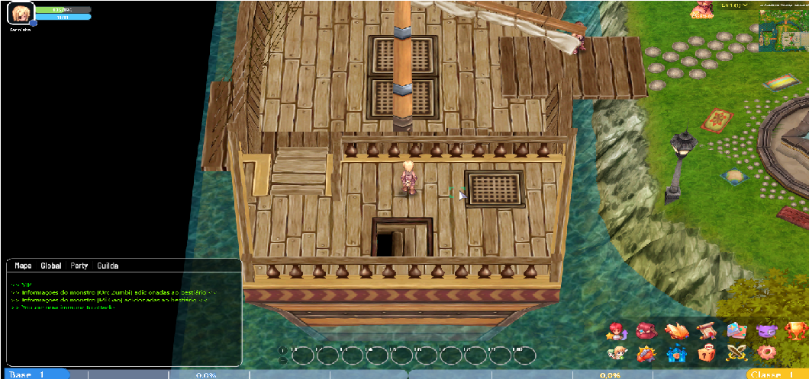<figcaption></figcaption></figure>

### **1) Đi bộ cho đến khi cắt cảnh với \[Tia Lupina] bắt đầu.**



<figure>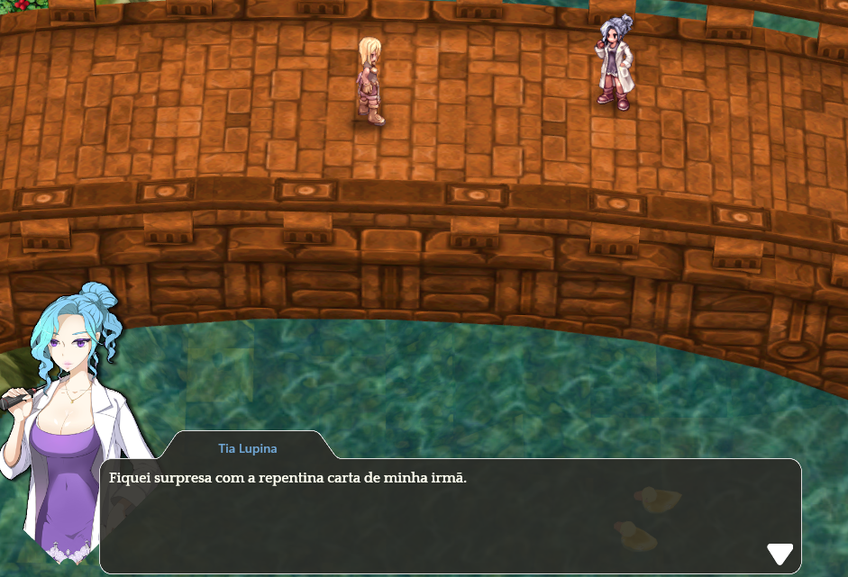<figcaption>
<mark style="color:red;"><strong>Cô ấy sẽ kể cho bạn một số câu chuyện và yêu cầu bạn đến lâu đài.</strong></mark> <mark style="color:red;"><strong>Con đường sẽ được đánh dấu trên mặt đất—chỉ cần đi theo nó.</strong></mark>
</figcaption></figure>




<figure>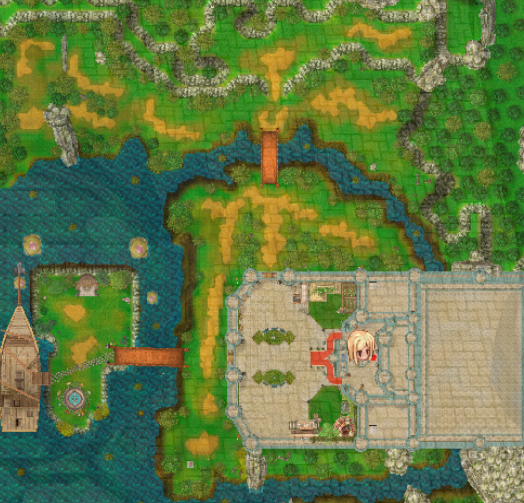<figcaption>
<mark style="color:red;"><strong>Con đường sẽ được đánh dấu trên mặt đất—chỉ cần đi theo nó.</strong></mark>
</figcaption></figure>



### **2) Đi đến NPC Roosevelt và nói chuyện với anh ấy.**


<figure>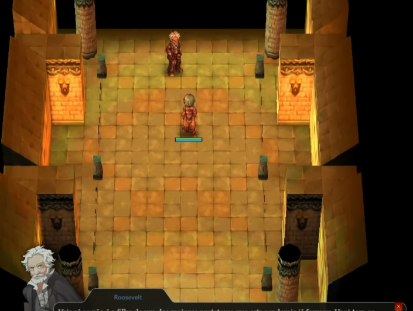<figcaption>
<mark style="color:red;"><strong>Nói chuyện với Roosevelt, và anh ấy sẽ giải thích một số điều quan trọng về học viện.</strong></mark> <mark style="color:red;"><strong>Chú ý đến ba đánh giá khóa học: "Kỹ thuật Chiến đấu, Kỹ thuật Niệm, và Kiến thức Chung."</strong></mark>
</figcaption></figure>



<figure>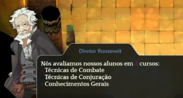<figcaption>
<mark style="color:red;"><strong>Chú ý đến ba đánh giá khóa học: "Kỹ thuật Chiến đấu, Kỹ thuật Niệm, và Kiến thức Chung."</strong></mark>
</figcaption></figure>



### 3) Sau khi nói chuyện với Roosevelt, bạn sẽ được dịch chuyển đến phòng tiếp theo. Đi lên một chút, và bạn sẽ tìm thấy NPC "Kiến thức Chung". Nói chuyện với cô ấy.


<figure>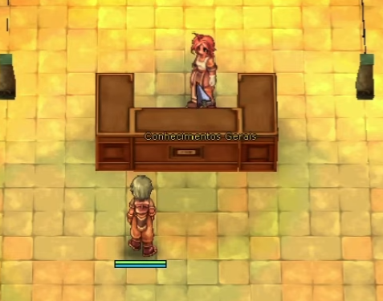<figcaption>
<mark style="color:red;"><strong>Chú ý đến ba đánh giá khóa học: "Kỹ thuật chiến đấu, Kỹ thuật niệm chú và Kiến thức chung."</strong></mark> <mark style="color:red;"><strong>Trả lời mỗi câu hỏi cho đến khi bạn hoàn thành bài kiểm tra.</strong></mark> 
</figcaption></figure>



<figure>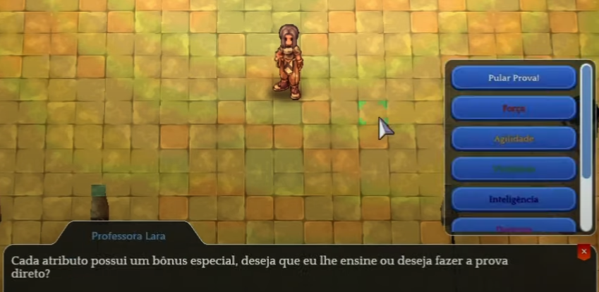<figcaption>
<mark style="color:red;"><strong>Trả lời mỗi câu hỏi cho đến khi bạn hoàn thành bài kiểm tra.</strong></mark>
</figcaption></figure>



### 4) Hãy đến phòng bên phải của bạn. Sẽ có một cổng—bước vào để được dịch chuyển đến một phòng với những đồ gốm đầy màu sắc. Sẽ có một NPC bên trong.


<figure>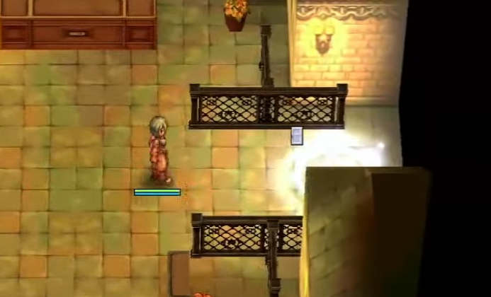<figcaption>
<mark style="color:red;"><strong>Khi bạn đến phòng có các đồ gốm nhiều màu sắc, hãy nói chuyện với NPC "Implacável."</strong></mark>  <mark style="color:red;"><strong>Ông ấy sẽ cho bạn hai lựa chọn: "Làm thế nào để tôi ra ngoài?" và "Masteries là gì?" Nếu bạn chọn lựa chọn đầu tiên, ông ấy sẽ dạy bạn kỹ năng "Return". Bằng cách nhấn phím ALT+S, bạn sẽ nhận được kỹ năng "Return".</strong></mark>  <mark style="color:red;"><strong>Sau đó, hãy sử dụng kỹ năng "Return" bằng cách nhấp vào nó hai lần để tiếp tục quá trình huấn luyện. Khi làm như vậy, ông ấy sẽ chúc mừng bạn, và bạn sẽ được dịch chuyển ra khỏi phòng.</strong></mark>  <mark style="color:red;"><strong>(Lưu ý: Nếu bạn chọn lựa chọn thứ hai, ông ấy sẽ chỉ đơn giản giải thích về Masteries.)</strong></mark>
</figcaption></figure>


<figure>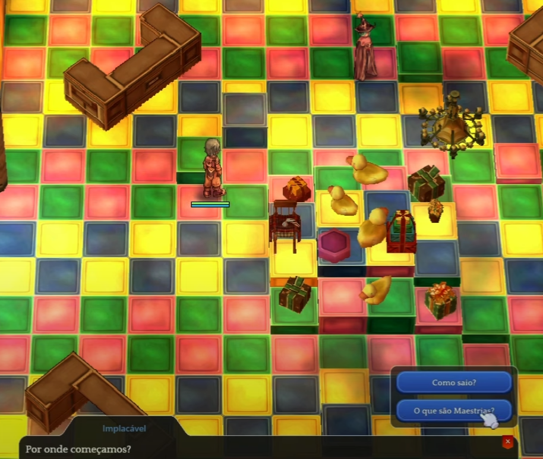<figcaption>
<mark style="color:red;"><strong>(Lưu ý: Nếu bạn chọn tùy chọn thứ hai, anh ta sẽ chỉ giải thích về Masteries.)</strong></mark>
</figcaption></figure>



### 5) Bây giờ, bên ngoài phòng, hãy đi sang trái, và bạn sẽ tìm thấy NPC "Quản lý Kho Vũ Khí." Nói chuyện với anh ta.



<figure>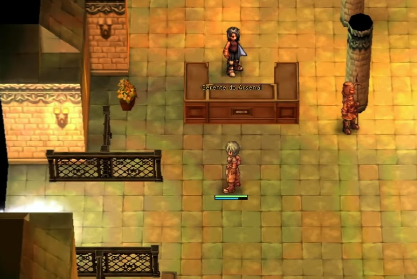<figcaption>
<mark style="color:red;"><strong>Khi bạn nói chuyện với NPC "Quản lý Kho Vũ Khí," anh ta sẽ giải thích ngắn gọn một số điều về trang bị. Nếu bạn vẫn có bất kỳ câu hỏi nào, anh ta sẽ hỏi bạn vào cuối.</strong></mark>  <mark style="color:red;"><strong>Nếu bạn không có câu hỏi nào, hãy nói "Không," và bạn sẽ được dịch chuyển đến phòng tiếp theo.</strong></mark>
</figcaption></figure>


<figure>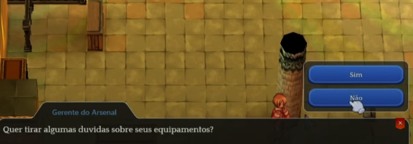<figcaption>
<mark style="color:red;"><strong>Nếu bạn không có câu hỏi nào, hãy nói "Không," và bạn sẽ được dịch chuyển đến phòng tiếp theo.</strong></mark>
</figcaption></figure>



### 6) **Khi bước vào phòng, bạn sẽ thấy 3 NPC. Hãy nói chuyện trực tiếp với NPC có tên "Kỹ Thuật Chiến Đấu."**


<figure><figcaption>
<mark style="color:red;"><strong>Khi bạn nói chuyện với anh ta, anh ta sẽ yêu cầu bạn đánh bại một số quái vật. Cuối cùng, anh ta sẽ gửi bạn đến khu vực "Săn Bắn".</strong></mark>  <mark style="color:red;"><strong>Các quái vật trong nhiệm vụ sẽ có một "TAG" dưới tên của chúng để hướng dẫn bạn.</strong></mark>  <mark style="color:red;"><strong>(Sau khi đánh bại tất cả các quái vật, hãy quay lại NPC "Kỹ Thuật Chiến Đấu" bằng cách sử dụng kỹ năng "Trở Về" và báo cáo với anh ta về việc hoàn thành nhiệm vụ.)</strong></mark>  <mark style="color:red;"><strong>(Lưu ý: Bạn cần đạt cấp độ lớp 10 để hoàn thành nhiệm vụ.)</strong></mark>
</figcaption></figure>



<figure>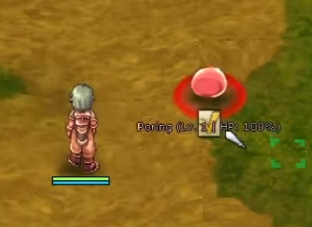<figcaption>
<mark style="color:red;"><strong>(Lưu ý: Bạn cần đạt cấp độ lớp 10 để hoàn thành nhiệm vụ.)</strong></mark>
</figcaption></figure>

| Quái vật                                                                              | Số lượng |
| ------------------------------------------------------------------------------------- | -------- |
|  Lunatic    | 7        |
|  Poring     | 7        |
|  Cây Willow  | 5        |

### 7) **Khi trở lại NPC "Kỹ Thuật Chiến Đấu", hãy nói chuyện với anh ta một lần nữa.**


<figure>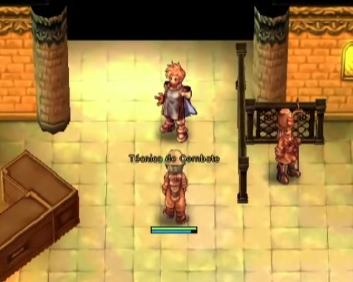<figcaption>
<mark style="color:red;"><strong>Khi bạn nói chuyện với anh ta lần nữa, anh ta sẽ chúc mừng bạn và chỉ đường ra khỏi lâu đài.</strong></mark>  <mark style="color:red;"><strong>Bạn phải nói chuyện với giám đốc, và các mũi tên sẽ xuất hiện trên mặt đất để chỉ cho bạn đường đi.</strong></mark>
</figcaption></figure>



<figure><figcaption>
<mark style="color:red;"><strong>Bạn phải nói chuyện với giám đốc, và các mũi tên sẽ xuất hiện trên mặt đất để chỉ cho bạn đường đi.</strong></mark>
</figcaption></figure>



### 8) **Khi bạn đến vị trí được chỉ định, bạn sẽ tìm thấy một "Ngôi nhà" với một số lính gác. Hãy bước vào cổng.**


<figure>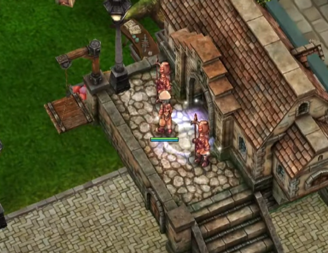<figcaption>
<mark style="color:red;"><strong>Khi bước vào cổng, bạn sẽ thấy một đoạn cắt cảnh với Dì Lupina và Giám đốc. Sau đó, bạn phải nói chuyện với ông ấy.</strong></mark>  <mark style="color:red;"><strong>(Lưu ý: Bạn chỉ có thể nói chuyện với ông ấy nếu bạn đã phân bổ tất cả điểm "KỸ NĂNG". Hãy nhớ kiểm tra bằng cách nhấn ALT+S để đảm bảo tất cả điểm đã được phân bổ.)</strong></mark>
</figcaption></figure>



<figure>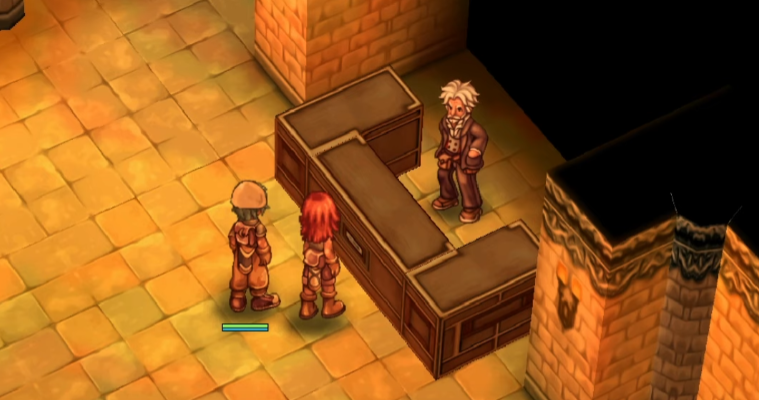<figcaption>
<mark style="color:red;"><strong>(Lưu ý: Bạn chỉ có thể nói chuyện với ông ấy nếu bạn đã phân bổ tất cả điểm "KỸ NĂNG". Hãy nhớ kiểm tra bằng cách nhấn ALT+S để đảm bảo tất cả điểm đã được phân bổ.)</strong></mark>
</figcaption></figure>



### 9) **Sau khi nói chuyện với giám đốc, ông ấy sẽ giải thích một số điều quan trọng về "Huy hiệu."**
<figure>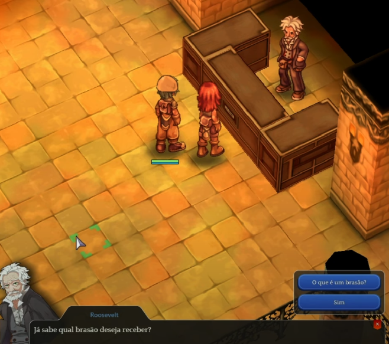<figcaption>
Trong cuộc trò chuyện, hai tùy chọn sẽ xuất hiện: "Biểu tượng gia đình là gì?" và "Có." Nếu bạn chọn tùy chọn đầu tiên, anh ta sẽ giải thích về chức năng của từng biểu tượng gia đình. Tùy chọn thứ hai sẽ đưa bạn đến lựa chọn biểu tượng gia đình.</strong></mark>  <mark style="color:red;"><strong>Khi bạn chọn biểu tượng gia đình của mình, anh ta sẽ dẫn bạn đến căn phòng cuối cùng. Tại đó, bạn sẽ tìm thấy nhiều NPC cho các lớp nhân vật tương ứng của bạn. Hãy nói chuyện với NPC mà bạn mong muốn để tiếp tục với lựa chọn của mình.</strong></mark>
</figcaption></figure>



<figure>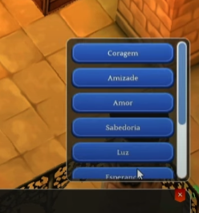<figcaption>
Khi bạn chọn biểu tượng gia đình của mình, anh ta sẽ dẫn bạn đến căn phòng cuối cùng. Tại đó, bạn sẽ tìm thấy nhiều NPC cho các lớp nhân vật tương ứng của bạn. Hãy nói chuyện với NPC mà bạn mong muốn để tiếp tục với lựa chọn của mình.
</figcaption></figure>

### 10) **Chọn lớp nhân vật của bạn**

* Khi bạn đã hoàn thành tất cả các bước huấn luyện, bạn sẽ được dẫn đến phần quan trọng nhất của nhân vật: chọn lớp nhân vật.
* Nếu bạn chưa quyết định lớp nào để sử dụng, chỉ cần nhấp VÀO ĐÂY để đưa ra quyết định của bạn.
* Trong phòng này, bạn sẽ tìm thấy các NPC chịu trách nhiệm thay đổi lớp nhân vật của bạn. Hãy chọn một cách cẩn thận, vì sẽ không thể thay đổi sau này.
* Sau khi quyết định lớp nhân vật, NPC sẽ hướng dẫn bạn đến guild chịu trách nhiệm. Hoàn thành nhiệm vụ và kết thúc quá trình thay đổi lớp của bạn.

<figure>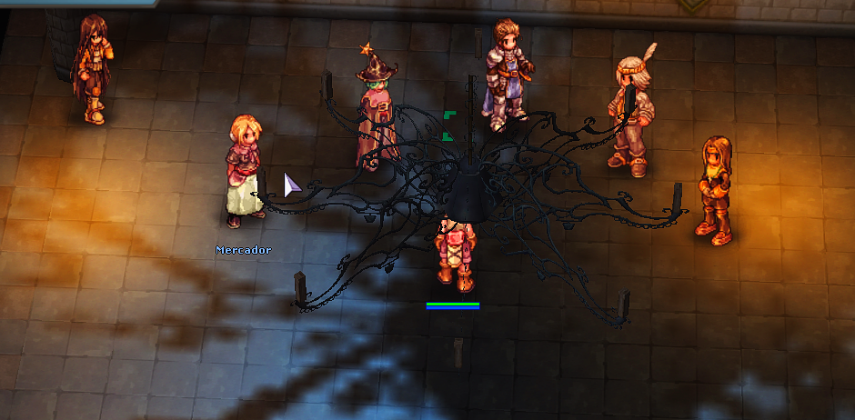<figcaption></figcaption></figure>