# 🖱️ HUD & Giao Diện

<figure><figcaption></figcaption></figure>

## **Về HUD**

* Khi bước vào **Arkaik**, bạn sẽ nhận thấy nhiều thông tin khác nhau. Chúng tôi sẽ liệt kê một số trong số đó để hướng dẫn bạn.

<figure><figcaption>
<mark style="color:red;"><strong>Tổng Quan Chung về HUD</strong></mark>
</figcaption></figure>

<table><thead><tr><th width="68">N</th><th width="249">Tên</th><th>Mô tả</th></tr></thead><tbody><tr><td>1</td><td>Thông tin Nhân vật</td><td>Hiển thị avatar, tên, HP, Mana và Biểu tượng của nhân vật của bạn.</td></tr><tr><td>2</td><td>Thông tin Đội</td><td>Hiển thị thông tin về các thành viên trong đội đã kết nối, chẳng hạn như cấp độ, tên, HP, Mana và Biểu tượng.</td></tr><tr><td>3</td><td>Bản đồ nhỏ</td><td>Hiển thị tên hiện tại của bản đồ, hình ảnh và khuôn mặt của nhân vật của bạn.</td></tr><tr><td>4</td><td>Các kênh</td><td>Cho phép bạn xem có bao nhiêu người chơi trong kênh hiện tại và chuyển kênh khi có sẵn.</td></tr><tr><td>5</td><td>Chỉ báo Đạn dược</td><td>Hiển thị số lượng đạn dược hiện tại đã trang bị để tham khảo nhanh mà không cần mở kho.</td></tr><tr><td>6</td><td>Trò chuyện</td><td>Hiển thị lịch sử tin nhắn.</td></tr><tr><td>7</td><td>Thanh Kinh nghiệm</td><td>Hiển thị cấp độ cơ bản và cấp độ lớp hiện tại của người chơi, cũng như tỷ lệ phần trăm kinh nghiệm tổng cần thiết để lên cấp.</td></tr><tr><td>8</td><td>Phím tắt</td><td>Cho phép bạn kéo các kỹ năng vào F1-F12.</td></tr><tr><td>9</td><td>Hộp tin nhắn</td><td>Nhấn ENTER để gõ tin nhắn và nhấn ENTER một lần nữa để gửi.</td></tr><tr><td>10</td><td>Danh sách Nhãn dán</td><td>Nhấp để gửi một nhãn dán.</td></tr><tr><td>11</td><td>Menu</td><td>Bạn có thể mở các menu trò chơi bằng cách nhấp vào chúng hoặc sử dụng tổ hợp phím.</td></tr><tr><td>12</td><td>Nhiệm vụ</td><td>Hiển thị các nhiệm vụ mà người chơi đang thực hiện, với tùy chọn "Đang tiến hành" được đánh dấu trên màn hình Nhiệm vụ để giúp theo dõi mục tiêu.</td></tr><tr><td>13</td><td>Cửa hàng Cash và Thẻ Chiến đấu</td><td>Cho phép bạn mở các menu cửa hàng cash và thẻ chiến đấu.</td></tr></tbody></table>

\## \*\*Màn Hình Thuộc Tính (ALT + A)\*\*

* Màn hình này cho phép bạn phân phối điểm thuộc tính có được khi nâng cấp cấp độ cơ bản của nhân vật.
* Di chuột qua thuộc tính mà bạn muốn nâng cấp sẽ cập nhật các số liệu bên dưới văn bản **"Điểm Thuộc Tính Còn Lại"**, cho phép bạn thấy có bao nhiêu điểm bạn sẽ còn lại nếu bạn tăng thuộc tính đó.

<figure>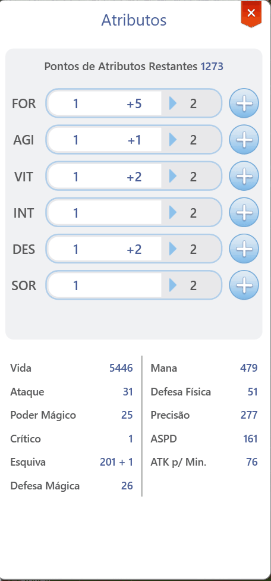<figcaption></figcaption></figure>

## **Thuộc Tính Phụ**

*   Màn hình cho phép bạn xem các thuộc tính phụ, chẳng hạn như:

    <table><thead><tr><th width="115">TRẠNG THÁI</th><th width="191">Thuộc tính</th><th>Mô tả</th></tr></thead><tbody><tr><td>Cơ bản</td><td><mark style="background-color:red;">HP</mark> <mark style="background-color:blue;">Mana</mark></td><td><mark style="background-color:red;">HP tối đa của bạn</mark> <mark style="background-color:blue;">Mana tối đa của bạn</mark></td></tr><tr><td>Thiệt hại</td><td>Tấn công Tấn công phép Độ chính xác Critical</td><td>
Độ mạnh tấn công vật lý của bạn

Độ mạnh tấn công phép của bạn Độ chính xác khi thực hiện các đòn tấn công vật lý Tỷ lệ chí mạng của bạn
</td></tr><tr><td>Phòng thủ</td><td>Phòng thủ vật lý Phòng thủ phép Tránh né</td><td>Khả năng phòng thủ của bạn trước các đòn tấn công vật lý Khả năng phòng thủ của bạn trước các đòn tấn công phép Cơ hội để bạn tránh né các đòn tấn công</td></tr><tr><td>Khác</td><td>Số đòn tấn công mỗi phút</td><td>Số lượng đòn tấn công mà nhân vật của bạn thực hiện mỗi giây</td></tr></tbody></table>

## **Màn hình Túi (ALT + Q)**\* Trong **Arkaik: Tales of Sarina**, màn hình trang bị và vật phẩm được kết hợp thành một giao diện duy nhất để giúp mọi người dễ dàng hơn. Trang bị, gỡ trang bị và tìm kiếm vật phẩm từ màn hình này.

<figure>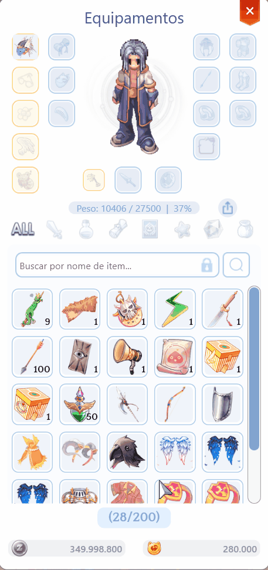<figcaption>
<mark style="color:red;"><strong>Bảng Vật Phẩm</strong></mark>
</figcaption></figure>

## **Về Vật Phẩm**

* Xem chức năng của trang bị bằng cách nhấp chuột phải vào nó.

<figure>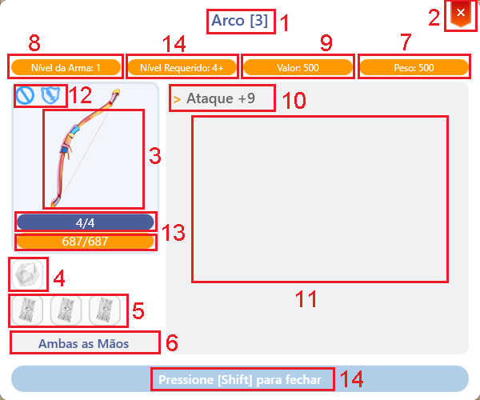<figcaption>
<mark style="color:red;"><strong>Thông Tin Vật Phẩm</strong></mark>
</figcaption></figure>

<table><thead><tr><th width="66">N</th><th width="215">Trường</th><th>Mô tả</th></tr></thead><tbody><tr><td>1</td><td>Tên Item</td><td>Tên, điều kiện và số ô trống.</td></tr><tr><td>2</td><td>Nút Đóng</td><td>Đóng chế độ xem hiện tại.</td></tr><tr><td>3</td><td>Hình Ảnh Item</td><td>Hiển thị hình ảnh của item.</td></tr><tr><td>4</td><td>Ngọc</td><td>Số ô và hiệu ứng liên kết.</td></tr><tr><td>5</td><td>Thẻ</td><td>Số ô và hiệu ứng liên kết.</td></tr><tr><td>6</td><td>Vị Trí</td><td>Vị trí trang bị.</td></tr><tr><td>7</td><td>Cân Nặng</td><td>Cân nặng trong kho.</td></tr><tr><td>8</td><td>Cấp Độ</td><td>Cấp độ của item.</td></tr><tr><td>9</td><td>Giá Bán</td><td>Giá trị khi bán cho NPC.</td></tr><tr><td>10</td><td>Tùy Chọn Ngẫu Nhiên</td><td>Hiển thị các tùy chọn ngẫu nhiên.</td></tr><tr><td>11</td><td>Mô Tả</td><td>Chức năng và lịch sử của item.</td></tr><tr><td>12</td><td>Hạn Chế</td><td>Giới hạn sử dụng.</td></tr><tr><td>13</td><td>Tiềm Năng và Độ Bền</td><td>Hiển thị tình trạng của item.</td></tr><tr><td>14</td><td>Cần Thiết</td><td>Cấp độ cần thiết để trang bị.</td></tr></tbody></table>

\## Màn Hình Kỹ Năng & Thành Thạo (ALT + S)

* Thông tin chung về Hệ Thống Kỹ Năng và Thành Thạo

<figure>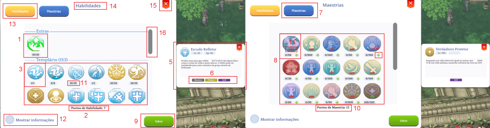<figcaption>
<mark style="color:red;"><strong>Kỹ Năng &#x26; Thành Thạo</strong></mark>
</figcaption></figure>

<table><thead><tr><th width="76">N</th><th>Tên</th><th>Mô tả</th></tr></thead><tbody><tr><td>1</td><td>Phân cách</td><td>Phân chia các lớp và kỹ năng.</td></tr><tr><td>2</td><td>Điểm Kỹ Năng</td><td>Các điểm có sẵn để phân phối.</td></tr><tr><td>3</td><td>Kỹ Năng</td><td>Nâng cấp và tổ chức kỹ năng.</td></tr><tr><td>4</td><td>Tăng Điểm Thành Thạo</td><td>Tăng cấp độ thành thạo.</td></tr><tr><td>5</td><td>Mô Tả Kỹ Năng</td><td>Văn bản mô tả của kỹ năng.</td></tr><tr><td>6</td><td>Loại Hiệu Ứng Kỹ Năng</td><td>Hiển thị yếu tố và đặc điểm.</td></tr><tr><td>7</td><td>Thành Thạo</td><td>Nút khu vực cụ thể.</td></tr><tr><td>8</td><td>Các Thành Thạo</td><td>Hiển thị các thành thạo của nhân vật.</td></tr><tr><td>9</td><td>Lưu</td><td>Xác nhận các thay đổi tiến hóa.</td></tr><tr><td>10</td><td>Điểm Thành Thạo</td><td>Các điểm có sẵn để sử dụng.</td></tr><tr><td>11</td><td>Cấp Độ Kỹ Năng</td><td>Giới hạn cấp độ kỹ năng tối đa.</td></tr><tr><td>12</td><td>Thông Tin</td><td>Màn hình kỹ năng và thành thạo.</td></tr><tr><td>13</td><td>Kỹ Năng</td><td>Mở tab kỹ năng.</td></tr><tr><td>14</td><td>Mô Tả</td><td>Chi tiết của tab đã chọn.</td></tr></tbody></table>

\## Kỹ Năng Chuyên Môn

* Thông Tin Cơ Bản Để Hiểu Về Kỹ Năng Chuyên Môn

<figure>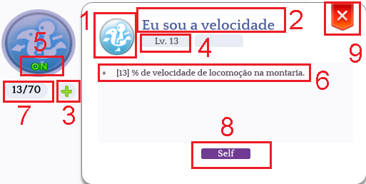<figcaption>
<mark style="color:red;"><strong>Thông Tin Về Lĩnh Vực Chuyên Môn</strong></mark>
</figcaption></figure>

<table><thead><tr><th width="69">N</th><th width="202">Tên</th><th>Mô tả</th></tr></thead><tbody><tr><td>1</td><td>Hình ảnh Kỹ Năng</td><td>Đây là biểu tượng của kỹ năng liên quan đến</td></tr><tr><td>2</td><td>Tên</td><td>Ở đây bạn có thể thấy tiêu đề của bậc thầy được hiển thị</td></tr><tr><td>3</td><td>Nâng Cấp Bậc Thầy</td><td>Nhấn để thêm 1 cấp cho bậc thầy này, sau đó xác nhận bằng</td></tr><tr><td>4</td><td>Cấp Độ</td><td>Hiển thị cấp độ kỹ năng theo định dạng: Lv &#x3C;Cấp Độ Bậc Thầy Hiện Tại/</td></tr><tr><td>5</td><td>Trạng Thái</td><td>Bạn có thể bật hoặc tắt bậc thầy</td></tr><tr><td>6</td><td>Mô Tả</td><td>Mô tả động của bậc thầy.</td></tr><tr><td>7</td><td>Số Điểm Đã Phân Bổ</td><td>Số lượng điểm đã đầu tư.</td></tr><tr><td>8</td><td>Loại Thống Kê</td><td>Chỉ ra nếu đây là buff cho bản thân, cho người khác,</td></tr><tr><td>9</td><td>Đóng</td><td>Đóng cửa sổ</td></tr></tbody></table>

## Màn Hình Nhiệm Vụ (ALT + E)\* "Arkaik: Tales of Sarina" có nhiều nhiệm vụ được chia thành các tập. Với mỗi bản mở rộng game mới, một bộ nhiệm vụ mới sẽ được giới thiệu.

<figure>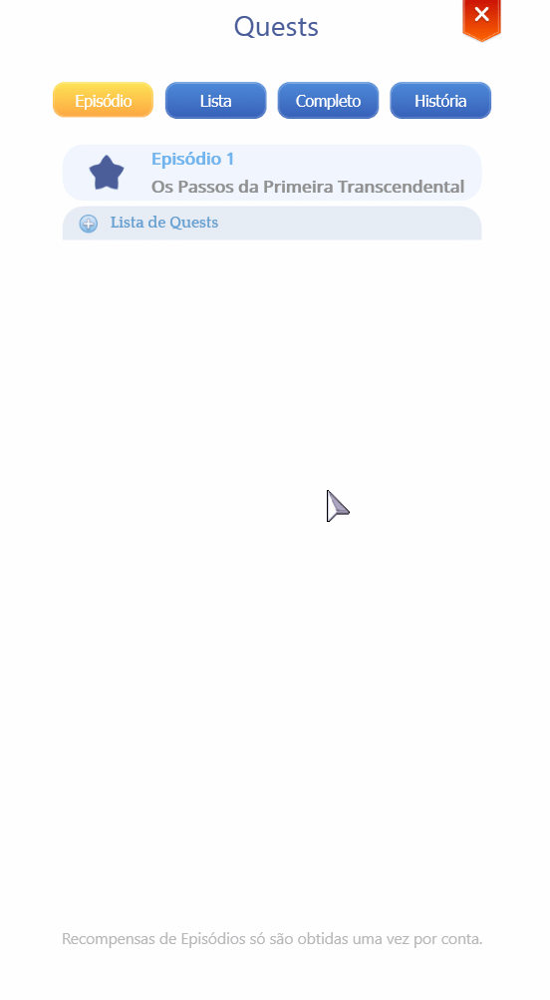<figcaption>
<mark style="color:red;"><strong>ALT+E ( Tab Nhiệm vụ )</strong></mark>
</figcaption></figure>

* Trong bảng này, bạn có thể thấy từng

<table><thead><tr><th width="157">Tên Tab</th><th>Mô tả</th></tr></thead><tbody><tr><td>Tập</td><td>Xem tất cả các tập và nhiệm vụ mà bạn đã hoàn thành hoặc đang thực hiện</td></tr><tr><td>Danh sách</td><td>Xem danh sách tất cả các nhiệm vụ. Tại đây bạn có thể lọc nhiệm vụ theo loại hoặc</td></tr><tr><td>Hoàn thành</td><td>Trong danh sách này, bạn có thể thấy tất cả các nhiệm vụ đã hoàn thành của mình được nhóm lại</td></tr><tr><td>Lịch sử</td><td>Theo dõi câu chuyện của Arkaik: Tales of Sarina trên</td></tr></tbody></table>

## Chi tiết của

* **Tóm tắt màn hình "Nhiệm vụ"**

<table><thead><tr><th width="67">N</th><th width="149">Tên</th><th>Mô tả</th></tr></thead><tbody><tr><td>1</td><td>Tiêu đề Nhiệm Vụ</td><td>Tiêu đề của nhiệm vụ.</td></tr><tr><td>2</td><td>Tóm Tắt</td><td>Những gì bạn cần làm để nhiệm vụ được đánh dấu là hoàn thành.</td></tr><tr><td>3</td><td>Mục Tiêu</td><td>Khi một nhiệm vụ yêu cầu tiêu diệt quái vật, phần này hiển thị các quái vật bạn cần đánh bại và tiến độ hiện tại của bạn.</td></tr><tr><td>4</td><td>Phần Thưởng</td><td>Phần thưởng bạn nhận được khi hoàn thành nhiệm vụ.</td></tr><tr><td>5</td><td>NPC</td><td>Hình ảnh của NPC đã giao cho bạn nhiệm vụ. Di chuột qua nó sẽ hiển thị tên của NPC.</td></tr></tbody></table>

## **Các Loại Nhiệm Vụ**

*   Mỗi cờ nhiệm vụ có một biểu tượng trực quan để chỉ ra loại của nó.

    <table><thead><tr><th width="102" data-type="files"> Biểu tượng</th><th width="129">Loại</th><th>Mô tả</th></tr></thead><tbody><tr><td></td><td><mark style="color:red;">Sự kiện</mark></td><td>Các nhiệm vụ này được nhận trong những thời điểm cụ thể trong năm hoặc trong các sự kiện theo chủ đề. Việc chúng có thể lặp lại hay không phụ thuộc vào sự kiện đó.</td></tr><tr><td></td><td><mark style="color:yellow;">Chính</mark></td><td>Các nhiệm vụ này là một phần của tập phim và là bắt buộc nếu bạn muốn mở khóa các tập tiếp theo. Chúng chỉ có thể hoàn thành một lần.</td></tr><tr><td></td><td><mark style="color:blue;">Phụ</mark></td><td>Các nhiệm vụ này là tùy chọn và không ảnh hưởng đến việc mở khóa các tập mới. Chúng chỉ có thể hoàn thành một lần.</td></tr><tr><td></td><td><mark style="color:green;">Có thể lặp lại</mark></td><td>Các nhiệm vụ này là tùy chọn và không ảnh hưởng đến việc mở khóa các tập mới. Chúng có thể được thực hiện nhiều lần, miễn là người chơi đáp ứng các điều kiện cần thiết.</td></tr></tbody></table>

    \## Màn Hình Bestiary (ALT + B)
* **Bestiary** cho phép bạn xem thông tin về các quái vật được thu thập thông qua kỹ năng **Monster Observer**.

<figure>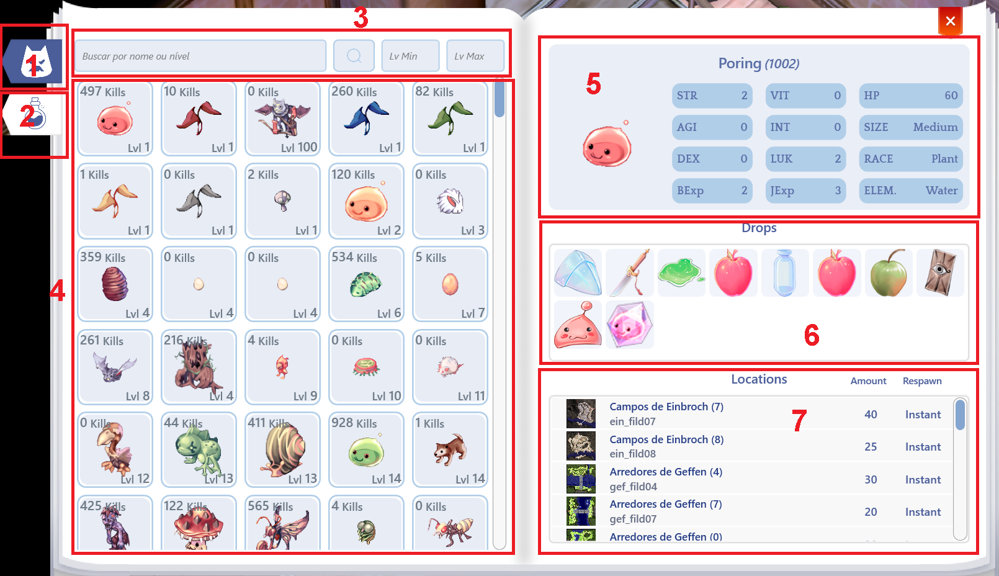<figcaption>
<mark style="color:red;"><strong>ALT+B (Thông Tin Bestiary)</strong></mark>
</figcaption></figure>

<table><thead><tr><th width="72">N</th><th width="279">Tên</th><th>Thông tin</th></tr></thead><tbody><tr><td>1</td><td>Tab Quái Vật</td><td>Khu vực tìm kiếm quái vật.</td></tr><tr><td>2</td><td>Tab Đồ Vật</td><td>Khu vực tìm kiếm đồ vật.</td></tr><tr><td>3</td><td>Tìm Kiếm</td><td>Khu vực để gõ những gì bạn đang tìm.</td></tr><tr><td>4</td><td>Thuật Ngữ</td><td>Thông tin về tất cả quái vật/đồ vật.</td></tr><tr><td>5</td><td>Thông Tin Quái Vật</td><td>Hiển thị chỉ số của quái vật.</td></tr><tr><td>6</td><td>Thông Tin Rơi Đồ</td><td>Hiển thị tỷ lệ và cơ hội rơi đồ.</td></tr><tr><td>7</td><td>Vị Trí Quái Vật trên Bản Đồ</td><td>Cho biết nơi tìm thấy quái vật.</td></tr></tbody></table>

## **Màn Hình Bộ Sưu Tập (ALT + C)**

* Bạn có thể theo dõi tiến trình bộ sưu tập bản đồ của mình tại đây.

<figure><figcaption>
<mark style="color:red;"><strong>ALT+C (Thông Tin Bộ Sưu Tập)</strong></mark>
</figcaption></figure>

\## \*\*Đọc Bộ Sưu Tập Bản Đồ\*\*

* Mỗi bản đồ chứa một số thông tin quan trọng cần xem xét.
* Khi tiêu diệt quái vật, không cần phải "nhặt vật phẩm từ mặt đất."
* Chỉ cần giết quái vật thì vật phẩm rơi ra sẽ được tính vào bộ sưu tập.
* **VẬT PHẨM CHỈ ĐƯỢC TÍNH NẾU BẠN TỰ MÌNH GIẾT QUÁI VẬT.**
* **NHẶT VẬT PHẨM RƠI DO BẠN BÈ ĐỂ LẠI KHÔNG ĐƯỢC TÍNH.**

<figure><figcaption>
<mark style="color:red;"><strong>Thông Tin Bộ Sưu Tập Bản Đồ Hiện Tại</strong></mark>
</figcaption></figure>

<table><thead><tr><th width="70">N</th><th width="263">Thông tin</th><th>Mô tả</th></tr></thead><tbody><tr><td>1</td><td>Tên Bản Đồ</td><td>Thông tin về bản đồ hiện tại mà bạn đang ở.</td></tr><tr><td>2</td><td>Thông Tin Bản Đồ Bổ Sung</td><td>Chi tiết bổ sung về bản đồ hiện tại.</td></tr><tr><td>3</td><td>Bản Đồ</td><td>Thông tin về bản đồ mà bạn đang ở.</td></tr><tr><td>4</td><td>Các Thuộc Tính Nhận Được Trong Bộ Sưu Tập</td><td>Các thuộc tính nhận được khi hoàn thành bộ sưu tập.</td></tr><tr><td>5</td><td>Các Vật Phẩm Cần Thiết</td><td>Các vật phẩm cần thiết để hoàn thành bộ sưu tập.</td></tr><tr><td>6</td><td>Các Giai Đoạn Đã Hoàn Thành</td><td>Hiển thị các giai đoạn đã hoàn thành.</td></tr></tbody></table>

## **Màn Hình Thành Tựu (ALT + T)**

* Bạn có thể theo dõi tiến trình thành tựu của mình ở đây.
* Hoàn thành một số **nhiệm vụ phụ** sẽ mang lại cho bạn một **danh hiệu**.
*   Những **danh hiệu** này có thể được trang bị cho nhân vật của bạn bằng cách nhấp vào chúng sau khi nhận được.

    <figure>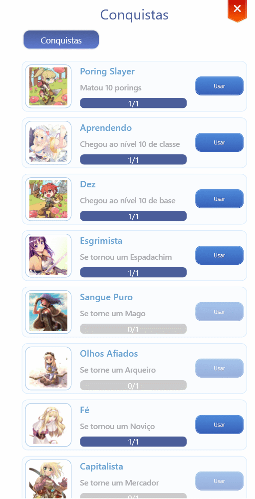<figcaption>
<mark style="color:red;"><strong>ALT+T (Thông tin Thành Tựu)</strong></mark>
</figcaption></figure>

## **Hiểu Về Thành Tựu**

<figure>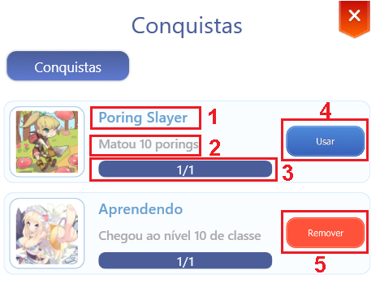<figcaption>
<mark style="color:red;"><strong>Chi Tiết Thành Tựu</strong></mark>
</figcaption></figure>

<table><thead><tr><th width="68">N</th><th>Thông Tin</th><th>Mô Tả</th></tr></thead><tbody><tr><td>1</td><td>Tiêu Đề</td><td>Tiêu đề đã nhận.</td></tr><tr><td>2</td><td>Mục Tiêu</td><td>Những gì cần làm để nhận được tiêu đề.</td></tr><tr><td>3</td><td>Tiến Trình</td><td>Tiến trình thành tựu của bạn.</td></tr><tr><td>4</td><td>Sử Dụng</td><td>Trang bị tiêu đề.</td></tr><tr><td>5</td><td>Gỡ Bỏ</td><td>Tháo trang bị tiêu đề.</td></tr></tbody></table>

## **Màn Hình Bạn Bè (ALT + F)**

*   Xem tất cả bạn bè đang kết nối của bạn ở một nơi, bao gồm vị trí, cấp độ cơ sở và lớp hiện tại.

    <figure>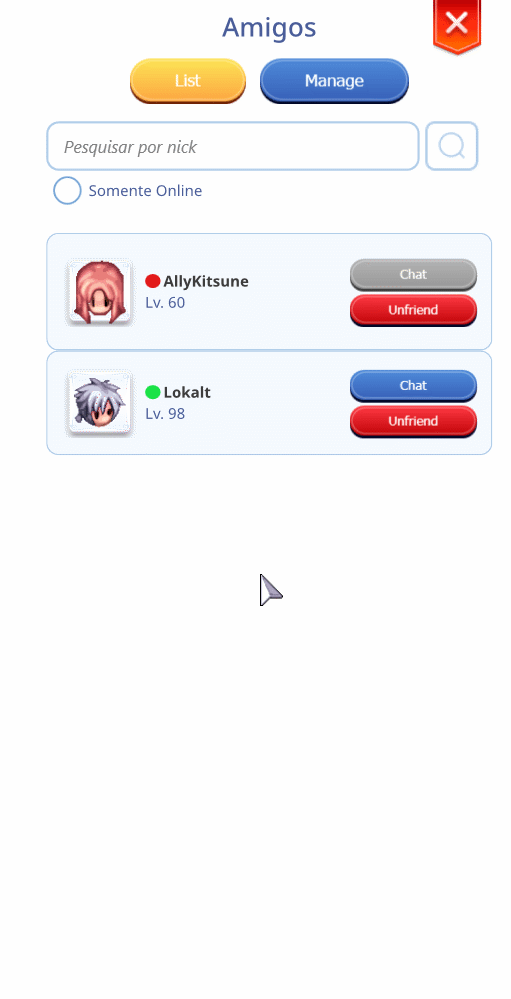<figcaption>
<mark style="color:red;"><strong>ALT+F (Thông tin danh sách bạn bè)</strong></mark>
</figcaption></figure>

| Thông tin           | Mô tả                         |
| ------------------- | ----------------------------- |
| Gửi "TIN NHẮN" - PM | /fm TÊN NGƯỜI CHƠI ; TIN NHẮN |

## Màn hình Nhóm (ALT + Z)

* Chơi trong một nhóm thì thú vị hơn nhiều, nhưng trước tiên, chúng ta cần biết cách tạo một nhóm.
* Nhấn vào biểu tượng bên dưới hoặc nhấn **ALT + Z** để mở cửa sổ nhóm.
* Đặt tên nhóm của bạn và nhấn xác nhận.

<figure><figcaption>
<mark style="color:red;"><strong>ALT+Z (Tạo Nhóm)</strong></mark>
</figcaption></figure>

<figure>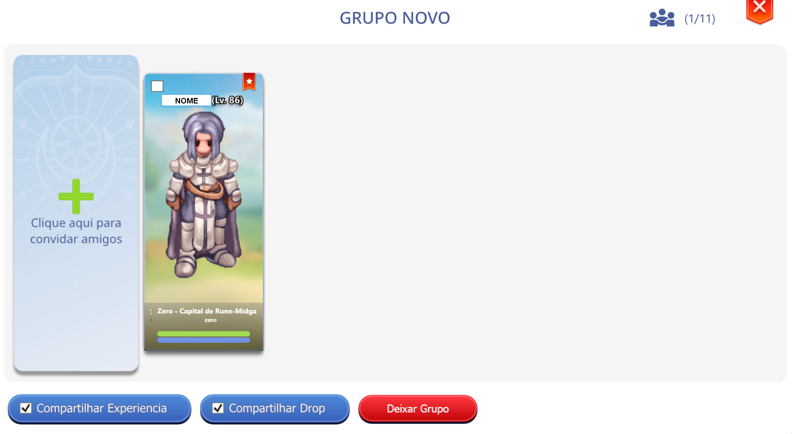<figcaption>
<mark style="color:red;"><strong>Tạo Nhóm</strong></mark>
</figcaption></figure>

## **Màn hình Macro**\* Bạn muốn nhanh chóng gửi sticker đó sau khi solo một người bạn hoặc cướp MVP?

* Thêm sticker hoặc văn bản vào một macro và sử dụng tổ hợp phím để thực hiện nhanh chóng.

<figure>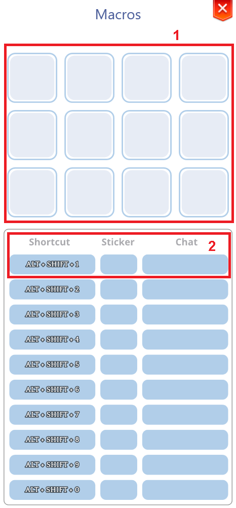<figcaption></figcaption></figure>

<table><thead><tr><th width="68">N</th><th width="134">Thông tin</th><th>Mô tả</th></tr></thead><tbody><tr><td>1</td><td>STICKERS</td><td>Nơi lưu trữ các sticker của bạn.</td></tr><tr><td>2</td><td>Tổ hợp phím</td><td>Nơi bạn cấu hình các tổ hợp phím để gửi sticker trong trò chuyện.</td></tr></tbody></table>
