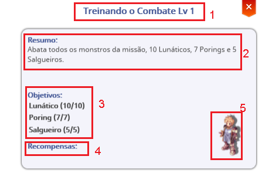

# 🖱️ HUD & Interface

<figure><figcaption></figcaption></figure>

## **About the HUD**

* Upon entering **Arkaik**, you will notice various pieces of information. We will list some of them to guide you.

<figure><figcaption>
<mark style="color:red;"><strong>General Overview of the HUD</strong></mark>
</figcaption></figure>

<table><thead><tr><th width="68">N</th><th width="249">Name</th><th>Description</th></tr></thead><tbody><tr><td>1</td><td>Character Information</td><td>Displays your character's avatar, name, HP, Mana, and Emblem.</td></tr><tr><td>2</td><td>Party Information</td><td>Shows information about connected party members, such as level, name, HP, Mana, and Emblem.</td></tr><tr><td>3</td><td>Mini Map</td><td>Mostra o nome atual do mapa, a imagem e o rosto de seu personagem.</td></tr><tr><td>4</td><td>Channels</td><td>Allows you to see how many players are in the current channel and switch channels when available.</td></tr><tr><td>5</td><td>Ammunition Indicator</td><td>Displays the current amount of equipped ammunition for quick reference without opening the inventory.</td></tr><tr><td>6</td><td>Chat</td><td>Shows the message history.</td></tr><tr><td>7</td><td>Experience Bar</td><td>Displays the player's current base and class level, as well as the current percentage of total experience needed to level up.</td></tr><tr><td>8</td><td>Shortcut</td><td>Allows you to drag skills to F1-F12.</td></tr><tr><td>9</td><td>Message Box</td><td>Press ENTER to type a message and press ENTER again to send it.</td></tr><tr><td>10</td><td>Sticker List</td><td>Click to send a sticker.</td></tr><tr><td>11</td><td>Menus</td><td>You can open the game menus by clicking on them or using key combinations.</td></tr><tr><td>12</td><td>Quest's</td><td>Displays the quests the player is currently on, with the "In Progress" option marked on the Quest screen to help track objectives.</td></tr><tr><td>13</td><td>Cash Shop and Battle Pass</td><td>Allows you to open the cash shop menus and battle pass.</td></tr></tbody></table>

## **Attributes Screen (ALT + A)**

* This screen allows you to distribute attribute points acquired when leveling up your character's base level.
* Hovering the cursor over the attribute you want to upgrade updates the numbers below the **"Remaining Attribute Points"** text, allowing you to see how many points you will have left if you increase that attribute.

<figure><figcaption></figcaption></figure>

## **Secondary Attributes**

* The screen allows you to view secondary attributes, such as:

<table><thead><tr><th width="115">STATUS</th><th width="191">Attribute</th><th>Description</th></tr></thead><tbody><tr><td>Basic</td><td><mark style="background-color:red;">HP</mark> <mark style="background-color:blue;">Mana</mark></td><td><mark style="background-color:red;">Your maximum HP</mark> <mark style="background-color:blue;">Your maximum Mana</mark></td></tr><tr><td>Damage</td><td>Attack Magic Attack Accuracy Critical</td><td>
Your physical attack power

Your magic attack power Your accuracy for landing physical attacks Your critical hit rate
</td></tr><tr><td>Defense</td><td>Physical Defense Magic Defense Evasion</td><td>Your defense against physical attacks Your defense against magical attacks Your chance to evade attacks</td></tr><tr><td>Others</td><td>Attacks per minute</td><td>QHow many attacks your character performs per second</td></tr></tbody></table>

## **Inventory Screen (ALT + Q)**

* In **Arkaik: Tales of Sarina**, the equipment and item screens are combined into a single interface to make things easier for everyone. Equip, unequip, and search for items from this screen.

<figure><figcaption>
<mark style="color:red;"><strong>Inventory Table</strong></mark>
</figcaption></figure>

## **About Items**

* See what your equipment does by right-clicking on it.

<figure><figcaption>
<mark style="color:red;"><strong>Item Information</strong></mark>
</figcaption></figure>

<table><thead><tr><th width="66">N</th><th width="215">Field</th><th>Descrição</th></tr></thead><tbody><tr><td>1</td><td>Item Name</td><td>Name, condition, and slots.</td></tr><tr><td>2</td><td>Close Button</td><td>Closes the current view.</td></tr><tr><td>3</td><td>Item Image</td><td>Displays the item image.</td></tr><tr><td>4</td><td>Gemns</td><td>Slots and linked effects.</td></tr><tr><td>5</td><td>Cards</td><td>Slots e efeitoSlots and linked effects.</td></tr><tr><td>6</td><td>Position</td><td>Equipment location.</td></tr><tr><td>7</td><td>Weight</td><td>Inventory weight.</td></tr><tr><td>8</td><td>Level</td><td>Item level.</td></tr><tr><td>9</td><td>Selling Price</td><td>Value when selling to NPCs.</td></tr><tr><td>10</td><td>Random Options</td><td>Displays random options.</td></tr><tr><td>11</td><td>Description</td><td>FItem function and history.</td></tr><tr><td>12</td><td>Restrictions</td><td>Usage limitations.</td></tr><tr><td>13</td><td>Potential and Durability</td><td>Displays item condition.</td></tr><tr><td>14</td><td>Required</td><td>Level required to equip.</td></tr></tbody></table>

## Skills & Masteries Screen (ALT + S)

* General Information about the Skills and Masteries System

<figure><figcaption>
<mark style="color:red;"><strong>Skills &#x26; Masteries</strong></mark>
</figcaption></figure>

<table><thead><tr><th width="76">N</th><th>Nome</th><th>Description</th></tr></thead><tbody><tr><td>1</td><td>Divider</td><td>Divides classes and skills.</td></tr><tr><td>2</td><td>Skill Points</td><td>Points available for distribution.</td></tr><tr><td>3</td><td>Skills</td><td>Upgrade and organize skills.</td></tr><tr><td>4</td><td>Increase Mastery Points</td><td>Increase the mastery level.</td></tr><tr><td>5</td><td>Skill Description</td><td>Descriptive text of the skill.</td></tr><tr><td>6</td><td>Skill Effect Type</td><td>Displays the element and characteristics.</td></tr><tr><td>7</td><td>Mastery</td><td>Specific area button.</td></tr><tr><td>8</td><td>Masteries</td><td>Displays the character's masteries.</td></tr><tr><td>9</td><td>Save</td><td>Confirms evolution changes.</td></tr><tr><td>10</td><td>Mastery Points</td><td>Points available for use.</td></tr><tr><td>11</td><td>Skill Level</td><td>Maximum skill level limit.</td></tr><tr><td>12</td><td>Information</td><td>Skills and masteries screen.</td></tr><tr><td>13</td><td>Skills</td><td>Opens the skills tab.</td></tr><tr><td>14</td><td>Description</td><td>Details of the selected tab.</td></tr></tbody></table>

## Masteries

* Basic Information to Understand Masteries

<figure><figcaption>
<mark style="color:red;"><strong>Mastery Field Information</strong></mark>
</figcaption></figure>

<table><thead><tr><th width="69">N</th><th width="202">Nome</th><th>Descrição</th></tr></thead><tbody><tr><td>1</td><td>Skill Image</td><td>Here is the icon of the skill associated with</td></tr><tr><td>2</td><td>Name</td><td>Here you can see the title of the master's degree displayed</td></tr><tr><td>3</td><td>Upgrade Mastery</td><td>Click to add 1 level to this mastery, then confirm by</td></tr><tr><td>4</td><td>Level</td><td>Display the skill level in the format: Lv &#x3C;Current Mastery Level/</td></tr><tr><td>5</td><td>State</td><td>You can turn mastery on or off</td></tr><tr><td>6</td><td>Description</td><td>Dynamic description of mastery.</td></tr><tr><td>7</td><td>Allocated Points</td><td>Amount of points invested.</td></tr><tr><td>8</td><td>Stats Type</td><td>Indicate if it is a buff for oneself, for others,</td></tr><tr><td>9</td><td>Close</td><td>Close the window</td></tr></tbody></table>

## Quest's Screen (ALT + E

* "Arkaik: Tales of Sarina" features various quests divided into episodes. With each new game expansion, a new set of.

<figure><figcaption>
<mark style="color:red;"><strong>ALT+E ( Missions tab )</strong></mark>
</figcaption></figure>

* In this table, you can see what each

<table><thead><tr><th width="157">Tab Name</th><th>Description</th></tr></thead><tbody><tr><td>Episode</td><td>View all the episodes and quests you have completed or are</td></tr><tr><td>List</td><td>View the list of all quests. Here you can filter quests by type or</td></tr><tr><td>Complete</td><td>In this list, you can see all your completed quests grouped</td></tr><tr><td>History</td><td>Follow the story of Arkaik: Tales of Sarina on</td></tr></tbody></table>

## Details of the

* #### **Summary of the "Quests" Screen**

<figure><figcaption>
<mark style="color:red;"><strong>When you click on a quest, a window will appear containing some information.</strong></mark>
</figcaption></figure>

<table><thead><tr><th width="67">N</th><th width="149"></th><th></th></tr></thead><tbody><tr><td>1</td><td>Quest Title</td><td>The title of the quest.</td></tr><tr><td>2</td><td>Summary</td><td>What you need to do for the mission to be marked as complete.</td></tr><tr><td>3</td><td>Objectives</td><td>When a quest requires killing monsters, this section displays the monsters you need to defeat and your current progress.</td></tr><tr><td>4</td><td>Reward</td><td>The reward you receive upon completing the mission.</td></tr><tr><td>5</td><td>NPC</td><td>The sprite of the NPC who gave you the mission. Hovering over it shows the NPC's name.</td></tr></tbody></table>

## **Quest Types**

* Each quest flag has a visual representation to indicate its type.

<table><thead><tr><th width="102" data-type="files">Ícone</th><th width="129">Tipo</th><th>Descrição</th></tr></thead><tbody><tr><td><a href="broken-reference">Broken link</a></td><td><mark style="color:red;">Event</mark></td><td>These quests are obtained during specific times of the year or thematic events. Whether they are repeatable or not depends on the event itself.</td></tr><tr><td><a href="broken-reference">Broken link</a></td><td><mark style="color:yellow;">Main</mark></td><td>These quests are part of the episode and are mandatory if you want to unlock the next episodes. They can only be completed once.</td></tr><tr><td><a href="broken-reference">Broken link</a></td><td><mark style="color:blue;">Side</mark></td><td>These quests are optional and do not interfere with unlocking new episodes. They can only be completed once.</td></tr><tr><td><a href="broken-reference">Broken link</a></td><td><mark style="color:green;">Repeatable</mark></td><td>These quests are optional and do not interfere with unlocking new episodes. They can be done multiple times, as long as the player meets the required conditions.</td></tr></tbody></table>

## Bestiary Screen (ALT + B) B)

* The **Bestiary** allows you to view information about monsters obtained through the **Monster Observer** skill.

<figure><figcaption>
<mark style="color:red;"><strong>ALT+B (Bestiary Information)</strong></mark>
</figcaption></figure>

<table><thead><tr><th width="72">N</th><th width="279">Name</th><th>Information</th></tr></thead><tbody><tr><td>1</td><td>Monster Tab</td><td>Search area for monsters.</td></tr><tr><td>2</td><td>Item Tab</td><td>Search area for items.</td></tr><tr><td>3</td><td>Search</td><td>Area to type what you are looking for.</td></tr><tr><td>4</td><td>Glossary</td><td>Information on all monsters/items.</td></tr><tr><td>5</td><td>Monster Information</td><td>Displays the monster’s stats.</td></tr><tr><td>6</td><td>Drop Information</td><td>Displays item drop rates and chances.</td></tr><tr><td>7</td><td>Monster Location on the Map</td><td>Shows where to find the monster.</td></tr></tbody></table>

## **Collections Screen (ALT + C)**

* You can track the progress of your map collection here.

<figure><figcaption>
<mark style="color:red;"><strong>ALT+C (Informações da Coleção)</strong></mark>
</figcaption></figure>

## **Map Collection Reading**

* Each map contains some important information to consider.
* When eliminating monsters, it is not necessary to "pick up the item from the ground."
* Simply killing the monster will count toward the collection if the item drops.
* **THE ITEM WILL ONLY COUNT IF YOU KILL THE MONSTER YOURSELF.**
* **UP AN ITEM DROPPED BY A FRIEND DOES NOT COUNT.**

<figure><figcaption>
<mark style="color:red;"><strong>Current Map Collection Information</strong></mark>
</figcaption></figure>

<table><thead><tr><th width="70">N</th><th width="263">Information</th><th>Description</th></tr></thead><tbody><tr><td>1</td><td>Map Name</td><td>Information about the current map you are on.</td></tr><tr><td>2</td><td>Additional Map Information</td><td>Complementary details about the current map.</td></tr><tr><td>3</td><td>Map</td><td>Information about the map you are in.</td></tr><tr><td>4</td><td>Attributes Received in the Collection</td><td>Attributes obtained upon completing the collection.</td></tr><tr><td>5</td><td>Required Items</td><td>Items needed to complete the collection.</td></tr><tr><td>6</td><td>Completed Stages</td><td>Displays the completed stages.</td></tr></tbody></table>

## **Achievements Screen (ALT + T)**

* You can track the progress of your achievements here.
* Completing certain **side quests** grants you a **title**.
* These **titles** can be equipped on your character by clicking on them after obtaining them.

<figure><figcaption>
<mark style="color:red;"><strong>ALT+T (Achievements Information)</strong></mark>
</figcaption></figure>

## **Understanding Achievements**

<figure><figcaption>
<mark style="color:red;"><strong>Achievement Details</strong></mark>
</figcaption></figure>

<table><thead><tr><th width="68">N</th><th>Information</th><th>Description</th></tr></thead><tbody><tr><td>1</td><td>Title</td><td>Obtained title.</td></tr><tr><td>2</td><td>Objective</td><td>What needs to be done to receive the title.</td></tr><tr><td>3</td><td>Progress</td><td>Your achievement progress.</td></tr><tr><td>4</td><td>Use</td><td>Equip the title.</td></tr><tr><td>5</td><td>Remove</td><td>Unequip the title.</td></tr></tbody></table>

## **Friends Screen (ALT + F)**

* View all your connected friends in one place, including their location, base level, and current class.

<figure><figcaption>
<mark style="color:red;"><strong>ALT+F (Friends List Information)</strong></mark>
</figcaption></figure>

| Information         | Description               |
| ------------------- | ------------------------- |
| Send "MESSAGE" - PM | /fm PLAYER NAME ; MESSAGE |

## Party Screen (ALT + Z)

* Playing in a party is much more fun, but first, we need to know how to create one.
* Click the icon below or press **ALT + Z** to open the party window.
* Set your party name and click confirm.

<figure><figcaption>
<mark style="color:red;"><strong>ALT+Z (Creating a Party)</strong></mark>
</figcaption></figure>

<figure><figcaption>
<mark style="color:red;"><strong>Party Creat</strong></mark>
</figcaption></figure>

## **Macros Screen**

* Want to quickly send that sticker after soloing a friend or stealing the MVP?
* Add stickers or text to a macro and use key combinations for quick execution.

<figure><figcaption></figcaption></figure>

<table><thead><tr><th width="68">N</th><th width="134">Information</th><th>Description</th></tr></thead><tbody><tr><td>1</td><td>STICKERS</td><td>The place where your stickers are stored.</td></tr><tr><td>2</td><td>Shortcuts</td><td>The place where you configure shortcuts to send your stickers in chat.</td></tr></tbody></table>
