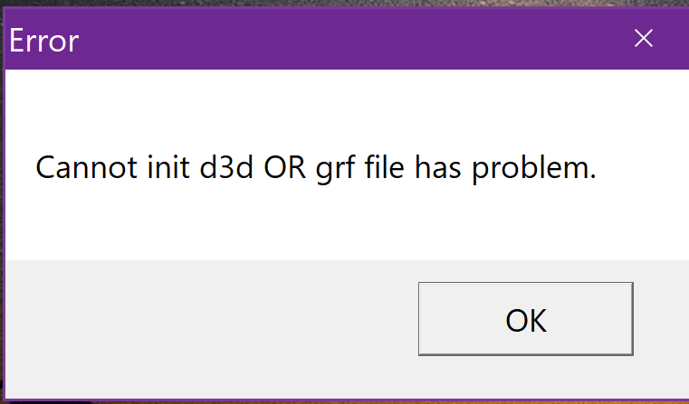
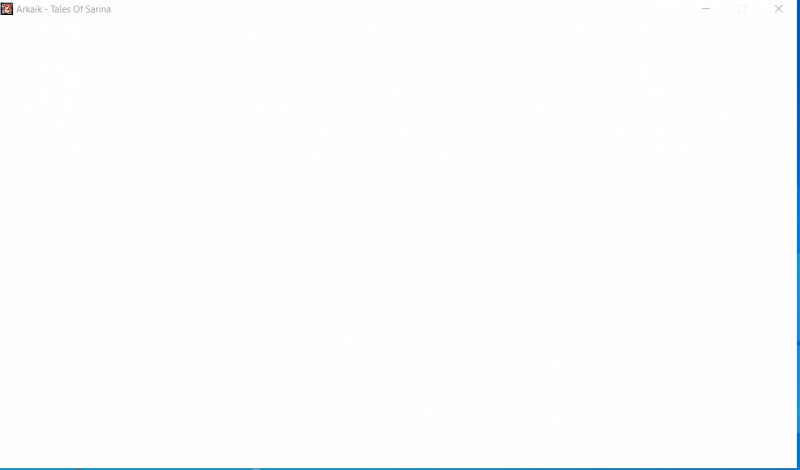

# 🪛 Common Issues (Client)

## Arkaik.exe opens, but when clicking "Play," nothing happens, and it closes



**Cause:**

* Your **antivirus** or **exploit protection** might be blocking the client's `.exe` file.

**Solution:**\
Go to:\
➡ **Windows Security** > **App & Browser Control** > **Exploit Protection Settings** > **Program Settings (Top Tab)** > **(+) Add a Program to Customize**

Type `Client.exe` and enable all processes. (Check all selection boxes; some may be enabled by default—disable them as well if necessary.)

<figure><figcaption></figcaption></figure>

<figure><figcaption></figcaption></figure>

## **Arkaik.exe does not open, is not in the task manager, and no error appears**



**Cause:**

* Your **antivirus** or **exploit protection** might be blocking the `exe` file of **Arkaik**.

**Solution:**\
➡ **Windows Security** > **App & Browser Control** > **Exploit Protection Settings** > **Program Settings (Top Tab)** > **(+) Add a Program to Customize**

Type **Arkaik.exe** and enable all processes. (Check all selection boxes; some may be enabled by default—disable them as well if necessary.)

📌 **Image:** Same procedure as above!

## **Error: Cannot find File with special characters "????"**



**Problem:**

* When running `Client.exe`, after selecting a character, the game displays special characters as `???`, causing it to **crash**.

<figure><figcaption></figcaption></figure>

**Cause:**

* The language pack **fails to convert UTF-8 encoding** for **Korean (Western Europe 1252)** characters.

**Solution:**\
➡ **Control Panel** > **Change date, time, or number formats** > **Administrative (Top Tab)** > **Change system locale**

🔹 **Uncheck** the **UNICODE UTF-8** box if it is enabled, restart, and test the game.

<figure><figcaption></figcaption></figure>

## **Error in Client.exe: "Cannot init d3d OR grf file has problem" or White Screen**



<figure><figcaption></figcaption></figure>

<figure><figcaption>
Tela Branca
</figcaption></figure>

**Problem:**

* When clicking on **Client.exe**, nothing happens, a white screen appears, and the game closes immediately, even after selecting the **graphics card** in **RO/OpenSetup.exe**.

**Problem 2:**

* When clicking **Play** through **Arkaik.exe** or **Client.exe**, the error message **"Cannot init d3d OR grf file has problem"** appears (this is the most common case).

***

#### **Solution for Problem 2:**

1. Open **RO/OpenSetup.exe**
2. Select your **graphics card**
3. Click **Apply**

➡ If the issue persists, try **Solution 1** below.

#### **Possible Cause:**

* Your **graphics card driver** may be outdated or not being recognized by **Ragnarok**.
* Some **RTX 3050 laptops** from **Asus Gaming** have this issue.

***

#### **How to Test This Issue:**

1. **Right-click** on **Client.exe**
2. Select **"Troubleshoot Compatibility"**
3. Click **"Test the Program"**

If the game **runs but has errors** (_like missing textures or incorrect visuals_), proceed to the **next solution**.

<figure><figcaption></figcaption></figure>

\
**Additional Solution: "Cannot init d3d OR grf file has problem"**

**Solution:**

1. Open **Device Manager**
2. Go to **Display Adapters**
3. **Disable** your **RTX graphics card** (or your dedicated GPU)
4. Open **Client.exe** again

**Explanation:**

* If the game **opens and works**, it means the **Vodoo** renderer is being used.
* Your graphics card might be **too modern** and **does not support older DirectX versions**.

[<mark style="color:purple;">Link do Video Tutorial</mark>](https://www.youtube.com/watch?v=2dStctdLMeE)

<figure><figcaption></figcaption></figure>

## **Error Loading Arkaik.exe Modules Before the Login Screen (Date & Time)**



**Problem:**

* When opening **Arkaik.exe**, during the module loading process, a **red error** appears stating:\
  &#xNAN;**"Server failed to authenticate the request"**.

<figure><figcaption></figcaption></figure>

**Cause:**

* This issue is common on **Windows 11** because it relies on an online server to synchronize the system time.

**Solution:**

1. **Go to:**
   * **Control Panel** > **Date & Time** > **Sync Now**

<figure><figcaption></figcaption></figure>

1. Open the **classic Date & Time settings** in Windows.
2. **Manually adjust** the date and time.
3. Make sure the time matches the current minutes from **Brasilia (Google Time Server)**.
4. Also, enable:
   * **"Change Time Zone"**
   * **"Internet Time"** synchronization with the correct server.

**If the Problem Persists:**

<figure><figcaption>
<mark style="color:red;"><strong>Click on Internet Time</strong></mark>
</figcaption></figure>

<figure><figcaption>
<mark style="color:red;"><strong>Change Time Zone</strong></mark>
</figcaption></figure>

<figure><figcaption></figcaption></figure>

## **Error: Failed to get updates URL (when opening arkaik.exe)**



**Problem:** When running **arkaik.exe**, an update error appears: **"Failed to get updates URL"**, meaning the update server rejected the connection.

**Solution:** Download **https://1.1.1.1**. If the issue persists, **Cloudflare** can optimize the best route for your internet.

<figure><figcaption></figcaption></figure>

## **Colored Squares Screen When Running Client.exe**



<figure><figcaption></figcaption></figure>

**Problem:**

* This configuration was designed for **older graphics cards**. Newer **RTX GPUs** and **chipsets** may experience this issue.

**Solution:**

1. Go to the folder where you installed the game:
   * **ArkaikOnline/RO/OpenSetup.exe**
   * Or open **arkaik.exe** > **Settings** > **External ROSETUP**
2. Look for a checkbox labeled **"Enable hardware accelerator"**, **disable it**, save, and restart the game.
3. If the issue persists, return to the same location and:
   * **Add a graphics card**
   * **Set a resolution lower than 1366x768**

## **STREAM MODE ARKAIK**

* How to resolve problem stream arkaik OBS STUDIO.
* If you are "<mark style="color:red;">**Streamer**</mark>" this season it's for you.



## GDI LIMIT PROBLEM

📌 How to Increase the GDI Object Limit in Windows

▫️ To avoid issues with the display of windows, menus, and alerts in Windows, you can increase the GDI object limit by editing the system registry.



<figure><figcaption></figcaption></figure>

🛠️ Step by Step:

(Only Windows 10+)

1️⃣ Open the Registry Editor (regedit). \
2️⃣ Go to the registry key:

Copy\
HKEY\_LOCAL\_MACHINE\SOFTWARE\Microsoft\WindowsNT\CurrentVersion\Windows\GDIProcessHandleQuota

3️⃣ Increase the value of GDIProcessHandleQuota. (Set it to 15000)\
4️⃣ Restart the computer to apply the changes.

📝 Important Details:\
💡 The GDIProcessHandleQuota value can be set in decimal (15000)\
⚠️ If the limit is reached, new windows may not open, menus may disappear, and alert boxes may fail to appear!\
\
🔄 GDI+ is the API that succeeded GDI (Windows Graphics Device Interface).
