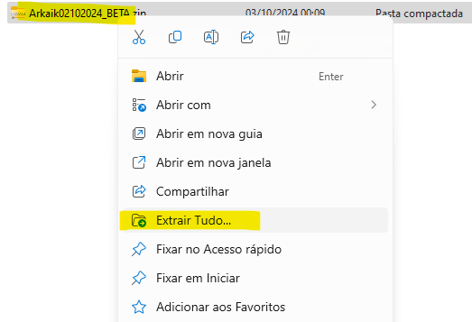
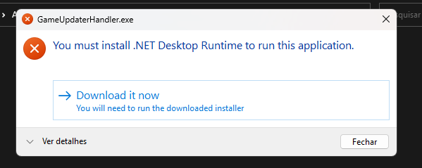

# 🚧 วิธีติดตั้ง Arkaik Online

<figure><figcaption></figcaption></figure>

* ### [**System Requirements**](how-to-install-arkaik-online.md#system-requirements-1)
* ### [**Account Registration**](how-to-install-arkaik-online.md#account-registration-1)
* ### [**Client Download**](how-to-install-arkaik-online.md#client-download-1)
* ### [**Client Extraction**](how-to-install-arkaik-online.md#client-extraction-1)
* ### [**Game Installation**](how-to-install-arkaik-online.md#game-installation-1)
* ### [**Client Update**](how-to-install-arkaik-online.md#client-update-1)
* ### [**Graphics and Sound Configuration**](how-to-install-arkaik-online.md#graphics-and-sound-configuration-1)
* ### [**Starting the Game**](how-to-install-arkaik-online.md#starting-the-game-1)
* ### [**Common Problem Solutions**](how-to-install-arkaik-online.md#common-problem-solutions-1)

### **ข้อกำหนดของระบบ**

| ส่วนประกอบ           | ข้อกำหนดขั้นต่ำ                     |
| ------------------- | -------------------------------------- |
| ระบบปฏิบัติการ      | Windows 10 หรือสูงกว่า                |
| โปรเซสเซอร์         | Dual Core 2.0 GHz                      |
| RAM                 | 4 GB (แนะนำ 8 GB)                     |
| พื้นที่ดิสก์        | 8 GB ว่าง (แนะนำอย่างน้อย 10 GB)     |
| การ์ดกราฟิก        | 256 MB พร้อม DirectX 9.0c             |
| การเชื่อมต่ออินเทอร์เน็ต | 1 Mbps หรือสูงกว่า                   |

### **การลงทะเบียนบัญชี**

เพื่อเล่น คุณต้องมีบัญชี ทำตามขั้นตอนด้านล่าง:

1. เข้าสู่เว็บไซต์ทางการของ **Arkaik Tales of Sarina**. <mark style="color:red;">**(ASIAN)**</mark>
2. คลิกที่ **"ลงทะเบียน"**.
3. กรอกข้อมูลที่จำเป็น (ชื่อผู้ใช้, อีเมล, รหัสผ่าน).
4. ยืนยันอีเมลของคุณโดยคลิกที่ลิงก์ยืนยันที่ส่งไป.

### **ดาวน์โหลดไคลเอนต์**

1. ไปที่ส่วน **ดาวน์โหลด** บนเว็บไซต์ทางการ.
2. คลิก **"ดาวน์โหลด"** เพื่อรับไคลเอนต์ (ปกติในรูปแบบ **.zip** หรือ **.rar**).

### **การแตกไฟล์ไคลเอนต์**

1. ไปที่โฟลเดอร์ที่ดาวน์โหลดไคลเอนต์.
2. คุณสามารถแตกไฟล์ได้โดยการ **คลิกขวา** บนไฟล์และเลือก **"แตกไฟล์ทั้งหมด"** ตามที่แสดงในภาพด้านล่าง.
3. รอให้การแตกไฟล์เสร็จสิ้น.

<figure><figcaption></figcaption></figure>

### **การติดตั้งเกม**

1. หลังจากแตกไฟล์แล้ว ให้ค้นหาไฟล์ **"Arkaik.exe"** หรือ **"Setup.exe"** ในโฟลเดอร์.
2. ดับเบิลคลิกเพื่อเริ่มการติดตั้ง.
3. ทำตามคำแนะนำบนหน้าจอเพื่อเลือกไดเรกทอรีการติดตั้ง.
4. รอให้การติดตั้งเสร็จสิ้น.

### **การอัปเดตไคลเอนต์**

1. รัน **Launcher.exe**.
2. ระบบจะตรวจสอบการอัปเดตโดยอัตโนมัติ.
3. รอในขณะที่การอัปเดตถูกนำไปใช้.

### **การตั้งค่ากราฟิกและเสียง**

1. ใน **launcher** คลิกที่ **"การตั้งค่า"**.
2. ปรับความละเอียดและการตั้งค่ากราฟิก.
3. บันทึกและปิดหน้าต่าง.

### **เริ่มเกม**

1. เปิด **Arkaik.exe**.
2. ป้อน **ข้อมูลการเข้าสู่ระบบ** (ชื่อผู้ใช้และรหัสผ่าน).
3. เลือก **Beta Server**.
4. ใน **launcher** คลิก **เล่น**.

### **การแก้ปัญหาทั่วไป**

**เกมไม่เปิด**

* ตรวจสอบว่า **DirectX 9.0c** ได้รับการติดตั้งแล้ว.
* เพิ่มข้อยกเว้นสำหรับเกมใน **ไฟร์วอลล์/แอนตี้ไวรัส** ของคุณ.

**ข้อผิดพลาด "ไฟล์เสียหาย"**

* ดาวน์โหลดไคลเอนต์ใหม่และแตกไฟล์อีกครั้ง.
* หากปัญหายังคงอยู่ ให้ตรวจสอบ **ปัญหาทั่วไป**.

**ประสิทธิภาพต่ำ (หน่วง)**

* ลดการตั้งค่ากราฟิกในตัวเลือก.
* ปิดโปรแกรมที่ทำงานอยู่เบื้องหลัง.

**ปัญหาการเชื่อมต่อ**

* ตรวจสอบ **ความเสถียรของอินเทอร์เน็ต** ของคุณ.
* ตรวจสอบว่าเซิร์ฟเวอร์อยู่ระหว่างการบำรุงรักษาหรือไม่ใน **Official Discord**. <mark style="color:red;">**(ASIAN)**</mark>

### **การติดตั้ง .NET 8**

ผู้เล่นหลายคนของ **Arkaik: Tales of Sarina** รายงานว่า ในระหว่างกระบวนการอัปเดต ข้อความจะปรากฏขึ้นเพื่อขอให้ติดตั้ง **.NET 8** (ทั้งเวอร์ชัน **x86** หรือ **x64**). แม้ว่านี่จะเป็นกระบวนการที่ง่าย แต่ผู้เล่นบางคนอาจสับสนหรือคิดว่านี่เป็นข้อผิดพลาด.

**.NET 8 คืออะไร?**

.NET 8 เป็นชุดของ **ไลบรารีและเครื่องมือ** ที่จำเป็นสำหรับการรันแอปพลิเคชัน Windows บางอย่าง รวมถึงเกม หากระบบของคุณไม่มีเวอร์ชันที่ถูกต้องของ .NET 8 ติดตั้ง เกมหรือ launcher อาจไม่ทำงานอย่างถูกต้อง.

**ทำไมถึงเกิดขึ้น?**

ในระหว่างการอัปเดตบางครั้ง เกมอาจต้องการ **ฟังก์ชันเฉพาะ** จาก **.NET 8**. หากระบบของคุณไม่มีเวอร์ชันที่จำเป็นติดตั้ง launcher จะขอให้ติดตั้งเฟรมเวิร์กโดยอัตโนมัติ.

**คุณควรทำอย่างไรเมื่อข้อความนี้ปรากฏขึ้น?**

(ขั้นตอนถัดไปอาจรวมถึงการดาวน์โหลดและติดตั้ง .NET 8—หากต้องการให้ฉันช่วยบอกได้เลย!)

<figure><figcaption></figcaption></figure>

หากคุณได้รับข้อความ (หรือต้องเผชิญกับข้อผิดพลาดที่ระบุไว้ด้านล่าง) ให้ทำตามขั้นตอนเหล่านี้เพื่อติดตั้ง **.NET 8**:

1. คลิกที่ลิงก์ที่ให้ไว้ในข้อความหรือไปที่เว็บไซต์ทางการของ Microsoft เพื่อดาวน์โหลด **DIRECT LINK** หรือ **.NET8 LINK**.
2. ดาวน์โหลดและติดตั้ง **โดยตรงบนคอมพิวเตอร์ของคุณ** (**สำคัญ**).
3. รัน launcher ของ **Arkaik: Tales of Sarina** อีกครั้งและตรวจสอบว่าปัญหาได้รับการแก้ไขหรือไม่.

***

#### **การแก้ปัญหาทั่วไป**

หากการติดตั้ง **.NET Framework** ไม่สามารถแก้ปัญหาได้หรือคุณยังเห็นข้อความ:

1. ตรวจสอบว่าคุณได้ติดตั้ง **.NET 8** แล้ว.
2. ลองอัปเดต **Windows** เพื่อให้แน่ใจว่ามีการติดตั้งความต้องการทั้งหมด.
3. ตรวจสอบว่า **แอนตี้ไวรัสหรือไฟร์วอลล์** ของคุณบล็อกการติดตั้งหรือการทำงานของเกมหลังจากการอัปเดตหรือไม่.

| ข้อผิดพลาดทั่วไป	                         | วิธีแก้ปัญหาที่แนะนำ                                      |
| ------------------------------------- | ------------------------------------------------------- |
| ตัวติดตั้ง .NET 8 ไม่เปิด            | ตรวจสอบสิทธิ์การดูแลระบบและรีสตาร์ทคอมพิวเตอร์ของคุณ.   |
| การติดตั้ง .NET 8 ล้มเหลว           | อัปเดต Windows และลองติดตั้งอีกครั้ง.                |
| ข้อความผิดพลาดหลังจากติดตั้ง .NET 8 | ตรวจสอบว่า launcher ไม่ถูกบล็อกโดยแอนตี้ไวรัสของคุณ. |

### คำสั่งที่มีประโยชน์ในเกม

| คำสั่ง  | ฟังก์ชัน                            |
| ------- | ----------------------------------- |
| /effect | เปิด/ปิด เอฟเฟกต์ภาพ                 |
| /where  | แสดงตำแหน่งของตัวละคร              |
| /noctrl | เปิด/ปิด การโจมตีต่อเนื่อง          |