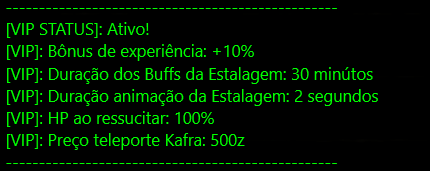

# 👑 ระบบ VIP (พรีเมียม)

<figure><figcaption></figcaption></figure>

## **ประโยชน์ของ VIP**

* ระบบ VIP มอบประโยชน์ที่ทำให้เกมเล่นง่ายและรวดเร็วขึ้น ผู้เล่น VIP จะได้รับประสบการณ์เพิ่มขึ้น 10% จ่ายน้อยลงสำหรับบัฟและการโทรศัพท์ และมีบัฟที่มีอายุการใช้งานนานขึ้น
* ใน VIP 1 เมื่อฟื้นคืนชีพ ผู้เล่นจะกลับมาพร้อม HP/SP เต็ม และยังได้รับโบนัสความเร็ว 10% เมื่ออยู่บนม้า นอกจากนี้ VIP จะได้รับโทษประสบการณ์น้อยลงเมื่อเสียชีวิตและสามารถลงรายการในตลาดได้มากขึ้น
* ประโยชน์เหล่านี้ช่วยประหยัดเวลาและทรัพยากร ทำให้ประสบการณ์การเล่นเกมมีความเป็นจริงและมีประสิทธิภาพมากขึ้น

<figure><figcaption>
<mark style="color:red;"><strong>โบนัส VIP</strong></mark>
</figcaption></figure>

## ตั๋ว VIP

* **ได้รับในเกม**: สามารถซื้อได้ในราคา 15,000 CP และมีอายุ 15 วัน
* **ได้รับจากเว็บไซต์**: สามารถซื้อได้โดยตรงจากเว็บไซต์ในราคา 30,000 CP และมีอายุ 30 วัน
* **สามารถแลกเปลี่ยนได้**: ตั๋ว VIP ที่ได้รับในเกมสามารถแลกเปลี่ยนระหว่างผู้เล่น ทำให้คุณสามารถซื้อหรือขายประโยชน์ภายในเกมได้

<figure><figcaption>
<mark style="color:red;"><strong>ตั๋ว VIP ในร้าน CP</strong></mark>
</figcaption></figure>

## ความแตกต่างระหว่างผู้เล่นปกติกับผู้เล่น VIP

<table><thead><tr><th width="383">คำอธิบาย</th><th width="144">ผู้เล่นปกติ</th><th>ผู้เล่น VIP</th></tr></thead><tbody><tr><td>ละเว้นการใช้เพชรในทักษะ?</td><td>ไม่</td><td>ไม่</td></tr><tr><td>โบนัสประสบการณ์</td><td>ไม่</td><td><mark style="color:yellow;">10%</mark></td></tr><tr><td>ค่าบัฟในโรงเตี๊ยม</td><td>400z</td><td><mark style="color:yellow;">200z</mark></td></tr><tr><td>เวลาการแอนิเมชันบัฟในโรงเตี๊ยม</td><td>5 วินาที</td><td><mark style="color:yellow;">2 วินาที</mark></td></tr><tr><td>ระยะเวลาบัฟในโรงเตี๊ยม</td><td>15 นาที</td><td><mark style="color:yellow;">30 นาที</mark></td></tr><tr><td>HP/SP เมื่อฟื้นคืนชีพ</td><td>20%</td><td><mark style="color:yellow;">100%</mark></td></tr><tr><td>การโทรศัพท์ (<mark style="color:green;">Kafra</mark>) - (<mark style="color:orange;">เรือ</mark>)</td><td><mark style="color:green;">900z</mark> - <mark style="color:orange;">500z</mark></td><td><mark style="color:green;">600z</mark> - <mark style="color:orange;">250z</mark></td></tr><tr><td>ขีดจำกัดการลงรายการในตลาด</td><td>10</td><td><mark style="color:yellow;">14</mark></td></tr><tr><td>ขีดจำกัดตัวละครต่อบัญชี</td><td>15</td><td><mark style="color:yellow;">15</mark></td></tr><tr><td>ซ่อมแซมของเสีย</td><td>900z</td><td><mark style="color:yellow;">400z</mark></td></tr><tr><td>โทษ EXP เมื่อเสียชีวิต</td><td>4%</td><td><mark style="color:yellow;">2%</mark></td></tr></tbody></table>