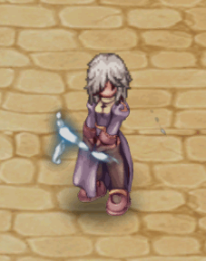
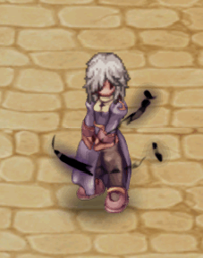

# 🟩 (Bottom/Mouth) | June

<table><thead><tr><th width="255.6666259765625">Image</th><th>in-game</th><th>Value</th></tr></thead><tbody><tr><td>
<figure><figcaption>
Auratom
</figcaption></figure>
</td><td>
<figure><figcaption></figcaption></figure>
</td><td><strong>22.000 CP</strong></td></tr><tr><td>
<figure><figcaption>
Auratom
</figcaption></figure>
</td><td>
<figure><figcaption></figcaption></figure>
</td><td><strong>22.000 CP</strong></td></tr><tr><td>
<figure><figcaption>
Auratom
</figcaption></figure>
</td><td>
<figure><figcaption></figcaption></figure>
</td><td><strong>22.000 CP</strong></td></tr><tr><td>
<figure><figcaption>
Auratom
</figcaption></figure>
</td><td>
<figure><figcaption></figcaption></figure>
</td><td><strong>22.000 CP</strong></td></tr><tr><td>
<figure><figcaption>
Auratom
</figcaption></figure>
</td><td>
<figure><figcaption></figcaption></figure>
</td><td><strong>22.000 CP</strong></td></tr><tr><td>
<figure><figcaption>
Auratom
</figcaption></figure>
</td><td>
<figure><figcaption></figcaption></figure>
</td><td><strong>22.000 CP</strong></td></tr><tr><td>
<figure><figcaption>
Mana Butterfly
</figcaption></figure>
</td><td>
<figure><figcaption></figcaption></figure>
</td><td><strong>16.000 CP</strong></td></tr><tr><td>
<figure><figcaption>
Mana Butterfly
</figcaption></figure>
</td><td>
<figure><figcaption></figcaption></figure>
</td><td><strong>16.000 CP</strong></td></tr><tr><td>
<figure><figcaption>
Mana Butterfly
</figcaption></figure>
</td><td>
<figure><figcaption></figcaption></figure>
</td><td><strong>16.000 CP</strong></td></tr><tr><td>
<figure><figcaption>
Mana Butterfly
</figcaption></figure>
</td><td>
<figure><figcaption></figcaption></figure>
</td><td><strong>16.000 CP</strong></td></tr><tr><td>
<figure><figcaption>
Mana Butterfly
</figcaption></figure>
</td><td>
<figure><figcaption></figcaption></figure>
</td><td><strong>16.000 CP</strong></td></tr><tr><td>
<figure><figcaption>
Mana Butterfly
</figcaption></figure>
</td><td>
<figure><figcaption></figcaption></figure>
</td><td><strong>16.000 CP</strong></td></tr><tr><td>
<figure><figcaption>
Mana Butterfly
</figcaption></figure>
</td><td>
<figure><figcaption></figcaption></figure>
</td><td><strong>16.000 CP</strong></td></tr><tr><td>
<figure><figcaption>
Outlaw's Scarf
</figcaption></figure>
</td><td>
<figure><figcaption></figcaption></figure>
</td><td><strong>18.000 CP</strong></td></tr><tr><td>
<figure><figcaption>
Eremes Scarf
</figcaption></figure>
</td><td>
<figure><figcaption></figcaption></figure>
</td><td><strong>29.000 CP</strong></td></tr><tr><td>
<figure><figcaption>
Ninja Scroll
</figcaption></figure>
</td><td>
<figure><figcaption></figcaption></figure>
</td><td><strong>15.000 CP</strong></td></tr></tbody></table>

