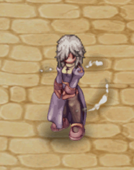

# 🟩 (Garmet) | June

<table><thead><tr><th width="255.6666259765625">Image</th><th>in-game</th><th>Value</th></tr></thead><tbody><tr><td>
<figure><figcaption>
Flight of Valkirie
</figcaption></figure>
</td><td>
<figure><figcaption></figcaption></figure>
</td><td><strong>22.000 CP</strong></td></tr><tr><td>
<figure><figcaption>
Glutton's Fork
</figcaption></figure>
</td><td>
<figure><figcaption></figcaption></figure>
</td><td><strong>22.000 CP</strong></td></tr><tr><td>
<figure><figcaption>
Sakura's  Wing
</figcaption></figure>
</td><td>
<figure><figcaption></figcaption></figure>
</td><td><strong>28.000 CP</strong></td></tr><tr><td>
<figure><figcaption>
Radiant Wings
</figcaption></figure>
</td><td>
<figure><figcaption></figcaption></figure>
</td><td><strong>35.000 CP</strong></td></tr><tr><td>
<figure><figcaption>
Fiery Wings
</figcaption></figure>
</td><td>
<figure><figcaption></figcaption></figure>
</td><td><strong>35.000 CP</strong></td></tr><tr><td>
<figure><figcaption>
Wings of Nature
</figcaption></figure>
</td><td>
<figure><figcaption></figcaption></figure>
</td><td><strong>35.000 CP</strong></td></tr><tr><td>
<figure><figcaption>
Frozen Wings
</figcaption></figure>
</td><td>
<figure><figcaption></figcaption></figure>
</td><td><strong>150.000 CP</strong></td></tr><tr><td>
<figure><figcaption>
Dark Wings
</figcaption></figure>
</td><td>
<figure><figcaption></figcaption></figure>
</td><td><strong>150.000 CP</strong></td></tr></tbody></table>

