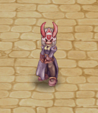
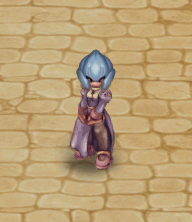
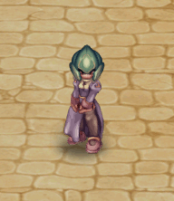
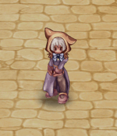

# 🟩 (Top/Head) | June

<table><thead><tr><th width="255.6666259765625">Image</th><th>in-game</th><th>Value</th></tr></thead><tbody><tr><td>
<figure><figcaption>
Hood with Little Ears
</figcaption></figure>
</td><td>
<figure><figcaption></figcaption></figure>
</td><td><strong>18.000 CP</strong></td></tr><tr><td>
<figure><figcaption>
Hood with Little Ears
</figcaption></figure>
</td><td>
<figure><figcaption></figcaption></figure>
</td><td><strong>18.000 CP</strong></td></tr><tr><td>
<figure><figcaption>
Hood with Little Ears
</figcaption></figure>
</td><td>
<figure><figcaption></figcaption></figure>
</td><td><strong>18.000 CP</strong></td></tr><tr><td>
<figure><figcaption>
Hood with Little Ears
</figcaption></figure>
</td><td>
<figure><figcaption></figcaption></figure>
</td><td><strong>18.000 CP</strong></td></tr><tr><td>
<figure><figcaption>
Hood with Little Ears
</figcaption></figure>
</td><td>
<figure><figcaption></figcaption></figure>
</td><td><strong>18.000 CP</strong></td></tr><tr><td>
<figure><figcaption>
Hood with Little Ears
</figcaption></figure>
</td><td>
<figure><figcaption></figcaption></figure>
</td><td><strong>18.000 CP</strong></td></tr><tr><td>
<figure><figcaption>
Hood with Little Ears
</figcaption></figure>
</td><td>
<figure><figcaption></figcaption></figure>
</td><td><strong>18.000 CP</strong></td></tr><tr><td>
<figure><figcaption>
Vulpes Hood
</figcaption></figure>
</td><td>
<figure><figcaption></figcaption></figure>
</td><td><strong>13.000 CP</strong></td></tr><tr><td>
<figure><figcaption>
Aquatic Essense
</figcaption></figure>
</td><td>
<figure><figcaption></figcaption></figure>
</td><td><strong>22.000 CP</strong></td></tr><tr><td>
<figure><figcaption>
Aquatic Essense
</figcaption></figure>
</td><td>
<figure><figcaption></figcaption></figure>
</td><td><strong>22.000 CP</strong></td></tr><tr><td>
<figure><figcaption>
Aquatic Essense
</figcaption></figure>
</td><td>
<figure><figcaption></figcaption></figure>
</td><td><strong>22.000 CP</strong></td></tr><tr><td>
<figure><figcaption>
Aquatic Essense
</figcaption></figure>
</td><td>
<figure><figcaption></figcaption></figure>
</td><td><strong>22.000 CP</strong></td></tr><tr><td>
<figure><figcaption>
Aquatic Essense
</figcaption></figure>
</td><td>
<figure><figcaption></figcaption></figure>
</td><td><strong>22.000 CP</strong></td></tr><tr><td>
<figure><figcaption>
Aquatic Essense
</figcaption></figure>
</td><td>
<figure><figcaption></figcaption></figure>
</td><td><strong>22.000 CP</strong></td></tr><tr><td>
<figure><figcaption>
Aquatic Essense
</figcaption></figure>
</td><td>
<figure><figcaption></figcaption></figure>
</td><td><strong>22.000 CP</strong></td></tr><tr><td>
<figure><figcaption>
Aquatic Essense
</figcaption></figure>
</td><td>
<figure><figcaption></figcaption></figure>
</td><td><strong>22.000 CP</strong></td></tr><tr><td>
<figure><figcaption>
Aquatic Essense
</figcaption></figure>
</td><td>
<figure><figcaption></figcaption></figure>
</td><td><strong>22.000 CP</strong></td></tr><tr><td>
<figure><figcaption>
Aquatic Essense
</figcaption></figure>
</td><td>
<figure><figcaption></figcaption></figure>
</td><td><strong>22.000 CP</strong></td></tr><tr><td>
<figure><figcaption>
Aquatic Essense
</figcaption></figure>
</td><td>
<figure><figcaption></figcaption></figure>
</td><td><strong>22.000 CP</strong></td></tr><tr><td>
<figure><figcaption>
Super Sayajin Broly hair
</figcaption></figure>
</td><td>
<figure><figcaption></figcaption></figure>
</td><td><strong>26.000 CP</strong></td></tr><tr><td>
<figure><figcaption>
Super Sayajin Wig
</figcaption></figure>
</td><td>
<figure><figcaption></figcaption></figure>
</td><td><strong>26.000 CP</strong></td></tr><tr><td>
<figure><figcaption>
Super Sayajin God Wig
</figcaption></figure>
</td><td>
<figure><figcaption></figcaption></figure>
</td><td><strong>26.000 CP</strong></td></tr><tr><td>
<figure><figcaption>
Super Sayajin Migatte Wig
</figcaption></figure>
</td><td>
<figure><figcaption></figcaption></figure>
</td><td><strong>26.000 CP</strong></td></tr><tr><td>
<figure><figcaption>
Enchanted Witch Hat
</figcaption></figure>
</td><td>
<figure><figcaption></figcaption></figure>
</td><td><strong>14.000 CP</strong></td></tr><tr><td>
<figure><figcaption>
Enchanted Witch Hat
</figcaption></figure>
</td><td>
<figure><figcaption></figcaption></figure>
</td><td><strong>14.000 CP</strong></td></tr><tr><td>
<figure><figcaption>
Enchanted Witch Hat
</figcaption></figure>
</td><td>
<figure><figcaption></figcaption></figure>
</td><td><strong>14.000 CP</strong></td></tr><tr><td>
<figure><figcaption>
Megaman helmet
</figcaption></figure>
</td><td>
<figure><figcaption></figcaption></figure>
</td><td><strong>20.000 CP</strong></td></tr><tr><td>
<figure><figcaption>
Megaman helmet
</figcaption></figure>
</td><td>
<figure><figcaption></figcaption></figure>
</td><td><strong>20.000 CP</strong></td></tr><tr><td>
<figure><figcaption>
Megaman helmet
</figcaption></figure>
</td><td>
<figure><figcaption></figcaption></figure>
</td><td><strong>20.000 CP</strong></td></tr><tr><td>
<figure><figcaption>
Megaman helmet
</figcaption></figure>
</td><td>
<figure><figcaption></figcaption></figure>
</td><td><strong>20.000 CP</strong></td></tr></tbody></table>

