# 🟩 Head

<table><thead><tr><th width="254.757568359375">Image</th><th>in-game</th><th>Value</th></tr></thead><tbody><tr><td>
<figure><figcaption></figcaption></figure>
</td><td>
<figure><figcaption></figcaption></figure>
</td><td>25.000 CP</td></tr><tr><td>
<figure><figcaption></figcaption></figure>
</td><td>
<figure><figcaption></figcaption></figure>
</td><td>25.000 CP</td></tr><tr><td>
<figure><figcaption></figcaption></figure>
</td><td>
<figure><figcaption></figcaption></figure>
</td><td>20.000 CP</td></tr><tr><td>
<figure><figcaption></figcaption></figure>
</td><td>
<figure><figcaption></figcaption></figure>
</td><td>22.000 CP</td></tr><tr><td>
<figure><figcaption></figcaption></figure>
</td><td>
<figure><figcaption></figcaption></figure>
</td><td>22.000 CP</td></tr><tr><td>
<figure><figcaption></figcaption></figure>
</td><td>
<figure><figcaption></figcaption></figure>
</td><td>22.000 CP</td></tr><tr><td>
<figure><figcaption></figcaption></figure>
</td><td>
<figure><figcaption></figcaption></figure>
</td><td>22.000 CP</td></tr><tr><td>
<figure><figcaption></figcaption></figure>
</td><td>
<figure><figcaption></figcaption></figure>
</td><td>22.000 CP</td></tr><tr><td>
<figure><figcaption></figcaption></figure>
</td><td>
<figure><figcaption></figcaption></figure>
</td><td>22.000 CP</td></tr><tr><td>
<figure><figcaption></figcaption></figure>
</td><td>
<figure><figcaption></figcaption></figure>
</td><td>22.000 CP</td></tr><tr><td>
<figure><figcaption></figcaption></figure>
</td><td>
<figure><figcaption></figcaption></figure>
</td><td>22.000 CP</td></tr><tr><td>
<figure><figcaption></figcaption></figure>
</td><td>
<figure><figcaption></figcaption></figure>
</td><td>22.000 CP</td></tr><tr><td>
<figure><figcaption></figcaption></figure>
</td><td>
<figure><figcaption></figcaption></figure>
</td><td>22.000 CP</td></tr><tr><td>
<figure><figcaption></figcaption></figure>
</td><td>
<figure>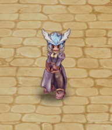<figcaption></figcaption></figure>
</td><td>22.000 CP</td></tr><tr><td>
<figure><figcaption></figcaption></figure>
</td><td>
<figure><figcaption></figcaption></figure>
</td><td>22.000 CP</td></tr><tr><td>
<figure><figcaption></figcaption></figure>
</td><td>
<figure><figcaption></figcaption></figure>
</td><td>22.000 CP</td></tr><tr><td>
<figure><figcaption></figcaption></figure>
</td><td>
<figure><figcaption></figcaption></figure>
</td><td>22.000 CP</td></tr><tr><td>
<figure><figcaption></figcaption></figure>
</td><td>
<figure><figcaption></figcaption></figure>
</td><td>22.000 CP</td></tr><tr><td>
<figure><figcaption></figcaption></figure>
</td><td>
<figure>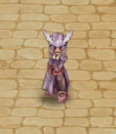<figcaption></figcaption></figure>
</td><td>22.000 CP</td></tr><tr><td>
<figure><figcaption></figcaption></figure>
</td><td>
<figure><figcaption></figcaption></figure>
</td><td>22.000 CP</td></tr><tr><td>
<figure><figcaption></figcaption></figure>
</td><td>
<figure><figcaption></figcaption></figure>
</td><td>22.000 CP</td></tr><tr><td>
<figure><figcaption></figcaption></figure>
</td><td>
<figure><figcaption></figcaption></figure>
</td><td>22.000 CP</td></tr><tr><td>
<figure><figcaption></figcaption></figure>
</td><td>
<figure>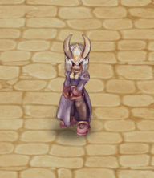<figcaption></figcaption></figure>
</td><td>22.000 CP</td></tr><tr><td>
<figure><figcaption></figcaption></figure>
</td><td>
<figure>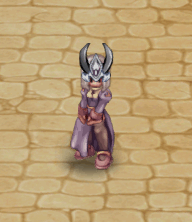<figcaption></figcaption></figure>
</td><td>22.000 CP</td></tr><tr><td>
<figure><figcaption></figcaption></figure>
</td><td>
<figure><figcaption></figcaption></figure>
</td><td>22.000 CP</td></tr><tr><td>
<figure><figcaption></figcaption></figure>
</td><td>
<figure><figcaption></figcaption></figure>
</td><td>22.000 CP</td></tr><tr><td>
<figure><figcaption></figcaption></figure>
</td><td>
<figure><figcaption></figcaption></figure>
</td><td>22.000 CP</td></tr><tr><td>
<figure><figcaption></figcaption></figure>
</td><td>
<figure>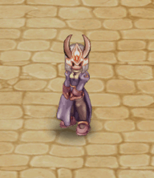<figcaption></figcaption></figure>
</td><td>22.000 CP</td></tr><tr><td>
<figure><figcaption></figcaption></figure>
</td><td>
<figure>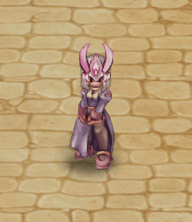<figcaption></figcaption></figure>
</td><td>22.000 CP</td></tr><tr><td>
<figure><figcaption></figcaption></figure>
</td><td>
<figure><figcaption></figcaption></figure>
</td><td>22.000 CP</td></tr><tr><td>
<figure><figcaption></figcaption></figure>
</td><td>
<figure><figcaption></figcaption></figure>
</td><td>22.000 CP</td></tr><tr><td>
<figure><figcaption></figcaption></figure>
</td><td>
<figure>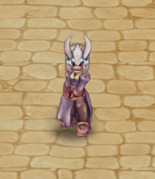<figcaption></figcaption></figure>
</td><td>22.000 CP</td></tr><tr><td>
<figure><figcaption></figcaption></figure>
</td><td>
<figure><figcaption></figcaption></figure>
</td><td>22.000 CP</td></tr><tr><td>
<figure><figcaption></figcaption></figure>
</td><td>
<figure><figcaption></figcaption></figure>
</td><td>20.000 CP</td></tr><tr><td>
<figure><figcaption></figcaption></figure>
</td><td>
<figure>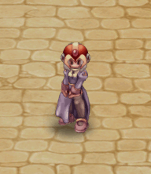<figcaption></figcaption></figure>
</td><td>20.000 CP</td></tr><tr><td>
<figure><figcaption></figcaption></figure>
</td><td>
<figure><figcaption></figcaption></figure>
</td><td>19.000 CP</td></tr><tr><td>
<figure><figcaption></figcaption></figure>
</td><td>
<figure><figcaption></figcaption></figure>
</td><td>19.000 CP</td></tr><tr><td>
<figure><figcaption></figcaption></figure>
</td><td>
<figure><figcaption></figcaption></figure>
</td><td>19.000 CP</td></tr><tr><td>
<figure><figcaption></figcaption></figure>
</td><td>
<figure><figcaption></figcaption></figure>
</td><td>19.000 CP</td></tr><tr><td>
<figure><figcaption></figcaption></figure>
</td><td>
<figure><figcaption></figcaption></figure>
</td><td>19.000 CP</td></tr><tr><td>
<figure><figcaption></figcaption></figure>
</td><td>
<figure><figcaption></figcaption></figure>
</td><td>19.000 CP</td></tr><tr><td>
<figure><figcaption></figcaption></figure>
</td><td>
<figure>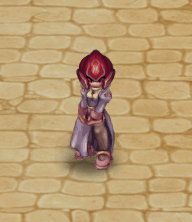<figcaption></figcaption></figure>
</td><td>19.000 CP</td></tr><tr><td>
<figure><figcaption></figcaption></figure>
</td><td>
<figure><figcaption></figcaption></figure>
</td><td>19.000 CP</td></tr><tr><td>
<figure><figcaption></figcaption></figure>
</td><td>
<figure>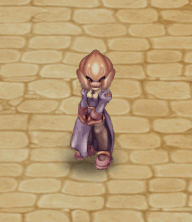<figcaption></figcaption></figure>
</td><td>19.000 CP</td></tr><tr><td>
<figure><figcaption></figcaption></figure>
</td><td>
<figure><figcaption></figcaption></figure>
</td><td>18.000 CP</td></tr><tr><td>
<figure><figcaption></figcaption></figure>
</td><td>
<figure><figcaption></figcaption></figure>
</td><td>18.000 CP</td></tr><tr><td>
<figure><figcaption></figcaption></figure>
</td><td>
<figure>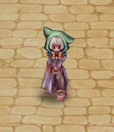<figcaption></figcaption></figure>
</td><td>18.000 CP</td></tr><tr><td>
<figure><figcaption></figcaption></figure>
</td><td>
<figure>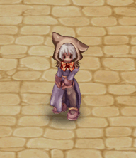<figcaption></figcaption></figure>
</td><td>18.000 CP</td></tr><tr><td>
<figure><figcaption></figcaption></figure>
</td><td>
<figure>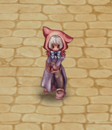<figcaption></figcaption></figure>
</td><td>18.000 CP</td></tr><tr><td>
<figure><figcaption></figcaption></figure>
</td><td>
<figure><figcaption></figcaption></figure>
</td><td>18.000 CP</td></tr><tr><td>
<figure><figcaption></figcaption></figure>
</td><td>
<figure><figcaption></figcaption></figure>
</td><td>18.000 CP</td></tr><tr><td>
<figure><figcaption></figcaption></figure>
</td><td>
<figure><figcaption></figcaption></figure>
</td><td>18.000 CP</td></tr><tr><td>
<figure><figcaption></figcaption></figure>
</td><td>
<figure><figcaption></figcaption></figure>
</td><td>18.000 CP</td></tr><tr><td>
<figure><figcaption></figcaption></figure>
</td><td>
<figure><figcaption></figcaption></figure>
</td><td>18.000 CP</td></tr><tr><td>
<figure><figcaption></figcaption></figure>
</td><td>
<figure><figcaption></figcaption></figure>
</td><td>18.000 CP</td></tr><tr><td>
<figure><figcaption></figcaption></figure>
</td><td>
<figure><figcaption></figcaption></figure>
</td><td>18.000 CP</td></tr><tr><td>
<figure><figcaption></figcaption></figure>
</td><td>
<figure><figcaption></figcaption></figure>
</td><td>18.000 CP</td></tr><tr><td>
<figure><figcaption></figcaption></figure>
</td><td>
<figure><figcaption></figcaption></figure>
</td><td>18.000 CP</td></tr><tr><td>
<figure><figcaption></figcaption></figure>
</td><td>
<figure><figcaption></figcaption></figure>
</td><td>18.000 CP</td></tr><tr><td>
<figure><figcaption></figcaption></figure>
</td><td>
<figure><figcaption></figcaption></figure>
</td><td>18.000 CP</td></tr><tr><td>
<figure><figcaption></figcaption></figure>
</td><td>
<figure><figcaption></figcaption></figure>
</td><td>18.000 CP</td></tr><tr><td>
<figure><figcaption></figcaption></figure>
</td><td>
<figure><figcaption></figcaption></figure>
</td><td>18.000 CP</td></tr><tr><td>
<figure><figcaption></figcaption></figure>
</td><td>
<figure><figcaption></figcaption></figure>
</td><td>18.000 CP</td></tr><tr><td>
<figure><figcaption></figcaption></figure>
</td><td>
<figure><figcaption></figcaption></figure>
</td><td>18.000 CP</td></tr><tr><td>
<figure><figcaption></figcaption></figure>
</td><td>
<figure><figcaption></figcaption></figure>
</td><td>18.000 CP</td></tr><tr><td>
<figure><figcaption></figcaption></figure>
</td><td>
<figure><figcaption></figcaption></figure>
</td><td>18.000 CP</td></tr><tr><td>
<figure><figcaption></figcaption></figure>
</td><td>
<figure><figcaption></figcaption></figure>
</td><td>18.000 CP</td></tr><tr><td>
<figure><figcaption></figcaption></figure>
</td><td>
<figure><figcaption></figcaption></figure>
</td><td>18.000 CP</td></tr><tr><td>
<figure><figcaption></figcaption></figure>
</td><td>
<figure><figcaption></figcaption></figure>
</td><td>18.000 CP</td></tr><tr><td>
<figure><figcaption></figcaption></figure>
</td><td>
<figure><figcaption></figcaption></figure>
</td><td>18.000 CP</td></tr><tr><td>
<figure><figcaption></figcaption></figure>
</td><td>
<figure><figcaption></figcaption></figure>
</td><td>18.000 CP</td></tr><tr><td>
<figure><figcaption></figcaption></figure>
</td><td>
<figure><figcaption></figcaption></figure>
</td><td>16.000 CP</td></tr><tr><td>
<figure><figcaption></figcaption></figure>
</td><td>
<figure><figcaption></figcaption></figure>
</td><td>16.000 CP</td></tr><tr><td>
<figure><figcaption></figcaption></figure>
</td><td>
<figure><figcaption></figcaption></figure>
</td><td>16.000 CP</td></tr><tr><td>
<figure><figcaption></figcaption></figure>
</td><td>
<figure><figcaption></figcaption></figure>
</td><td>16.000 CP</td></tr><tr><td>
<figure><figcaption></figcaption></figure>
</td><td>
<figure><figcaption></figcaption></figure>
</td><td>16.000 CP</td></tr><tr><td>
<figure><figcaption></figcaption></figure>
</td><td>
<figure><figcaption></figcaption></figure>
</td><td>16.000 CP</td></tr><tr><td>
<figure><figcaption></figcaption></figure>
</td><td>
<figure><figcaption></figcaption></figure>
</td><td>15.000 CP</td></tr><tr><td>
<figure><figcaption></figcaption></figure>
</td><td>
<figure><figcaption></figcaption></figure>
</td><td>15.000 CP</td></tr><tr><td>
<figure><figcaption></figcaption></figure>
</td><td>
<figure><figcaption></figcaption></figure>
</td><td>15.000 CP</td></tr><tr><td>
<figure><figcaption></figcaption></figure>
</td><td>
<figure><figcaption></figcaption></figure>
</td><td>15.000 CP</td></tr><tr><td>
<figure><figcaption></figcaption></figure>
</td><td>
<figure><figcaption></figcaption></figure>
</td><td>15.000 CP</td></tr><tr><td>
<figure><figcaption></figcaption></figure>
</td><td>
<figure><figcaption></figcaption></figure>
</td><td>15.000 CP</td></tr><tr><td>
<figure><figcaption></figcaption></figure>
</td><td>
<figure><figcaption></figcaption></figure>
</td><td>15.000 CP</td></tr><tr><td>
<figure><figcaption></figcaption></figure>
</td><td>
<figure><figcaption></figcaption></figure>
</td><td>15.000 CP</td></tr><tr><td></td><td>
<figure><figcaption></figcaption></figure>
</td><td>14.000 CP</td></tr><tr><td>
<figure><figcaption></figcaption></figure>
</td><td>
<figure><figcaption></figcaption></figure>
</td><td>14.000 CP</td></tr><tr><td>
<figure><figcaption></figcaption></figure>
</td><td>
<figure><figcaption></figcaption></figure>
</td><td>14.000 CP</td></tr><tr><td>
<figure><figcaption></figcaption></figure>
</td><td>
<figure><figcaption></figcaption></figure>
</td><td>13.000 CP</td></tr><tr><td>
<figure><figcaption></figcaption></figure>
</td><td>
<figure><figcaption></figcaption></figure>
</td><td>13.000 CP</td></tr><tr><td>
<figure><figcaption></figcaption></figure>
</td><td>
<figure><figcaption></figcaption></figure>
</td><td>13.000 CP</td></tr><tr><td>
<figure><figcaption></figcaption></figure>
</td><td>
<figure><figcaption></figcaption></figure>
</td><td>13.000 CP</td></tr><tr><td>
<figure><figcaption></figcaption></figure>
</td><td>
<figure><figcaption></figcaption></figure>
</td><td>13.000 CP</td></tr><tr><td>
<figure><figcaption></figcaption></figure>
</td><td>
<figure><figcaption></figcaption></figure>
</td><td>13.000 CP</td></tr><tr><td>
<figure><figcaption></figcaption></figure>
</td><td>
<figure><figcaption></figcaption></figure>
</td><td>13.000 CP</td></tr><tr><td>
<figure><figcaption></figcaption></figure>
</td><td>
<figure><figcaption></figcaption></figure>
</td><td>13.000 CP</td></tr><tr><td>
<figure><figcaption></figcaption></figure>
</td><td>
<figure><figcaption></figcaption></figure>
</td><td>13.000 CP</td></tr></tbody></table>
