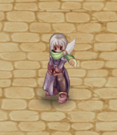
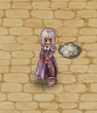

# 🟩 Vision

| Image                                                                                                                     | In-game                                                                                                         | Value     |
| ------------------------------------------------------------------------------------------------------------------------- | --------------------------------------------------------------------------------------------------------------- | --------- |
| 
<figure><figcaption></figcaption></figure>
      | 
<figure><figcaption></figcaption></figure>
 | 20.000 CP |
| 
<figure><figcaption></figcaption></figure>
      | 
<figure><figcaption></figcaption></figure>
 | 20.000 CP |
| 
<figure><figcaption></figcaption></figure>
      | 
<figure><figcaption></figcaption></figure>
     | 20.000 CP |
| 
<figure><figcaption></figcaption></figure>
      | 
<figure><figcaption></figcaption></figure>
     | 20.000 CP |
| 
<figure><figcaption></figcaption></figure>
      | 
<figure><figcaption></figcaption></figure>
     | 20.000 CP |
| 
<figure><figcaption></figcaption></figure>
      | 
<figure><figcaption></figcaption></figure>
     | 20.000 CP |
| 
<figure><figcaption></figcaption></figure>
      | 
<figure><figcaption></figcaption></figure>
     | 20.000 CP |
| 
<figure><figcaption></figcaption></figure>
      | 
<figure><figcaption></figcaption></figure>
     | 20.000 CP |
| 
<figure><figcaption></figcaption></figure>
      | 
<figure><figcaption></figcaption></figure>
     | 21.000 CP |
| 
<figure><figcaption></figcaption></figure>
      | 
<figure><figcaption></figcaption></figure>
     | 21.000 CP |
| 
<figure><figcaption></figcaption></figure>
      | 
<figure><figcaption></figcaption></figure>
     | 21.000 CP |
| 
<figure><figcaption></figcaption></figure>
      | 
<figure><figcaption></figcaption></figure>
     | 21.000 CP |
| 
<figure><figcaption></figcaption></figure>
      | 
<figure><figcaption></figcaption></figure>
     | 21.000 CP |
| 
<figure><figcaption></figcaption></figure>
      | 
<figure><figcaption></figcaption></figure>
     | 21.000 CP |
| 
<figure><figcaption></figcaption></figure>
      | 
<figure><figcaption></figcaption></figure>
     | 20.000 CP |
| 
<figure><figcaption></figcaption></figure>
     | 
<figure><figcaption></figcaption></figure>
     | 20.000 CP |
| 
<figure><figcaption></figcaption></figure>
 | 
<figure><figcaption></figcaption></figure>
     | 20.000 CP |
| 
<figure><figcaption></figcaption></figure>
 | 
<figure><figcaption></figcaption></figure>
     | 20.000 CP |
| 
<figure><figcaption></figcaption></figure>
 | 
<figure><figcaption></figcaption></figure>
     | 20.000 CP |
| 
<figure><figcaption></figcaption></figure>
 | 
<figure><figcaption></figcaption></figure>
     | 20.000 CP |
| 
<figure><figcaption></figcaption></figure>
 | 
<figure><figcaption></figcaption></figure>
     | 20.000 CP |
| 
<figure><figcaption></figcaption></figure>
 | 
<figure><figcaption></figcaption></figure>
     | 20.000 CP |
| 
<figure><figcaption></figcaption></figure>
    | 
<figure><figcaption></figcaption></figure>
     | 19.000 CP |
| 
<figure><figcaption></figcaption></figure>
 | 
<figure><figcaption></figcaption></figure>
 | 19.000 CP |
| 
<figure><figcaption></figcaption></figure>
 | 
<figure><figcaption></figcaption></figure>
     | 19.000 CP |
| 
<figure><figcaption></figcaption></figure>
    | 
<figure><figcaption></figcaption></figure>
     | 19.000 CP |
| 
<figure><figcaption></figcaption></figure>
    | 
<figure><figcaption></figcaption></figure>
     | 19.000 CP |
| 
<figure><figcaption></figcaption></figure>
    | 
<figure><figcaption></figcaption></figure>
     | 19.000 CP |
| 
<figure><figcaption></figcaption></figure>
    | 
<figure><figcaption></figcaption></figure>
     | 19.000 CP |
| 
<figure><figcaption></figcaption></figure>
      | 
<figure><figcaption></figcaption></figure>
     | 19.000 CP |
| 
<figure><figcaption></figcaption></figure>
      | 
<figure><figcaption></figcaption></figure>
     | 19.000 CP |
| 
<figure><figcaption></figcaption></figure>
      | 
<figure><figcaption></figcaption></figure>
     | 19.000 CP |
| 
<figure><figcaption></figcaption></figure>
      | 
<figure><figcaption></figcaption></figure>
     | 19.000 CP |
| 
<figure><figcaption></figcaption></figure>
      | 
<figure><figcaption></figcaption></figure>
     | 19.000 CP |
| 
<figure><figcaption></figcaption></figure>
      | 
<figure><figcaption></figcaption></figure>
     | 19.000 CP |
| 
<figure><figcaption></figcaption></figure>
      | 
<figure><figcaption></figcaption></figure>
     | 19.000 CP |
| 
<figure><figcaption></figcaption></figure>
      | 
<figure><figcaption></figcaption></figure>
     | 18.000 CP |
| 
<figure><figcaption></figcaption></figure>
      | 
<figure><figcaption></figcaption></figure>
     | 17.000 CP |
| 
<figure><figcaption></figcaption></figure>
      | 
<figure><figcaption></figcaption></figure>
     | 17.000 CP |
| 
<figure><figcaption></figcaption></figure>
      | 
<figure><figcaption></figcaption></figure>
     | 17.000 CP |
| 
<figure><figcaption></figcaption></figure>
      | 
<figure><figcaption></figcaption></figure>
     | 16.000 CP |
| 
<figure><figcaption></figcaption></figure>
      | 
<figure><figcaption></figcaption></figure>
     | 15.000 CP |
| 
<figure><figcaption></figcaption></figure>
      | 
<figure><figcaption></figcaption></figure>
     | 13.000 CP |
