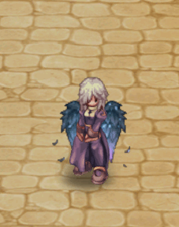
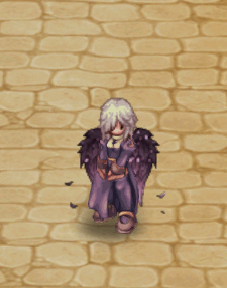

# 🟩 (Middle/Vision) | July

<table><thead><tr><th width="255.6666259765625">ảnh </th><th>hoạt ảnh</th><th>trị giá</th></tr></thead><tbody><tr><td>
<figure><figcaption></figcaption></figure>
</td><td>
<figure><figcaption></figcaption></figure>
</td><td><strong>20.000 CP</strong></td></tr><tr><td>
<figure><figcaption></figcaption></figure>
</td><td>
<figure><figcaption></figcaption></figure>
</td><td><strong>18.000 CP</strong></td></tr><tr><td>
<figure><figcaption></figcaption></figure>
</td><td>
<figure><figcaption></figcaption></figure>
</td><td><strong>18.000 CP</strong></td></tr><tr><td>
<figure><figcaption></figcaption></figure>
</td><td>
<figure><figcaption></figcaption></figure>
</td><td><strong>16.000 CP</strong></td></tr><tr><td>
<figure><figcaption></figcaption></figure>
</td><td>
<figure><figcaption></figcaption></figure>
</td><td><strong>21.000 CP</strong></td></tr><tr><td>
<figure><figcaption></figcaption></figure>
</td><td>
<figure><figcaption></figcaption></figure>
</td><td><strong>21.000 CP</strong></td></tr><tr><td>
<figure><figcaption></figcaption></figure>
</td><td>
<figure><figcaption></figcaption></figure>
</td><td><strong>21.000 CP</strong></td></tr><tr><td>
<figure><figcaption></figcaption></figure>
</td><td>
<figure><figcaption></figcaption></figure>
</td><td><strong>21.000 CP</strong></td></tr><tr><td>
<figure><figcaption></figcaption></figure>
</td><td>
<figure><figcaption></figcaption></figure>
</td><td><strong>21.000 CP</strong></td></tr><tr><td>
<figure><figcaption></figcaption></figure>
</td><td>
<figure><figcaption></figcaption></figure>
</td><td><strong>21.000 CP</strong></td></tr><tr><td>
<figure><figcaption></figcaption></figure>
</td><td>
<figure><figcaption></figcaption></figure>
</td><td><strong>21.000 CP</strong></td></tr><tr><td>
<figure><figcaption></figcaption></figure>
</td><td>
<figure><figcaption></figcaption></figure>
</td><td><strong>21.000 CP</strong></td></tr><tr><td>
<figure><figcaption></figcaption></figure>
</td><td>
<figure><figcaption></figcaption></figure>
</td><td><strong>21.000 CP</strong></td></tr><tr><td>
<figure><figcaption></figcaption></figure>
</td><td>
<figure><figcaption></figcaption></figure>
</td><td><strong>21.000 CP</strong></td></tr><tr><td>
<figure><figcaption></figcaption></figure>
</td><td>
<figure><figcaption></figcaption></figure>
</td><td><strong>21.000 CP</strong></td></tr><tr><td>
<figure><figcaption></figcaption></figure>
</td><td>
<figure><figcaption></figcaption></figure>
</td><td><strong>21.000 CP</strong></td></tr><tr><td>
<figure><figcaption></figcaption></figure>
</td><td>
<figure><figcaption></figcaption></figure>
</td><td><strong>21.000 CP</strong></td></tr><tr><td>
<figure><figcaption></figcaption></figure>
</td><td>
<figure><figcaption></figcaption></figure>
</td><td><strong>21.000 CP</strong></td></tr><tr><td>
<figure><figcaption></figcaption></figure>
</td><td>
<figure><figcaption></figcaption></figure>
</td><td><strong>21.000 CP</strong></td></tr><tr><td>
<figure><figcaption></figcaption></figure>
</td><td>
<figure><figcaption></figcaption></figure>
</td><td><strong>21.000 CP</strong></td></tr><tr><td>
<figure><figcaption></figcaption></figure>
</td><td>
<figure><figcaption></figcaption></figure>
</td><td><strong>21.000 CP</strong></td></tr><tr><td>
<figure><figcaption></figcaption></figure>
</td><td>
<figure><figcaption></figcaption></figure>
</td><td><strong>21.000 CP</strong></td></tr></tbody></table>
