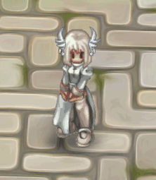
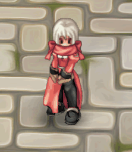
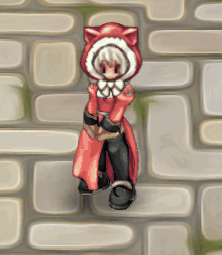

# ☃️ Lutie Event

## Event: Christmas Mission

* To understand how the Christmas missions work, see the Gif below to view the missions.

## Event: Christmas Missions

***

## 📖 About the Mission

* To start the mission, you must go to the city of **LUTIE**.
* After that, you will begin the mission by interacting with the NPC **Christmas Event**.

***

## 🎄 Mission 1

* In **LUTIE**, talk to the **Christmas Event** NPC to start your mission.

<figure><figcaption></figcaption></figure>

### &#x20;&#xNAN;_&#x4E;PC "Christmas Event," located in Lutie_

* After talking, he will ask you for some items.
* Defeat some **Santa Poring** and bring **30 Christmas Cake**.
* You can find them in: Zaro, Payon, Morocc, Geffen, Prontera, Alberta, Aldebaran (Santa Poring, Christmas Orc, Christmas Goblin).

| Monster                                                              | Item                                                               | QTY    |
| -------------------------------------------------------------------- | ------------------------------------------------------------------ | ------ |
|   (1) (2) (1).png>)**Santa Poring** |   (1) (2).png>)**Christmas Cake** | **30** |

* After collecting "30 **Christmas Cake**" go back to the "**Christmas Event**" NPC, who will give you "Asinhas do Inverno" as a reward.

| Reward                                                       | Illustration                                                                                        |
| ------------------------------------------------------------ | --------------------------------------------------------------------------------------------------- |
|   (1).png>)**Winter Wings** | 
<figure><figcaption></figcaption></figure>
 |

***

## 🎄 Mission 2

* After completing the first mission, start the second one at the **Little Scarf** NPC.

<figure><figcaption></figcaption></figure>

### &#x20;&#xNAN;_&#x4E;PC Little Scarf in Lutie_

* After talking, he will ask you for some items.
* Defeat some **Christmas Goblin** and bring **40 Gift Ribbons**.
* You can find them in: Zaro, Payon, Morocc, Geffen, Prontera, Alberta, Aldebaran (Santa Poring, Christmas Orc, Christmas Goblin).

| Monster                                                          | Item                                                      | QTY    |
| ---------------------------------------------------------------- | --------------------------------------------------------- | ------ |
|   (1).png>)**Christmas Goblin** |   (1).png>)**Gift Loop** | **40** |

* After collecting 20 **Gift Loop**, return to **Cachecolina** NPC,who will give you "Scarf with Ribbon" as a reward.

| Reward                                                         | Illustration                                                                                        |
| -------------------------------------------------------------- | --------------------------------------------------------------------------------------------------- |
|  (1).png>) **Scarf With Bow** | 
<figure><figcaption></figcaption></figure>
 |

***

### 🎄 Mission 3

* After completing the second mission, continue at the **Sweetooth** NPC.

<figure><figcaption></figcaption></figure>

### &#x20;&#xNAN;_&#x4E;PC Sweetooth in Lutie_

* Collect **20 Sweet Potato** (buy from NPC seller).

<figure><figcaption></figcaption></figure>

\
&#xNAN;_&#x53;eller of Fruits NPC_

| Item                                                              | QTY    |
| ----------------------------------------------------------------- | ------ |
|   (1) (1).png>)**Sweet Potato** | **20** |

* After collecting 20 Sweet Potato + 20 Candy Cane, return to **Sweetooth** NPC,who will give you "Christmas Cat Hat" as a reward.

| Reward                                                                 | Illustration                                                                                        |
| ---------------------------------------------------------------------- | --------------------------------------------------------------------------------------------------- |
|   (1) (1).png>)**Christmas Cat Hat** | 
<figure><figcaption></figcaption></figure>
 |

***

## 🎄 Mission 4

## **Part 1/3**

* Continue talking to **True Santa** NPC.

<figure><figcaption></figcaption></figure>

### &#x20;&#xNAN;_&#x4E;PC True Santa in Lutie_

* After talking, he will ask you for some items.
* Defeat **Antonio, Santa Poring, Christmas Orc, Christmas Goblin** and bring **1 Christmas Hat**.
* You can find the Christmas monsters on the maps "Zero, Payon, Morroc, Geffen, Prontera, Alberta, Aldebaran, (Santa Poring, Christmas Orc, and Christmas Goblin)".
* Antonio = 2% drop chance
* Christmas/Santa monsters = 1% drop chance
* After finishing, go back to the "**True Santa**" NPC and hand over the "**Christmas Hat**" to proceed.

| Monster                                                      | Item                                                           | QTY   |
| ------------------------------------------------------------ | -------------------------------------------------------------- | ----- |
|   (1) (1).png>)**Antonio** |   (2).png>)**Christmas Hat** | **1** |

***

## **Part 2/3**

* Talk again to **True Santa** NPC, he will give you a **Magic Bag**.
* He will teleport you to a new map and ask you to bring **100** "**Cold Envelope**."
* To get the envelopes, just use the "**Magic Bag**" on the presents. A capture animation will appear. It is not consumed when used, but the chance to obtain the item is 35%.
* After collecting all 100 envelopes, you will be teleported back to him.

| Capture Monster                                           | Item Obtained                                                  | Item Used                                                                                   | Chance  |
| --------------------------------------------------------- | -------------------------------------------------------------- | ------------------------------------------------------------------------------------------- | ------- |
|   (1).png>)**Mystcase** |   (1).png>)**Cold Envelope** |  **Magic Bag** | **35%** |

***

### **Part 3/3 (Repeatable)**

* After finishing, go back to the "**True Santa**" NPC.
* At this point, he will ask you to kill "20 Antonios."
* After finishing, go back to the "**True Santa**" NPC to receive "Celebration Coin" as a reward.

| Reward                                                            | Description                         |
| ----------------------------------------------------------------- | ----------------------------------- |
|   (1).png>)**Celebration Coin** | Used at the **Christmas Store** NPC |

_This mission can be repeated infinitely to farm more Celebration Coins._

***

## 🎁 Magic Bag

* You can also purchase **Magic Bag** from **Christmas Store NPC** to capture presents.
* Even if capture fails, you are guaranteed to get some items.

***

## 🎁 Capture Items (Drop Chance)

<table><thead><tr><th width="176.33331298828125">Type</th><th>Item</th><th>Drop</th><th>QTY</th></tr></thead><tbody><tr><td>Bound</td><td> Antonio Phsycal Bag</td><td>5%</td><td>1</td></tr><tr><td>Free</td><td> Yggdrasil Seed</td><td>10%</td><td>1</td></tr><tr><td>Bound</td><td> Poring Noel Balon</td><td>0.10%</td><td>1</td></tr><tr><td>Bound</td><td> Santa's Tiara</td><td>0.10%</td><td>1</td></tr><tr><td>Bound</td><td> Fireworks: Christmas</td><td>0.10%</td><td>1</td></tr><tr><td>Bound</td><td> Elvish Elixir</td><td>1%</td><td>1</td></tr><tr><td>Bound</td><td> Small Mastery Bag</td><td>0.1%</td><td>1</td></tr><tr><td>Free</td><td> Old Gem Album</td><td>0.01%</td><td>1</td></tr><tr><td>Bound</td><td> Enriched Enriquecido</td><td>0.10%</td><td>1</td></tr><tr><td>Bound</td><td> Bubble Gum</td><td>0.10%</td><td>1</td></tr><tr><td>Free</td><td>Reinder Horn</td><td>1%</td><td>1</td></tr><tr><td>Free</td><td> Bell Scard</td><td>1%</td><td>1</td></tr><tr><td>Free</td><td> SnowFlakes</td><td>1%</td><td>1</td></tr><tr><td>Free</td><td> Bragi Wings</td><td>1%</td><td>1</td></tr><tr><td>Bound</td><td>Medium Mastery Bag</td><td>0.1%</td><td>1</td></tr></tbody></table>

***

## 🎁 Guaranteed Capture Items

| Type  | Item                                                                  | QTY |
| ----- | --------------------------------------------------------------------- | --- |
| Free  |   (1).png>)Amulet                   | 1   |
| Free  |   (1).png>)Yggdrasil Leaf           | 1   |
| Bound |   (1).png>)Reformulated Blue Potion | 10  |
| Bound |  (1).png>)Magic Bag                 | 1   |
| Bound |   (1).png>)Gift Box                 | 1   |
| Bound |   (1).png>)Old Blue Box             | 1   |
| Bound |   (1).png>)Condensed White Potion   | 5   |
| Bound |  (1).png>)Condensed Yellow Potion   | 5   |
| Bound |  (1).png>)Condensed Red Potion      | 5   |
| Bound |  (1).png>)Red Potion                | 5   |
| Bound |  (1).png>)Orange Potion             | 5   |
| Bound |  (1).png>)Yellow Potion             | 5   |
| Bound |   (1).png>)White Potion             | 5   |
| Bound |   (1).png>)Blue Potion              | 5   |
| Bound |  (1).png>)Green Potion              | 1   |
| Bound |   (1).png>)Green Herb               | 1   |
| Bound |   (1).png>)Banana                   | 5   |

***

## 🎅 Exchange NPC

* After completing all missions and having **Commemoration Coins**, you can use them to exchange rewards at the **Christmas Store NPC**.
* If you run out of coins, repeat **Mission 4** to get more.
