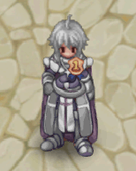
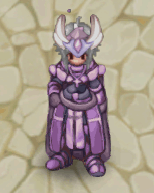
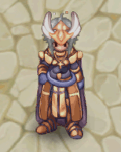
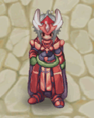
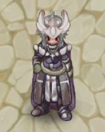

# 🏇 Race to 99

<figure><figcaption></figcaption></figure>

## Modalities and Rules

| Information                                                                                                                                                                                                                                                                                                                                                                                                                                                                                                                                                                |
| -------------------------------------------------------------------------------------------------------------------------------------------------------------------------------------------------------------------------------------------------------------------------------------------------------------------------------------------------------------------------------------------------------------------------------------------------------------------------------------------------------------------------------------------------------------------------- |
| 
<mark style="color:red;"><strong>Participating Classes:</strong></mark>

<ul><li>Novice, Knight/Crusader, Hunter,Bard/Dancer, Wizard, Sage, Blacksmith/Alchemist, Rogue/ Assasin, Priest/Monk.</li></ul>

<mark style="color:red;"><strong>Places</strong></mark> 
<ul><li>Each class will have a 1st and 2nd place <strong>(2 winners per class)</strong>.</li><li>In total, <strong>there will be 26 winners</strong></li><li><strong>First Place 100k Cube Points.</strong></li><li><strong>Second Place 100k Cube Points.</strong></li></ul> |

## **How to check the rank**

* In the city of **"**<mark style="color:red;">**ZERO**</mark>**"**, find the NPC **"**<mark style="background-color:red;">**LEVEL RACE**</mark>**"**
* The NPC will show all the useful information for you to check the current ranking.
* “Check Recent”, “List by Class”, “Rewards”.

<figure><figcaption>
<mark style="color:red;"><strong>NPC LEVEL RACE</strong></mark>
</figcaption></figure>

## Rewards

<table><thead><tr><th width="367">Image</th><th align="center">Nameaa</th></tr></thead><tbody><tr><td>
<figure><figcaption></figcaption></figure>
</td><td align="center">

<strong>First Place</strong>
</td></tr><tr><td>
<figure><figcaption></figcaption></figure>
</td><td align="center">

<strong>Shiny Ornament</strong>
</td></tr><tr><td>
<figure><figcaption></figcaption></figure>
</td><td align="center">

<strong>Shiny Ornament</strong>
</td></tr><tr><td>
<figure><figcaption></figcaption></figure>
</td><td align="center">

<strong>Shiny Ornament</strong>
</td></tr><tr><td>
<figure><figcaption></figcaption></figure>
</td><td align="center">

<strong>Shiny Ornament</strong>
</td></tr><tr><td>
<figure><figcaption></figcaption></figure>
</td><td align="center">

<strong>Shiny Ornament</strong>
</td></tr><tr><td>
<figure><figcaption></figcaption></figure>
</td><td align="center">

<strong>Shiny Ornament</strong>
</td></tr></tbody></table>
