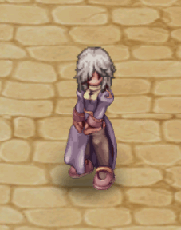

# ❄️ Ice Arena 3v3

**Về Giải đấu 3v3**

* Giải đấu của chúng tôi hướng đến mục tiêu mang lại niềm vui với cơ chế PvP khác với thông thường, thường dữ dội hơn với ít chiến lược.
*
  Với cơ chế giảm sát thương, thời gian hồi chiêu của kỹ năng và thuốc hồi máu, và các buff trung tâm với 100% HP/SP hồi máu, PvP trở nên ít "tất tay" hơn và thiên về vị trí và chiến lược hơn.

**Phần thưởng tiền mặt**

* 3 người chơi đứng đầu sẽ chia nhau phần thưởng tiền mặt, <mark style="color:red;">với 40% cho người đứng đầu 1 và 30% cho mỗi người đứng đầu 2 và 3</mark>. Người chơi có thể tham gia giải đấu miễn phí, nhưng để giành được giải thưởng tiền mặt, cần phải có "vé tham gia" giải đấu, có giá là <mark style="color:red;">10k CP.</mark>
* <mark style="color:red;">Phí 10.000 RMT sẽ được phân bổ toàn bộ (100%) vào quỹ giải thưởng của giải đấu, cũng như lệ phí tham gia giải đấu.</mark>
* Nếu một người chơi không có mục nhập nào giành chiến thắng trong Top 3, số tiền sẽ được chia cho 2 người chiến thắng còn lại.

**Giờ mở cửa của đấu trường**

Đấu trường sẽ mở cửa ở chế độ giao hữu (không tính điểm) vào mỗi ngày từ <mark style="color:red;">8:00 sáng đến 9:59 sáng</mark>, từ <mark style="color:red;">3:00 chiều đến 4:59</mark> chiều và từ <mark style="color:red;">7:00 tối đến 8:59 tối</mark>.

Làm thế nào để tham gia

<figure><figcaption>
<mark style="color:red;">Để tham gia, hãy nhập lệnh @joinarena</mark>
</figcaption></figure>

* Giải đấu sẽ diễn ra 2 ngày một tuần và kéo dài <mark style="color:red;">1 giờ.</mark>
*
  Để vào hàng đợi, chỉ cần sử dụng lệnh <mark style="color:red;">@joinarena.</mark>
*
  Nếu bạn vào hàng đợi và cần rời đi vì việc khác, hãy sử dụng <mark style="color:red;">@leavearena</mark>. Nếu nhân vật của bạn vào trận đấu và vẫn AFK, hoặc bị chứng minh qua báo cáo, điều đó có thể dẫn đến BAN! Điều này bao gồm các tài khoản khác (tài khoản phụ và tài khoản chính) từ cùng một máy tính hoặc IP! Ngay cả khi chúng không liên quan đến sự kiện!
*
  Bạn không được ở trong một nhóm để sử dụng lệnh và vào hàng đợi.
*
  Nếu bạn vào hàng đợi rồi tham gia một nhóm, bạn sẽ tự động bị xóa khỏi hàng đợi!
*
  Vé tham gia giải đấu trả phí sẽ chỉ được bán vào tuần đầu tiên của mỗi tháng <mark style="color:red;">(để ngăn người chơi mua vào ngày cuối cùng nếu họ ở đầu).</mark>

**Cơ Học**

* Các đội là ngẫu nhiên, điều này làm cho nó công bằng hơn và ngăn chặn "bè lũ".
* <mark style="color:red;">Giảm 65% sát thương.</mark>
*  <mark style="color:green;">Kỹ năng hồi máu</mark> có thời gian <mark style="color:red;">hồi +10 giây.</mark>
*  <mark style="color:orange;">Vật phẩm tiêu hao</mark> có thời gian <mark style="color:red;">hồi +15 giây.</mark>
*
  Thắng một trận sẽ được <mark style="color:red;">20 điểm</mark> và thua sẽ mất <mark style="color:red;">15 điểm</mark>.
*
  Không được phép rời khỏi bản đồ hoặc dịch chuyển ra ngoài. Nếu bạn đăng xuất trong khi đang chơi, 60 điểm sẽ bị trừ như một hình phạt.
*
  Cứ mỗi 30 giây, một bộ buff ngẫu nhiên sẽ xuất hiện ở giữa bản đồ, cấp nhiều buff khác nhau và hồi 100% HP và SP cho tất cả mọi người trong nhóm bắt được nó.
*
  Có 3 bộ buff và cứ mỗi 30 giây, một trong các bộ sẽ xuất hiện, mỗi bộ có hoạt ảnh và hiệu ứng hình ảnh riêng để nhận dạng.

**Hệ thống cuộc sống**

* Mỗi đội có 3 thành viên.
*
  Mỗi người chơi có <mark style="color:red;">3 mạng.</mark>
*
  Khi tất cả thành viên của một đội mất 3 mạng, trận đấu sẽ kết thúc.
*
  Đội nào vẫn còn ít nhất 1 thành viên có 1 mạng sẽ thắng.

**Lưu ý**

* Tiến vào căn cứ địch (băng qua cầu) sẽ dẫn đến tử vong ngay lập tức—nhân vật của bạn sẽ chết ngay lập tức. Điều này nhằm mục đích cung cấp một vùng an toàn để các bên tập hợp lại.
* Vào phút thứ 3 của trận đấu, vùng an toàn sẽ bị vô hiệu hóa để ngăn các bên tránh giao tranh.
* Vào phút thứ 4 của trận đấu, một Emperium sẽ xuất hiện ở giữa bản đồ. Nhóm tiêu diệt nó sẽ tự động khiến một thành viên của nhóm địch mất mạng. Sau đó, Emperium sẽ hồi sinh sau mỗi 1 phút.
* <mark style="color:red;">Emperium đã GIẢM HP, không có khả năng miễn nhiễm và không bị giảm nguyên tố.</mark>

**Bộ tăng sức mạnh đấu trường**

| Các loại Buff | Danh sách hiệu ứng                                                                                                                                                                                                                                                                                                                                                                                                                                                                                                                                      | Hiệu ứng Aura                                                                                      |
| ------------- | ------------------------------------------------------------------------------------------------------------------------------------------------------------------------------------------------------------------------------------------------------------------------------------------------------------------------------------------------------------------------------------------------------------------------------------------------------------------------------------------------------------------------------------------------------- | -------------------------------------------------------------------------------------------------- |
| Bộ 1          | 
 Suffragium  Impositio Manus  Berserk  Venom Reflect  Endow Weapon  Endow Armor
 | 
<figure><figcaption></figcaption></figure>
 |
| Bộ 2          | 
 Battle Chant  Kyrie Eleison  Assumptio  Increase Agility  Aura Blade
                                                                                                                                                                                                             | 
<figure><figcaption></figcaption></figure>
 |
| Bộ 3          | 
 Recovery  Magic Rod  Blessing  Maximum Power-Thrust  Kaite
                                                                                                                                              | 
<figure><figcaption></figcaption></figure>
     |
