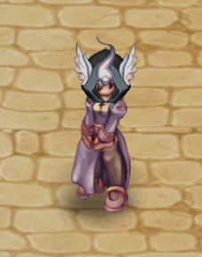

# ♾️ 100% Infinite Tower

## **Endless Tower?**

* Unlike the tower we already know, this one is truly **infinite**. You and your friends can keep climbing as far as you can manage. Of course, **the higher you go, the harder it gets**.

<figure><figcaption>
<mark style="color:red;"><strong>Guardian of the Endless Tower</strong></mark>
</figcaption></figure>

## **How to Get There**

* Go to the **nearest Kafra** in your city, click on the **"**<mark style="color:red;">**Teleport**</mark>**"** option, and select the city.
* <mark style="color:red;">**Go to Alberta**</mark>**.**

<figure><figcaption>
<mark style="color:red;"><strong>How to Reach Your Destination: Alberta</strong></mark>
</figcaption></figure>

## **NPC Location**

* Upon arriving in **Alberta**, head **west** to find the <mark style="color:red;">**Captain**</mark>.

<figure><figcaption>
<mark style="color:red;"><strong>Encontrando o Capitão que leva até a Torre.</strong></mark>
</figcaption></figure>

## **Entering the Endless Tower**

* To access the **Endless Tower**, talk to the **Captain** and select the option **"**<mark style="color:red;">**Let's go now**</mark>**"**.
* Once on the island, select **"**<mark style="color:red;">**Generate Dungeon**</mark>**"**.
* After creating it, click on **"**<mark style="color:red;">**Enter Dungeon**</mark>**"**.
* Make sure you are in a **party&#x20;**<mark style="color:red;">**(ALT+Z)**</mark> before entering the instance.

<figure><figcaption>
<mark style="color:red;"><strong>Going to the Endless Tower</strong></mark>
</figcaption></figure>

## **Tower Mechanics**

**2. Tower Structure**

* The tower consists of <mark style="color:red;">**100 floors**</mark>, each more challenging than the previous one.
* <mark style="color:red;">**After completing all 100 floors, it will RESET**</mark> back to **level 1** automatically. However, all **monsters will become stronger, with increased HP and higher LOOT rates**.
* **Regular floors:**
  * You will face waves of common monsters.
* **Checkpoint floors (every 5-10 floors):**
  * **MVPs** or mini-bosses will spawn as the main challenge.
  * **Examples:** Eddga, Stormy Knight, Dracula, Valkyrie Randgris, among others.

***

**3. Basic Rules**

* **Time limit:** The instance lasts **4 hours** from the moment it is created.
* **Shared progress:** If someone dies, they can return to the tower **as long as the party leader remains inside**.
* **Group challenges:** Only **one party** can enter the instance at a time.
* **Monster respawn:** Monsters spawn **in waves or batches**, depending on the floor.
* **Rewards:** You receive **rewards for defeating MVPs**.

<figure><figcaption>
<mark style="color:red;"><strong>First Floor of the Infinite Tower</strong></mark>
</figcaption></figure>
