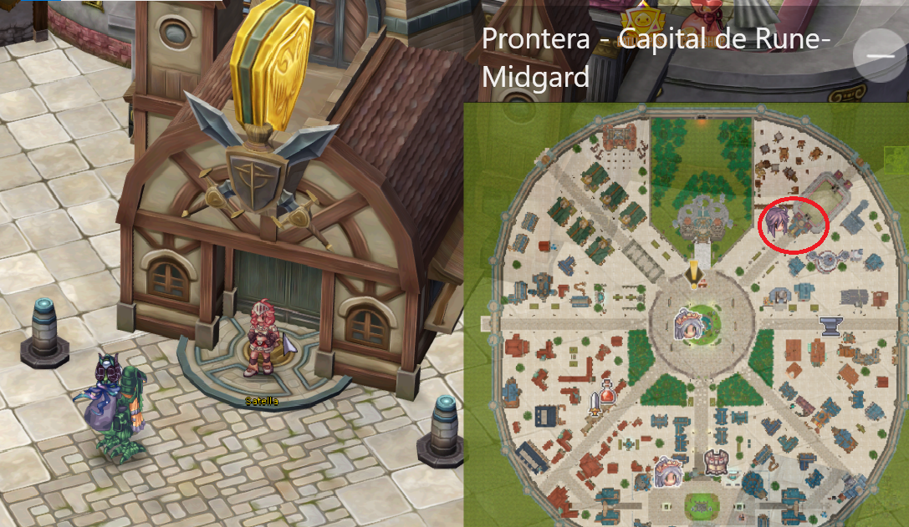
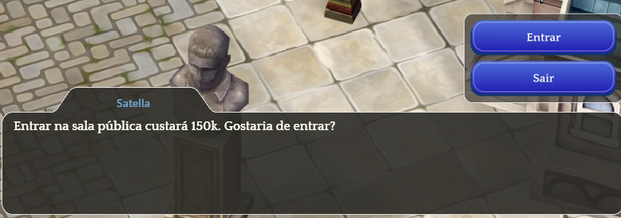
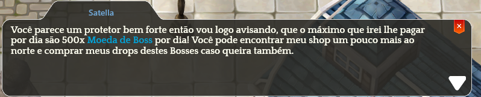
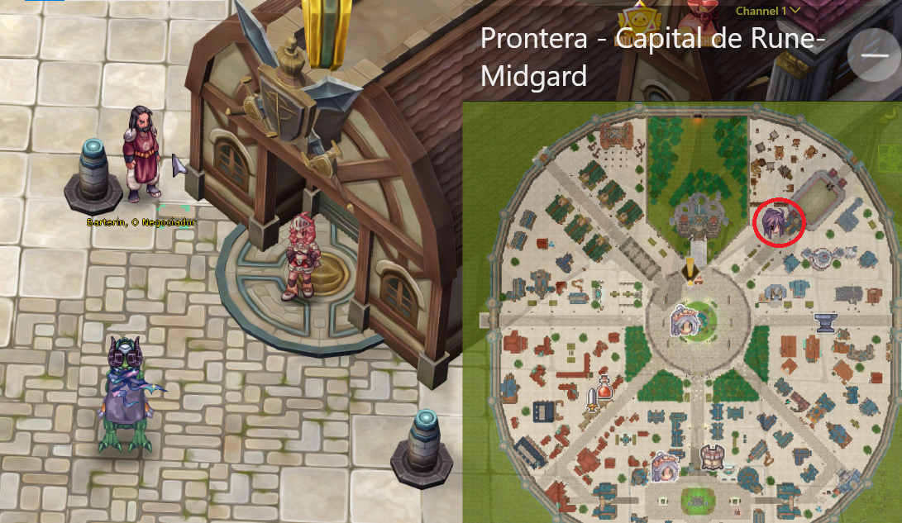
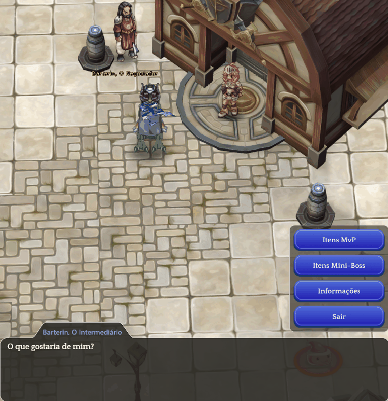

# 🐲 Boss Arena

* To participate, it is necessary to meet specific requirements and follow rules that optimize the experience and rewards for participants.
* Below are the details and categories of the arena mechanics.

## About the Location

* Head to the city of **"**<mark style="color:red;">**Prontera**</mark>**"**, accessing any Kafra from a nearby city.
* You will find the NPC **"**<mark style="color:red;">**Satella**</mark>**"** in the upper right corner of the map.

<figure><figcaption>
<mark style="color:red;"><strong>NPC Satella is responsible for opening the Boss rooms.</strong></mark>
</figcaption></figure>

## **Entry and Fees**

* **Entry Fee:** Each entry to the **Boss Arena** costs **150k Zeny**.
* If the player dies during the session, it is possible to return, but the entry fee must be paid again.
* **Access Duration:** After entering, the player will have **4 continuous hours** to stay in the arena.
* The timer starts counting as soon as the player enters the arena.
* **Important:** The time is not cumulative. If the player uses only **1 hour** and leaves, the remaining time is lost.

***

## <mark style="color:red;">**(Double Coin Event ACTIVATED)**</mark>

* **1 ➝ 2 Boss Coins**
* **4 ➝ 8 Boss Coins**
* **8 ➝ 16 Boss Coins**
* **25 ➝ 50 Boss Coins**



### **Room Types**

#### **Public Rooms:**

* There are 2 public rooms, where players can choose to enter the less crowded one.
* A <mark style="color:red;">**public room**</mark> has a duration of **4 hours** after paying the fee of **150k Zeny**.

<figure><figcaption>
<mark style="color:red;"><strong>Acesso a sala pública.</strong></mark>
</figcaption></figure>

#### **Private Rooms:**

* It is possible to acquire an **exclusive private room** for your **party (PT)** at a cost of **3kk Zeny**.
* A <mark style="color:red;">**private room**</mark> also lasts for **4 hours**, and only **PT members** will have access.



### **Boss Coin Farming Limit**

* The maximum daily limit is **500 "Boss Coins"** per player.
* After reaching the limit, the player can still continue helping their team, but <mark style="color:red;">**will no longer receive more Boss Coins**</mark><mark style="color:red;">.</mark>

<figure><figcaption>
<mark style="color:red;"><strong>Illustration of the Boss Coin Limit.</strong></mark>
</figcaption></figure>

### **Boss Coin Drop Chances**

The chance of obtaining Boss Coins is directly **related to the HP of the defeated enemy**.

* **Drop probabilities by HP:**
  * Every **200k HP** has a **10% chance** of earning <mark style="color:red;">**1 Coin**</mark>. _(For example, up to 200k = 10%, 400k = 20%, and so on...)_
  * **From 1kk to 3kk HP**, there is a **100% chance** of earning <mark style="color:red;">**1 Coin**</mark>.
  * **Above 3kk HP**, there is a **100% chance** of earning <mark style="color:red;">**3 Coins**</mark>.



### **Bosses and Mini-Bosses**

* All current Bosses <mark style="color:red;">(Except those from Eldoria)</mark>.
* All Mini-Bosses present.

#### **Highlights**

* They do not drop loot.
* They do not give experience.

#### **MVPS**

<table><thead><tr><th width="83">IMG</th><th width="227">Name</th><th>Chance</th><th>Boss Coin</th></tr></thead><tbody><tr><td></td><td>Kraken</td><td>70%</td><td>1</td></tr><tr><td></td><td>Giant Octopus</td><td>70%</td><td>1</td></tr><tr><td></td><td>Queen Bee</td><td>70%</td><td>1</td></tr><tr><td></td><td>Golden Thief Bug</td><td>70%</td><td>1</td></tr><tr><td></td><td>Luar Flower</td><td>70%</td><td>1</td></tr><tr><td></td><td>Freeoni</td><td>70%</td><td>1</td></tr><tr><td></td><td>Maya</td><td>70%</td><td>1</td></tr><tr><td></td><td>Eddga</td><td>100%</td><td>4</td></tr><tr><td></td><td>Doppelganger</td><td>100%</td><td>4</td></tr><tr><td></td><td>Dracula</td><td>100%</td><td>4</td></tr><tr><td></td><td>Drake</td><td>100%</td><td>4</td></tr><tr><td></td><td>Osíris</td><td>100%</td><td>4</td></tr><tr><td></td><td>Pharaoh</td><td>100%</td><td>8</td></tr><tr><td></td><td>General Turtle</td><td>100%</td><td>8</td></tr><tr><td></td><td>Lady Tanee</td><td>100%</td><td>8</td></tr><tr><td></td><td>Orc Hero</td><td>100%</td><td>8</td></tr><tr><td></td><td>Orc Lord</td><td>100%</td><td>8</td></tr><tr><td></td><td>RSX 0806</td><td>100%</td><td>8</td></tr><tr><td></td><td>Amon Ra</td><td>100%</td><td>8</td></tr><tr><td></td><td>Baphomet</td><td>100%</td><td>8</td></tr><tr><td></td><td>Lord of the Dead</td><td>100%</td><td>8</td></tr><tr><td></td><td>Tao Gunka</td><td>100%</td><td>8</td></tr><tr><td></td><td>Stormy Knight</td><td>100%</td><td>25</td></tr><tr><td></td><td>Hatii</td><td>100%</td><td>25</td></tr><tr><td></td><td>Detardeurus</td><td>100%</td><td>25</td></tr></tbody></table>

#### Mini-Bosses

<table><thead><tr><th width="81">IMG</th><th width="223">Name</th><th>Chance</th><th>Coin</th></tr></thead><tbody><tr><td></td><td>Dragonfly</td><td>70%</td><td>1</td></tr><tr><td></td><td>Wandering Wolf</td><td>70%</td><td>1</td></tr><tr><td></td><td>Eclipse</td><td>70%</td><td>1</td></tr><tr><td></td><td>Angeling</td><td>70%</td><td>1</td></tr><tr><td></td><td>Deviling</td><td>70%</td><td>1</td></tr><tr><td></td><td>Nine-Tailed Cat</td><td>70%</td><td>1</td></tr><tr><td></td><td>Toad</td><td>70%</td><td>1</td></tr><tr><td></td><td>Mysteltainn</td><td>70%</td><td>1</td></tr><tr><td></td><td>Male Maya</td><td>70%</td><td>1</td></tr><tr><td></td><td>Tirfing</td><td>70%</td><td>1</td></tr><tr><td></td><td>Executor</td><td>70%</td><td>1</td></tr><tr><td></td><td>Griffon</td><td>70%</td><td>1</td></tr><tr><td></td><td>Mutant Dragon</td><td>70%</td><td>1</td></tr><tr><td></td><td>ArchAngeling</td><td>70%</td><td>1</td></tr><tr><td></td><td>Ghostring</td><td>70%</td><td>1</td></tr><tr><td></td><td>Illusion of Darkness</td><td>70%</td><td>1</td></tr></tbody></table>



### About Groups (PTs)

When a player is in a party (PT), the drop of Insignias works as follows:

* Only players level 90 or higher can participate.
* There is no limit to the number of players in the party (except for the party itself) and no drop penalties.

**About Drops**

* There is no penalty for players in the party; everyone receives the coins when the drop happens.
* <mark style="color:red;">**The coin drop is for the entire group.**</mark>
* <mark style="color:red;">**When a Boss drops a coin, everyone will receive the same amount equally.**</mark>

**Spawn Location**

* Inside the area, there will be a safe zone where everyone can prepare before heading out.
* The location serves as a "lobby" for players to search for and form new parties or find new players to create parties.



* AoNext to the NPC **"Satella"**, you will find the NPC **"**<mark style="color:red;">**Beterin, The Trader**</mark>**"**.

<figure><figcaption>
<mark style="color:red;"><strong>NPC Beterin, The Trader, responsible for the exchange of Boss Coins.</strong></mark>
</figcaption></figure>

### About the Shop

* Each **MVP** and **Mini-Boss** has a shop with ALL of their drops <mark style="color:red;">(</mark><mark style="color:red;">**Except for cards and gems**</mark><mark style="color:red;">)</mark>.
* The cost of each item dropped by the boss is based on the drop rate of that item.

<figure><figcaption>
<mark style="color:red;"><strong>Illustration of the Boss Coin Shop</strong></mark>
</figcaption></figure>


