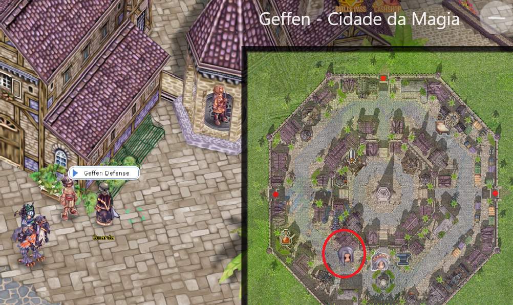
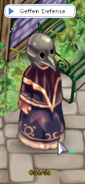
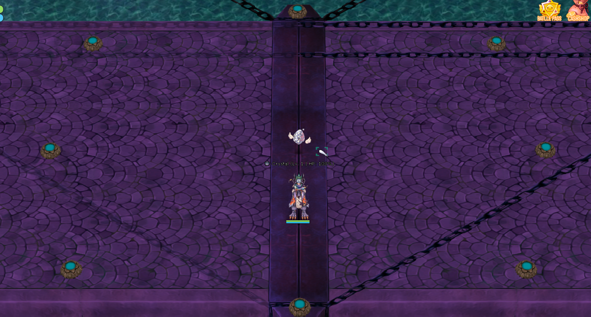
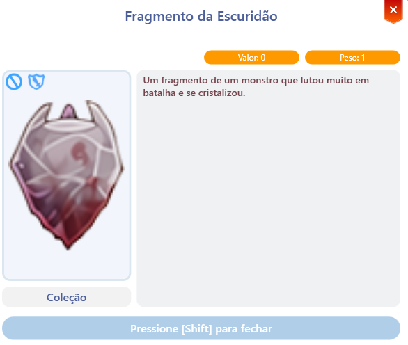

# 🏹 การป้องกันเกฟเฟน

## **การป้องกันเกฟเฟนคืออะไร?**

มันคือ **instance** ที่ตั้งอยู่ในเมือง **เกฟเฟน** ใกล้กับ **Kafra ทางใต้** โดยมีวัตถุประสงค์ในการ **ปกป้องคริสตัลที่อยู่กลางสะพาน** ขณะที่ฝูงมอนสเตอร์เข้ามาใกล้

## ที่ตั้งบนแผนที่

* Instance ตั้งอยู่บนแผนที่ <mark style="color:red;">**เกฟเฟน**</mark>
* คุณสามารถตรวจสอบตำแหน่งได้จาก <mark style="color:red;">**MINIMAP**</mark>
* คุณจะพบ **2&#x20;**<mark style="color:red;">**NPCs**</mark>: **"Guard"** และ **"Oracle"**

<figure><figcaption></figcaption></figure>

## **วิธีเข้าถึงสถานที่**

* ไปที่ <mark style="color:red;">**Kafra**</mark> ที่ใกล้ที่สุดในเมืองของคุณ คลิกที่ตัวเลือก **"**<mark style="color:red;">**Teleport**</mark>**"** และเลือกเมือง
* <mark style="color:red;">**ไปที่ GEFFEN**</mark>**.**

<figure><figcaption>
<mark style="color:red;"><strong>ใช้ Kafra ของเมืองเพื่อเดินทางไป GEFFEN</strong></mark>
</figcaption></figure>

## NPCs ใน Instance การป้องกันเกฟเฟน



## <mark style="background-color:red;">Guard</mark>

* รับผิดชอบในการเปิด instance
* คุณต้องอยู่ใน **ปาร์ตี้&#x20;**<mark style="color:red;">**(ALT+Z)**</mark>

## **ระดับความยาก**

* เพื่อก้าวผ่านระดับต่าง ๆ คุณต้องทำให้เสร็จสิ้นระดับก่อนหน้า
* การเลื่อนระดับแต่ละครั้งต้องใช้เงิน <mark style="background-color:green;">**2,000,000 Zeny.**</mark>
* ระดับความยากมีหลายระดับ: **ง่าย, ปกติ, ยาก, ผู้เชี่ยวชาญ**
* หลังจากเสร็จสิ้น instance ประตูทางเข้าจะถูกปิด และสมาชิกในปาร์ตี้ไม่สามารถเข้าใหม่ได้ _(นำ Sage มาฟื้นคืนชีพหากคุณตายหลังจากเสร็จสิ้น)_

<figure><figcaption>
<mark style="color:red;"><strong>รับผิดชอบในการเปิด instance การป้องกันเกฟเฟน</strong></mark>
</figcaption></figure>



## <mark style="background-color:red;">**Astral Oracle**</mark>

* รับผิดชอบในการแลกเปลี่ยน <mark style="color:red;">**Darkness Fragments**</mark> ที่ได้รับภายใน **instance การป้องกันเกฟเฟน**
* สำหรับทุก <mark style="background-color:red;">**100 Fragments**</mark> คุณสามารถแลกเปลี่ยนกับ NPCs และรับหนึ่งในรายการที่ระบุ
* ต้องชำระ **ค่าธรรมเนียม Zeny** เพื่อทำการแลกเปลี่ยน

<figure><figcaption>
<mark style="color:red;"><strong>Astral Oracle: รับผิดชอบในการแลกเปลี่ยนเศษส่วน</strong></mark>
</figcaption></figure>

## **รายการที่สามารถแลกเปลี่ยนได้ระหว่างการแลกเปลี่ยน:**

<table><thead><tr><th width="344">รายการ</th><th width="62">จำนวน</th><th>หมายเหตุ</th></tr></thead><tbody><tr><td> Wild Fury Potion</td><td>30</td><td>เพิ่ม ASPD.</td></tr><tr><td> Ziegfried Amulet</td><td>5</td><td>ฟื้นคืนชีพเมื่อเสียชีวิต</td></tr><tr><td> Yggdrasil Fruit</td><td>20</td><td>ฟื้นฟู HP เต็ม</td></tr><tr><td> Anti-Gravitational Pass Box</td><td>1</td><td>10x Pass (น้ำหนัก +2k)</td></tr><tr><td> Chewing Gum Box</td><td>1</td><td>10x Drop Boost Gum +50%</td></tr><tr><td> Old Gem Album</td><td>1</td><td>อาจได้รับอัญมณีแบบสุ่ม</td></tr><tr><td> Mysterious Pet Egg</td><td>1</td><td>อาจได้รับสัตว์เลี้ยงแบบสุ่ม</td></tr><tr><td> Monster Assistant Box Lv.1</td><td>1</td><td>อาจได้รับผู้ช่วยระดับต่ำ</td></tr><tr><td> Monster Assistant Box Lv.2</td><td>1</td><td>อาจได้รับผู้ช่วยระดับกลาง</td></tr><tr><td> Monster Assistant Box Lv.3</td><td>1</td><td>อาจได้รับผู้ช่วยระดับ MVP</td></tr><tr><td> Basic Equipment Box</td><td>1</td><td>ได้รับอุปกรณ์ทั่วไป</td></tr><tr><td> Advanced Equipment Box</td><td>1</td><td>ได้รับอุปกรณ์หายาก</td></tr><tr><td> Superior Equipment Box</td><td>1</td><td>ได้รับอุปกรณ์ที่หายากมาก</td></tr><tr><td> Precious Stones Box Lv.1</td><td>1</td><td>ได้รับแร่แบบสุ่ม</td></tr><tr><td> Precious Stones Box Lv.2</td><td>1</td><td>ได้รับแร่แบบสุ่มหลายรายการ</td></tr></tbody></table>



## **คุณจะพบอะไรภายใน?**

* <mark style="background-color:green;">**คริสตัลที่ต้องปกป้อง**</mark>**.**
* <mark style="background-color:red;">**เสาที่ต้องทำลาย**</mark> เมื่อมอนสเตอร์ปรากฏขึ้นเพื่อป้องกันการโจมตีเพิ่มเติม
* **กำจัดคลื่นของมอนสเตอร์** ที่มุ่งตรงไปยังคริสตัล

<figure><figcaption>
<mark style="color:red;"><strong>สิ่งที่คุณจะพบภายใน instance</strong></mark>
</figcaption></figure>

## รางวัล

* หลังจากเสร็จสิ้น instance คุณจะได้รับ **"**<mark style="color:red;">**Darkness Fragment**</mark>**"** ซึ่งสามารถแลกเปลี่ยนกับ NPC **"**<mark style="color:red;">**Astral Oracle**</mark>**"**
* <mark style="background-color:green;">**ระดับความยากที่สูงขึ้นจะให้รางวัลที่ดีกว่า**</mark>**.**

<figure><figcaption></figcaption></figure>