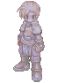
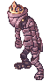

# 😈 Pertarungan MVP

## **Tentang Lokasi**

Bersiaplah untuk **tantangan epik** di _Arkaik: Tales of Sarina_! Pertarungan <mark style="color:red;">**MVP**</mark> menempatkan pemain dalam **grup solo** atau **partai penuh** di dalam sebuah instance yang dipenuhi dengan pertempuran yang intens.

***

## **🔷 Mekanika Acara:**

* Pemain akan menghadapi **gelombang MVP dan Mini Boss yang berturut-turut**.
* Acara berakhir **setelah mengalahkan semua bos yang tersedia**.
* **PvP akan diaktifkan**, membuat kompetisi semakin sengit.
* **Tingkat drop meningkat**, mengikuti aturan yang sama seperti **saluran PvP** <mark style="color:red;">**(+50% Drop)**</mark>.
* **MVP akan mendapatkan buff**, secara signifikan meningkatkan **HP** mereka, membuat pertarungan lebih menantang.
* Pertarungan berlangsung di **peta instanced** di **"**<mark style="color:red;">**Niflheim**</mark>**"**.

***

## **Lokasi NPC*** Untuk mencapai area tersebut, pergi ke **Niflheim**, menggunakan **Kafras** dari kota mana saja.
* **NPC** **"**<mark style="color:red;">**MVP Battle**</mark>**"** terletak **di timur kota**, dekat dengan **"Vale"**.

<figure><figcaption>
<mark style="color:red;"><strong>Lokasi NPC: "MVP Battle" di Niflheim</strong></mark>
</figcaption></figure>

#### **Jam Buka untuk Pertarungan MVP**

* Setiap **Jumat** dari <mark style="color:red;">**21:00**</mark>**&#x20;hingga&#x20;**<mark style="color:red;">**00:00**</mark>.
* Selama periode ini, akses **terbuka untuk semua pemain**.

***

#### **Cara Berpartisipasi**

* Anda **harus berada dalam sebuah party** <mark style="color:red;">(</mark><mark style="color:red;">**SOLO**</mark> <mark style="color:red;"></mark><mark style="color:red;">atau dalam</mark> <mark style="color:red;"></mark><mark style="color:red;">**KELOMPOK hingga 11 pemain**</mark><mark style="color:red;">)</mark>.* Hingga **5 grup dapat bergabung per instance**. _(Jika grup keenam masuk, instance baru akan dibuat, mengalokasikan grup baru ke ruangan yang berbeda untuk kompetisi.)_



### **MVPS**<table data-full-width="true"><thead><tr><th width="83">IMG</th><th>Nama</th></tr></thead><tbody><tr><td></td><td>Kraken</td></tr><tr><td></td><td>Giant Octopus</td></tr><tr><td></td><td>Ratu Lebah</td></tr><tr><td></td><td>Golden Thief Bug</td></tr><tr><td></td><td>Bunga Lunar</td></tr><tr><td></td><td>Freeoni</td></tr><tr><td></td><td>Maya</td></tr><tr><td></td><td>Eddga</td></tr><tr><td></td><td>Doppelganger</td></tr><tr><td></td><td>Dracula</td></tr><tr><td></td><td>Drake</td></tr><tr><td></td><td>Osíris</td></tr><tr><td></td><td>Firaun</td></tr><tr><td></td><td>Jenderal Kura-kura</td></tr><tr><td></td><td>Nona Tanee</td></tr><tr><td></td><td>Pahlawan Orc</td></tr><tr><td></td><td>Orc Lord</td></tr><tr><td></td><td>RSX 0806</td></tr><tr><td></td><td>Amon Ra</td></tr><tr><td></td><td>Baphomet</td></tr><tr><td></td><td>Lord of the Dead</td></tr><tr><td></td><td>Tao Gunka</td></tr><tr><td></td><td>Kesatria Badai</td></tr><tr><td></td><td>Hatii</td></tr><tr><td></td><td>Detardeurus</td></tr></tbody></table>### Mini-Bosses<table><thead><tr><th width="78">IMG</th><th>Nama</th></tr></thead><tbody><tr><td></td><td>Capung</td></tr><tr><td></td><td>Serigala Mengembara</td></tr><tr><td></td><td>Eklips</td></tr><tr><td></td><td>Angeling</td></tr><tr><td></td><td>Deviling</td></tr><tr><td></td><td>Kucing Ekor Sembilan</td></tr><tr><td></td><td>Katak</td></tr><tr><td></td><td>Mysteltainn</td></tr><tr><td></td><td>Maya Jantan</td></tr><tr><td></td><td>Tirfing</td></tr><tr><td></td><td>Eksekutor</td></tr><tr><td></td><td>Grifo</td></tr><tr><td></td><td>DrMutant Naga</td></tr><tr><td></td><td>ArchAngeling</td></tr><tr><td></td><td>Ghostring</td></tr><tr><td></td><td>Ilusi Gelap</td></tr></tbody></table>
