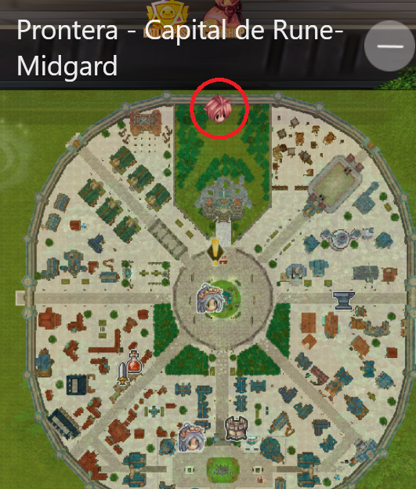
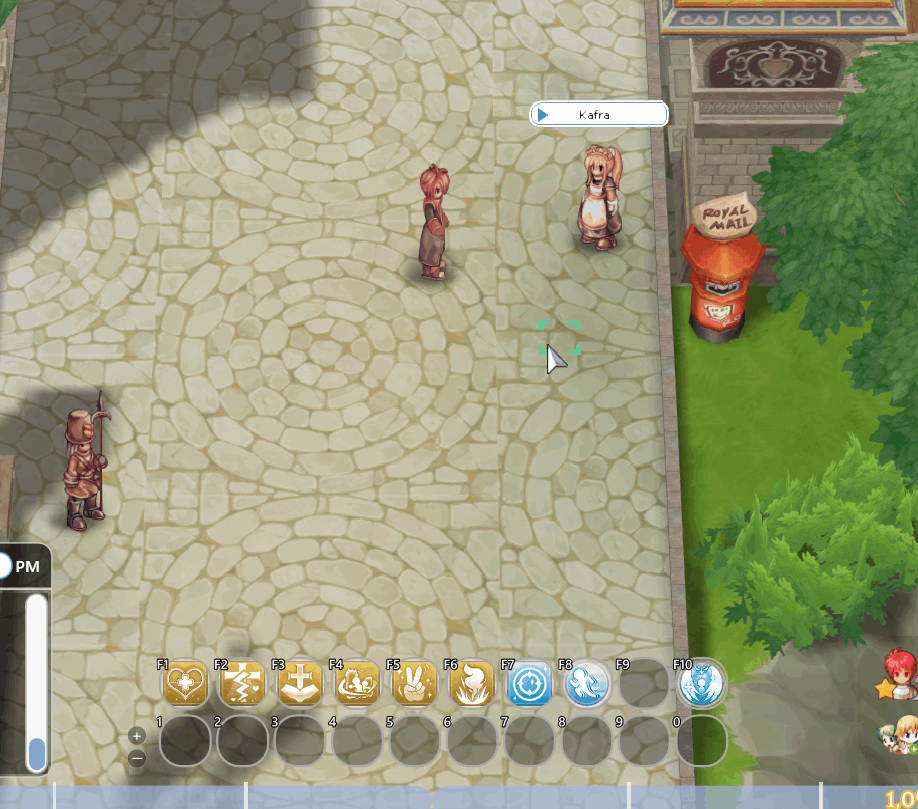
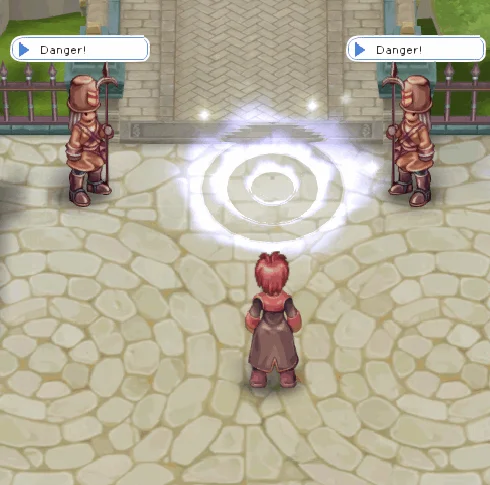
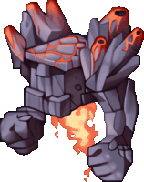
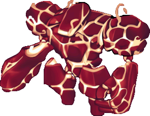
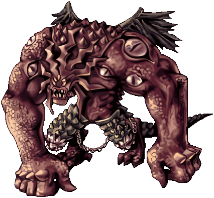
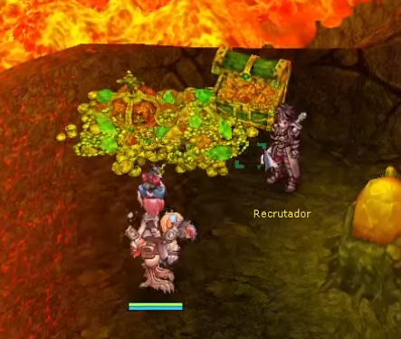

# ⚔️ Prontera Dungeon

<figure><figcaption></figcaption></figure>

## **Ngục Tối Prontera là gì?**

* **Ngục Tối Prontera** là một trong những **instance hoàn toàn đổi mới** và độc đáo trong **Arkaik**, với các cơ chế và vật phẩm độc quyền riêng.

## Nơi Tìm Thấy Trên Bản Đồ

* Instance nằm trên bản đồ <mark style="color:red;">**Prontera**</mark>.
* Bạn có thể kiểm tra vị trí của nó trên <mark style="color:red;">**BẢN ĐỒ NHỎ**</mark>.
* Bạn sẽ tìm thấy một cổng với một số lính canh—chỉ cần bước vào.

<figure><figcaption>
<mark style="color:red;"><strong>Vị trí trên "Bản Đồ Nhỏ" của Prontera</strong></mark>
</figcaption></figure>

## **Cách Truy Cập Vị Trí**

* ## &#x20;Đi đến  <mark style="color:red;">**Kafra**<mark style="color:red;">  gần nhất trong thành phố của bạn, nhấp vào tùy chọn  **"**<mark style="color:red;">**Teleport**<mark style="color:red;">**"**  và chọn thành phố.
*   <mark style="color:red;">**Đi đến Prontera**</mark>**.**

    <figure><figcaption></figcaption></figure>
* Sau đó, đi <mark style="color:red;">**phía bắc của Prontera**</mark> cho đến khi bạn tìm thấy <mark style="color:red;">**các lính gác và một cổng**</mark>.
*   Sau đó, chỉ cần bước vào <mark style="color:red;">**cổng**</mark>.\

    <figure><figcaption></figcaption></figure>

## **Có những NPC nào bên trong?**



<mark style="color:red;">**NGƯỜI TUYỂN DỤNG**</mark>

* Để tạo instance của bạn, bạn cần <mark style="color:red;">**tạo một nhóm (ALT+Z)**</mark><mark style="color:red;">.</mark>
* Để hủy tương tác, bạn có thể chọn tùy chọn **"**<mark style="color:red;">**Không đời nào...**</mark>**"**.\* Để rời khỏi phòng, chỉ cần chọn **"**<mark style="color:red;">**Ra khỏi đây**</mark>**"**.

<figure><figcaption>
<mark style="color:red;"><strong>Giao tiếp với NPC TUYỂN DỤNG</strong></mark>
</figcaption></figure>



<mark style="background-color:red;">**THỦ CÔNG**</mark>

* NPC <mark style="color:red;">**Thủ công**</mark> cung cấp một số vật phẩm có thể được <mark style="color:red;">**chế tạo**</mark>.
* Sau khi hoàn thành instance, bạn sẽ nhận được một số <mark style="color:red;">**Tinh chất Lửa**</mark>.
* Đây là **một trong những vật phẩm cần thiết** để tạo ra **vũ khí nâng cấp** của bạn.
* **Các vật phẩm khác không thể thu thập trong instance**.
*   Một số vật phẩm có thể được thu thập bằng cách đánh bại <mark style="color:red;">**\[QUÁI VẬT ĐẶC BIỆT**</mark>**]**.

    <figure><figcaption>
<mark style="color:red;"><strong>Giao tiếp với NPC "CRAFTS"</strong></mark>
</figcaption></figure>



### **Vũ khí chế tạo**



### **Vũ Khí Chế Tạo** - TẦNG 1

<table><thead><tr><th width="252">Hình ảnh</th><th width="118">Nghề</th><th>Vật phẩm chế tạo</th></tr></thead><tbody><tr><td></td><td>Bard &#x26; Dancer</td><td>
+6 1x Berimbau

120x Tinh chất Lửa

100x Đôi cánh Đen

10x Mũ Gấu Trúc

Đá Horong
</td></tr><tr><td></td><td>Knight</td><td>
+6 1x Kiếm Claymore Tăng cường

120x Tinh chất Lửa

100x Ngọc Ký Ức

1x Haedonggum

20x Đá Cornutus
</td></tr><tr><td></td><td>Tất cả</td><td>
+6 1x Áo choàng Lửa

120x Tinh chất Lửa

100x Ngọc Ký Ức

1x Kiếm Tác động

1x Pavana

10x Đá Raggler
</td></tr><tr><td></td><td>Priest</td><td>
+6 1x Gậy Tăng cường

120x Tinh chất Lửa

100x Đầu lâu Cổ xưa

10x Nhẫn Vàng

20x Đá Sương Mù
</td></tr><tr><td></td><td>Rogue</td><td>
+6 1x Dao găm Tăng cường

120x Tinh chất Lửa

100x Đôi cánh Đen

1x Lưỡi dao Bụi Sao

20x Đá Lửa
</td></tr><tr><td></td><td>Crusader</td><td>
+6 1x Giáo Tăng cường

120x Tinh chất Lửa

100x Đầu lâu Cổ xưa

1x Giáo, 1x Lưỡi hái

20x Giáo Lửa Cấp 5
</td></tr><tr><td></td><td>Wizard</td><td>
+6 1x Quyền trượng Tăng cường

120x Tinh chất Lửa

100x Ngọc Ký Ức

1x Băng ma

200x Rào cản Lửa Cấp 5
</td></tr><tr><td></td><td>Monk</td><td>
+6 1x Nắm đấm Magma Tăng cường

120x Tinh chất Lửa

100x Đầu lâu Cổ xưa

5x Màn đen

400x Máu Sói
</td></tr><tr><td></td><td>Sage</td><td>
+6 1x Kinh thánh Tăng cường

120x Tinh chất Lửa

200x Ngọc Lửa

1x Rune Tàn bạo Huyền bí

250x Giáo Lửa Cấp 3
</td></tr><tr><td></td><td>Tất cả</td><td>
+6 1x Khiên Lửa

120x Tinh chất Lửa

100x Đôi cánh Đen

10x Que diêm

70x Rune Tàn bạo Cổ xưa
</td></tr><tr><td></td><td>Assasin</td><td>
+6 1x Katar Lửa Tăng cường

120x Tinh chất Lửa

100x Ngọc Ký Ức

1x Jamadhar

20x Đá Novus Scarlet
</td></tr><tr><td></td><td>Blacksmith</td><td>
+6 1x Thép Igneous Tăng cường

120x Tinh chất Lửa

100x Đôi cánh Đen

1x Rìu Đẫm máu

1x Khí ga nước mắt
</td></tr><tr><td></td><td>Hunter</td><td>
+6 1x Cung Tăng cường

120x Tinh chất Lửa

200x Ngọc Lửa

3x Đôi cánh Thiên thần

500x Biểu tượng Chính thức
</td></tr><tr><td></td><td>Alchimist</td><td>
+6 1x Dao Tăng cường

120x Tinh chất Lửa

200x Ngọc Lửa

1x Bardiche

20x Đá Grizzly
</td></tr></tbody></table>



### Vũ Khí Chế Tạo - TIER 2

<mark style="color:red;">**(Chưa Được Triển Khai)**</mark>

| Hình ảnh | Nghề nghiệp         |
| -------- | ------------------- |
| Sắp Có   | Nhạc Công & Vũ Công |
| Sắp Có   | Hiệp Sĩ             |
| Sắp Có   | Tất Cả              |
| Sắp Có   | Thầy Tu             |
| Sắp Có   | Kẻ Lừa Đảo          |
| Sắp Có   | Thập Tự Quân        |
| Sắp Có   | Pháp Sư             |
| Sắp Có   | Thiền Sư            |
| Sắp Có   | Triết Gia           |
| Sắp Có   | Tất Cả              |
| Sắp Có   | Sát Thủ             |
| Sắp Có   | Thợ Rèn             |
| Sắp Có   | Thợ Săn             |
| Sắp Có   | Giả Kim             |



## **Tôi Sẽ Tìm Thấy Gì Bên Trong?**



<mark style="background-color:red;">**QUÁI VẬT**</mark>

*   Quái vật xuất hiện bên trong instance.

    <table><thead><tr><th width="127">Hình ảnh</th><th>Tên</th></tr></thead><tbody><tr><td></td><td>Quái vật Lửa</td></tr><tr><td></td><td>Quái vật Lửa</td></tr><tr><td></td><td>Quái vật Lửa</td></tr></tbody></table>



<mark style="color:red;">**Cơ chế Bản đồ**</mark>

* **Rào chắn:** Một số phòng sẽ chứa một số lượng lớn quái vật và rào chắn cản đường bạn. Hãy đánh bại tất cả quái vật để dọn sạch khu vực.
* **Gai:** Trong hành trình của bạn, sẽ có những khu vực có gai cản trở sự di chuyển của bạn.

<mark style="background-color:red;">**Cơ chế Kính**</mark>

| Hình ảnh                          | Mô tả                                                                             |
| --------------------------------- | --------------------------------------------------------------------------------- |
|  | Sẽ có một **viên pha lê** mà bạn cần kích hoạt bằng cách kéo cần gạt để mở đường. |

<mark style="background-color:red;">**Cơ khí linh hồn**</mark>

| Sprite                                    | Mô tả                                                                                                         |
| ----------------------------------------- | ------------------------------------------------------------------------------------------------------------- |
|  | Một số linh hồn đang **bị lạc trên bản đồ**. Bạn phải **hướng dẫn chúng đến bàn thờ** để hoàn thành nhiệm vụ. |



Nhà tuyển dụng

*   Sau khi các linh hồn được giải phóng, anh ta sẽ mở rào cản đến <mark style="color:red;">**SATAN MORROC**</mark>.

    <figure><figcaption>
<mark style="color:red;"><strong>Sau khi hoàn thành tất cả các thử thách, bạn phải nói chuyện với anh ta để mở khóa thử thách cuối cùng: đánh bại Satan Morroc.</strong></mark>
</figcaption></figure>



<mark style="background-color:red;">**MVPs**</mark>

| Sprite                                      | Mô tả                          |
| ------------------------------------------- | ------------------------------ |
|          | Boss của Phần Một của Instance |
|  | Boss của Phần Hai của Instance |



## **Phần thưởng**

<figure><figcaption></figcaption></figure>

* Sau khi đánh bại <mark style="color:red;">**Satan Morroc**</mark>, hãy thu thập **Linh hồn** cuối cùng và giao nó cho **bàn thờ** gần đó.\* Bạn sẽ được **dịch chuyển** đến NPC **"Nhà Tuyển Dụng"**, người sẽ đưa bạn ra khỏi instance.
* Khi rời khỏi instance, bạn sẽ nhận được **"**<mark style="color:red;">**20 Mảnh Tinh Chất Lửa**</mark>**"**, có thể được sử dụng để chế tạo **thiết bị** tại NPC **"**<mark style="color:red;">**THỢ Rèn**</mark>**"**

<figure><figcaption>
<mark style="color:red;"><strong>Vật Phẩm Nhận Được Sau Khi Hoàn Thành Instance</strong></mark>
</figcaption></figure>

* **Vật Phẩm Nhận Được Sau Khi Hoàn Thành Instance**

| Vật Phẩm                         | Tên           | Tỉ Lệ                                     |
| -------------------------------- | ------------- | ----------------------------------------- |
|  | Giày Diabolus | <mark style="color:red;">**0.15%**</mark> |
|  | Giáp Lửa      | <mark style="color:red;">**0.6%**</mark>  |
