# ⚔️ ดันเจี้ยนปรอนเทร่า

## **ดันเจี้ยนปรอนเทร่าคืออะไร?**

* **ดันเจี้ยนปรอนเทร่า** เป็นหนึ่งใน **Instance** ที่ **สร้างสรรค์ใหม่ทั้งหมด** และ **ไม่เหมือนใคร** ใน **Arkaik** โดยมีกลไกและไอเท็มพิเศษเฉพาะของตนเอง

### <mark style="color:red;">(รอวิดีโอเอเชีย)</mark>

## ที่ตั้งในแผนที่

* Instance ตั้งอยู่ในแผนที่ <mark style="color:red;">**ปรอนเทร่า**</mark>
* คุณสามารถตรวจสอบตำแหน่งได้ที่ <mark style="color:red;">**MINIMAP**</mark>
* คุณจะพบพอร์ทัลพร้อมกับการ์ด—เพียงแค่เข้าไป

<figure><figcaption>
<mark style="color:red;"><strong>ตำแหน่งบน "Mini Map" ของปรอนเทร่า</strong></mark>
</figcaption></figure>

## **วิธีเข้าถึงตำแหน่ง**

* ไปที่ <mark style="color:red;">**Kafra**</mark> ที่ใกล้ที่สุดในเมืองของคุณ คลิกที่ตัวเลือก **"**<mark style="color:red;">**Teleport**</mark>**"** และเลือกเมือง
* <mark style="color:red;">**ไปที่ปรอนเทร่า**</mark>**.**

<figure><figcaption></figcaption></figure>

* หลังจากนั้นให้มุ่งหน้าไปทาง <mark style="color:red;">**เหนือของปรอนเทร่า**</mark> จนกว่าคุณจะพบ <mark style="color:red;">**การ์ดและพอร์ทัล**</mark>
* จากนั้นเพียงแค่เข้าไปใน <mark style="color:red;">**พอร์ทัล**</mark>

<figure>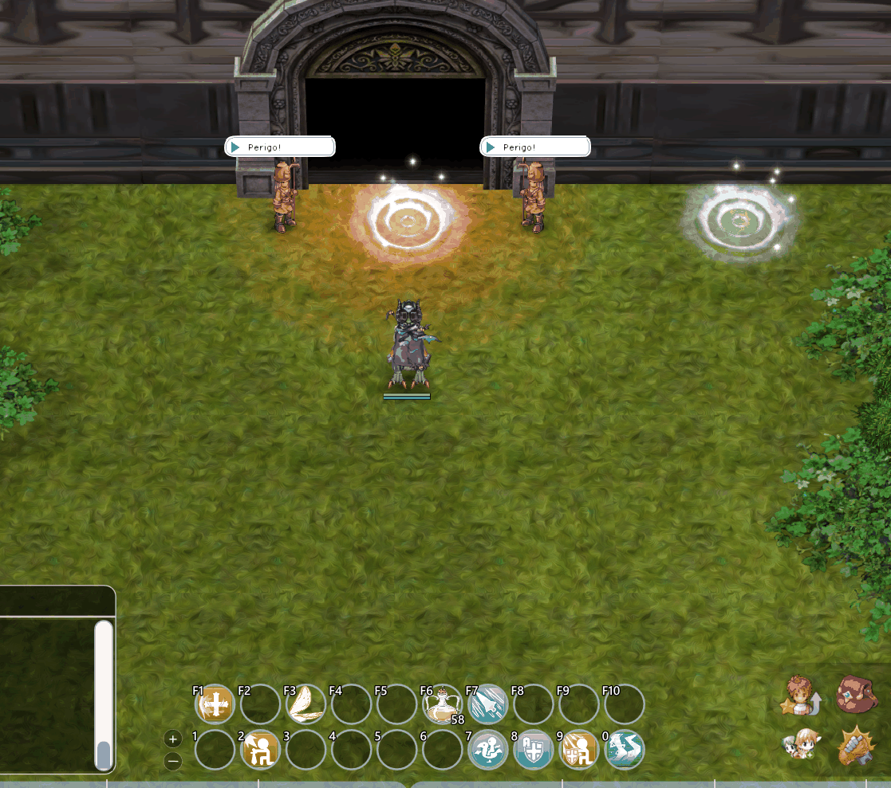<figcaption></figcaption></figure>

## **NPC ใดบ้างที่มีอยู่ภายใน?**



<mark style="color:red;">**ผู้สรรหา**</mark>

* เพื่อสร้าง Instance ของคุณ คุณต้อง <mark style="color:red;">**จัดตั้งปาร์ตี้ (ALT+Z)**</mark><mark style="color:red;">.</mark>
* หากต้องการยกเลิกการโต้ตอบ คุณสามารถเลือกตัวเลือก **"**<mark style="color:red;">**ไม่มีทาง...**</mark>**"**
* หากต้องการออกจากห้อง เพียงเลือก **"**<mark style="color:red;">**ออกไปที่นี่**</mark>**"**

<figure><figcaption>
<mark style="color:red;"><strong>การโต้ตอบกับ NPC ผู้สรรหา</strong></mark>
</figcaption></figure>



<mark style="background-color:red;">**งานฝีมือ**</mark>

* <mark style="color:red;">**NPC งานฝีมือ**</mark> เสนอไอเท็มบางอย่างที่สามารถ <mark style="color:red;">**สร้างได้**</mark>
* เมื่อเสร็จสิ้น Instance คุณจะได้รับ <mark style="color:red;">**Fire Essence**</mark> บางส่วน
* ไอเท็มเหล่านี้เป็น **หนึ่งในไอเท็มที่จำเป็น** สำหรับการสร้าง **อาวุธที่ได้รับการปรับปรุง**
* **ไอเท็มอื่น ๆ ไม่สามารถได้รับภายใน Instance**
* ไอเท็มบางอย่างสามารถได้รับจากการเอาชนะ <mark style="color:red;">**\[สัตว์ประหลาดพิเศษ**</mark>**]** 

<figure><figcaption>
<mark style="color:red;"><strong>การโต้ตอบกับ NPC "งานฝีมือ"</strong></mark>
</figcaption></figure>



## **อาวุธที่สร้างขึ้น**

<table><thead><tr><th width="252">ภาพ</th><th width="118">อาชีพ</th><th>วัสดุที่ใช้ในการสร้าง</th></tr></thead><tbody><tr><td>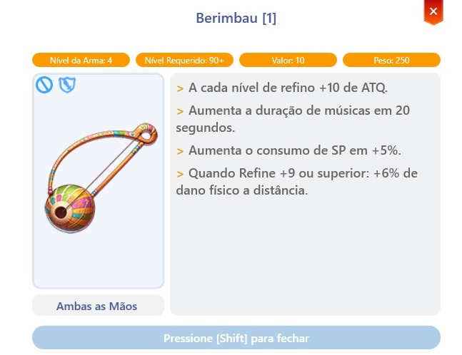</td><td>Bard &#x26; Dancer</td><td>
1x กีตาร์ 

40x Fire Essence

25x ปีกดำ 

450x เปลือกเต่า
</td></tr><tr><td>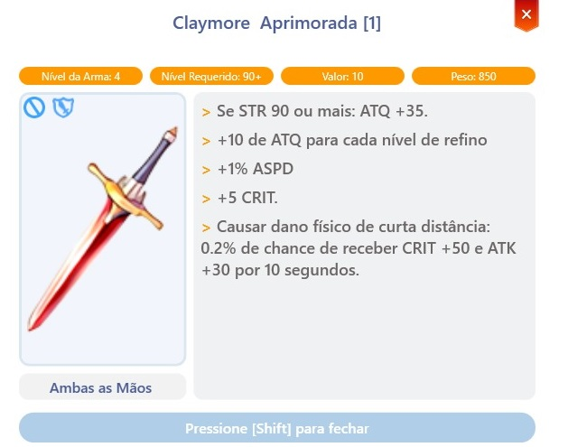</td><td>Knight</td><td>
 1x Zweihander 

40x Fire Essence 

25x Memory Jewel 

600x หัวใจที่ลุกโชน
</td></tr><tr><td>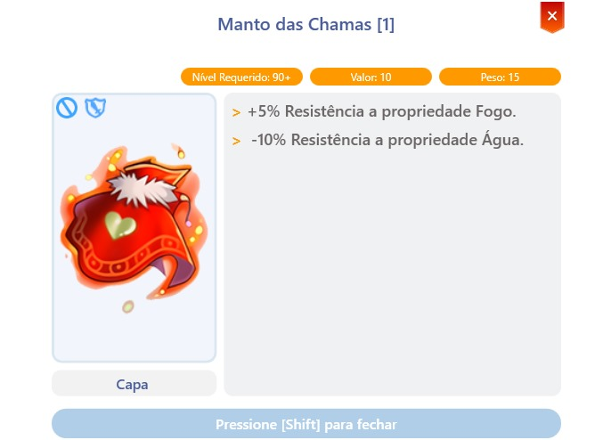</td><td>ทั้งหมด</td><td>
1x เสื้อคลุมพิธีกรรมสวรรค์ 

40x Fire Essence 

25x Memory Jewel 

1x การ์ด Pasana
</td></tr><tr><td>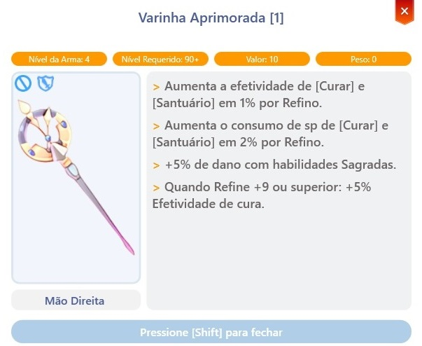</td><td>Priest</td><td>
1x Rod

40x Fire Essence

5x กะโหลกโบราณ

1x การ์ด Heater 
</td></tr><tr><td>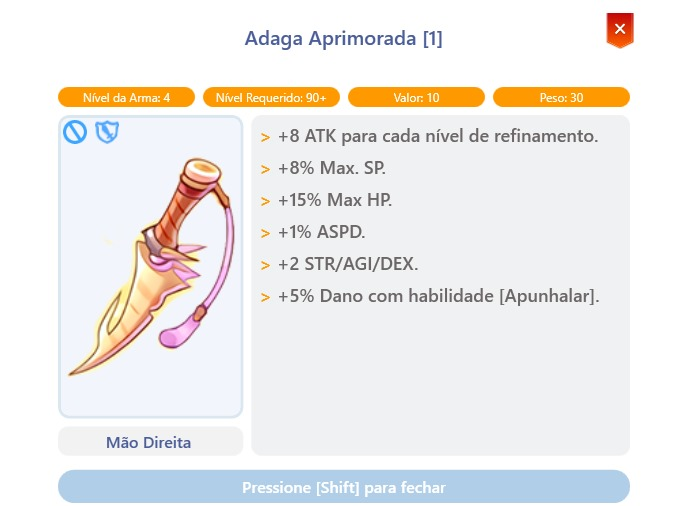</td><td>Rogue</td><td>
1x Sucsamad

40x Fire Essence

25x ปีกดำ

500x เกือกม้าลุกโชน
</td></tr><tr><td>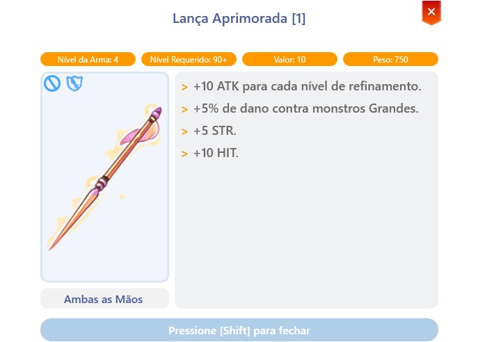</td><td>Crusader</td><td>
1x ใบมีดลานซ์ขนาดใหญ่

40x Fire Essence

5x กะโหลกโบราณ

600x หนังมังกร
</td></tr><tr><td>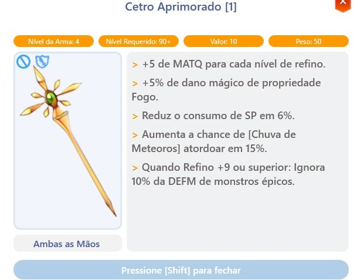</td><td>Wizard</td><td>
1x Rod

40x Fire Essence

25x Memory Jewel

1x การ์ด Nine Tails
</td></tr><tr><td>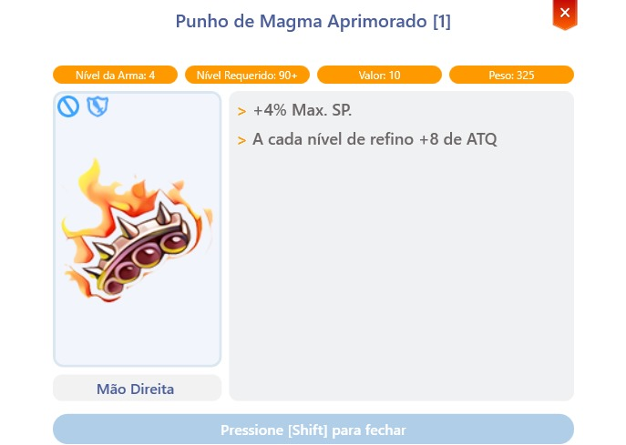</td><td>Monk</td><td>
1x หมัดลาวา

40x Fire Essence

5x กะโหลกโบราณ

250x ก้ามปูแมงมุม
</td></tr><tr><td>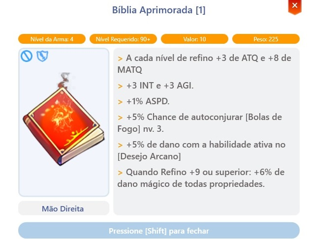</td><td>Sage</td><td>
120x หน้ากระดาษที่เสื่อมสภาพ

40x Fire Essence

10x อาเกตลุกโชน

120x ตัวแปลงธาตุไฟ
</td></tr><tr><td>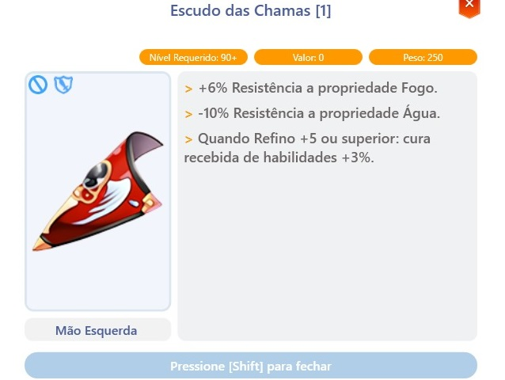</td><td>ทั้งหมด</td><td>
1x บัคเคลอร์

40x Fire Essence

25x ปีกดำ

200x เหล็ก
</td></tr><tr><td>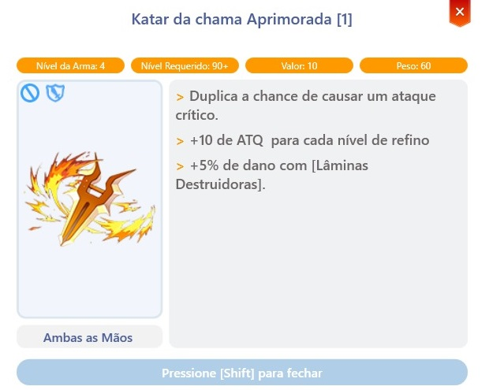</td><td>Assasin</td><td>
1x Katar of the Fierce Flame

40x Fire Essence

25x Memory Jewel

250x ขนที่ลุกโชน
</td></tr><tr><td>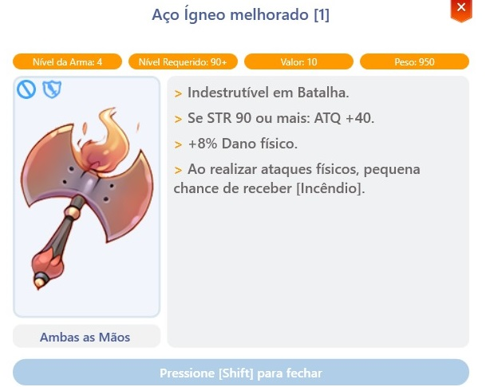</td><td>Blacksmith</td><td>
1x ขวาน Orcish

40x Fire Essence

25x ปีกดำ

30x หัวใจไฟ
</td></tr><tr><td>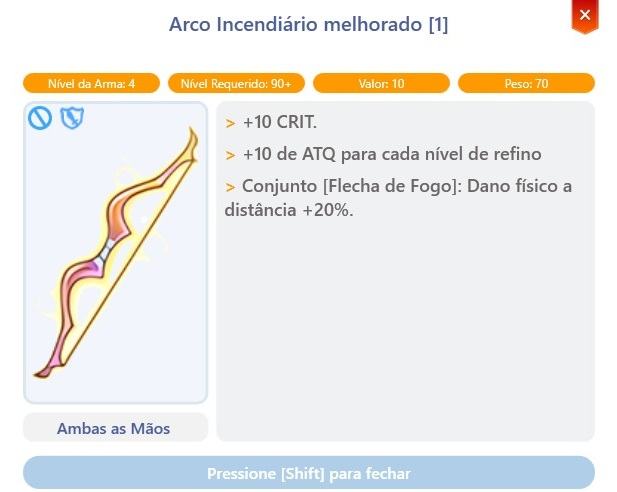</td><td>Hunter</td><td>
1x Gakkung

40x Fire Essence

10x อาเกตลุกโชน

400x เลือดสีแดง
</td></tr><tr><td>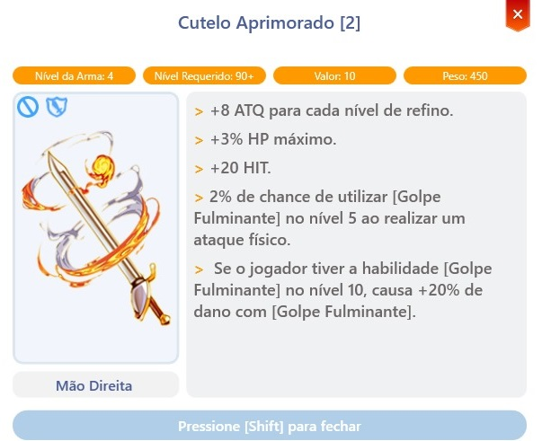</td><td>Alchimist</td><td>
1x ดาบสุริยะ

40x Fire Essence

10x อาเกตลุกโชน

120x หินภูเขาไฟ
</td></tr></tbody></table>



## **อาวุธที่สร้างขึ้น** - TIER 1

<table><thead><tr><th width="252">ภาพ</th><th width="118">อาชีพ</th><th>วัสดุที่ใช้ในการสร้าง</th></tr></thead><tbody><tr><td></td><td>Bard &#x26; Dancer</td><td>
+6 1x Berimbau

120x Fire Essence

100x ปีกดำ

10x หมวกแพนด้า

อัญมณี Horong
</td></tr><tr><td></td><td>Knight</td><td>
+6 1x Claymore ที่ได้รับการปรับปรุง

120x Fire Essence

100x Memory Jewel

1x Haedonggum

20x อัญมณี Cornutus
</td></tr><tr><td></td><td>ทั้งหมด</td><td>
+6 1x เสื้อคลุมไฟ

120x Fire Essence

100x Memory Jewel

1x Impact Saber

1x Pavana

10x อัญมณี Raggler
</td></tr><tr><td></td><td>Priest</td><td>
+6 1x Rod ที่ได้รับการปรับปรุง

120x Fire Essence

100x กะโหลกโบราณ

10x แหวนทอง

20x อัญมณี Mist
</td></tr><tr><td></td><td>Rogue</td><td>
+6 1x มีดที่ได้รับการปรับปรุง

120x Fire Essence

100x ปีกดำ

1x Stellar Dust Blade

20x อัญมณี Fiery
</td></tr><tr><td></td><td>Crusader</td><td>
+6 1x ลานซ์ที่ได้รับการปรับปรุง

120x Fire Essence

100x กะโหลกโบราณ

1x ลานซ์, 1x เคียว

20x ลานซ์ไฟระดับ 5
</td></tr><tr><td></td><td>Wizard</td><td>
+6 1x Scepter ที่ได้รับการปรับปรุง

120x Fire Essence

100x Memory Jewel

1x Ghost Band

200x Barrier ไฟระดับ 5
</td></tr><tr><td></td><td>Monk</td><td>
+6 1x หมัดลาวาที่ได้รับการปรับปรุง

120x Fire Essence

100x กะโหลกโบราณ

5x Dark Veil

400x เลือดหมาป่า
</td></tr><tr><td></td><td>Sage</td><td>
+6 1x Bible ที่ได้รับการปรับปรุง

120x Fire Essence

200x อาเกตลุกโชน

1x Mystic Brutal Rune

250x หอกไฟระดับ 3
</td></tr><tr><td></td><td>ทั้งหมด</td><td>
+6 1x โล่ไฟ

120x Fire Essence

100x ปีกดำ

10x ไม้ขีดไฟ

70x Ancient Brutal Rune
</td></tr><tr><td></td><td>Assasin</td><td>
+6 1x Flame Katar ที่ได้รับการปรับปรุง

120x Fire Essence

100x Memory Jewel

1x Jamadhar

20x อัญมณี Novus Scarlet
</td></tr><tr><td></td><td>Blacksmith</td><td>
+6 1x เหล็กที่ได้รับการปรับปรุง

120x Fire Essence

100x ปีกดำ

1x ขวานเลือด

1x แก๊สฉีด
</td></tr><tr><td></td><td>Hunter</td><td>
+6 1x คันธนูที่ได้รับการปรับปรุง

120x Fire Essence

200x อาเกตลุกโชน

3x ปีกนางฟ้า

500x ตราสัญลักษณ์ทางการ
</td></tr><tr><td></td><td>Alchimist</td><td>
+6 1x มีดที่ได้รับการปรับปรุง

120x Fire Essence

200x อาเกตลุกโชน

1x Bardiche

20x อัญมณี Grizzly
</td></tr></tbody></table>



## อาวุธที่สร้างขึ้น - TIER 2

#### <mark style="color:red;">**(ยังไม่ได้ดำเนินการ)**</mark>

| ภาพ       | อาชีพ           |
| ----------- | ------------- |
| รอมาเร็ว ๆ นี้ | Bard & Dancer |
| รอมาเร็ว ๆ นี้ | Knight        |
| รอมาเร็ว ๆ นี้ | ทั้งหมด           |
| รอมาเร็ว ๆ นี้ | Priest        |
| รอมาเร็ว ๆ นี้ | Rogue         |
| รอมาเร็ว ๆ นี้ | Crusader      |
| รอมาเร็ว ๆ นี้ | Wizard        |
| รอมาเร็ว ๆ นี้ | Monk          |
| รอมาเร็ว ๆ นี้ | Sage          |
| รอมาเร็ว ๆ นี้ | ทั้งหมด           |
| รอมาเร็ว ๆ นี้ | Assasin       |
| รอมาเร็ว ๆ นี้ | Blacksmith    |
| รอมาเร็ว ๆ นี้ | Hunter        |
| รอมาเร็ว ๆ นี้ | Alchimist     |



## **ฉันจะพบอะไรภายใน?**



<mark style="background-color:red;">**สัตว์ประหลาด**</mark>

* สัตว์ประหลาดที่พบภายใน Instance

<table><thead><tr><th width="127">สไปรต์</th><th>ชื่อ</th></tr></thead><tbody><tr><td></td><td>สัตว์ประหลาดไฟ</td></tr><tr><td></td><td>สัตว์ประหลาดไฟ</td></tr><tr><td></td><td>สัตว์ประหลาดไฟ</td></tr></tbody></table>



<mark style="color:red;">**กลไกของแผนที่**</mark>

* **สิ่งกีดขวาง:** ห้องบางห้องจะมีสัตว์ประหลาดจำนวนมากและสิ่งกีดขวางขวางทางของคุณ เอาชนะสัตว์ประหลาดทั้งหมดเพื่อเคลียร์พื้นที่
* **หนาม:** ตลอดการเดินทางของคุณ จะมีพื้นที่ที่มีหนามเพื่อขัดขวางการเคลื่อนไหวของคุณ

<mark style="background-color:red;">**กลไกคริสตัล**</mark>

| สไปรต์                            | คำอธิบาย                                                                                  |
| --------------------------------- | -------------------------------------------------------------------------------------------- |
|  | จะมี **คริสตัล** ที่คุณต้องเปิดใช้งานโดยการดึงคันโยกเพื่อเปิดทาง |

<mark style="background-color:red;">**กลไกวิญญาณ**</mark>

| สไปรต์                                    | คำอธิบาย                                                                                        |
| ----------------------------------------- | -------------------------------------------------------------------------------------------------- |
|  | วิญญาณบางตัว **สูญหายบนแผนที่** คุณต้อง **นำทางพวกเขาไปยังแท่นบูชา** เพื่อเสร็จสิ้น Instance |



ผู้สรรหา

* หลังจากปล่อยวิญญาณ เขาจะเปิดสิ่งกีดขวางไปยัง <mark style="color:red;">**SATAN MORROC**</mark>

<figure><figcaption>
<mark style="color:red;"><strong>หลังจากเสร็จสิ้นความท้าทายทั้งหมด คุณต้องพูดคุยกับเขาเพื่อปลดล็อกความท้าทายสุดท้าย: การเอาชนะ Satan Morroc.</strong></mark>
</figcaption></figure>



<mark style="background-color:red;">**MVPs**</mark>

| สไปรต์                                      | คำอธิบาย                                            |
| ------------------------------------------- | ---------------------------------------------------- |
|          | 
บอสของส่วนแรกของ Instance

 |
|  | บอสของส่วนที่สองของ Instance              |



## **รางวัล**

<figure><figcaption></figcaption></figure>

* หลังจากเอาชนะ <mark style="color:red;">**Satan Morroc**</mark> ให้เก็บ **วิญญาณ** สุดท้ายและส่งไปยัง **แท่นบูชา** ใกล้เคียง
* คุณจะถูก **โทรกลับ** ไปยัง NPC **"ผู้สรรหา"** ซึ่งจะส่งคุณออกจาก Instance
* เมื่อออกจาก Instance คุณจะได้รับ **"**<mark style="color:red;">**20 Fire Essence Fragments**</mark>**"** ซึ่งสามารถใช้ในการสร้าง **อุปกรณ์** ที่ NPC **"**<mark style="color:red;">**งานฝีมือ**</mark>**"**

<figure><figcaption>
<mark style="color:red;"><strong>ไอเท็มที่ได้รับหลังจากเสร็จสิ้น Instance</strong></mark>
</figcaption></figure>

* **ไอเท็มที่ได้รับหลังจากเสร็จสิ้น Instance**

| ไอเท็ม                             | ชื่อ           | โอกาส                                    |
| -------------------------------- | -------------- | ----------------------------------------- |
|  | Diabolus Boots | <mark style="color:red;">**0.15%**</mark> |
|  | Fire Armor     | <mark style="color:red;">**0.6%**</mark>  |