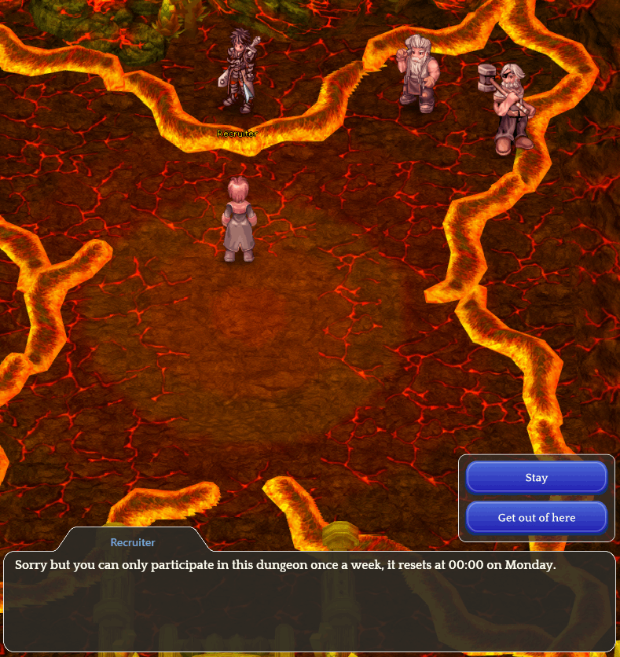
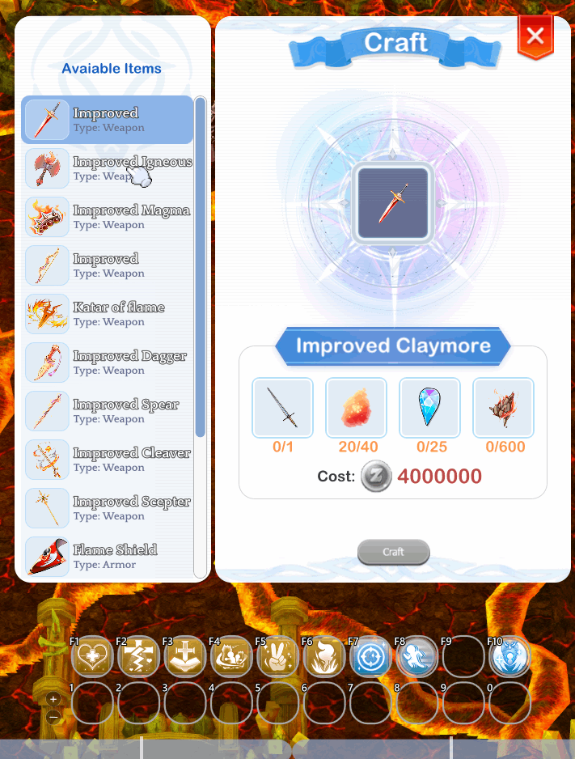
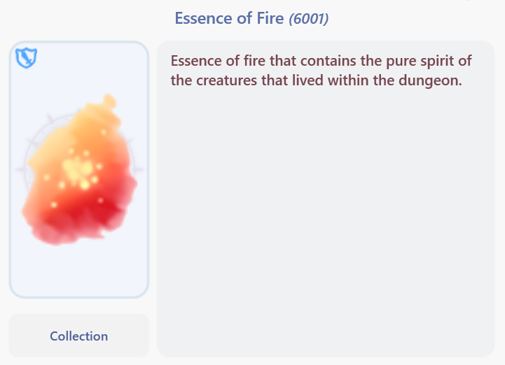

# ⚔️ Prontera Dungeon

<figure><figcaption></figcaption></figure>

## **What is the Prontera Dungeon?**

* The **Prontera Dungeon** is one of the **completely innovative** and unique **instances** in **Arkaik**, featuring its own mechanics and exclusive items.

## Where to Find It on the Map

* The instance is located in the <mark style="color:red;">**Prontera**</mark> map.
* You can check its location on the <mark style="color:red;">**MINIMAP**</mark>.
* You will find a portal with some guards—just enter.

<figure><figcaption>
<mark style="color:red;"><strong>Location on the "Mini Map" of Prontera</strong></mark>
</figcaption></figure>

## **How to Access the Location**

* Go to the nearest <mark style="color:red;">**Kafra**</mark> in your city, click on the **"**<mark style="color:red;">**Teleport**</mark>**"** option, and select the city.
* <mark style="color:red;">**Go to Prontera**</mark>**.**

<figure><figcaption></figcaption></figure>

* After that, head <mark style="color:red;">**north of Prontera**</mark> until you find the <mark style="color:red;">**guards and a portal**</mark>.
* Then, simply enter the <mark style="color:red;">**portal**</mark>.

<figure><figcaption></figcaption></figure>

## **Which NPCs Exist Inside?**



<mark style="color:red;">**RECRUITER**</mark>

* To create your instance, you need to <mark style="color:red;">**form a party (ALT+Z)**</mark><mark style="color:red;">.</mark>
* To cancel the interaction, you can choose the option **"**<mark style="color:red;">**No way...**</mark>**"**.
* To leave the room, simply select **"**<mark style="color:red;">**Get out of here**</mark>**"**.

<figure><figcaption>
<mark style="color:red;"><strong>Interaction with the RECRUITER NPC</strong></mark>
</figcaption></figure>



<mark style="background-color:red;">**CRAFTS**</mark>

* The <mark style="color:red;">**Crafts NPC**</mark> offers some items that can be <mark style="color:red;">**crafted**</mark>.
* Upon completing the instance, you will receive some <mark style="color:red;">**Fire Essence**</mark>.
* These are **one of the required items** to create your **enhanced weapon**.
* **Other items cannot be obtained within the instance**.
* Some items can be acquired by defeating <mark style="color:red;">**\[SPECIAL MONSTERS**</mark>**]**.

<figure><figcaption>
<mark style="color:red;"><strong>Interaction with the "CRAFTS" NPC</strong></mark>
</figcaption></figure>



## **Crafted Weapons**

<table><thead><tr><th width="252">Image</th><th width="118">Job</th><th>Crafting Items</th></tr></thead><tbody><tr><td>
<figure><figcaption></figcaption></figure>
</td><td>Bard &#x26; Dancer</td><td>
1x Guitar 

40x Fire Essence

25x Black Wings 

450x Turtle Shell
</td></tr><tr><td>
<figure><figcaption></figcaption></figure>
</td><td>Knight</td><td>
 1x Zweihander 

40x Fire Essence 

25x Memory Jewel 

600x Blazing Heart
</td></tr><tr><td>
<figure><figcaption></figcaption></figure>
</td><td>All</td><td>
1x Celestial Ceremonial Cloak 

40x Fire Essence 

25x Memory Jewel 

1x Pasana Card
</td></tr><tr><td>
<figure><figcaption></figcaption></figure>
</td><td>Priest</td><td>
1x Rod

40x Fire Essence

5x Ancient Skull

1x Heater Card 
</td></tr><tr><td>
<figure><figcaption></figcaption></figure>
</td><td>Rogue</td><td>
1x Sucsamad

40x Fire Essence

25x Black Wings

500x Flaming Horseshoe
</td></tr><tr><td>
<figure><figcaption></figcaption></figure>
</td><td>Crusader</td><td>
1x Colossal Lance Blade

40x Fire Essence

5x Ancient Skull

600x Dragon Skin
</td></tr><tr><td>
<figure><figcaption></figcaption></figure>
</td><td>Wizard</td><td>
1x Rod

40x Fire Essence

25x Memory Jewel

1x Nine Tails Card
</td></tr><tr><td>
<figure><figcaption></figcaption></figure>
</td><td>Monk</td><td>
1x Magma Fist

40x Fire Essence

5x Ancient Skull

250x Scorpion Claws
</td></tr><tr><td>
<figure><figcaption></figcaption></figure>
</td><td>Sage</td><td>
120x Deteriorated Page

40x Fire Essence

10x Flaming Agate

120x Fire Element Converter
</td></tr><tr><td>
<figure><figcaption></figcaption></figure>
</td><td>Alll</td><td>
1x Buckler

40x Fire Essence

25x Black Wings

200x Steel
</td></tr><tr><td>
<figure><figcaption></figcaption></figure>
</td><td>Assasin</td><td>
1x Katar of the Fierce Flame

40x Fire Essence

25x Memory Jewel

250x Incandescent Fur
</td></tr><tr><td>
<figure><figcaption></figcaption></figure>
</td><td>Blacksmith</td><td>
1x Orcish Axe

40x Fire Essence

25x Black Wings

30x Fire Heart
</td></tr><tr><td>
<figure><figcaption></figcaption></figure>
</td><td>Hunter</td><td>
1x Gakkung

40x Fire Essence

10x Flaming Agate

400x Scarlet Blood
</td></tr><tr><td>
<figure><figcaption></figcaption></figure>
</td><td>Alchimist</td><td>
1x Solar Sword

40x Fire Essence

10x Flaming Agate

120x Pumice Stone
</td></tr></tbody></table>



## **Crafted Weapons** - TIER 1

<table><thead><tr><th width="252">Image</th><th width="118">Job</th><th>Crafting Items</th></tr></thead><tbody><tr><td>
<figure><figcaption></figcaption></figure>
</td><td>Bard &#x26; Dancer</td><td>
+6 1x Berimbau

120x Fire Essence

100x Black Wings

10x Panda Hat

Horong Gem
</td></tr><tr><td>
<figure><figcaption></figcaption></figure>
</td><td>Knight</td><td>
+6 1x Enhanced Claymore

120x Fire Essence

100x Memory Jewel

1x Haedonggum

20x Cornutus Gem
</td></tr><tr><td>
<figure><figcaption></figcaption></figure>
</td><td>All</td><td>
+6 1x Flame Cloak

120x Fire Essence

100x Memory Jewel

1x Impact Saber

1x Pavana

10x Raggler Gem
</td></tr><tr><td>
<figure><figcaption></figcaption></figure>
</td><td>Priest</td><td>
+6 1x Enhanced Rod

120x Fire Essence

100x Ancient Skull

10x Gold Ring

20x Mist Gem
</td></tr><tr><td>
<figure><figcaption></figcaption></figure>
</td><td>Rogue</td><td>
+6 1x Enhanced Dagger

120x Fire Essence

100x Black Wings

1x Stellar Dust Blade

20x Fiery Gem
</td></tr><tr><td>
<figure><figcaption></figcaption></figure>
</td><td>Crusader</td><td>
+6 1x Enhanced Lance

120x Fire Essence

100x Ancient Skull

1x Lance, 1x Scythe

20x Fire Lance Level 5
</td></tr><tr><td>
<figure><figcaption></figcaption></figure>
</td><td>Wizard</td><td>
+6 1x Enhanced Scepter

120x Fire Essence

100x Memory Jewel

1x Ghost Band

200x Fire Barrier Level 5
</td></tr><tr><td>
<figure><figcaption></figcaption></figure>
</td><td>Monk</td><td>
+6 1x Enhanced Magma Fist

120x Fire Essence

100x Ancient Skull

5x Dark Veil

400x Wolf Blood
</td></tr><tr><td>
<figure><figcaption></figcaption></figure>
</td><td>Sage</td><td>
+6 1x Enhanced Bible

120x Fire Essence

200x Flaming Agate

1x Mystic Brutal Rune

250x Fire Spear Level 3
</td></tr><tr><td>
<figure><figcaption></figcaption></figure>
</td><td>All</td><td>
+6 1x Flame Shield

120x Fire Essence

100x Black Wings

10x Matchstick

70x Ancient Brutal Rune
</td></tr><tr><td>
<figure><figcaption></figcaption></figure>
</td><td>Assasin</td><td>
+6 1x Enhanced Flame Katar

120x Fire Essence

100x Memory Jewel

1x Jamadhar

20x Novus Scarlet Gem
</td></tr><tr><td>
<figure><figcaption></figcaption></figure>
</td><td>Blacksmith</td><td>
+6 1x Enhanced Igneous Steel

120x Fire Essence

100x Black Wings

1x Bloody Axe

1x Tear Gas
</td></tr><tr><td>
<figure><figcaption></figcaption></figure>
</td><td>Hunter</td><td>
+6 1x Enhanced Incendiary Bow

120x Fire Essence

200x Flaming Agate

3x Angel Wings

500x Official Emblem
</td></tr><tr><td>
<figure><figcaption></figcaption></figure>
</td><td>Alchimist</td><td>
+6 1x Enhanced Cleaver

120x Fire Essence

200x Flaming Agate

1x Bardiche

20x Grizzly Gem
</td></tr></tbody></table>



## **Crafted Weapons** - TIER 2

<table><thead><tr><th>Image</th><th width="120">Job</th><th>Crafting items</th></tr></thead><tbody><tr><td>
<figure><figcaption></figcaption></figure>
</td><td>Bard &#x26; Dancer</td><td></td></tr><tr><td>
<figure><figcaption></figcaption></figure>
</td><td>Knight</td><td></td></tr><tr><td>
<figure><figcaption></figcaption></figure>
</td><td>All</td><td></td></tr><tr><td>
<figure><figcaption></figcaption></figure>
</td><td>Priest</td><td></td></tr><tr><td>
<figure><figcaption></figcaption></figure>
</td><td>Rogue</td><td></td></tr><tr><td>
<figure><figcaption></figcaption></figure>
</td><td>Crusader</td><td></td></tr><tr><td>
<figure><figcaption></figcaption></figure>
</td><td>Wizard</td><td></td></tr><tr><td>
<figure><figcaption></figcaption></figure>
</td><td>Monk</td><td></td></tr><tr><td>
<figure><figcaption></figcaption></figure>
</td><td>Sage</td><td></td></tr><tr><td>
<figure><figcaption></figcaption></figure>
</td><td>All</td><td></td></tr><tr><td>
<figure><figcaption></figcaption></figure>
</td><td>Assasin</td><td></td></tr><tr><td>
<figure><figcaption></figcaption></figure>
</td><td>Blacksmith</td><td></td></tr><tr><td>
<figure><figcaption></figcaption></figure>
</td><td>Hunter</td><td></td></tr><tr><td>
<figure><figcaption></figcaption></figure>
</td><td>Alchimist</td><td></td></tr></tbody></table>



## **What Will I Find Inside?**



<mark style="background-color:red;">**MONSTERS**</mark>

* Monsters found inside the instance.

<table><thead><tr><th width="127">Sprite</th><th>Nome</th></tr></thead><tbody><tr><td></td><td>Flame Monster</td></tr><tr><td></td><td>Flame Monster</td></tr><tr><td></td><td>Flame Monster</td></tr></tbody></table>



<mark style="color:red;">**Map Mechanics**</mark>

* **Barricades:** Some rooms will contain a large number of monsters and barricades blocking your path. Defeat all monsters to clear the area.
* **Thorns:** Along your journey, there will be areas with thorns to hinder your movement.

<mark style="background-color:red;">**Crystal Mechanic**</mark>

| Sprite                            | Description                                                                                  |
| --------------------------------- | -------------------------------------------------------------------------------------------- |
|  | There will be a **crystal** that you need to activate by pulling the lever to open the path. |

<mark style="background-color:red;">**Soul Mechanic**</mark>

| Sprite                                    | Description                                                                                        |
| ----------------------------------------- | -------------------------------------------------------------------------------------------------- |
|  | Some souls are **lost on the map**. You must **guide them to the altar** to complete the instance. |



Recruiter

* After the souls are released, he will open the barricades to <mark style="color:red;">**SATAN MORROC**</mark>.

<figure><figcaption>
<mark style="color:red;"><strong>After completing all the challenges, you must talk to him to unlock the final challenge: defeating Satan Morroc.</strong></mark>
</figcaption></figure>



<mark style="background-color:red;">**MVPs**</mark>

| Sprite                                      | Descrição                                            |
| ------------------------------------------- | ---------------------------------------------------- |
|          | 
Boss of the First Part of the Instance

 |
|  | Boss of the Second Part of the Instance              |



## **Rewards**

<figure><figcaption></figcaption></figure>

* After defeating <mark style="color:red;">**Satan Morroc**</mark>, collect the last **Soul** and deliver it to the **altar** nearby.
* You will then be **teleported** to the NPC **"Recruiter"**, who will send you out of the instance.
* Upon leaving the instance, you will receive **"**<mark style="color:red;">**20 Fire Essence Fragments**</mark>**"**, which can be used to craft **equipment** at the NPC **"**<mark style="color:red;">**CRAFTS**</mark>**"**

<figure><figcaption>
<mark style="color:red;"><strong>Item Received After Completing the Instance</strong></mark>
</figcaption></figure>

* **Item Received After Completing the Instance**

| Item                                                                                                          | Nome               | Chance                                    |
| ------------------------------------------------------------------------------------------------------------- | ------------------ | ----------------------------------------- |
| 
<figure><figcaption></figcaption></figure>
 | Diabolus Boots     | <mark style="color:red;">**0.15%**</mark> |
| 
<figure><figcaption></figcaption></figure>
 | Blazing Fury Armor | <mark style="color:red;">**0.6%**</mark>  |
