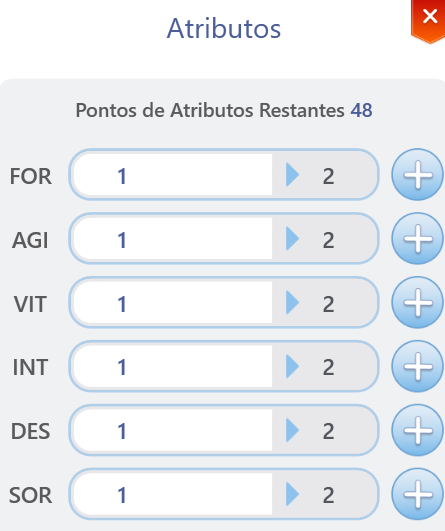

# 📊 Atribut & Statistik

* Arkaik bekerja dengan <mark style="color:red;">**sistem distribusi status**</mark>.
* Setiap level yang Anda dapatkan memberikan Anda beberapa poin untuk didistribusikan.
* Setiap poin yang dialokasikan dalam daftar atribut memberikan Anda beberapa bonus.

<figure><figcaption>
<mark style="color:red;"><strong>ALT+E (Atribut)</strong></mark>
</figcaption></figure>

## **Daftar Atribut**

* Untuk menavigasi melalui daftar, cukup ikuti contoh **"**<mark style="color:red;">**GIF di bawah ini**</mark>**"**.

<figure><figcaption>
<mark style="color:red;"><strong>Contoh Navigasi</strong></mark>
</figcaption></figure>



## <mark style="color:red;">**Kekuatan (STR)**</mark>* Setiap **1** poin di **"**<mark style="color:red;">**STR**</mark>**"** memberikan Anda beberapa bonus.

<table><thead><tr><th width="512">Deskripsi</th><th>Bonus</th></tr></thead><tbody><tr><td>Serangan Fisik</td><td><mark style="color:red;"><strong>+1</strong></mark></td></tr><tr><td>Peningkatan kerusakan senjata (<mark style="color:red;"><strong>Serangan Jarak Dekat</strong></mark>)</td><td><mark style="color:red;"><strong>0.5%</strong></mark></td></tr><tr><td>Setiap <mark style="color:red;"><strong>5</strong></mark> poin di <mark style="color:red;"><strong>STR</strong></mark> meningkatkan <strong>(</strong><mark style="color:red;"><strong>Serangan Jarak Jauh</strong></mark><strong>)</strong></td><td><mark style="color:red;"><strong>+1</strong></mark></td></tr><tr><td>Kapasitas Membawa (<mark style="color:red;"><strong>Batas Berat</strong></mark>)</td><td><mark style="color:red;"><strong>+30</strong></mark></td></tr></tbody></table>


## <mark style="color:orange;">**Agility (AGI)**</mark>

* Setiap **1** poin dalam **"**<mark style="color:orange;">**AGI**</mark>**"** memberikan Anda beberapa bonus.

<table><thead><tr><th width="546">Deskripsi</th><th>Bonus</th></tr></thead><tbody><tr><td>Hindar</td><td><mark style="color:orange;"><strong>+1</strong></mark></td></tr><tr><td>Peningkatan Kecepatan Serangan</td><td><mark style="color:orange;"><strong>(Tidak Ada Rumus)</strong></mark></td></tr><tr><td>Ketahanan terhadap <strong>(</strong><mark style="color:orange;"><strong>Darah dan Tidur</strong></mark><strong>)</strong></td><td><mark style="color:orange;"><strong>+1%</strong></mark></td></tr><tr><td>Setiap <strong>5</strong> poin dalam <mark style="color:orange;"><strong>AGI</strong></mark> meningkatkan <strong>"</strong><mark style="color:orange;"><strong>Pertahanan Fisik</strong></mark><strong>"</strong></td><td><mark style="color:orange;"><strong>+1</strong></mark></td></tr></tbody></table>


## <mark style="color:green;">**Vitalitas (VIT)**</mark>

* Setiap **1** poin di **"**<mark style="color:green;">**VIT**</mark>**"** memberikan Anda beberapa bonus.<table><thead><tr><th width="544">Deskripsi</th><th>Bonus</th></tr></thead><tbody><tr><td>Max HP</td><td><mark style="color:green;"><strong>+1%</strong></mark></td></tr><tr><td>Peningkatan efek penyembuhan dari <strong>(</strong><mark style="color:green;"><strong>Consumables / HP</strong></mark><strong>)</strong></td><td><mark style="color:green;">+<strong>2%</strong></mark></td></tr><tr><td>Ketahanan terhadap <mark style="color:green;"><strong>Racun dan (Racun Mematikan), serta pengurangan efek</strong></mark></td><td><mark style="color:green;"><strong>+1%</strong></mark></td></tr><tr><td>Mengurangi kemungkinan <strong>(</strong><mark style="color:green;"><strong>Terbakar, Hipotermia, Kristalisasi</strong></mark><strong>)</strong> dan durasi</td><td><mark style="color:green;"><strong>+1% dan 0,1s</strong></mark></td></tr><tr><td>Setiap <mark style="color:green;"><strong>2</strong></mark> poin di <mark style="color:green;"><strong>VIT</strong></mark> meningkatkan <strong>"</strong><mark style="color:green;"><strong>Pertahanan Fisik</strong></mark><strong>"</strong></td><td><mark style="color:green;"><strong>+1</strong></mark></td></tr><tr><td>Setiap <mark style="color:green;"><strong>5</strong></mark> poin di <mark style="color:green;"><strong>VIT</strong></mark> meningkatkan <strong>"</strong><mark style="color:green;"><strong>Pertahanan Sihir</strong></mark><strong>"</strong></td><td><mark style="color:green;"><strong>+1</strong></mark></td></tr></tbody></table>


## <mark style="color:blue;">**Kecerdasan (INT)**</mark>

* Setiap **1** poin dalam **"**<mark style="color:blue;">**INT**</mark>**"** memberikan Anda beberapa bonus.<table><thead><tr><th width="546">Deskripsi</th><th>Bonus</th></tr></thead><tbody><tr><td>Serangan Sihir Dasar</td><td><mark style="color:blue;"><strong>+1,5</strong></mark></td></tr><tr><td>Max SP</td><td><mark style="color:blue;"><strong>+1%</strong></mark></td></tr><tr><td>Peningkatan efek penyembuhan dari <strong>(</strong><mark style="color:blue;"><strong>Consumables / SP</strong></mark><strong>)</strong></td><td><mark style="color:blue;"><strong>+1%</strong></mark></td></tr><tr><td>Ketahanan terhadap <strong>(</strong><mark style="color:blue;"><strong>Tidur dan Tidur Dalam</strong></mark><strong>)</strong></td><td><mark style="color:blue;"><strong>+1%</strong></mark></td></tr><tr><td>Sedikit mengurangi waktu casting variabel</td><td><mark style="color:blue;"><strong>(Tidak Ada Rumus)</strong></mark></td></tr><tr><td>Setiap <mark style="color:blue;"><strong>2</strong></mark> poin di <mark style="color:blue;"><strong>INT</strong></mark> meningkatkan <strong>(</strong><mark style="color:blue;"><strong>Pertahanan Sihir</strong></mark><strong>)</strong></td><td><mark style="color:blue;"><strong>+1</strong></mark></td></tr><tr><td>Setiap <mark style="color:blue;"><strong>2</strong></mark> poin di <mark style="color:blue;"><strong>INT</strong></mark> meningkatkan <strong>(</strong><mark style="color:blue;"><strong>Pemulihan SP Alami</strong></mark><strong>)</strong></td><td><mark style="color:blue;"><strong>+1</strong></mark></td></tr></tbody></table>


## <mark style="color:purple;">**Ketangkasan (DEX)**</mark>

* Setiap **1** poin di **"**<mark style="color:purple;">**DEX**</mark>**"** memberikan Anda beberapa bonus.<table><thead><tr><th width="546">Deskripsi</th><th>Bonus</th></tr></thead><tbody><tr><td>Akurasi</td><td><mark style="color:purple;"><strong>+1</strong></mark></td></tr><tr><td>Meningkatkan serangan fisik jarak jauh</td><td><mark style="color:purple;"><strong>+1</strong></mark></td></tr><tr><td>Mengurangi waktu casting variabel</td><td><mark style="color:purple;"><strong>(Tanpa Rumus)</strong></mark></td></tr><tr><td>Meningkatkan kecepatan serangan</td><td><mark style="color:purple;"><strong>(Tanpa Rumus)</strong></mark></td></tr><tr><td>Setiap <mark style="color:purple;"><strong>5</strong></mark> poin di <mark style="color:purple;"><strong>DEX</strong></mark> meningkatkan <strong>(</strong><mark style="color:purple;"><strong>Serangan Melee</strong></mark><strong>)</strong></td><td><mark style="color:purple;"><strong>+1</strong></mark></td></tr><tr><td>Setiap <mark style="color:purple;"><strong>5</strong></mark> poin di <mark style="color:purple;"><strong>DEX</strong></mark> meningkatkan <strong>(</strong><mark style="color:purple;"><strong>Serangan Sihir</strong></mark><strong>)</strong></td><td><mark style="color:purple;"><strong>+1</strong></mark></td></tr><tr><td>Setiap <mark style="color:purple;"><strong>5</strong></mark> poin di <mark style="color:purple;"><strong>DEX</strong></mark> meningkatkan <strong>(</strong><mark style="color:purple;"><strong>Pertahanan Sihir</strong></mark><strong>)</strong></td><td><mark style="color:purple;"><strong>+1</strong></mark></td></tr></tbody></table>


## <mark style="color:yellow;">**Luck (LUK)**</mark>

* Setiap **1** poin di **"**<mark style="color:yellow;">**LUK**</mark>**"** memberikan Anda beberapa bonus.<table><thead><tr><th width="546">Deskripsi</th><th>Bonus</th></tr></thead><tbody><tr><td>Serangan Kritis</td><td><mark style="color:yellow;"><strong>+0.3</strong></mark></td></tr><tr><td>Ketahanan terhadap <strong>(</strong><mark style="color:yellow;"><strong>Kutukan dan Sihir</strong></mark><strong>)</strong></td><td><mark style="color:yellow;"><strong>+1%</strong></mark></td></tr><tr><td>Setiap <mark style="color:yellow;"><strong>3</strong></mark> poin di <mark style="color:yellow;"><strong>LUK</strong></mark> meningkatkan <strong>(</strong><mark style="color:yellow;"><strong>Serangan Fisik</strong></mark><strong>)</strong></td><td><mark style="color:yellow;"><strong>+1</strong></mark></td></tr><tr><td>Setiap <mark style="color:yellow;"><strong>3</strong></mark> poin di <mark style="color:yellow;"><strong>LUK</strong></mark> meningkatkan <strong>(</strong><mark style="color:yellow;"><strong>Serangan Sihir</strong></mark><strong>)</strong></td><td><mark style="color:yellow;"><strong>+1</strong></mark></td></tr><tr><td>Setiap <mark style="color:yellow;"><strong>3</strong></mark> poin di <mark style="color:yellow;"><strong>LUK</strong></mark> meningkatkan <strong>(</strong><mark style="color:yellow;"><strong>Akurasi</strong></mark><strong>)</strong></td><td><mark style="color:yellow;"><strong>+1</strong></mark></td></tr><tr><td>Setiap <mark style="color:yellow;"><strong>3</strong></mark> poin di <mark style="color:yellow;"><strong>LUK</strong></mark> meningkatkan <strong>(</strong><mark style="color:yellow;"><strong>Penghindaran</strong></mark><strong>)</strong></td><td><mark style="color:yellow;"><strong>+1</strong></mark></td></tr><tr><td>Setiap <mark style="color:yellow;"><strong>5</strong></mark> poin di <mark style="color:yellow;"><strong>LUK</strong></mark> meningkatkan <strong>(</strong><mark style="color:yellow;"><strong>Ketahanan terhadap Serangan Kritis</strong></mark><strong>)</strong></td><td><mark style="color:yellow;"><strong>+1%</strong></mark></td></tr><tr><td>Setiap <mark style="color:yellow;"><strong>10</strong></mark> poin di <mark style="color:yellow;"><strong>LUK</strong></mark> meningkatkan <strong>(</strong><mark style="color:yellow;"><strong>Penghindaran Sempurna</strong></mark><strong>)</strong></td><td><mark style="color:yellow;"><strong>+1</strong></mark></td></tr></tbody></table>
