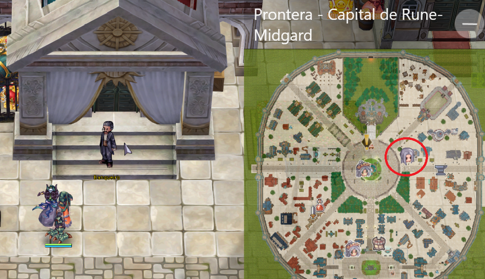
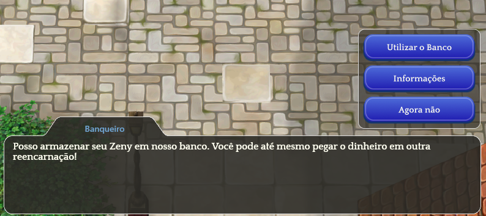

# 🏦 Banker

## **Apa itu Banker?**

* **Banker** adalah **NPC yang terletak di kota** <mark style="color:red;">**Prontera**</mark>.
* Fungsinya adalah untuk **menyimpan Zeny Anda dengan aman**.

<figure><figcaption>
<mark style="color:red;"><strong>Lokasi Banker di Prontera</strong></mark>
</figcaption></figure>

## **Bagaimana Cara Kerjanya?**

* <mark style="background-color:red;">**Banker dapat menyimpan Zeny Anda**</mark>, memungkinkan Anda untuk **menggunakannya di berbagai karakter**.
* Setiap kali Anda **"**<mark style="color:red;">**Tarik**</mark>**"** Zeny, Anda <mark style="color:red;">**harus membayar biaya kecil**</mark>.

<figure><figcaption>
<mark style="color:red;"><strong>Informasi Banker Saat Berinteraksi</strong></mark>
</figcaption></figure>