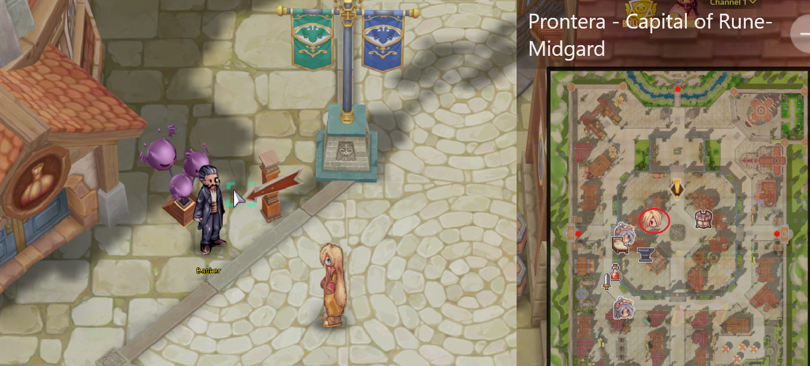
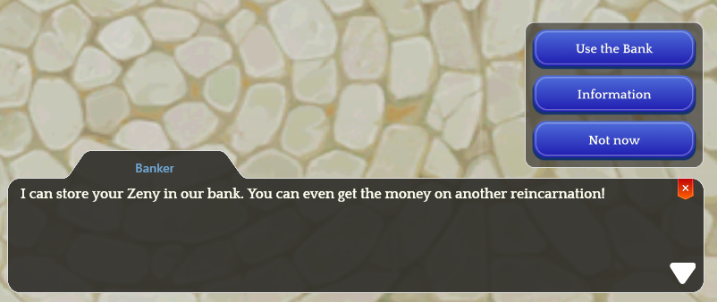

# 🏦 Banker

## **What is the Banker?**

* The **Banker** is an **NPC located in the city of&#x20;**<mark style="color:red;">**Prontera**</mark>.
* Its function is to **store your Zeny safely**.

<figure><figcaption>
<mark style="color:red;"><strong>Banker Location in Prontera</strong></mark>
</figcaption></figure>

## **How Does It Work?**

* The <mark style="background-color:red;">**Banker can store your Zeny**</mark>, allowing you to **use it across different characters**.
* Each time you **"**<mark style="color:red;">**Withdraw**</mark>**"** Zeny, you <mark style="color:red;">**must pay a small fee**</mark>.

<figure><figcaption>
<mark style="color:red;"><strong>Banker Information Upon Interaction</strong></mark>
</figcaption></figure>
