# 📗 Class Guides

## **Professions and Class Evolution**

* Professions—or **classes**—function as an evolution path that you choose to strengthen your character with exclusive skills.
* All players in **Arkaik: Tales of Sarina** start as **Novices** and can decide their path from **class level 10** onward.
* Carefully observe the requirements for changing professions: **base level** or **class level**.
* Remember that each class has different **roles and characteristics**, so choose your path wisely—**there’s no turning back!**

## <mark style="color:blue;">**Starting Class**</mark>

<figure>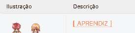<figcaption>
<mark style="color:red;"><strong>Click on the NAME to see more information.</strong></mark>
</figcaption></figure>

<table><thead><tr><th width="170">Illustration</th><th data-type="content-ref">Description</th></tr></thead><tbody><tr><td></td><td><a href="novice.md">novice.md</a></td></tr></tbody></table>

#### **Class Table**

* Starting from **Base Level 10** and **Job Level 10**, you can **choose** one of the <mark style="color:red;">**1-1 Classes**</mark> below.
* From **Job Level 40** onward, you can **evolve** into one of the alternative classes.
* Each class has **2-1 and 2-2 versions**, representing two different specialization paths.



#### <mark style="color:yellow;">Job 1-1</mark>

<table><thead><tr><th width="152">Illustration</th><th data-type="content-ref">Description</th></tr></thead><tbody><tr><td>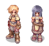</td><td><a href="swordman.md">swordman.md</a></td></tr></tbody></table>

#### <mark style="color:green;">Job 2-1</mark>

<table><thead><tr><th width="150">Illustration</th><th data-type="content-ref">Description</th></tr></thead><tbody><tr><td>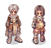</td><td><a href="knight.md">knight.md</a></td></tr></tbody></table>

#### <mark style="color:green;">Job 2-2</mark>

<table><thead><tr><th width="150">Illustration</th><th data-type="content-ref">Description</th></tr></thead><tbody><tr><td>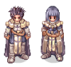</td><td><a href="crusader.md">crusader.md</a></td></tr></tbody></table>



#### <mark style="color:yellow;">Job 1-1</mark>

<table><thead><tr><th width="152">Illustration</th><th data-type="content-ref">Description</th></tr></thead><tbody><tr><td>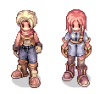</td><td><a href="archer.md">archer.md</a></td></tr></tbody></table>

#### <mark style="color:green;">Job 2-1</mark>

<table><thead><tr><th width="152">Illustration</th><th data-type="content-ref">Description</th></tr></thead><tbody><tr><td>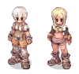</td><td><a href="hunter.md">hunter.md</a></td></tr></tbody></table>

#### <mark style="color:green;">Job 2-2</mark>

<table><thead><tr><th width="152">Illustration</th><th data-type="content-ref">Description</th></tr></thead><tbody><tr><td>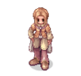</td><td><a href="bard.md">bard.md</a></td></tr><tr><td>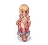</td><td><a href="dancer.md">dancer.md</a></td></tr></tbody></table>



#### <mark style="color:yellow;">Job 1-1</mark>

<table><thead><tr><th width="150">Illustration</th><th data-type="content-ref">Description</th></tr></thead><tbody><tr><td>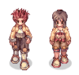</td><td><a href="thief.md">thief.md</a></td></tr></tbody></table>

#### <mark style="color:green;">Job 2-1</mark>

<table><thead><tr><th width="151">Illustration</th><th data-type="content-ref">Description</th></tr></thead><tbody><tr><td>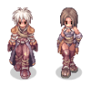</td><td><a href="assasin.md">assasin.md</a></td></tr></tbody></table>

#### <mark style="color:green;">Job 2-2</mark>

<table><thead><tr><th width="149">Illustration</th><th data-type="content-ref">Description</th></tr></thead><tbody><tr><td>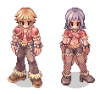</td><td><a href="rogue.md">rogue.md</a></td></tr></tbody></table>



#### <mark style="color:yellow;">Job 1-1</mark>

<table><thead><tr><th width="151">Illustration</th><th data-type="content-ref">Description</th></tr></thead><tbody><tr><td>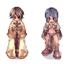</td><td><a href="mage.md">mage.md</a></td></tr></tbody></table>

#### <mark style="color:green;">Job 2-1</mark>

<table><thead><tr><th width="150">Illustration</th><th data-type="content-ref">Description</th></tr></thead><tbody><tr><td>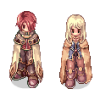</td><td><a href="wizard.md">wizard.md</a></td></tr></tbody></table>

#### <mark style="color:green;">Job 2-2</mark>

<table><thead><tr><th width="149">Illustration</th><th data-type="content-ref">Description</th></tr></thead><tbody><tr><td>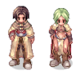</td><td><a href="sage.md">sage.md</a></td></tr></tbody></table>



#### <mark style="color:yellow;">Job 1-1</mark>

<table><thead><tr><th width="150">Illustration</th><th data-type="content-ref">Description</th></tr></thead><tbody><tr><td>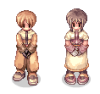</td><td><a href="acolyte.md">acolyte.md</a></td></tr></tbody></table>

#### <mark style="color:green;">Job 2-1</mark>

<table><thead><tr><th width="150">Illustration</th><th data-type="content-ref">Description</th></tr></thead><tbody><tr><td>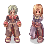</td><td><a href="priest.md">priest.md</a></td></tr></tbody></table>

#### <mark style="color:green;">Job 2-2</mark>

<table><thead><tr><th width="151">Illustration</th><th data-type="content-ref">Description</th></tr></thead><tbody><tr><td>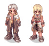</td><td><a href="monk.md">monk.md</a></td></tr></tbody></table>



#### <mark style="color:yellow;">Job 1-1</mark>

<table><thead><tr><th width="151">Illustration</th><th data-type="content-ref">Description</th></tr></thead><tbody><tr><td>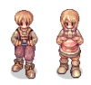</td><td><a href="merchant.md">merchant.md</a></td></tr></tbody></table>

#### <mark style="color:green;">Job 2-1</mark>

<table><thead><tr><th width="150">Illustration</th><th data-type="content-ref">Description</th></tr></thead><tbody><tr><td>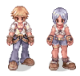</td><td><a href="blacksmith.md">blacksmith.md</a></td></tr></tbody></table>

#### <mark style="color:green;">Job 2-2</mark>

<table><thead><tr><th width="147">Illustration</th><th data-type="content-ref">Descrição</th></tr></thead><tbody><tr><td>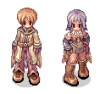</td><td><a href="alchemist.md">alchemist.md</a></td></tr></tbody></table>



#### <mark style="color:yellow;">Job 1-1</mark>

<table><thead><tr><th width="150">Illustration</th><th>Description</th></tr></thead><tbody><tr><td>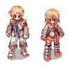</td><td>[Taekwon]</td></tr><tr><td>
<figure><figcaption></figcaption></figure>
</td><td>[Ninja]</td></tr></tbody></table>


