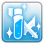

# \[Nhà Giả Kim]

<figure><figcaption></figcaption></figure>

* Do đó, họ có kiến thức sâu sắc về thực vật và động vật của ba châu lục.
* Với khoa học, **Nhà Giả Kim** có thể tạo ra những loại thuốc mạnh mẽ hơn nhiều so với những loại được bán trong cửa hàng.
* Không chỉ giới hạn ở hơi thở đơn giản của sự sống, họ còn nghiên cứu **chiến thuật chiến tranh**, sử dụng những quả bom dễ ném.





## **Kỹ Năng**<table><thead><tr><th width="87">IMG</th><th width="127">Tên</th><th>Mô tả</th></tr></thead><tbody><tr><td></td><td>Thành thạo Rìu và Kiếm</td><td>Tăng <strong>ATK</strong> khi trang bị <strong>rìu hoặc kiếm một tay</strong> lên <strong>(SkillLevel*3)</strong>.</td></tr><tr><td></td><td>Nghiên cứu Thuốc</td><td>Thông qua nghiên cứu, tăng <strong>tỷ lệ thành công của việc chế tạo thuốc</strong> và <strong>cải thiện hiệu quả hồi phục</strong> của các loại thuốc chế tạo lên <strong>(SkillLevel*5)%</strong>.</td></tr><tr><td></td><td>Nhà Thuốc</td><td>Cho phép mở <strong>menu chế tạo thuốc</strong>. Cần <strong>1 Bình Trộn</strong>. Tỷ lệ thành công của việc chế tạo vật phẩm là <strong>(SkillLevel*5)%</strong>.</td></tr><tr><td></td><td>Hỏa Huyết Hy Lạp</td><td>Ném <strong>chất lỏng dễ cháy</strong> xuống đất, gây <strong>thiệt hại hỗn hợp</strong> lên <strong>(SkillLevel*20+100)%</strong> mỗi <strong>0.5 giây</strong> cho đối thủ. Trong khu vực này, mục tiêu có <strong>(SkillLevel)% cơ hội mỗi giây</strong> để bị <strong>gãy vũ khí</strong>.</td></tr><tr><td></td><td>Kinh Hoàng Axit</td><td>Ném <strong>axit</strong> vào đối thủ, gây <strong>thiệt hại hỗn hợp (SkillLevel*80+200)% từ xa, bỏ qua né tránh của mục tiêu</strong>. Có <strong>(SkillLevel*3)% cơ hội</strong> để gây <strong>chảy máu</strong> hoặc <strong>(SkillLevel*2+1)% cơ hội</strong> để <strong>gãy giáp của mục tiêu</strong>.</td></tr><tr><td></td><td>Giao Hàng</td><td>Sau khi chọn <strong>thành viên trong nhóm</strong>, sử dụng một vật phẩm tiêu hao sẽ <strong>áp dụng hiệu ứng cho họ thay vì cho bản thân</strong>. Điều này kéo dài <strong>bao lâu họ còn trong tầm nhìn của bạn</strong> hoặc <strong>cho đến khi bạn sử dụng kỹ năng này lại cho bản thân</strong>.</td></tr><tr><td></td><td>Biến Hình Cây Ăn Thịt</td><td>Biến đổi <strong>1 Bình Cây Ăn Thịt</strong> thành <strong>Cây Ăn Thịt</strong>, hỗ trợ người dùng trong chiến đấu.</td></tr><tr><td></td><td>Biến Hình Khối Biển</td><td>Tạo ra <strong>tối đa 5 Khối Lửa</strong> mà <strong>nổ khi bị tấn công</strong>. Bất kỳ mục tiêu nào trong <strong>khu vực nổ 11x11</strong> sẽ nhận <strong>thiệt hại vật lý nguyên tố Lửa</strong>, bao gồm <strong>homunculi và trợ lý</strong>. Tăng cấp độ kỹ năng <strong>tăng cường HP</strong> của <strong>Khối Biển</strong> lên <strong>(SkillLevel*400+2000)</strong>, tối đa hóa thiệt hại nổ. <strong>Trong bản đồ PvP, vụ nổ sẽ ảnh hưởng đến tất cả các nhân vật, bao gồm cả đồng minh và người dùng.</strong>.</td></tr><tr><td></td><td>Bọc Vũ Khí</td><td>Bọc <strong>vũ khí</strong> của mục tiêu bằng sáp đặc biệt, ngăn không cho nó bị <strong>gỡ bỏ hoặc gãy trong chiến đấu</strong> trong <strong>(120*SkillLevel) giây</strong>.</td></tr><tr><td></td><td>Bọc Khiên</td><td>Bọc <strong>khiên</strong> của mục tiêu bằng sáp đặc biệt, ngăn không cho nó bị <strong>gỡ bỏ hoặc gãy trong chiến đấu</strong> trong <strong>(120*SkillLevel) giây</strong>.</td></tr><tr><td></td><td>Bọc Giáp</td><td>Bọc <strong>giáp</strong> của mục tiêu bằng sáp đặc biệt, ngăn không cho nó bị <strong>gỡ bỏ hoặc gãy trong chiến đấu</strong> trong <strong>(120*SkillLevel) giây</strong>.</td></tr><tr><td></td><td>Bọc Mũ</td><td>Bọc <strong>mũ bảo hiểm</strong> của mục tiêu bằng sáp đặc biệt, ngăn không cho nó bị <strong>gỡ bỏ hoặc gãy trong chiến đấu</strong> trong <strong>(120*SkillLevel) giây</strong>.</td></tr><tr><td></td><td>Sức Mạnh Liên Kết</td><td>Ở trong <strong>5 ô</strong> gần <strong>Homunculus</strong> của bạn làm cho các đòn tấn công cơ bản của bạn gây <strong>gấp ba lần sát thương</strong> lên <strong>cùng một mục tiêu</strong> tối đa <strong>(SkillLevel) lần</strong>.</td></tr><tr><td></td><td>Biến Hình Homunculus</td><td>Biến đổi một <strong>phôi thai</strong> để tạo ra một <strong>homunculus ngẫu nhiên</strong>. Sử dụng kỹ năng này một lần nữa <strong>đánh thức một homunculus đã bị bốc hơi</strong>.</td></tr><tr><td></td><td>Hóa Hơi Homunculus</td><td>Đưa <strong>homunculus vào giấc ngủ</strong>, cho phép nó được <strong>đánh thức lại bằng Biến Hình Homunculus</strong>. <strong>Không hoạt động</strong> nếu homunculus có <strong>dưới 80% HP</strong>.</td></tr><tr><td></td><td>Hồi Sinh Homunculus</td><td>Hồi sinh <strong>homunculus</strong> với <strong>(SkillLevel*20)% HP được phục hồi</strong>.</td></tr><tr><td></td><td>Ném Thuốc Cuồng Nộ Hoang Dã</td><td>Ném <strong>2 Thuốc Cuồng Nộ Hoang Dã</strong> vào mục tiêu, <strong>bỏ qua các hạn chế về loại vật phẩm</strong>. <strong>Không có hiệu lực trên các nhân vật dưới cấp 84</strong>. <strong>Chỉ có thể được sử dụng khi tinh thần Alchemist đang hoạt động</strong>.</td></tr><tr><td></td><td>Ra Lệnh: Tấn Công</td><td>Ra lệnh cho <strong>homunculus</strong> <strong>tấn công một mục tiêu</strong>. <strong>Các kỹ năng và đòn tấn công thực hiện trên mục tiêu đó gây thêm +(2*SkillLevel)% sát thương</strong>.</td></tr><tr><td></td><td>Ra Lệnh: Rút Lui</td><td>Ra lệnh cho <strong>homunculus</strong> <strong>hủy tất cả lệnh</strong> và quay về với chủ nhân, <strong>hồi phục cả hai</strong> <strong>(SkillLevel*200) HP</strong>.</td></tr><tr><td></td><td>Ra Lệnh: Định Vị</td><td>Ra lệnh cho <strong>homunculus</strong> <strong>di chuyển đến một ô đã chọn</strong>. Khi ở trong cùng một ô, <strong>homunculus nhận -(SkillLevel*2)% sát thương</strong>.</td></tr><tr><td></td><td>Trao Đổi Tương Đương</td><td><strong>Đánh bại một mục tiêu</strong> phục hồi <strong>(SkillLevel*5)% HP hiện tại</strong>.</td></tr><tr><td></td><td>Biến Hình Nhanh</td><td>Sau <strong>(10-SkillLevel) kỹ năng (từ một mục tiêu)</strong>, kỹ năng tiếp theo sẽ được cast <strong>ngay lập tức và không tốn mana</strong>.</td></tr><tr><td></td><td>Biến Hình Con Người</td><td><strong>Tiêu tốn 500 HP</strong> để <strong>đặt lại tất cả thời gian hồi chiêu kỹ năng xuống 40%</strong>.</td></tr><tr><td></td><td>Phá Hủy Hóa Học</td><td><strong>Giết ngay lập tức một con quái vật với chi phí toàn bộ mana của bạn</strong>. <strong>Không hoạt động trên các quái vật huyền thoại</strong>.</td></tr></tbody></table>


## Bậc Thầy

<table><thead><tr><th width="84">IMG</th><th width="126">Tên</th><th width="385">Mô tả	</th><th>Cấp độ</th></tr></thead><tbody><tr><td></td><td>Không Thuốc, Không Vấn Đề</td><td>Giảm <strong>((Cấp độ Thành thạo / 3) - 80)%</strong> sát thương <strong>để ngăn chặn hư hỏng trang bị và tiêu tốn thuốc khi sử dụng kỹ năng</strong>.</td><td>150</td></tr><tr><td></td><td>Biến Hình Nâng Cao</td><td>Tại <strong>Cấp độ Thành thạo 50</strong>, cho phép sử dụng <strong>2 loại cây cùng một lúc</strong>. Tại <strong>Cấp độ Thành thạo 100</strong>, cho phép sử dụng <strong>3 loại cây cùng một lúc</strong>.</td><td>100</td></tr><tr><td></td><td>Phân Bón Siêu Cấp</td><td>Mỗi <strong>50 điểm thành thạo</strong> sẽ tăng <strong>phạm vi kỹ năng cây trồng thêm 1 ô</strong>.</td><td>250</td></tr><tr><td></td><td>Thành Thạo Thực Vật</td><td>Mỗi điểm sẽ làm <strong>ATK và MATK</strong> của người dùng <strong>tăng tỷ lệ sát thương cây trồng</strong>. Tại <strong>200 điểm thành thạo</strong>, tất cả <strong>ATK và MATK</strong> của người dùng sẽ hoàn toàn tăng tỷ lệ sát thương cây trồng.</td><td>200</td></tr><tr><td></td><td>Giải Phẫu Chủng Tộc</td><td>Tại cấp độ thành thạo tối đa, <strong>kỹ năng Acid Terror</strong> sẽ <strong>chịu ảnh hưởng của các chỉ số chủng tộc và kích thước</strong> (thẻ, bộ sưu tập, v.v.).</td><td>150</td></tr><tr><td></td><td>Nghiên Cứu Genome</td><td>Gây <strong>(Cấp độ Thành thạo*2)% sát thương nhiều hơn</strong> lên <strong>quái vật Hình người và Thực vật</strong>. <strong>Không có tác dụng lên người chơi</strong> và có <strong>hiệu ứng bằng một nửa trên quái vật huyền thoại</strong>.</td><td>100</td></tr><tr><td></td><td>Ngọn Lửa Địa Ngục</td><td>Tăng <strong>số lần đánh của Ngọn Lửa Hy Lạp thêm 1 cho mỗi 40 điểm thành thạo</strong>.</td><td>200</td></tr><tr><td></td><td>Không Thuốc, Không Vấn Đề</td><td>Giảm <strong>((Cấp độ Thành thạo / 3) - 80)% sát thương Ngọn Lửa Hy Lạp</strong> để <strong>ngăn chặn tiêu tốn thuốc khi sử dụng kỹ năng</strong>.</td><td>120</td></tr><tr><td></td><td>Không Giới Hạn</td><td>Tại <strong>Cấp độ Thành thạo 120</strong>, cho phép <strong>sử dụng Ngọn Lửa Hy Lạp trực tiếp lên mục tiêu</strong>. Tuy nhiên, <strong>giảm khả năng hư hỏng vũ khí xuống 0%</strong>.</td><td>120</td></tr><tr><td></td><td>Niêm Phong Hóa Học</td><td>Mỗi <strong>50 điểm thành thạo</strong>, <strong>1 đồng minh bổ sung có thể được liên kết</strong> trong <strong>kỹ năng Giao hàng</strong>.</td><td>200</td></tr><tr><td></td><td>Khoa Học Nhân Giống</td><td>Mỗi <strong>150 cấp độ</strong>, tăng <strong>sản lượng chế tạo thuốc thêm +1</strong>. Tại cấp độ tối đa, <strong>chế tạo 3 loại thuốc thay vì 1</strong>.</td><td>300</td></tr></tbody></table>
