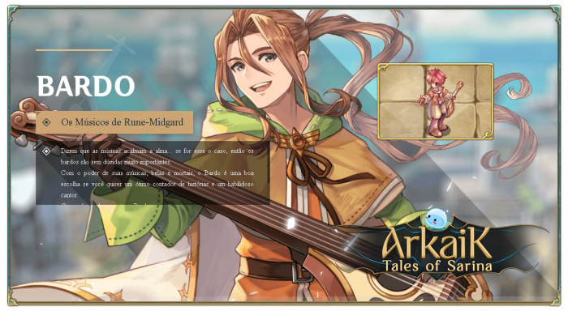

# \[Bard]

<figure><figcaption></figcaption></figure>

* With the power of their music, both beautiful and deadly, the **Bard** is a great choice if you want an excellent storyteller and a skilled singer.
* As a support class, the Bard focuses on singing to inspire party members in battle against enemies. However, they also possess the skills of an archer and can fight as well.


<mark style="color:red;">**Video Quest Bard (English)**</mark>




## **Skills**

<table><thead><tr><th width="87">IMG</th><th width="124">Name	</th><th>Description</th></tr></thead><tbody><tr><td></td><td>Music Lessons</td><td>This skill must be learned to unlock the use of <strong>music skills</strong>. When using a <strong>music skill</strong>, the player must press the keys in sequence to cast the skill.</td></tr><tr><td></td><td>Melodic Arrow</td><td>Uses an instrument to shoot an arrow, dealing <strong>ranged physical damage</strong> of <strong>(SkillLevel*25+125)%</strong>, depending on the equipped ammo's property. If successfully performing a song, this skill deals <strong>double damage</strong>.</td></tr><tr><td></td><td>Music: Dissonance</td><td>This skill has <strong>2 musical notes</strong>. Party members <strong>(within vision)</strong> have a <strong>1% chance</strong> to deal <strong>1% of the target's max HP as bonus damage</strong> with each basic attack. This effect lasts for <strong>(SkillLevel*20) seconds</strong>.</td></tr><tr><td></td><td>Sharp Note</td><td>Manipulates vibrations in the air to <strong>freeze</strong> the surroundings, inflicting <strong>freeze</strong> on enemies and allies <strong>({SkillLevel*5+15}%)</strong>.</td></tr><tr><td></td><td>Music: Perfection</td><td>This skill has <strong>3 musical notes</strong>. Party members <strong>(within vision)</strong> receive <strong>{SkillLevel*2} DEX and INT</strong>. <em>This effect lasts for (SkillLevel*20) seconds</em>.</td></tr><tr><td></td><td>Music: Suspense &#x26; Confrontation</td><td>This skill has <strong>3 musical notes</strong>. Party members <strong>(within vision)</strong> receive <strong>{SkillLevel*5%} attack speed</strong>. <em>This effect lasts for (SkillLevel*10) seconds</em>.</td></tr><tr><td></td><td>Music: Union of Love</td><td>This skill has <strong>4 musical notes</strong>. Party members <strong>(within vision)</strong> receive a <strong>{SkillLevel*2%} variable cast time reduction</strong> and <strong>{SkillLevel*3%} post-cast delay reduction</strong>. <em>This effect lasts for (SkillLevel*10) seconds</em>.</td></tr><tr><td></td><td>Music: My Turn</td><td>This skill has <strong>6 musical notes</strong>. Party members <strong>(within vision)</strong> gain <strong>{SkillLevel*5%} more drop rate for items of 1% or lower</strong> and <strong>recover {SkillLevel*2} SP</strong> when killing monsters. <em>This effect lasts for (SkillLevel*20) seconds</em>.</td></tr><tr><td></td><td>Dream Melody</td><td>Repeats the <strong>last successfully played song</strong> without needing to use a skill.</td></tr><tr><td></td><td>Masterpiece: Lullaby</td><td>This skill has <strong>15 musical notes</strong>. Party members <strong>(within vision)</strong> have a <strong>{SkillLevel*2%} chance to put enemies to sleep</strong>. <em>This effect lasts for (SkillLevel*6) seconds</em>.</td></tr><tr><td></td><td>Masterpiece: Blink Like a Star</td><td>This skill has <strong>13 musical notes</strong>. Party members <strong>(within the same map)</strong> receive <strong>{SkillLevel*2%} bonus experience</strong>. <em>This effect lasts for (SkillLevel*30) seconds</em>.</td></tr><tr><td></td><td>Masterpiece: Our Enemies</td><td>This skill has <strong>15 musical notes</strong>. Party members <strong>(within the same map)</strong> receive <strong>-{SkillLevel*2%} damage</strong>. <em>This effect lasts for (SkillLevel*3) seconds</em>.</td></tr><tr><td></td><td>Masterpiece: Epic Battle</td><td>This skill has <strong>17 musical notes</strong>. <strong>Revives</strong> party members <strong>(within the same map)</strong>, <strong>repairs their equipment</strong>, and grants them <strong>+{SkillLevel*3%} damage</strong> against <strong>epic monsters</strong>. <em>This effect lasts for (SkillLevel*6) seconds</em>.</td></tr><tr><td></td><td>OMasterpiece: Spirits' Pact</td><td>This skill has <strong>14 musical notes</strong>. Party members <strong>(within the same map)</strong> <strong>automatically loot items</strong> and gain <strong>{SkillLevel*2%} skill cooldown reduction</strong>. <em>This effect lasts for (SkillLevel*30) seconds</em>.</td></tr><tr><td></td><td>Masterpiece: Lament</td><td>This skill has <strong>20 musical notes</strong>. <strong>Teleports all party members (within the same map) to your location</strong>, leaving them at <strong>full HP and SP</strong>. If the skill is <strong>level 5</strong>, it also <strong>applies a random song</strong> to each party member.</td></tr><tr><td></td><td>Masterpiece: A Gem for Your Wizard</td><td>This skill has <strong>18 musical notes</strong>. Party members <strong>(within the same map)</strong> <strong>no longer need Blue Gems</strong> for skills, and <strong>Gemstone drop rate increases by {SkillLevel*2%}</strong>. <em>This effect lasts for (SkillLevel*15) seconds</em>.</td></tr><tr><td></td><td>Duet: Resist</td><td>This skill has <strong>10 musical notes</strong>. Party members <strong>(within the same map)</strong> receive <strong>+{SkillLevel*2%} HP and SP</strong>. At <strong>level 10</strong>, fully healed players <strong>become immune to damage</strong> for <strong>(SkillLevel*10) seconds</strong> after receiving this buff.</td></tr><tr><td></td><td>Painful Voice</td><td>Increases <strong>shout volume</strong> to inflict <strong>Chaos</strong> on enemies. Success chance scales based on the level difference between the <strong>user and the target</strong>.</td></tr><tr><td></td><td>Compose</td><td>Opens the <strong>music composition interface</strong>. A <strong>donation box</strong> appears near you, allowing other players to <strong>donate money</strong> for your <strong>beautiful performance</strong>! Cannot be used <strong>near other Bards or Dancers</strong> who are also performing.</td></tr></tbody></table>



## Masteries

<table><thead><tr><th width="84">IMG</th><th width="137">Name	</th><th width="376">Description	</th><th>Level</th></tr></thead><tbody><tr><td></td><td>Good at Everything</td><td>Reduces <strong>mana cost</strong> of your skills by <strong>{MasteryLevel*2%}</strong>.</td><td>60</td></tr><tr><td></td><td>Is This a Bow?</td><td>At max mastery level, <strong>Arrow Storm</strong> can be cast using <strong>musical instruments</strong>. However, <strong>Arrow Storm</strong> deals <strong>-30% damage</strong> and costs <strong>50 MP</strong>.</td><td>150</td></tr><tr><td></td><td>Cancel Me If You Can</td><td>Increases <strong>Melodic Arrow</strong> damage by <strong>{MasteryLevel*2%}</strong>, but <strong>double damage</strong> after successfully playing a song <strong>no longer applies</strong>. This damage boost <strong>does not work on epic monsters</strong>.</td><td>100</td></tr><tr><td></td><td>Accelerating the Beat</td><td>At max mastery level, the <strong>Sharp Note</strong> skill <strong>no longer freezes allies</strong>.</td><td>30</td></tr><tr><td></td><td>Learned to Sing</td><td>At max mastery level, the <strong>Sharp Note</strong> skill <strong>no longer freezes allies</strong>.</td><td>100</td></tr><tr><td></td><td>Accelerating the Beat</td><td>Each mastery level <strong>reduces skill cooldown by 1 second</strong>.</td><td>50</td></tr><tr><td></td><td>Accelerating the Beat</td><td>Each mastery level <strong>reduces skill cooldown by 1 second</strong>.</td><td>50</td></tr><tr><td></td><td>Accelerating the Beat</td><td>Each mastery level <strong>reduces skill cooldown by 1 second</strong>.</td><td>50</td></tr><tr><td></td><td>Accelerating the Beat</td><td>Each mastery level <strong>reduces skill cooldown by 1 second</strong>.</td><td>50</td></tr><tr><td></td><td>Accelerating the Beat</td><td>Each mastery level <strong>reduces skill cooldown by 1 second</strong>.</td><td>500</td></tr><tr><td></td><td>Accelerating the Beat</td><td>Each mastery level <strong>reduces skill cooldown by 1 second</strong>.</td><td>30</td></tr><tr><td></td><td>Accelerating the Beat</td><td>Each mastery level <strong>reduces skill cooldown by 1 second</strong>.</td><td>50</td></tr><tr><td></td><td>Accelerating the Beat</td><td>Each mastery level <strong>reduces skill cooldown by 1 second</strong>.</td><td>30</td></tr><tr><td></td><td>Accelerating the Beat</td><td>Each mastery level <strong>reduces skill cooldown by 1 second</strong>.</td><td>30</td></tr><tr><td></td><td>Accelerating the Beat</td><td>Each mastery level <strong>reduces skill cooldown by 1 second</strong>.</td><td>50</td></tr><tr><td></td><td>Accelerating the Beat</td><td>Each mastery level <strong>reduces skill cooldown by 1 second</strong>.</td><td>50</td></tr><tr><td></td><td>Accelerating the Beat</td><td>Each mastery level <strong>reduces skill cooldown by 1 second</strong>.</td><td>50</td></tr></tbody></table>


