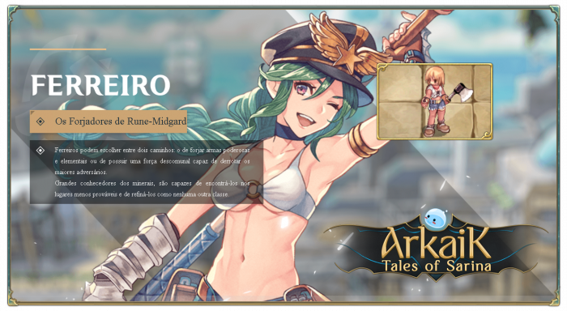

# \[Blacksmith]

<figure><figcaption></figcaption></figure>

* **Blacksmiths** can choose between two paths: forging powerful elemental weapons or possessing overwhelming strength capable of defeating the greatest adversaries.
* As great connoisseurs of minerals, they can find them in the most unexpected places and refine them like no other class.


<mark style="color:red;">**Video Quest Blacksmith (English)**</mark>




## **Skills**

<table><thead><tr><th width="84">IMG</th><th width="122">Name	</th><th>Description</th></tr></thead><tbody><tr><td></td><td>Thor’s Hammer</td><td>Strikes the ground with a hammer, with a <strong>(SkillLevel*10+20)% chance</strong> to <strong>stun enemies</strong>, plus a <strong>5% chance</strong> to <strong>break players’ armor</strong>. Requires an <strong>axe</strong> to be equipped.</td></tr><tr><td></td><td>Concentrated Adrenaline</td><td>Increases attack speed by <strong>(SkillLevel*5)%</strong> when equipping any weapon. Party members who are not <strong>Blacksmiths</strong> receive only <strong>25% of the bonus</strong>. Does not work with ranged weapons.</td></tr><tr><td></td><td>Pure Adrenaline</td><td>Increases <strong>attack speed</strong> of nearby party members by <strong>30%</strong> when equipping <strong>axes or maces</strong>.</td></tr><tr><td></td><td>Create Fundamental Stone</td><td>Allows forging <strong>10 elemental ores</strong> into <strong>1 raw stone</strong> with a <strong>10% success rate</strong>. Requires a <strong>Mini-Furnace</strong>.</td></tr><tr><td></td><td>Power Amplifier</td><td>Disables natural SP regeneration to deal <strong>maximum damage</strong> with physical attacks. While active, <strong>drains 1 SP per (SkillLevel) seconds</strong>. The effect is canceled if <strong>used again or if SP reaches zero</strong>.</td></tr><tr><td></td><td>Ironwork</td><td>Allows forging <strong>iron</strong> with a chance of success.</td></tr><tr><td></td><td>Violent Force</td><td>Increases <strong>weapon ATK</strong> of all party members by <strong>(SkillLevel</strong><em><strong>5)% for (SkillLevel</strong></em><strong>20) seconds</strong>. While active, <strong>each attack has a 0.1% chance to break the weapon</strong>.</td></tr><tr><td></td><td>Perfect Handling</td><td>Removes <strong>weapon size penalties</strong> for all party members for <strong>(SkillLevel*5) seconds</strong>.</td></tr><tr><td></td><td>Restoration</td><td>Repairs a <strong>broken equipment</strong> from the target’s inventory and restores its durability. Requires <strong>1 Steel</strong> for armor and shields. <strong>Material requirements by level:</strong> - Level 1: <strong>1x Iron Ore</strong> - Level 2: <strong>1x Iron</strong> - Level 3: <strong>1x Steel</strong> - Level 4: <strong>1x Oridecon Ore</strong></td></tr><tr><td></td><td>Weapon Mastery</td><td>Improves forging success rate by <strong>(SkillLevel*10)%</strong>, <strong>accuracy by (SkillLevel*20)%</strong>, and <strong>ATK by (SkillLevel*2)</strong>.</td></tr><tr><td></td><td>Firm Grip</td><td>Grants <strong>+1 STR</strong> and <strong>+4 ATK</strong>. Increases the duration of <strong>Pure Adrenaline, Violent Force, and Perfect Handling</strong> by <strong>10%</strong>.</td></tr><tr><td></td><td>Fire Resistance</td><td>Adapts to the heat of labor, providing <strong>(SkillLevel)% resistance to the Neutral property</strong> and <strong>(SkillLevel*4)% resistance to the Fire property</strong>.</td></tr><tr><td></td><td>Ore Discovery</td><td>Adds a <strong>0.1% chance</strong> to drop ores when defeating monsters.</td></tr><tr><td></td><td>Mining</td><td>Allows mining for ores in the fields. Using this skill shows your <strong>mining level and current mining experience</strong>.</td></tr><tr><td></td><td>Drill Mining</td><td>Allows crafting a <strong>mining drill</strong> in exchange for <strong>2 Steel</strong>, with a <strong>(SkillLevel*10)% success rate</strong>.</td></tr><tr><td></td><td>Tengen Drill Mining</td><td>When using <strong>Gurren Drill</strong>, there is a <strong>(SkillLevel*2)% chance</strong> to create <strong>3 drills at once instead of one</strong>.</td></tr><tr><td></td><td>Minagan Mining</td><td>Reveals the <strong>location of up to (SkillLevel*5) mines</strong> on the minimap.</td></tr><tr><td></td><td>Reinforced Drill Mining</td><td>Increases <strong>(SkillLevel*2)% resistance</strong> to drill damage during mining.</td></tr><tr><td></td><td>Mete-Drill Mining</td><td>Striking an ore for the first time or switching between ores <strong>deals (SkillLevel) extra damage</strong>.</td></tr><tr><td></td><td>Bey-Drill Mining</td><td>Reduces the <strong>waiting time to mine a deposit by (SkillLevel*5)%</strong>.</td></tr><tr><td></td><td>Poké-Drill Mining</td><td>Increases the <strong>number of drills</strong> that can be stored in the inventory by <strong>(SkillLevel)</strong>.</td></tr><tr><td></td><td>Mine Shield Drill Mining</td><td>Reduces <strong>(SkillLevel*2)% of the damage taken from mining accidents</strong>, including those caused by the <strong>Hue Mine skill</strong>.</td></tr><tr><td></td><td>Explosive Mine Mining</td><td>When depleting a mine, there is a <strong>(SkillLevel*10)% chance</strong> to obtain an <strong>extra item depending on the mine type</strong>.</td></tr><tr><td></td><td>It Was Never Luck</td><td>Consumes <strong>1 Enriched Oridecon</strong> to <strong>reroll random properties of an equipment in the inventory</strong> and <strong>remove its gems</strong>. - The equipment <strong>loses 1 to 2 potential points</strong>. - If <strong>potential reaches 0, the item is permanently destroyed along with its gems</strong>. - If the player is in the <strong>Blacksmith ranking</strong> (<code>/bsrank NOT MINING RANK</code>), only <strong>1 potential point</strong> is consumed.</td></tr><tr><td></td><td>Repair Scroll</td><td>Allows crafting a <strong>Repair Scroll</strong> by consuming a <strong>Worn-Out Scroll</strong>.</td></tr><tr><td></td><td>Refinement Scroll</td><td>Allows opening the <strong>scroll crafting menu</strong> for refinement scrolls.</td></tr></tbody></table>



## Masteries

<table><thead><tr><th width="84">IMG</th><th width="117">Name</th><th width="384">Description</th><th>Level</th></tr></thead><tbody><tr><td></td><td>Are You Mjolnir?</td><td>At max level, increases the <strong>area of effect of Thor’s Hammer</strong> by <strong>3 cells</strong>, reaching a total area of <strong>8x8 cells</strong>.</td><td>100</td></tr><tr><td></td><td>Thorn Hammer</td><td>Allows <strong>Thor’s Hammer</strong> to deal <strong>damage equal to (MasteryLevel*3)%</strong>, equivalent to <strong>3% ATK per mastery level</strong>, in a <strong>5x5 area around the character</strong>. However, <strong>reduces the Stun chance to 30%</strong>.</td><td>150</td></tr><tr><td></td><td>Materialist</td><td>At max mastery level, <strong>your equipment cannot be forcibly removed</strong>.</td><td>100</td></tr></tbody></table>


