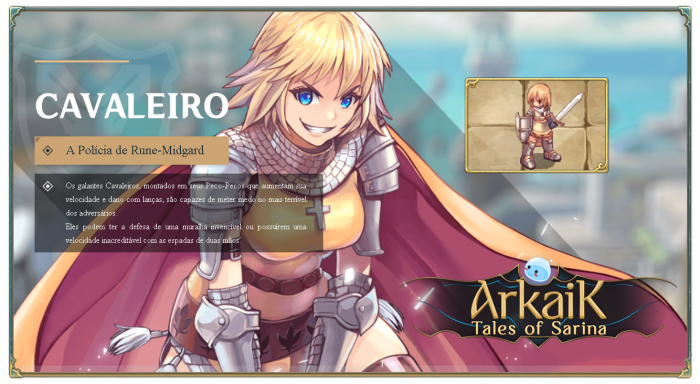

# \[Knight]

<figure><figcaption></figcaption></figure>

* The **gallant Knights**, mounted on their **Peco-Pecos**, which increase their speed and spear damage, are capable of striking fear into even the most formidable opponents.
* They can either have the **defense of an unbreakable wall** or wield **unbelievable speed** with their mighty **two-handed swords**.


<mark style="color:red;">**Video Quest Knight (English)**</mark>




## **Skills**

<table><thead><tr><th width="84">IMG</th><th width="136">Name</th><th>Description</th></tr></thead><tbody><tr><td></td><td>Spear Mastery</td><td>Increases ATK when equipping spears by <strong>{SkillLevel*4}</strong> without a mount and <strong>{SkillLevel*5}</strong> when mounted.</td></tr><tr><td></td><td>Pierce</td><td>While using a spear, precisely strikes an opponent, dealing <strong>{SkillLevel*10+100}%</strong> melee physical damage. A single attack can be repeated up to <strong>3 times</strong> depending on the target's size. During the attack, the user gains <strong>{SkillLevel*5}%</strong> accuracy.</td></tr><tr><td></td><td>Brandish Spear</td><td>While mounted, uses the spear to deal ranged physical damage to a target and nearby opponents, also pushing them back. The damage depends on the distance between the target and the user.</td></tr><tr><td></td><td>Spear Stab</td><td>Uses a spear to deal <strong>{SkillLevel*60}%</strong> ranged physical damage to the target and opponents in a straight line, pushing them back. <strong>20%</strong> of your STR points affect this skill's damage. The skill deals <strong>double damage</strong> to monsters with more than <strong>90% max HP</strong>.</td></tr><tr><td></td><td>Spear Boomerang</td><td>Throws a spear at the target, dealing <strong>{SkillLevel*50}% melee physical damage</strong>. The skill's range is <strong>{SkillLevel+2}</strong> cells. <strong>20%</strong> of your DEX points and <strong>10%</strong> of your STR points affect this skill's damage.</td></tr><tr><td></td><td>Two-Handed Quickening</td><td>Increases attack speed by <strong>30%</strong> when equipping two-handed swords for <strong>{SkillLevel*30}</strong> seconds.</td></tr><tr><td></td><td>Counter Attack</td><td>Becomes immobile for <strong>{SkillLevel*0.4}</strong> seconds, countering melee physical attacks. Counterattacks are always critical hits. This skill <strong>never misses</strong>.</td></tr><tr><td></td><td>Tyr's Impact</td><td>Deals <strong>{SkillLevel*40+100}%</strong> melee physical damage to the target and nearby opponents, pushing them back. Enemies that collide with walls take <strong>triple damage</strong> if you're using a spear. The skill cannot be interrupted, but it <strong>is not blockable</strong>.</td></tr><tr><td></td><td>Call Peco-Peco</td><td>Consumes <strong>Monster Feed</strong> to summon your <strong>Peco-Peco</strong>. Use the skill again to dismount. While mounted, movement speed and weight capacity increase (<strong>+1000</strong>). Spear users ignore size penalties against medium monsters. While mounted, <strong>attack speed is halved</strong>.</td></tr><tr><td></td><td>Mounted Mastery</td><td>Recovers <strong>{SkillLevel*10+50}%</strong> of attack speed lost when using a mount.</td></tr><tr><td></td><td>Parry</td><td>Adds <strong>{SkillLevel*3+20}%</strong> chance to block an enemy's attack when using a two-handed sword.</td></tr><tr><td></td><td>Summon Royal Guard</td><td>Increases the <strong>leader's</strong> damage by <strong>{SkillLevel}%</strong> while in the same map. The maximum bonus a <strong>leader</strong> can receive is <strong>30%</strong>. This skill only works in parties with at least <strong>2 members</strong>, and the self-applied bonus does not count.</td></tr><tr><td></td><td>Offensive Advance</td><td>Rushes toward the target to deal ranged physical damage. The <strong>greater the distance</strong> between the user and the target, the <strong>higher the damage</strong> and <strong>cast time</strong>, which <strong>cannot be interrupted</strong>.</td></tr></tbody></table>



## Masteries

<table><thead><tr><th width="84">IMG</th><th width="124">Name</th><th width="389">Description</th><th>Level</th></tr></thead><tbody><tr><td></td><td>Walking Stick Kid</td><td>At max mastery level, while using a <strong>Spear</strong>, your attack range increases by <strong>4</strong> and basic attacks are considered <strong>ranged</strong>. However, basic attacks <strong>consume 1 SP</strong>.</td><td>100</td></tr><tr><td></td><td>Villain Hunter</td><td><strong>+{MasteryLevel}%</strong> damage dealt and received against <strong>Brutes</strong> and <strong>Evolutions</strong>.</td><td>20</td></tr><tr><td></td><td>I Want You Close</td><td>At max mastery level, the <strong>Brandish Spear</strong> skill no longer pushes back enemies.</td><td>50</td></tr><tr><td></td><td>I Think I Hit the Heart</td><td>Adds <strong>{MasteryLevel*3}%</strong> chance for <strong>Spear Stab</strong> to deal <strong>4% of the target’s current HP</strong> as bonus damage. Only works on <strong>epic monsters</strong> with <strong>more than 91% HP</strong>.</td><td>60</td></tr><tr><td></td><td>AThis Skill Makes No Sense</td><td>Increases <strong>Spear Boomerang</strong> damage by <strong>{MasteryLevel*3}%</strong>.</td><td>60</td></tr><tr><td></td><td>I Can Also Use One-Handed</td><td>At max mastery level, the skill <strong>Two-Handed Quickening</strong> can also be used with <strong>one-handed swords</strong>.</td><td>90</td></tr><tr><td></td><td>Let Me Spam</td><td>Defeating an enemy grants a <strong>{MasteryLevel*3}%</strong> chance to <strong>reset</strong> the cooldown of <strong>Tyr’s Impact</strong>.</td><td>100</td></tr><tr><td></td><td>I Am Speed</td><td><strong>+{MasteryLevel}%</strong> movement speed while mounted.</td><td>70</td></tr><tr><td></td><td>Unstoppable</td><td>At max level, <strong>Offensive Advance</strong> removes <strong>frozen status</strong>.</td><td>100</td></tr><tr><td></td><td>I Can Also Use a Sword</td><td>At max level, allows using the skill <strong>Pierce</strong> with <strong>two-handed swords</strong>.</td><td>100</td></tr><tr><td></td><td>Piercing</td><td>Increases <strong>Spear Stab</strong> damage by <strong>{MasteryLevel*2}%</strong>.</td><td>100</td></tr><tr><td>
<figure><figcaption></figcaption></figure>
</td><td>Piercing</td><td>At max mastery level, the skill {Bowling Bash} can deal a critical hit.</td><td>180</td></tr></tbody></table>


