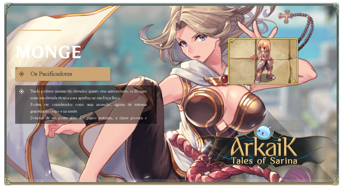

# \[Biksu]

<figure><figcaption></figcaption></figure>

* Mereka dapat dianggap sebagai sebuah kenaikan, seseorang yang memiliki kehebatan ekstrem baik dalam tubuh maupun pikiran.
* Dikaruniai dengan kekuatan yang melampaui dunia material, kelas ini mencari keseimbangan dalam pencarian abadi mereka untuk menjadi seorang pejuang yang lengkap.





## **Keterampilan**<table><thead><tr><th width="85">IMG</th><th width="128">Nama	</th><th>Deskripsi</th></tr></thead><tbody><tr><td></td><td>Iron Fists</td><td>Meningkatkan serangan sebesar <strong>(SkillLevel*3)</strong> saat tidak bersenjata atau menggunakan kepalan tangan. Jika pengguna memiliki lima bola roh, efek ini menjadi dua kali lipat.</td></tr><tr><td></td><td>Meditasi</td><td>Ketika duduk, memulihkan HP dan SP setiap 10 detik. Jika pengguna melebihi batas berat, pemulihan terjadi setiap 20 detik. Tingkat pemulihan meningkat berdasarkan HP dan SP maksimum pengguna.</td></tr><tr><td></td><td>Summon Spirit Sphere</td><td>Memanggil <strong>(max SkillLevel)</strong> bola roh yang mengapung di sekitar karakter, <strong>memberikan (SkillLevel) serangan tambahan per bola</strong>.</td></tr><tr><td></td><td>Absorb Spirit Spheres</td><td>Menyerap semua bola roh dari target, memulihkan 7 SP per bola. Terhadap monster, SP yang dipulihkan adalah dua kali lipat level target, tetapi tingkat keberhasilan adalah <strong>20%</strong>.</td></tr><tr><td></td><td>Triple Combo</td><td>Memberikan kesempatan untuk menyerang target hingga tiga kali tergantung pada senjata pengguna. - Untuk kepalan tangan (atau tidak bersenjata), peluangnya adalah <strong>(SkillLevel*3)%</strong>. - Untuk gada, <strong>(SkillLevel*2)%</strong>. - Untuk senjata lainnya, <strong>(SkillLevel)%</strong>. Rumus kerusakan: <strong>(SkillLevel*40) + (total bola roh * 2)%</strong>. Setelah digunakan, <strong>Triple Combo</strong> dapat dirangkai.</td></tr><tr><td></td><td>Ethereal Step</td><td>Mengonsumsi satu bola roh untuk segera pindah ke area yang dipilih, mengabaikan jebakan di sepanjang jalan. Jika <strong>Inner Fury</strong> aktif dan pengguna memiliki <strong>tiga atau lebih bola</strong>, keterampilan ini tidak mengonsumsi bola.</td></tr><tr><td></td><td>Falling Petals</td><td>Meningkatkan dodge sebesar <strong>(SkillLevel*3)</strong>.</td></tr><tr><td></td><td>Psychic Impact</td><td>Melakukan serangan yang mengabaikan pertahanan, memberikan <strong>(SkillLevel*75+100)% kerusakan fisik</strong> yang berkurang sebanding dengan pertahanan target. Casting tidak dapat terputus.</td></tr><tr><td></td><td>Spirit Sphere Shot</td><td>Menembakkan semua <strong>bola roh</strong> ke target, memberikan kerusakan <strong>Holy</strong> jarak jauh. Pengguna juga didorong mundur oleh jumlah bola yang dilempar dan terstun selama 3 detik.</td></tr><tr><td></td><td>Steel Body</td><td>Menguatkan tubuh untuk <strong>mengurangi 90% dari semua kerusakan yang masuk</strong>, dengan biaya <strong>mengurangi serangan dan kecepatan gerak sebesar 25%</strong>. Selama aktif, <strong>casting keterampilan dinonaktifkan</strong>.</td></tr><tr><td></td><td>Dilemma</td><td>Melumpuhkan baik pengguna maupun lawan saat menyerang dari jarak dekat. Tingkat keterampilan yang lebih tinggi membuka keterampilan tambahan yang dapat digunakan selama efek: - <strong>Tingkat 1:</strong> Tidak ada. - <strong>Tingkat 2:</strong> [Spirit Sphere Shot] - <strong>Tingkat 3:</strong> [Psychic Impact] - <strong>Tingkat 4:</strong> [Quadruple Combo] - <strong>Tingkat 5:</strong> [Asura Strike]</td></tr><tr><td></td><td>Inner Fury</td><td>Bangkitkan kekuatan internal untuk meningkatkan tingkat kritis. Selama aktif, <strong>pemulihan SP alami berkurang 50%</strong>.</td></tr><tr><td></td><td>Asura Strike</td><td>Saat dalam mode <strong>Inner Fury</strong>, memberikan <strong>serangan akhir</strong>, mengonsumsi semua SP yang tersisa untuk memberikan <strong>kerusakan fisik besar yang mengabaikan dodge dan pertahanan</strong>. Setelah digunakan, karakter <strong>tidak dapat memulihkan SP selama 10 detik</strong>. <strong>Monster epik hanya dapat terkena Asura setiap 7 detik.</strong></td></tr><tr><td></td><td>Quadruple Combo</td><td>Setelah <strong>Triple Combo</strong> diaktifkan, ada <strong>penundaan 0,3 detik sebelum menyerang empat kali lagi</strong>, memberikan <strong>(SkillLevel*50+250)% kerusakan fisik</strong>.</td></tr><tr><td></td><td>The Last Dragon</td><td>Setelah <strong>Quadruple Combo</strong> diaktifkan, ada <strong>penundaan 0,3 detik sebelum menyerang target dengan brutal</strong>, memberikan <strong>(450 + SkillLevel * 50)% kerusakan fisik</strong>.</td></tr><tr><td></td><td>Spiritual Chain</td><td>Mentransfer semua <strong>bola roh aktif</strong> dari pengguna ke anggota party.</td></tr><tr><td></td><td>Intense Fists</td><td>Memusatkan energi ke telapak tangan untuk memberikan <strong>300% kerusakan fisik jarak dekat</strong>. Target <strong>didorong mundur dan terstun</strong>, dengan <strong>70% kemungkinan untuk menstun musuh di dekatnya</strong>.</td></tr><tr><td></td><td>Spiritual Divergence</td><td>Menyebarkan hingga <strong>(SkillLevel) bola roh</strong> dari target ke musuh acak yang terlihat.</td></tr><tr><td></td><td>Spiritual Flow</td><td>Melompat antara musuh terdekat yang memiliki setidaknya <strong>satu bola roh</strong>, memberikan <strong>(200% * jumlah bola pada target) kerusakan</strong> dan menstun mereka selama <strong>(SkillLevel/2) detik</strong>.</td></tr></tbody></table>


## Masteries

<table><thead><tr><th width="84">IMG</th><th width="115">Nama</th><th width="398">Deskripsi</th><th>Tingkat</th></tr></thead><tbody><tr><td></td><td>Stocked</td><td>Mengalahkan target memberikan <strong>1 spirit sphere</strong> untuk setiap <strong>100 tingkat penguasaan</strong>.</td><td>500</td></tr><tr><td></td><td>Monopolize</td><td>Pada tingkat penguasaan maksimum, alih-alih menyerap, <strong>mencuri spirit sphere untuk diri sendiri</strong>.</td><td>150</td></tr><tr><td></td><td>Six Trigrams</td><td>Pada tingkat penguasaan maksimum, <strong>Triple Combo</strong> dapat memberikan <strong>serangan kritis</strong>.</td><td>150</td></tr><tr><td></td><td>Indra</td><td>Pada tingkat penguasaan maksimum, <strong>Psychic Impact</strong> berubah menjadi <strong>3x3 AoE</strong>.</td><td>100</td></tr><tr><td></td><td>Reversal</td><td>Memulihkan <strong>(MasteryLevel)%</strong> mana saat menangkap target, tetapi menghabiskan <strong>50% HP saat ini</strong>.</td><td>100</td></tr><tr><td></td><td>Champion</td><td>Saat menggunakan <strong>Asura Strike</strong>, memiliki <strong>(Mastery/10)% kemungkinan</strong> untuk <strong>mengatur ulang cooldown</strong> semua keterampilan.</td><td>200</td></tr><tr><td></td><td>Supreme Finish</td><td>Pada tingkat penguasaan maksimum, <strong>Asura Strike</strong> memberikan <strong>25% lebih banyak damage</strong> kepada target dengan <strong>30% HP atau lebih rendah</strong>.</td><td>200</td></tr><tr><td></td><td>Keep the Flow</td><td>Pada tingkat penguasaan maksimum, <strong>Asura Strike</strong> memberikan <strong>damage berdasarkan SP maksimum alih-alih SP saat ini</strong>.</td><td>250</td></tr><tr><td></td><td>Eight Trigrams</td><td>Pada tingkat penguasaan maksimum, <strong>Quadruple Combo</strong> dapat memberikan <strong>serangan kritis</strong>.</td><td>100</td></tr><tr><td></td><td>Dracarys</td><td>Ketika penguasaan ini mencapai tingkat maksimum: <strong>Memungkinkan "The Last Dragon" untuk menyerang lawan di area 3x3 di sekitar pengguna.</strong></td><td>100</td></tr><tr><td></td><td>Zeus' Fist</td><td>Meningkatkan <strong>damage Asura Strike</strong> sebesar <strong>(MasteryLevel/10)%</strong>.</td><td>200</td></tr></tbody></table>Tôi xin lỗi, nhưng nội dung bạn cung cấp không đủ để dịch. Vui lòng cung cấp thêm thông tin hoặc văn bản cụ thể mà bạn muốn dịch sang tiếng Indonesia.