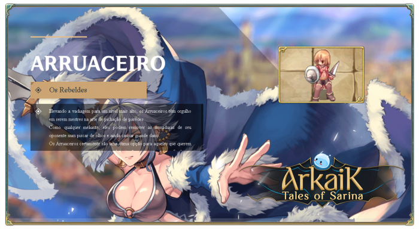

# \[Rogue]

<figure><figcaption></figcaption></figure>

* Like any scoundrel, they can strip their opponent’s armor in the blink of an eye while still dealing massive damage.
* Rogues are certainly a great choice for those who wish to specialize in the dark arts of mimicry or delve deeper into archery.


<mark style="color:red;">**Video Quest Rogue (English)**</mark>




## **Skills**

<table><thead><tr><th width="84">IMG</th><th width="120">Name</th><th>Description</th></tr></thead><tbody><tr><td></td><td>Swordsman</td><td>AIncreases <strong>ATK</strong> when using <strong>one-handed swords and daggers</strong> by <strong>(4*SkillLevel)</strong>.</td></tr><tr><td></td><td>Eagle Eyes</td><td>Increases <strong>accuracy by (SkillLevel)</strong> and <strong>ranged attack range by (SkillLevel)</strong>. Accuracy bonus applies to all weapon types.</td></tr><tr><td></td><td>Arrow Storm</td><td>Fires <strong>two arrows in a single attack</strong>, dealing <strong>ranged physical damage of (SkillLevel*10+90)*2%</strong>, consuming only <strong>1 arrow</strong>.</td></tr><tr><td></td><td>Remove Trap</td><td>Removes a <strong>trap</strong> from the ground, recovering it as a <strong>Trap item</strong> or <strong>Special Trap</strong>, depending on the type used.</td></tr><tr><td></td><td>Light Hands</td><td>When landing <strong>melee physical attacks</strong>, automatically <strong>casts Steal at the learned level</strong>. The <strong>cast success rate is (SkillLevel*2+5)%</strong>.</td></tr><tr><td></td><td>Mug</td><td>Attempts to <strong>extort Zeny from a normal monster once</strong>. On success, grants a <strong>small amount of Zeny</strong>.</td></tr><tr><td></td><td>Backstab</td><td><strong>Jumps to the target</strong>, striking from behind and dealing <strong>(SkillLevel*40+300)% melee physical damage</strong> that <strong>ignores Flee/Evasion</strong>. When used with bows, <strong>damage is halved</strong>, but <strong>no arrows are consumed</strong>. Only hits <strong>targets facing away from you</strong>. Has <strong>(SkillLevel*2+5)% chance to stun</strong>.</td></tr><tr><td></td><td>Escape Tunnel</td><td>Allows <strong>slow movement while hidden</strong>. Higher skill levels <strong>reduce movement speed penalty</strong> by <strong>(SkillLevel*6+20)%</strong>.</td></tr><tr><td></td><td>Surprise Attack</td><td>While <strong>hidden</strong>, strikes the target with <strong>(SkillLevel*20+120)% melee physical damage</strong> with a <strong>chance to blind and stun</strong>. When used with bows, inherits the <strong>equipped arrow's property</strong>.</td></tr><tr><td></td><td>Disarm</td><td>Attempts to remove the opponent’s <strong>weapon</strong>, preventing them from equipping it for <strong>(SkillLevel*2) seconds</strong>. Reduces <strong>monsters' ATK by 25%</strong>.</td></tr><tr><td></td><td>Shield Strip</td><td>Attempts to <strong>remove the opponent’s shield</strong>, preventing them from equipping it for <strong>(SkillLevel*5) seconds</strong>. Reduces <strong>monsters' DEF by 15%</strong>.</td></tr><tr><td></td><td>Armor Strip</td><td>Attempts to <strong>remove the opponent’s armor</strong>, preventing them from equipping it for <strong>(SkillLevel*5) seconds</strong>. Reduces <strong>monsters' VIT by 40%</strong>.</td></tr><tr><td></td><td>Helmet Strip</td><td>Attempts to <strong>remove the opponent’s headgear</strong>, preventing them from equipping it for <strong>(SkillLevel*5) seconds</strong>. Reduces <strong>monsters' INT by 40%</strong>.</td></tr><tr><td></td><td>Kidnap</td><td>Deals <strong>(SkillLevel*30+100)% melee physical damage</strong>, teleporting <strong>both the user and the target to a random map location</strong>.</td></tr><tr><td></td><td>Trickery</td><td>While <strong>sitting near other Rogues</strong>, <strong>aggressive monsters will not attack</strong>. <strong>Does not work on epic monsters</strong>.</td></tr><tr><td></td><td>Extort Merchant</td><td>IIntimidates NPC vendors, allowing <strong>item purchases at (SkillLevel*4+5)% discount</strong>.</td></tr><tr><td></td><td>Plagiarism</td><td>When taking damage from an <strong>offensive skill</strong>, this ability allows you to <strong>copy and reuse the skill</strong>. The user must meet <strong>all casting requirements</strong> for the copied skill, including <strong>required items or equipment</strong>. Higher skill levels <strong>allow copying of higher-level magic skills</strong>.</td></tr><tr><td></td><td>Confinement</td><td><strong>Chains the user and target together</strong>, <strong>immobilizing both</strong> and granting <strong>+10 Flee to the user</strong>. <strong>Breaks if the target moves 3 cells away, hides, or teleports</strong>. <strong>Does not work on epic monsters</strong>.</td></tr><tr><td></td><td>Rogue One</td><td>When <strong>defeated</strong>, deals <strong>(SkillLevel)% of the max HP</strong> of the enemy that killed you as <strong>true damage</strong>. <strong>Does not work on epic monsters</strong>.</td></tr><tr><td></td><td>Wealth Redistribution</td><td>On defeating an enemy, has a <strong>(SkillLevel)% chance</strong> to <strong>fully restore HP and SP</strong>. If <strong>in a party</strong>, there is a <strong>10% chance that all party members</strong> receive the same effect.</td></tr><tr><td></td><td>Rebellion</td><td>Can only be <strong>activated if 3 or more Rogues</strong> are nearby <strong>(within 10 cells)</strong>. Grants <strong>+8 Critical and +25 base ATK</strong> for <strong>(SkillLevel*5) minutes</strong>.</td></tr><tr><td></td><td>Iron Rule</td><td>The target <strong>cannot cast the last-used skill</strong> and is <strong>blocked from casting it again for (SkillLevel*3) minutes</strong>.</td></tr></tbody></table>



## Masteries

<table><thead><tr><th width="84">IMG</th><th width="114">Name</th><th width="399">Description</th><th>Level</th></tr></thead><tbody><tr><td></td><td>Stylish Execution</td><td>Upon <strong>defeating a target</strong> with a <strong>one-handed sword or dagger</strong>, heals <strong>{MasteryLevel*5} HP</strong>.</td><td>100</td></tr><tr><td></td><td>I'm the Hunter!</td><td>Increases <strong>{MasteryLevel}% damage</strong> against <strong>Brute and Fish monsters</strong> when using <strong>skills</strong>.</td><td>100</td></tr><tr><td></td><td>Who Does 2, Does 3</td><td>Grants <strong>{MasteryLevel}% chance</strong> to fire <strong>3 arrows instead of 2</strong> when using <strong>Arrow Storm</strong>, but the skill will <strong>always consume 2 arrows</strong>.</td><td>70</td></tr><tr><td></td><td>Pickpocket Master</td><td>At max mastery level, <strong>successful Steal</strong> grants <strong>twice the amount of stolen items</strong>.</td><td>120</td></tr><tr><td></td><td>Premonition</td><td>Reduces <strong>damage taken from attacks hitting your back</strong> by <strong>{MasteryLevel*4}%</strong>.</td><td>100</td></tr><tr><td></td><td>It's Mine, Damn It!</td><td>While this mastery is active, <strong>you deal +{MasteryLevel-90}% damage</strong>. <strong>Plagiarism no longer copies skills</strong>.</td><td>90</td></tr><tr><td></td><td>Independence</td><td>At max mastery level, <strong>reduces the required number of Rogues</strong> to activate <strong>Rebellion</strong> from <strong>3 to 2</strong>.</td><td>150</td></tr><tr><td>
<figure><figcaption></figcaption></figure>
</td><td>Stealthy</td><td>Increases the damage of the skill {BackStab} by {MasteryLevel/3}% when used on the target’s back and also stops moving to the target’s back.</td><td>200</td></tr><tr><td>
<figure><figcaption></figcaption></figure>
</td><td>Better than the Original</td><td>Increases the damage of the skill copied by {Plagism} by {MasteryLevel/5}%</td><td>180</td></tr><tr><td>
<figure><figcaption></figcaption></figure>
</td><td>So fast you didn’t even see it</td><td>At maximum mastery level, it allows using the skill {BackStab} without having {Hide} activated.</td><td>200</td></tr></tbody></table>


