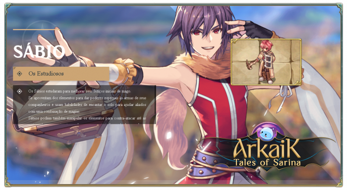

# \[Sage]

<figure><figcaption></figcaption></figure>

* They harness the elements to grant special powers to their allies' weapons and use abilities to enchant the ground, aiding their comrades with a combination of spells.
* Sages can also manipulate the elements to counter even the most powerful spells, making them an indispensable support in any group.


<mark style="color:red;">**Video Quest Sage (English)**</mark>




## **Skills**

<table><thead><tr><th width="84">IMG</th><th width="110">Name</th><th>Description</th></tr></thead><tbody><tr><td></td><td>Petrify</td><td>At the cost of a <strong>Red Gemstone</strong>, invokes a spell capable of <strong>inflicting petrification</strong> on the target with <strong>(20+4*SkillLevel)% chance of success</strong>. Using this skill on a target in the <strong>initial phase of petrification will cancel the effect</strong>.</td></tr><tr><td></td><td>Earth Fury</td><td>Controls the ground to <strong>raise (SkillLevel) spikes</strong> that <strong>individually deal 125% earth-property magic damage</strong> to enemies within the area.</td></tr><tr><td></td><td>Stone Column</td><td>Raises <strong>(SkillLevel) sharp spikes</strong> from the ground to hit a target. <strong>Each spike deals 100% earth-property magic damage</strong>.</td></tr><tr><td></td><td>Book Study</td><td>Increases <strong>attack speed</strong> by <strong>(SkillLevel*0.5)%</strong> and <strong>attack per (SkillLevel/3) when equipping books</strong>. <strong>Intelligence + (SkillLevel)</strong>.</td></tr><tr><td></td><td>Cancel Magic</td><td>While casting a spell, allows <strong>interrupting it without suffering after-cast delay</strong>, but <strong>immediately consumes (SkillLevel*10+10)% of mana</strong>.</td></tr><tr><td></td><td>Magic Mirror</td><td>Remains <strong>immobile for (SkillLevel*0.2+0.2) seconds to absorb a single-target magic spell cast on the user</strong>, ignoring its damage and <strong>preventing the caster from using the same skill for (SkillLevel*2) seconds</strong>.</td></tr><tr><td></td><td>Magic Break</td><td>Interrupts the <strong>target's casting</strong> and <strong>absorbs (SkillLevel*25-25)% of the mana consumed by the invoked spell</strong>. At max level, it also <strong>deals damage proportional to 2% of the target’s max HP, converting 1% of the total damage dealt into HP for the user</strong>.</td></tr><tr><td></td><td>Free Casting</td><td>Allows <strong>walking and physically attacking while casting spells</strong>. <strong>Movement speed is reduced</strong> and <strong>restores (SkillLevel*5+25)% of mana lost due to spell casting</strong>.</td></tr><tr><td></td><td>Arcane Will</td><td>There is a <strong>(SkillLevel*2+7)%</strong> chance to <strong>autocast</strong> the last offensive spell cast while physically attacking. Spells cast automatically will consume 66% more mana and will be invoked at level 3. Skills that can be <strong>re-cast</strong>: ➝ [Spiritual Attack] ➝ [Spirits of the Ancients] ➝ [Ice Lance] ➝ [Cold Burst] ➝ [Fire Ball] ➝ [Fire Lance] ➝ [Lightning] ➝ [Thunder Storm] ➝ [Earth Fury] ➝ [Stone Column]</td></tr><tr><td></td><td>Enchant with Fire</td><td>Attempts to enchant the target’s weapon with the fire property using scarlet blood. If it fails, the weapon will be unequipped. The enchantment success rate is <strong>(SkillLevel*10+60)%</strong>.</td></tr><tr><td></td><td>Enchant with Frost</td><td>Attempts to enchant the target’s weapon with the water property using a blue crystal. If it fails, the weapon will be unequipped. The enchantment success rate is <strong>(SkillLevel*10+60)%</strong>.</td></tr><tr><td></td><td>Enchant with Wind</td><td>Attempts to enchant the target’s weapon with the wind property using verdant life. If it fails, the weapon will be unequipped. The enchantment success rate is <strong>(SkillLevel*10+60)%</strong>.</td></tr><tr><td></td><td>Enchant with Earth</td><td>Attempts to enchant the target’s weapon with the earth property using verdant life. If it fails, the weapon will be unequipped. The enchantment success rate is <strong>(SkillLevel*10+60)%</strong>.</td></tr><tr><td></td><td>Giant Dragonology</td><td>By studying dragons, increases intelligence by <strong>(SkillLevel)</strong> and <strong>increases resistance by (SkillLevel*4)%</strong>, attack by <strong>(SkillLevel*4)%</strong>, and magic attack by <strong>(SkillLevel*2)%</strong> against the Dragon race.</td></tr><tr><td></td><td>Volcano</td><td>Simulates the lava of a volcano on the ground, increasing the physical and magical fire damage by <strong>(SkillLevel*5)%</strong> and <strong>increasing the attack of characters entering the area by (SkillLevel*10)</strong>.</td></tr><tr><td></td><td>Deluge</td><td>Simulates the ocean floor on the ground, increasing the physical and magical water damage by <strong>(SkillLevel*5)%</strong> and <strong>increasing the vitality of characters entering the area by (SkillLevel*5)</strong>.</td></tr><tr><td></td><td>Whirlwind</td><td>Simulates the force of wind on the ground, increasing the physical and magical wind damage by <strong>(SkillLevel*5)%</strong> and <strong>increasing the dodge rate of characters entering the area by (SkillLevel*3)</strong>.</td></tr><tr><td></td><td>Land Protector</td><td>Protects the terrain from certain skills, nullifying and preventing the casting of ground-based spells. Requires 1 yellow gem and 1 blue gem.</td></tr><tr><td></td><td>Disenchant</td><td>Consumes one yellow gem to attempt to remove both negative and positive effects from the target. The success rate is <strong>(SkillLevel*10+50)%</strong>.</td></tr><tr><td></td><td>Opponent Analysis</td><td>Consumes 5 yellow gems to analyze the structure of the next skill that will cause damage. Upon receiving that skill again within the next <strong>(SkillLevel)</strong> instances, the damage will be reduced by 80%. The skill is currently linked to <strong>(SkillAnalyze)</strong>.</td></tr><tr><td></td><td>Create Elemental Converter</td><td>Creates converters from materials found in nature, with a 100% success rate.</td></tr><tr><td></td><td>Elemental Change</td><td>Changes the monster’s property to neutral.</td></tr><tr><td></td><td>Chess Master</td><td>Int +(SkillLevel). Allows the evolution of chess-related skills. This skill increases the duration a chess piece remains in play by <strong>(SkillLevel+4)</strong> seconds. Allies see their pieces as white and professors as black. Enemies see them as black. Pieces activate their effects at 2-second intervals.</td></tr><tr><td></td><td>Chess: Pawn</td><td>Deals <strong>(SkillLevel*10+125)%</strong> magical damage (never misses) to the target and to cells in a 1x1 area around this piece.</td></tr><tr><td></td><td>Chess: Rook</td><td>Once summoned, prepares for 4 seconds before moving in the direction the caster was facing at the time of summoning. Moves <strong>(SkillLevel*3)</strong> cells, pushing the target <strong>(SkillLevel)</strong> cells away and having a <strong>(SkillLevel*2)%</strong> chance to summon a pawn piece at the target’s new location. Pushed targets that collide with an obstacle lose all positive buffs. Agility points influence this piece's movement speed.</td></tr><tr><td></td><td>Chess: Knight</td><td>Deals <strong>(SkillLevel*10+125)%</strong> damage in a 5x5 area.</td></tr><tr><td></td><td>Chess: Bishop</td><td>Each time you use this piece, you gain 1 bishop point. Summons 1 bishop piece for each accumulated bishop point that moves diagonally from the player's current position up to <strong>(SkillLevel)</strong> spaces or until it collides with a wall. Upon reaching 4 points, the points reset to zero. While the bishop moves, allies within a 2x2 cell radius receive <strong>(SkillLevel)%</strong> bonus damage on their next skill for 5 seconds, while enemies take half damage from the next skill used. When this skill is used with four bishop points, bishops move, attempting to connect two bishops in an X shape if possible. Agility points influence the movement speed of the bishops.</td></tr><tr><td></td><td>Chess: Queen</td><td>This skill can only be used after playing 500 pieces or more. All your pieces leave the board. The queen <strong>teleports</strong> and defeats up to <strong>(SkillLevel*2)</strong> monsters in her sight <strong>(does not work on epic monsters)</strong>.</td></tr><tr><td></td><td>Chess: King</td><td>Consumes all your mana to be played. Upon summoning the King, you enter <strong>wise mode</strong>, causing the next <strong>8 skills</strong> to reduce <strong>50% of the cooldown</strong> of all skills currently on cooldown.</td></tr></tbody></table>



## Masteries

<table><thead><tr><th width="84">IMG</th><th width="108">Name</th><th width="405">Description	</th><th>Level</th></tr></thead><tbody><tr><td></td><td>Quicksand</td><td>Reduces 30% of <strong>Earth Fury</strong> damage in exchange for a <strong>(0.2 * MasteryLevel)%</strong> chance to <strong>stun</strong> affected targets.</td><td>200</td></tr><tr><td></td><td>Elementary, Dear Watson</td><td>The skills <strong>[Fire Lance]</strong>, <strong>[Ice Lance]</strong>, <strong>[Lightning]</strong>, and <strong>[Earth Fury]</strong> deal <strong>(MasteryLevel/2)%</strong> more damage, but their mana cost doubles.</td><td>60</td></tr><tr><td></td><td>Book 1 - Water</td><td>At max level, the skill no longer requires an item.</td><td>50</td></tr><tr><td></td><td>Book 2 - Earth</td><td>At max level, the skill no longer requires an item.</td><td>50</td></tr><tr><td></td><td>Book 3 - Fire</td><td>At max level, the skill no longer requires an item.</td><td>50</td></tr><tr><td></td><td>Book 4 - Air</td><td>At max level, the skill no longer requires an item.</td><td>50</td></tr><tr><td></td><td>En Passant</td><td>At max mastery level, basic attacks grant a <strong>5% chance</strong> to summon a chess <strong>pawn</strong> piece.</td><td>150</td></tr><tr><td></td><td>Rook</td><td>At max mastery level, summoning a <strong>rook</strong> grants a <strong>1% chance</strong> to summon a <strong>King</strong>.</td><td>70</td></tr><tr><td></td><td>Fork</td><td>Increases the <strong>Knight</strong> piece's damage by <strong>(MasteryLevel/2)%</strong>.</td><td>140</td></tr><tr><td></td><td>Queen’s Gambit</td><td>At max mastery level, <strong>no mana</strong> is required to summon the <strong>Queen</strong>.</td><td>200</td></tr><tr><td></td><td>Checkmate</td><td>At max mastery level, summoning the <strong>King</strong> reduces the <strong>Queen’s cooldown by 50%</strong>.</td><td>200</td></tr><tr><td>
<figure><figcaption></figcaption></figure>
</td><td>Long Live the Council of Sages </td><td>At maximum mastery level, disables the skill's buffs and debuffs but increases its damage by 70%.</td><td>150</td></tr></tbody></table>


