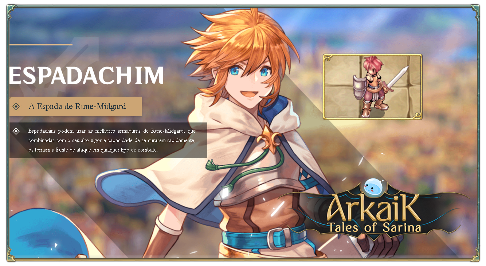

# \[Swordman]

<figure><figcaption></figcaption></figure>

* They are capable of wielding both spears and swords, whether one-handed or two-handed, and are always ready to defend the weak and strike back with great strength using their incredible battle skills.
* Upon reaching **job level 40**, they can evolve into **Knights** or **Crusaders**.


<mark style="color:red;">**Video Quest Swordman (English)**</mark>




## **Skills**

<table><thead><tr><th width="94">IMG</th><th width="166">Name</th><th>Description</th></tr></thead><tbody><tr><td></td><td>Swordsman</td><td>Increases ATK with one-handed swords and daggers by (4*SkillLevel).</td></tr><tr><td></td><td>Barbarian</td><td>Increases ATK with two-handed swords by (4*SkillLevel).</td></tr><tr><td></td><td>Swordsman’s Energy</td><td>While stationary, regenerates HP every 10 seconds. The regeneration rate increases according to the user's life. Also improves the healing effectiveness of HP recovery items by (10*SkillLevel)%. The effect is canceled if the user cannot naturally regenerate HP, for example, due to exceeding the weight limit. The regeneration time is reduced by 5 seconds when sitting.</td></tr><tr><td></td><td>Fatal Strike</td><td>Strikes the opponent with a single physical melee attack, dealing (100+30<em>SkillLevel)% ATK damage. Increasing the skill level improves the chances of hitting the target. The success rate is (5SkillLevel)%.</em> The skill is influenced by the character's attack animation. Increasing attack speed makes skill usage faster.</td></tr><tr><td></td><td>Taunt</td><td>Attempts to provoke the target to attract them. If successful, it reduces the target's DEF by (10-5<em>SkillLevel)% and **increases their ATK by (2+3</em>SkillLevel).** Passive monsters will become aggressive towards the user. The success rate is currently (50+3*SkillLevel)%. Against other players, it reduces their DEF attributes. Interrupts spell casting. Does not work on undead and MVPs. Frees allies from confusion.</td></tr><tr><td></td><td>Explosive Impact</td><td>Creates a massive explosion, dealing melee physical damage equal to (100+20<em>SkillLevel)% ATK and <strong>pushing enemies around the character back two cells.</strong> Accuracy of this skill is (10</em>SkillLevel)%. In the next 10 seconds, the user cannot dodge and will take (10*SkillLevel)% increased damage.</td></tr><tr><td></td><td>Vigor</td><td>Increases magic defense by (1*SkillLevel). Prevents your character from being unable to perform actions when receiving attacks. The effect duration is interrupted if the user receives 7 hits. In War of Emperium and Battle maps, it only increases magic defense.</td></tr><tr><td></td><td>Union</td><td>Increases physical attack by 1% for each party member.</td></tr><tr><td></td><td>Consecutive Strike</td><td>After defeating a target, adds (5*SkillLevel)% chance to cause stun on the next attack.</td></tr><tr><td></td><td>Mirror Sword</td><td>Adds (5*SkillLevel)% chance to reflect all received magic damage for 2 seconds. A sword must be equipped.</td></tr></tbody></table>



## Masteries

<table><thead><tr><th width="94">IMG</th><th width="166">Name</th><th width="336">Description</th><th>Level</th></tr></thead><tbody><tr><td></td><td>Stylish Finisher</td><td>Upon defeating a target with a one-handed sword or dagger, restores {MasteryLevel*5} HP.</td><td>100</td></tr><tr><td></td><td>Rough Finisher</td><td>When this mastery reaches the maximum level, upon defeating a target with a two-handed sword, the next basic attack deals double damage.</td><td>100</td></tr><tr><td></td><td>No Rest</td><td>The effects of your emblem increase by {MasteryLevel/2}%.</td><td>50</td></tr><tr><td></td><td>Stunning Strike</td><td>5% chance to deal -30% damage with (Fulminant Strike). Adds {MasteryLevel/2}% chance to cause stun when using (Fulminant Strike).</td><td>50</td></tr><tr><td></td><td>Fulminant Strike EX</td><td>+{MasteryLevel}% damage with Fulminant Strike. -{MasteryLevel}% damage with {Explosive Impact}.</td><td>50</td></tr><tr><td></td><td>Irritating</td><td>When this mastery reaches the maximum level, it makes the target of the Provoke skill no longer receive additional attack bonuses, having only reduced defense.</td><td>100</td></tr><tr><td></td><td>Explosive Strength</td><td>Increases {MasteryLevel*2}% damage of {Explosive Impact}.</td><td>30</td></tr><tr><td></td><td>Punching Bag</td><td>Receives 10 to 50 additional damage. Increases by {MasteryLevel/5} the number of hits required before interrupting the Vigor skill.</td><td>50</td></tr><tr><td></td><td>Revitalizing Presence</td><td>When this mastery reaches the maximum level, it is possible to cast the Vigor skill on other allies.</td><td>100</td></tr><tr><td></td><td>Survival Instinct</td><td>Reduces {MasteryLevel/2}% of received damage when at 10% HP or less.</td><td>60</td></tr></tbody></table>


