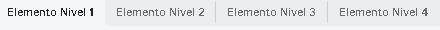
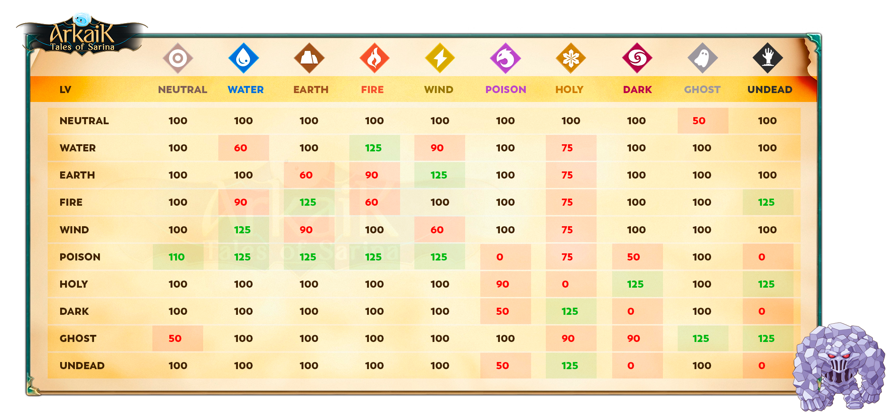
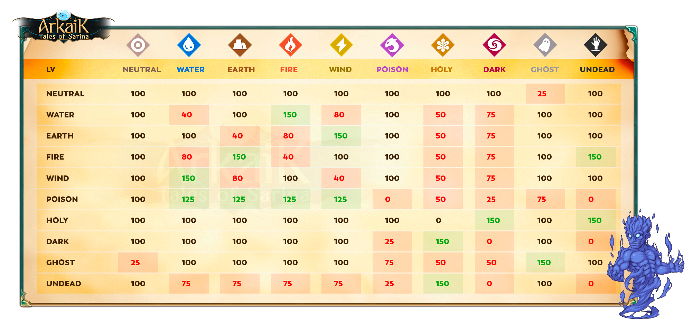
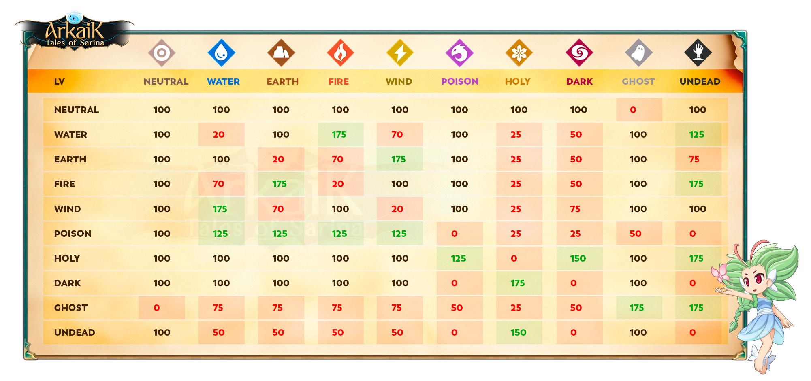
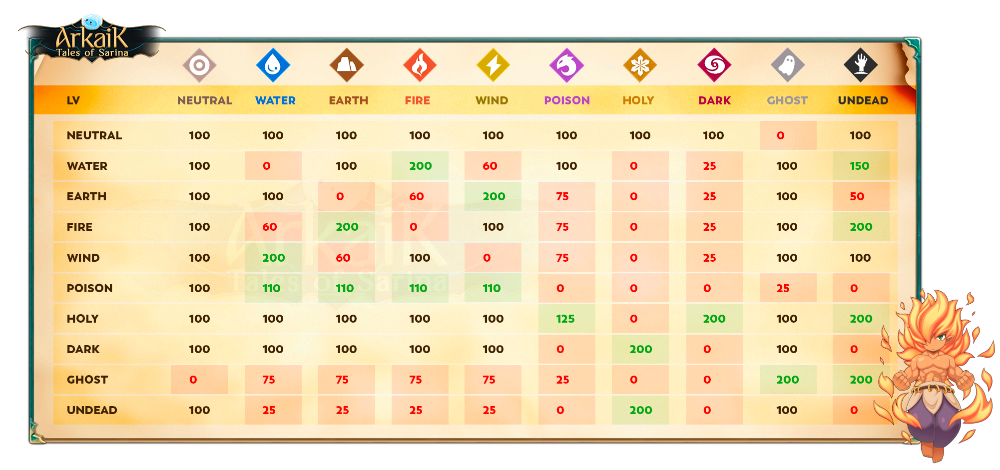

# 🔥 Panduan Elemen

## **Cara Menavigasi Tab Elemen**

<table><thead><tr><th width="156">Singkatan</th><th width="146"></th><th width="132"></th><th width="158"></th><th></th></tr></thead><tbody><tr><td><strong>NEU</strong> = Netral</td><td><strong>WAT</strong>= Air</td><td><strong>EAR</strong>= Tanah</td><td><strong>FIR</strong>= Api</td><td><strong>WIN</strong>= Angin</td></tr><tr><td><strong>POI</strong>= Racun</td><td><strong>HOL</strong>= Suci</td><td><strong>DAR</strong>= Gelap</td><td><strong>GOH</strong>= Hantu</td><td><strong>UND</strong>= Mayat Hidup</td></tr></tbody></table>

## Tabel Elemen&#x20;

<figure><figcaption>
<mark style="color:red;"><strong>Cara Menavigasi Tab Elemen</strong></mark>
</figcaption></figure>



## Tabel Tingkat Elemen 1* Semakin **rendah** nilainya, semakin **sedikit damage** yang kamu berikan. Semakin **tinggi** nilainya, semakin **banyak damage** yang kamu berikan.
* **Contoh:**
  * <mark style="color:red;">**0 = Kamu tidak memberikan damage.**</mark>
  * <mark style="color:green;">**125 = Kamu memberikan 25% lebih banyak damage.**</mark>

<figure><figcaption></figcaption></figure>



## Tabel Tingkat Elemen 2

* Semakin **rendah** nilainya, semakin **sedikit damage** yang kamu berikan. Semakin **tinggi** nilainya, semakin **banyak damage** yang kamu berikan.
* **Contoh:**
  * <mark style="color:red;">**0 = Kamu tidak memberikan damage.**</mark>
  * <mark style="color:green;">**150 = Kamu memberikan 50% lebih banyak damage.**</mark>

<figure><figcaption></figcaption></figure>



## Tabel Tingkat Elemen 3* Semakin **rendah** nilainya, semakin **sedikit damage** yang kamu lakukan. Semakin **tinggi** nilainya, semakin **banyak damage** yang kamu lakukan.
* **Contoh:**
  * <mark style="color:red;">**0 = Kamu tidak memberikan damage.**</mark>
  * <mark style="color:green;">**175 = Kamu memberikan 75% lebih banyak damage.**</mark>

<figure><figcaption></figcaption></figure>



## Tabel Tingkat Elemen 4

* Semakin **rendah** nilainya, semakin **sedikit damage** yang kamu lakukan. Semakin **tinggi** nilainya, semakin **banyak damage** yang kamu lakukan.
* **Contoh:**
  * <mark style="color:red;">**0 = Kamu tidak memberikan damage.**</mark>
  * <mark style="color:green;">**200 = Kamu memberikan 100% lebih banyak damage.**</mark>

<figure><figcaption></figcaption></figure>

