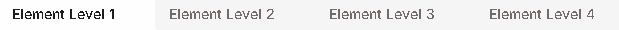

# 🔥 Element Guide

<figure><figcaption>
<mark style="color:red;"><strong>How to Navigate the Elements Tab</strong></mark>
</figcaption></figure>

## Element Table



### Element Level 1 Table

* The **lower** the value, the **less damage** you deal. The **higher** the value, the **more damage** you deal.
* **Example:**
  * <mark style="color:red;">**0 = You deal no damage.**</mark>
  * <mark style="color:green;">**125 = You deal 25% more damage.**</mark>

<figure><figcaption></figcaption></figure>



### Element Level 2 Table

* The **lower** the value, the **less damage** you deal. The **higher** the value, the **more damage** you deal.
* **Example:**
  * <mark style="color:red;">**0 = You deal no damage.**</mark>
  * <mark style="color:green;">**150 = You deal 50% more damage.**</mark>

<figure><figcaption></figcaption></figure>



### Element Level 3 Table

* The **lower** the value, the **less damage** you deal. The **higher** the value, the **more damage** you deal.
* **Example:**
  * <mark style="color:red;">**0 = You deal no damage.**</mark>
  * <mark style="color:green;">**175 = You deal 75% more damage.**</mark>

<figure><figcaption></figcaption></figure>



### Element Level 4 Table

* The **lower** the value, the **less damage** you deal. The **higher** the value, the **more damage** you deal.
* **Example:**
  * <mark style="color:red;">**0 = You deal no damage.**</mark>
  * <mark style="color:green;">**200 = You deal 100% more damage.**</mark>

<figure><figcaption></figcaption></figure>


