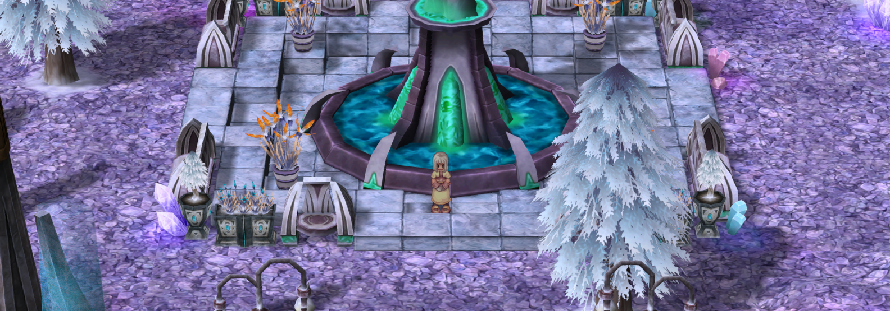

# 🚧 Item Crafting

**Crafting is a mechanic available to certain classes, allowing you to create items.**

* **Item creation is&#x20;**<mark style="color:red;">**available for specific classes**</mark>**&#x20;in the game.**
* **Each class has its own "way" of crafting items.**

## **Classes and Crafting**



* **Archers** can create various types of **arrows**, each with different **elemental** properties and status effects.
* To craft arrows, simply open **ALT+S** and select the **"Make Arrow"** skill.

<figure><figcaption>
<mark style="color:red;"><strong>Illustrative image of an "Archer"</strong></mark>
</figcaption></figure>

### Arrow

<table><thead><tr><th width="257">Item</th><th>Produced Quantity</th></tr></thead><tbody><tr><td> Jellopy</td><td>20</td></tr><tr><td> Tree Root</td><td>60</td></tr><tr><td> Solid Trunk</td><td>100</td></tr><tr><td> Trunk</td><td>200</td></tr><tr><td> Rigid Trunk</td><td>500</td></tr></tbody></table>

### **Iron Arrow**

<table><thead><tr><th width="213">Item</th><th>Produced Quantity</th></tr></thead><tbody><tr><td> Wolf Claw</td><td>10</td></tr><tr><td> Lantern</td><td>100</td></tr><tr><td> Iron Ore</td><td>170</td></tr><tr><td>Iron</td><td>500</td></tr></tbody></table>

### **Wind Arrow**

<table><thead><tr><th width="214">Item</th><th>Produced Quantity</th></tr></thead><tbody><tr><td> Harpie Feather</td><td>150</td></tr><tr><td> Breeze of Wind</td><td>400</td></tr><tr><td> Rough Wind</td><td>1500</td></tr></tbody></table>

### Oridecon Arrow

<table><thead><tr><th width="305">Item</th><th>Produced Quantity</th></tr></thead><tbody><tr><td> Oridecon Ore</td><td>250</td></tr><tr><td> Clock Tower Key</td><td>600</td></tr><tr><td> Oridecon</td><td>1500</td></tr></tbody></table>

### Steel Arrow

<table><thead><tr><th width="257">Item</th><th>Produced Quantity</th></tr></thead><tbody><tr><td> Steel</td><td>150</td></tr><tr><td> Elunium Ore</td><td>250</td></tr><tr><td> Elunium</td><td>1500</td></tr></tbody></table>

### Crystal Arrow

<table><thead><tr><th width="257">Item</th><th>Produced Quantity</th></tr></thead><tbody><tr><td> Gill</td><td>150</td></tr><tr><td> Blue Crystal</td><td>400</td></tr><tr><td> Mystic Frozen</td><td>1500</td></tr></tbody></table>

### Rusty Arrow

<table><thead><tr><th width="214">Item</th><th>Produced Quantity</th></tr></thead><tbody><tr><td> Bee Sting</td><td>30</td></tr><tr><td> Zenorc Fang</td><td>100</td></tr><tr><td> Old Pick</td><td>200</td></tr></tbody></table>

### Fire Arrow

<table><thead><tr><th width="256">Item</th><th>Produced Quantity</th></tr></thead><tbody><tr><td> Burning Heart</td><td>150</td></tr><tr><td> Scarlet Blood</td><td>400</td></tr><tr><td> CoraFlame Heart</td><td>1500</td></tr></tbody></table>

### Immaterial Arrow

<table><thead><tr><th width="259">Item</th><th>Produced Quantity</th></tr></thead><tbody><tr><td> Star Dust</td><td>50</td></tr><tr><td>Star Fragment</td><td>200</td></tr><tr><td> Emperium</td><td>500</td></tr></tbody></table>

### Stone Arrow

<table><thead><tr><th width="261">Item</th><th>Produced Quantity</th></tr></thead><tbody><tr><td> Goat Horn</td><td>450</td></tr><tr><td> Green Live</td><td>400</td></tr><tr><td> Great Nature</td><td>1500</td></tr></tbody></table>

### Silver Arrow

<table><thead><tr><th width="263">Item</th><th>Produced Quantity</th></tr></thead><tbody><tr><td> Holy Water</td><td>50</td></tr><tr><td> Shaman Staff</td><td>300</td></tr></tbody></table>

### Sacred Arrow

<table><thead><tr><th width="260">Item</th><th>Produced Quantity</th></tr></thead><tbody><tr><td> Rosary</td><td>300</td></tr><tr><td> Yggdrasil Fruit</td><td>900</td></tr></tbody></table>

### Shadow Arrow

<table><thead><tr><th width="264">Item</th><th>Produced Quantity</th></tr></thead><tbody><tr><td> Bat Tooth</td><td>50</td></tr><tr><td> Dullahan Armor</td><td>150</td></tr><tr><td> Loki's Whispers</td><td>900</td></tr></tbody></table>

### Sharp Arrow

<table><thead><tr><th width="269">Item</th><th>Produced Quantity</th></tr></thead><tbody><tr><td> Sharp Leaf</td><td>150</td></tr><tr><td>Insect Leg</td><td>500</td></tr></tbody></table>

### Cursed Arrow

<table><thead><tr><th width="268">Item</th><th>Produced Quantity</th></tr></thead><tbody><tr><td> Amulet</td><td>250</td></tr><tr><td> Cursed Ruby</td><td>600</td></tr></tbody></table>

### Luminous Arrow

<table><thead><tr><th width="268">Item</th><th>Produced Quantity</th></tr></thead><tbody><tr><td> Tear Gas</td><td>100</td></tr><tr><td> Blind Man's Folly</td><td>1500</td></tr></tbody></table>

### Freezing Arrow

<table><thead><tr><th width="269">Item</th><th>Produced Quantity</th></tr></thead><tbody><tr><td> Blue Crystal</td><td>100</td></tr><tr><td> Mystic Frozen</td><td>300</td></tr></tbody></table>

### Silencing Arrow

<table><thead><tr><th width="269">Item</th><th>Produced Quantity</th></tr></thead><tbody><tr><td> Stone Heart</td><td>75</td></tr><tr><td> Crystal Fragment</td><td>450</td></tr></tbody></table>

### Poisoned Arrow

<table><thead><tr><th width="272">Item</th><th>Produced Quantity</th></tr></thead><tbody><tr><td> Poison Spore</td><td>100</td></tr><tr><td> Poisonous Fang</td><td>300</td></tr></tbody></table>

### Sleep Arrow

<table><thead><tr><th width="272">Item</th><th>Produced Quantity</th></tr></thead><tbody><tr><td> Aloe</td><td>100</td></tr><tr><td> Toxic Gas</td><td>400</td></tr></tbody></table>

### Stunning Arrow

<table><thead><tr><th width="275">Item</th><th>Produced Quantity</th></tr></thead><tbody><tr><td> Stone Piece</td><td>100</td></tr><tr><td> Pumice Stone</td><td>400</td></tr></tbody></table>



* **Novices** can create **"Holy Water"**.
* **TO PRODUCE HOLY WATER, YOU MUST STAND ON ANY WATER SURFACE.**
* Used for **Aspersio**.
* Used for **Crusader quests**.
* Can be sold in the **"**<mark style="color:red;">**Global Market**</mark>**"**.

<figure><figcaption>
<mark style="color:red;">I<strong>llustrative image of "Novice".</strong></mark>
</figcaption></figure>

## **Holy Water**

<table><thead><tr><th width="235">Item</th><th width="101">Required</th><th>Produced Quantity</th></tr></thead><tbody><tr><td> <strong>Empty Bottle</strong></td><td><strong>1</strong></td><td> <strong>1x Holy Water</strong></td></tr></tbody></table>



* **Blacksmiths** can create various **specific** items.
* They can craft **refinement scrolls**.
* They can craft **repair scrolls**.
* They can craft **fundamental stones**.

<figure><figcaption>
<mark style="color:red;"><strong>Illustrative image of "Blacksmith"</strong></mark>
</figcaption></figure>

## **Refinement Scroll**

* To use the created **scrolls**, simply click on them.
* Select the weapon that matches your **level**, then click to **refine**.
* Always keep an eye on your **"Potential"**—if it reaches **0**, the item will <mark style="color:red;">**break**</mark>.

<table><thead><tr><th>Item</th><th width="257" align="center">Scroll</th><th align="center">Produced Quantity</th></tr></thead><tbody><tr><td> Fracon</td><td align="center">Weapon Refinement Lv 1</td><td align="center">1</td></tr><tr><td> Emveretarcon</td><td align="center">Weapon Refinement Lv 2</td><td align="center">1</td></tr><tr><td> Oridecon</td><td align="center">Weapon Refinement Lv 3</td><td align="center">1</td></tr><tr><td> Gold Bar</td><td align="center">Weapon Refinement Lv 4</td><td align="center">1</td></tr><tr><td> Elunium</td><td align="center">  Equipment Refinement</td><td align="center">1</td></tr></tbody></table>

## **Repair Scroll**

<table><thead><tr><th width="269">Item</th><th align="center">Scroll</th><th align="center">Produced Quantity</th></tr></thead><tbody><tr><td> Worn Scroll</td><td align="center">Repair Scroll</td><td align="center">1</td></tr></tbody></table>

## Pedras Fundamentais

<table><thead><tr><th width="221">Item</th><th width="112" align="center">Required	</th><th width="237">Produced Item	</th><th align="center">Quantity</th></tr></thead><tbody><tr><td> Green Live</td><td align="center">1</td><td> Great Nature</td><td align="center">1</td></tr><tr><td> Blue Crystal</td><td align="center">1</td><td> Mystic Frozen</td><td align="center">1</td></tr><tr><td> Breeze of Wind</td><td align="center">1</td><td> Rough Wind</td><td align="center">1</td></tr><tr><td> Scarlet Blood</td><td align="center">1</td><td> Flame Heart</td><td align="center">1</td></tr><tr><td> Star Dust</td><td align="center">1</td><td> Star Fragment</td><td align="center">1</td></tr></tbody></table>



* **Alchemists** can create various types of **potions**.
* You can create potions by opening **ALT+S** and using the **"Pharmacy"** skill.

<figure><figcaption>
<mark style="color:red;"><strong>Illustrative image of "Alchemist"</strong></mark>
</figcaption></figure>

## HP/SP Potions

<table><thead><tr><th>Required Items	</th><th width="194">Quantity	</th><th>Produced Item</th></tr></thead><tbody><tr><td> Red Herb  Potion Bottle</td><td>1</td><td> Red Potion</td></tr><tr><td> Yellow Herb   Potion Bottle</td><td>1</td><td> Yellow Potion</td></tr><tr><td> White Herb  Potion Bottle</td><td>1</td><td> White Potion</td></tr><tr><td> Blue Herb  Scell  Potion Bottle</td><td>1</td><td> Blue Potion</td></tr></tbody></table>

## Compact HP Potions

<table><thead><tr><th width="273">Required Items	</th><th width="129">Quantity	</th><th>Produced Item</th></tr></thead><tbody><tr><td> Test Tube  Red Potion  Cactus Needle</td><td>1</td><td>  Compact Red Potion</td></tr><tr><td> Test Tube  Yellow Potion  Mole Whiske<strong>rs</strong></td><td>1</td><td>  Compact Yellow Potion</td></tr><tr><td> Test Tube  White Potion  Witch’s Stardust</td><td>1</td><td> Compact White Potion</td></tr></tbody></table>

## **Coating Items**

<table><thead><tr><th width="271">Required Items	</th><th width="180">Quantity	</th><th>Produced Item</th></tr></thead><tbody><tr><td> Empty Bottle  Immortal Heart  Zenorc Fang  Alcohol</td><td>1</td><td> Coating Bottle</td></tr></tbody></table>

## **Support Items**

<table><thead><tr><th width="265">Required Items	</th><th width="185">Quantity	</th><th>Produced Item</th></tr></thead><tbody><tr><td> Empty Bottle  <strong>Alcohol</strong>  Mint</td><td>1</td><td> Anodyne</td></tr><tr><td> Empty Bottle  Honey  Aloe</td><td>1</td><td> Aloe Vera</td></tr><tr><td> Test Tube  Empty Bottle  Stem  Poison Spore</td><td>10</td><td> Alcohol</td></tr></tbody></table>

## Resistance Potions

<table><thead><tr><th width="263">Required Items	</th><th width="142">Quantity	</th><th>Produced Item</th></tr></thead><tbody><tr><td> Potion Bottle  Blue Gemstone  Immortal Heart</td><td>1</td><td> Water Resistance Potion</td></tr><tr><td> Potion Bottle  Red Gemstone  Lizard Crest</td><td>1</td><td> Fire Resistance Potion</td></tr><tr><td> Potion Bottle  Blue Gemstone  Moth Dust</td><td>1</td><td> Wind Resistance Potion</td></tr><tr><td> Potion Bottle  Yellow Gemstone  Family-Sized Jellopy</td><td>1</td><td> Earth Resistance Potion</td></tr></tbody></table>

## Items for Homunculus

<table><thead><tr><th width="264">Required Items	</th><th width="177">Quantity	</th><th>Produced Item</th></tr></thead><tbody><tr><td>Dew of Yggdrasil  Seed of Life  Test Tube</td><td>1</td><td> Embryo</td></tr></tbody></table>

## Items for Dealing Damage

<table><thead><tr><th>Required Items	</th><th width="151">Quantity	</th><th>Produced Item</th></tr></thead><tbody><tr><td> Empty Bottle  Immortal Heart</td><td>1</td><td> Acid Bottle</td></tr><tr><td> Empty Bottle  Fabric  Alcohol</td><td>1</td><td> Fire Bottle</td></tr><tr><td> Empty Bottle  Carnivorous Plant Flower</td><td>2</td><td> Plant Bottle</td></tr><tr><td> Empty Bottle  Tendon  Neuron</td><td>1</td><td> Marine Sphere Bottle</td></tr></tbody></table>



* **Sages** can create **Elemental Converters**.
* They can be **stacked** and sold in the **Global Market.**

<figure><figcaption>
<mark style="color:red;"><strong>Illustrative image of "Sage"</strong></mark>
</figcaption></figure>

## **Elemental Converters**

<table><thead><tr><th width="284">Item</th><th width="118">Required	</th><th>Produced Item</th></tr></thead><tbody><tr><td> <strong>Scorpion Tail</strong></td><td><strong>3</strong></td><td><mark style="color:red;"><strong>1x</strong> Fire Converter</mark></td></tr><tr><td> <strong>Horn</strong></td><td><strong>3</strong></td><td><mark style="color:orange;"><strong>1x</strong> Earth Converter</mark></td></tr><tr><td> <strong>Rainbow Shell</strong></td><td><strong>3</strong></td><td><mark style="color:green;"><strong>1x</strong> Wind Converter</mark></td></tr><tr><td> <strong>Shell</strong></td><td><strong>3</strong></td><td><mark style="color:blue;"><strong>1x</strong> Water Converter</mark></td></tr></tbody></table>


