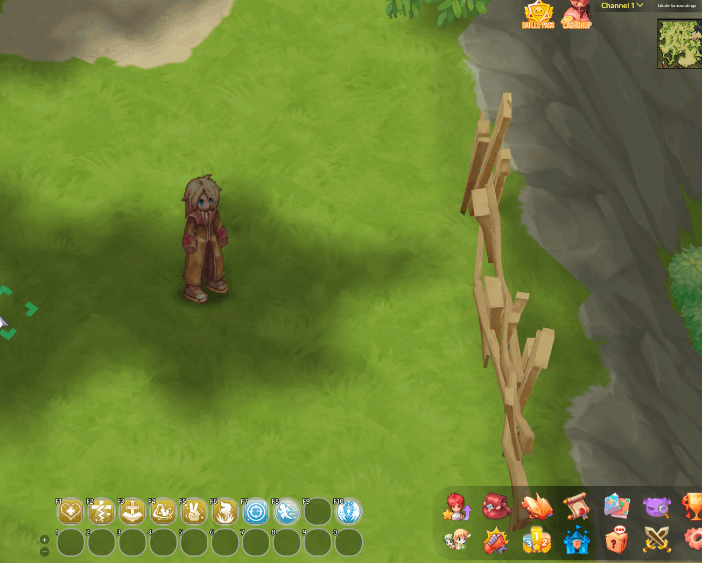

# 🐶 Pets and Evolutions

## **How to Tame?**

* Some monsters can be tamed to assist you on your journey.
* Each pet provides exclusive benefits.

## **Taming Process**

<table><thead><tr><th width="236">Image</th><th>Description</th></tr></thead><tbody><tr><td>
<figure><figcaption></figcaption></figure>
</td><td>Some monster drop items have descriptions such as <strong>"Favorite Food of Poring"</strong>, among others.</td></tr><tr><td>
<figure><figcaption></figcaption></figure>
</td><td>Simply click on the consumable item and select the monster.</td></tr><tr><td>
<figure><figcaption></figcaption></figure>
</td><td>A mini-game will take place, and you may <strong>"Fail"</strong> or <strong>"Succeed"</strong> in taming.</td></tr><tr><td>
<figure><figcaption></figcaption></figure>
</td><td>When you succeed in the mini-game, you will receive the pet egg.</td></tr></tbody></table>

## **Summoning a Pet**

* To summon your pet, simply have a **"Pet Egg"** and an **"Incubator"**.
* The incubator can be purchased in any city from **"**<mark style="color:red;">**Pet Trainers**</mark>**"**.

<figure><figcaption>
<mark style="color:red;"><strong>Using the "Incubator"</strong></mark>
</figcaption></figure>



## List of Pets

<table><thead><tr><th width="295">Egg</th><th>Buff</th></tr></thead><tbody><tr><td> Alice</td><td>Loyal: <strong>MDEF +2</strong>. Resistance to Human and Humanoid races +2%. Friendly: <strong>MDEF +1</strong>. Resistance to Human and Humanoid races +1%.</td></tr><tr><td> Angeling </td><td>Loyal: Max HP +2%. Healing effectiveness +8%. Friendly: Max HP +2%. Healing effectiveness +6%.</td></tr><tr><td>Wanderer</td><td>AGI +3. DEX -1.</td></tr><tr><td> Am mut</td><td>Loyal: Magic Attack +4%. Friendly: Magic Attack +3%.</td></tr><tr><td>Stone Shooter</td><td>Loyal: Fire Property Resistance +5%. Friendly: Fire Property Resistance +3%.</td></tr><tr><td>Baphomet Jr.</td><td>Loyal: <strong>DEF and MDEF +2</strong>. Stun tolerance -2%. Friendly: <strong>DEF and MDEF +1</strong>. Stun tolerance -1%.</td></tr><tr><td>Savage Baby</td><td>Loyal: <strong>VIT +2</strong>. HP +75. Friendly: <strong>VIT +1</strong>. HP +50.</td></tr><tr><td> Bongun</td><td>Loyal: <strong>VIT +2</strong>. Stun tolerance +2%. Friendly: <strong>VIT +1</strong>. Stun tolerance +1%.</td></tr><tr><td> ChonChon</td><td>Loyal: AGI +2. Flee +3. Friendly: AGI +1. Flee +2.</td></tr><tr><td> Choco</td><td>Loyal: <strong>CRIT +9</strong>. Ranged physical damage +3%. Friendly: <strong>CRIT +7</strong>. Ranged physical damage +2%.</td></tr><tr><td> Steel ChonChon</td><td>Leal: ELoyal: Flee +9. Friendly: Flee +6.</td></tr><tr><td> Chung-E</td><td>Loyal: <strong>DEF +2</strong>. Resistance to Humanoids +2%. Friendly: <strong>DEF +1</strong>. Resistance to Humanoids +1%.</td></tr><tr><td> Deviruch</td><td>Loyal: Max HP and SP +1%. Physical and magical damage +1%. Friendly: Physical and magical damage +1%.</td></tr><tr><td> Diabolic</td><td>Loyal: Max HP and SP +2%. Physical and magical damage +2%. When performing physical attacks, 6% chance to auto-cast Fire Lance Lv.3. Friendly: Max HP and SP +1%. Physical and magical damage +2%. When performing physical attacks, 3% chance to auto-cast Fire Lance Lv.3.</td></tr><tr><td> Deleter</td><td>Loyal: <strong>AGI +3</strong>. Attack speed +3%. Friendly: <strong>AGI +2</strong>. Attack speed +2%.</td></tr><tr><td> Dokebi</td><td>Loyal: Magic damage +2%. Friendly: Magic damage +1%.</td></tr><tr><td> Drops</td><td>Loyal: ATK +5. Accuracy +5. Friendly: ATK +3. Accuracy +3.</td></tr><tr><td> Dullahan</td><td>Loyal: Critical Rate +8%. Friendly: Critical Rate +5%.</td></tr><tr><td> Spore</td><td>Loyal: Accuracy +8. Friendly: Accuracy +5.</td></tr><tr><td> Poison Spore</td><td>Loyal: <strong>STR +2, INT +2</strong>. Friendly: <strong>STR +1, INT +1</strong>.</td></tr><tr><td> Desert Wolf Baby</td><td>Loyal: <strong>INT +2, SP +75</strong>. Friendly: <strong>INT +1, SP +50</strong>.</td></tr><tr><td> Smokie</td><td>Loyal: <strong>AGI +2</strong>. Perfect Dodge +1. Friendly: <strong>AGI +1</strong>. Perfect Dodge +1.</td></tr><tr><td> Leaf Cat</td><td>Loyal: Resistance to Brute race +5%. Friendly: Resistance to Brute race +3%.</td></tr><tr><td> Christmas Goblin</td><td>Loyal: Max HP +45. Water Element Resistance +2%. Friendly: Max HP +30. Water Element Resistance +1%.</td></tr><tr><td>Goblin Leader</td><td>Loyal: Physical damage against Human and Humanoid races +5%. Friendly: Physical damage against Human and Humanoid races +3%.</td></tr><tr><td> Golem</td><td>Loyal: Max HP +150. Friendly: Max HP +100.</td></tr><tr><td> Gremlin</td><td>Loyal: <strong>DEX +2, Accuracy +2</strong>. Friendly: <strong>DEX +1, Accuracy +1</strong>.</td></tr><tr><td> Orc Warrior</td><td>Loyal: ATK +15. Friendly: ATK +10.</td></tr><tr><td> Grand Orc</td><td>Loyal: ATK +25. Friendly: ATK +20.</td></tr><tr><td> Nine-Tailed Cat</td><td>Loyal: CRIT and Accuracy +5. When performing physical attacks, 1% chance to activate for 5 seconds (HP +400 per second). Friendly: CRIT and Accuracy +4. When performing physical attacks, 1% chance to activate for 5 seconds (HP +300 per second).</td></tr><tr><td> Grand Peco-Peco</td><td>Loyal: Max HP +400. Friendly: Max HP +300.</td></tr><tr><td> Hyegun</td><td>Loyal: <strong>VIT +4</strong>. Stun Resistance +4%. Friendly: <strong>VIT +3</strong>. Stun Resistance +3%.</td></tr><tr><td> Imp</td><td>Loyal: Fire Property Resistance +3%. Physical damage against Fire Property opponents +2%. Friendly: Fire Property Resistance +2%. Physical damage against Fire Property opponents +1%.</td></tr><tr><td> Incubus</td><td>Leal:Loyal: Max SP +5%. Friendly: Max SP +3%.</td></tr><tr><td> Ísis</td><td>Loyal: Magic Damage +2%. Friendly: Magic Damage +1%.</td></tr><tr><td> Jirtas</td><td>Loyal: Damage against <strong>Humanoid</strong> players +3%. Friendly: Damage against <strong>Humanoid</strong> players +2%.</td></tr><tr><td> Snow Hare</td><td>Friendly: Magic Attack +2%.</td></tr><tr><td> Goblin Leader</td><td>LLoyal: Physical damage against Human and Humanoid races +5%. Friendly: Physical damage against Human and Humanoid races +3%.</td></tr><tr><td> Loli Ruri</td><td>Loyal: Max HP +5%. When taking damage, 2% chance to auto-cast Heal Lv.1. Friendly: Max HP +3%. When taking damage, 1% chance to auto-cast Heal Lv.1.</td></tr><tr><td> Lunatic</td><td>Loyal: CRIT +3. ATK +3. Friendly: CRIT +2. ATK +2.</td></tr><tr><td> Marionette</td><td>Loyal: Regenerates 3% of mana every 9 seconds. Friendly: Regenerates 2% of mana every 9 seconds.</td></tr><tr><td> Medusa</td><td>Loyal: <strong>VIT +2</strong>. Petrification Resistance +8%. Friendly: <strong>VIT +1</strong>. Petrification Resistance +5%.</td></tr><tr><td> Myabi Ningyo</td><td>Loyal: <strong>INT +2</strong>. Variable Cast Time -5%. Friendly: <strong>INT +1</strong>. Variable Cast Time -3%.</td></tr><tr><td> Hunter Fly</td><td>Loyal: Perfect Dodge +2. Accuracy +1. Friendly: Perfect Dodge +2.</td></tr><tr><td> Mummy</td><td>Loyal: Hit Rate +5%. Friendly: Hit Rate +4%.</td></tr><tr><td> Ancient Mummy</td><td>Loyal: Accuracy +6. Physical and magical damage against Dragon race +6%. Friendly: Accuracy +6. Physical and magical damage against Dragon race +3%.</td></tr><tr><td> Munak</td><td>Loyal: <strong>INT +2, DEF +2</strong>. Friendly: <strong>INT +1, DEF +1</strong>.</td></tr><tr><td> Mastering</td><td>Loyal: <strong>LUK +3, CRIT +3</strong>. Friendly: <strong>LUK +3, CRIT +2</strong>. Neutral: <strong>LUK +3, CRIT +1</strong>. Other: <strong>LUK +2, CRIT +1</strong>.</td></tr><tr><td> Metaling</td><td>Loyal: Friendly: Max HP +70. HP Natural Recovery +20%. Physical and magical damage against Plant race +6%.</td></tr><tr><td> Nine Tails</td><td>Loyal: CRIT +3. Accuracy +3. Friendly: CRIT +2. Accuracy +2.</td></tr><tr><td> Peco Peco</td><td>Loyal: Max HP +200. Friendly: Max HP +150.</td></tr><tr><td> Nightmare</td><td>Loyal: Sleep Effect Resistance +100%. <strong>INT +1</strong>. Friendly: Sleep Effect Resistance +100%.</td></tr><tr><td> Petite (Green)</td><td>Loyal: <strong>AGI +1</strong>. Attack speed +1%. Friendly: Attack speed +1%.</td></tr><tr><td> Picky</td><td>Loyal: <strong>STR +2, ATK +8</strong>. Friendly: <strong>STR +1, ATK +5</strong>.</td></tr><tr><td> Poring</td><td>Loyal: <strong>LUK +3, CRIT +1</strong>. Friendly: <strong>LUK +2, CRIT +1</strong>.</td></tr><tr><td> Poporing</td><td>Loyal: <strong>LUK +3</strong>. Poison Resistance +15%. Friendly: <strong>LUK +2</strong>. Poison Resistance +10%.</td></tr><tr><td> Small Poring</td><td>Loyal: HP Recovery Rate +75%. Friendly: HP Recovery Rate +50%.</td></tr><tr><td> Rocker</td><td>Loyal: Max HP +38. HP Natural Recovery +6%. Friendly: Max HP +25. HP Natural Recovery +5%.</td></tr><tr><td> Shinobi</td><td>Loyal: <strong>AGI +3</strong>. Friendly: <strong>AGI +2</strong>.</td></tr><tr><td> Sohee</td><td>Loyal: <strong>STR +2, DEX +2</strong>. Friendly: <strong>STR +1, DEX +1</strong>.</td></tr><tr><td> Succubus</td><td>Loyal: 2% chance to convert 5% of physical damage dealt into HP. Max HP +1%. Friendly: 1% chance to convert 3% of physical damage dealt into HP.</td></tr><tr><td> Whisper</td><td>Loyal: Flee +10. Allows the use of {Skill_51}. Friendly: Flee +7.</td></tr><tr><td> Savage</td><td>Loyal: <strong>VIT +2, Max HP +200</strong>. Friendly: <strong>VIT +2, Max HP +100</strong>.</td></tr><tr><td> Teddy Bear</td><td>Loyal: Max SP +150. Friendly: Max SP +100.</td></tr><tr><td> Yoyo</td><td>Loyal: <strong>CRIT +5</strong>. Friendly: <strong>CRIT +3</strong>.</td></tr></tbody></table>



## List of Evolutions

<table><thead><tr><th width="86">IMG</th><th width="123">Name</th><th>Items	</th><th>Max Loyalty Buff</th></tr></thead><tbody><tr><td></td><td><mark style="color:red;"><strong>Am mut</strong></mark></td><td>

<ul><li><strong>Pre-evolution:</strong> Dokkaebi</li><li> 3 Old Brooms</li><li> 3 Golds</li><li> 3 Violet Dyes</li><li> 300 Dokebi Horns</li></ul></td><td>Magic Damage +4%.</td></tr><tr><td></td><td><mark style="color:red;"><strong>Angeling</strong></mark></td><td>

<ul><li><strong>Pre-evolution:</strong> Mastering</li><li> 20 Yellow Potions</li><li> 50 White Herbs</li><li> 200 Jellopies</li><li> 1 Aureola</li></ul></td><td>Max HP +2%. Healing effectiveness +8%.</td></tr><tr><td></td><td><mark style="color:red;"><strong>Choco</strong></mark></td><td>

<ul><li><strong>Pre-evolution:</strong> Yoyo</li><li> 3 Tropical Bananas</li><li> 2 Yoyo Doll</li><li> 1 Yoyo Card</li><li> 300 Cocoa</li></ul></td><td>CRIT +9. Ranged physical damage +3%.</td></tr><tr><td></td><td><mark style="color:red;"><strong>Deleterious</strong></mark></td><td>

<ul><li><strong>Pre-evolution:</strong> Green Petite</li><li> 150 Aloe Vera</li><li> 3 Shining Stones</li><li> 1 Deleterious Card</li><li> 100 Petite Tails</li></ul></td><td><strong>AGI +3</strong>. Attack Speed +3%.</td></tr><tr><td></td><td><mark style="color:red;"><strong>Diabolik</strong></mark></td><td>

<ul><li><strong>Pre-evolution:</strong> Deviruch</li><li> 3 Shadow Contracts</li><li> 30 Holy Hands</li><li> 250 Small Evil Wings</li><li> 1 Deviling Card</li></ul></td><td>Max HP and SP +2%. Physical and Magical Damage +2%. When performing physical attacks, 6% chance to auto-cast Fire Lance Lv. 3.</td></tr><tr><td></td><td><mark style="color:red;"><strong>Desert Wolf</strong></mark></td><td>

<ul><li><strong>Pre-evolution:</strong> Baby Desert Wolf</li><li> 20 Animal Skins</li><li> 300 Desert Wolf Claws</li><li> 3 Dry Bones</li><li> 1 Desert Wolf Card</li></ul></td><td>INT +4. Max SP +130. Earth Property Magic Damage +5%.</td></tr><tr><td></td><td><mark style="color:red;"><strong>Leaf Lunatic</strong></mark></td><td>

<ul><li><strong>Pre-evolution:</strong> Lunatic</li><li> 250 Clover</li><li> 1 Leaf Lunatic Card</li><li> 30 Four Leaf Clover</li><li> 100 Giant Leaf</li></ul></td><td>CRIT and ATK +5. Physical and Magical Damage against Formless Race +6%.</td></tr><tr><td></td><td><mark style="color:red;"><strong>Grand Orc</strong></mark></td><td>

<ul><li><strong>Pre-evolution:</strong> Orc Warrior</li><li> 3 Tribal Horror</li><li> 500 Orc Amulets</li><li> 1 Orc Sword</li><li> 1 Orc Warrior Card</li><li> 1 Orc Helmet</li></ul></td><td>ATK +25.</td></tr><tr><td></td><td><mark style="color:red;"><strong>Grand Peco</strong></mark></td><td>

<ul><li><strong>Pre-evolution:</strong> PecoPeco</li><li> 10 Mastela Fruit</li><li> 10 Pet Food</li><li> 3 Fat Earthworm</li><li> 1 PecoPeco Card</li><li> 300 Grand Peco Feathers</li></ul></td><td>Max HP +400.</td></tr><tr><td></td><td><mark style="color:red;"><strong>Baby-Isis</strong></mark></td><td>

<ul><li><strong>Pre-evolution:</strong> Isis</li><li> 3 Obedience Bracelets</li><li> 6 3-Carat Diamonds</li><li> 1 Queen’s Ornament</li><li> 300 Shiny Scales</li></ul></td><td>Physical Damage +4%.</td></tr><tr><td></td><td><mark style="color:red;"><strong>Mastering</strong></mark></td><td>

<ul><li><strong>Pre-evolution:</strong> Poring</li><li> 3 Green Apples</li><li> 10 Yggdrasil Leaves</li></ul></td><td>LUK +3. CRIT +3.</td></tr><tr><td></td><td><mark style="color:red;"><strong>Metaller</strong></mark></td><td>

<ul><li><strong>Pre-evolution:</strong> Rocker</li><li> 200 Yellow Herbs</li><li> 1 Metaller Card</li><li> 777 Grasshopper Legs</li><li> 3 Melody Plants</li></ul></td><td>HP Max +70. HP Regen +20%. Physical &#x26; Magical Damage against Plant Race +6%.</td></tr><tr><td></td><td><mark style="color:red;"><strong>Savage</strong></mark></td><td>

<ul><li><strong>Pre-evolution:</strong> Baby Savage</li><li> 3 Sweet Milk</li><li> 100 Meat</li><li> 50 Feather</li><li> 10 Pet Food</li></ul></td><td>VIT +2. Max HP +200.</td></tr><tr><td></td><td><mark style="color:red;"><strong>Yao Jun</strong></mark></td><td>

<ul><li><strong>Pre-evolution:</strong> Bongun</li><li> 1 Yao Jun Card</li><li> 1 Yao Jun Hat</li><li> 50 Old Portrait</li><li> 100 Munak Doll</li></ul></td><td>VIT +4. Stun Resistance +4%. 1% chance to convert 1% of physical damage into SP.</td></tr></tbody></table>


