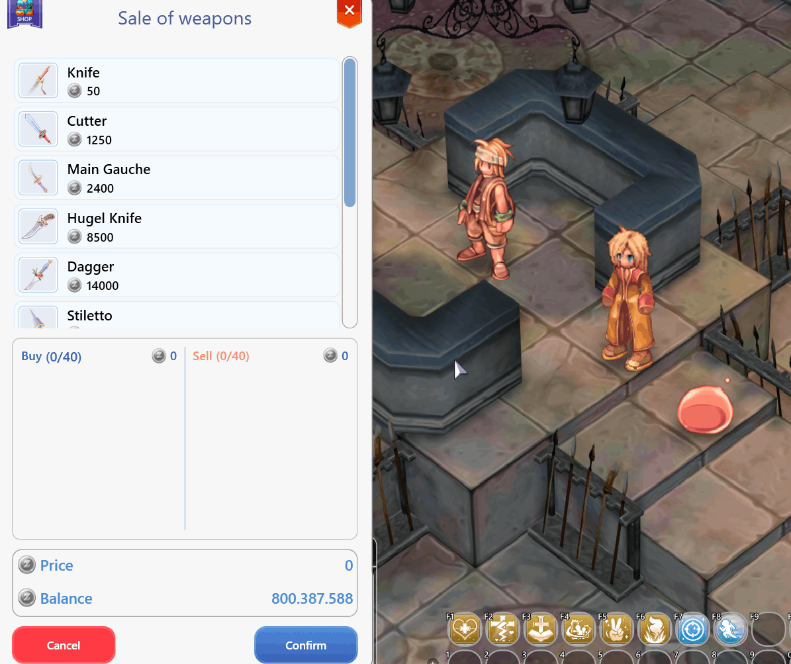

# 🛒 Toko dan NPC

<figure><figcaption></figcaption></figure>

## **Tentang "Toko Peralatan"**

* **Tentang Toko:** Di setiap peta **Arkaik Tales of Sarina**, terdapat toko untuk "Senjata" dan "Peralatan".
* **Senjata:** Setiap kota memiliki senjata spesifik untuk setiap kelas, mulai dari **Pisaus, Pedang, Tombak, Kapak, Palu, Sarung Tangan, Tongkat, Busur, Gitar, Cambuk**, dll.
* **Peralatan:** Semua kota memiliki toko peralatannya sendiri, yang umumnya mencakup **Helm, Jubah, Sepatu, Armor, Cincin**.

## **Cara Memeriksa Toko:**

* Untuk memeriksa toko, <mark style="color:red;">**di bawah ini akan ada 3 TOMBOL**</mark> untuk Anda melihat toko-toko tersebut. <mark style="color:green;">**KLIK NAMA**</mark> untuk melihat item-itemnya.* **"**<mark style="color:red;">**Kota**</mark>**", "**<mark style="color:red;">**Senjata**</mark>**", "**<mark style="color:red;">**Armor**</mark>**".**

<figure><figcaption></figcaption></figure>

## Kota



<figure><figcaption>
<mark style="color:red;"><strong>Lokasi Toko Peralatan di Kota Prontera</strong></mark>
</figcaption></figure>




<figure><figcaption>
<mark style="color:red;"><strong>Toko Senjata</strong></mark>  <mark style="color:red;"><strong>(Pisa, Pedang, Busur, Lembing, Kapak, Palu)</strong></mark>
</figcaption></figure>



<figure><figcaption>
<mark style="color:red;"><strong>Toko Armor</strong></mark> <em><mark style="color:red;">(Peralatan Umum)</mark></em>
</figcaption></figure>





<figure><figcaption>
<mark style="color:red;"><strong>Lokasi Toko Peralatan di Kota Zero</strong></mark>
</figcaption></figure>



<figure><figcaption>
<mark style="color:red;"><strong>Toko Senjata</strong></mark> <em><mark style="color:red;">(Pisa, Pedang, Busur, Tombak, Kapak, Palu)</mark></em><mark style="color:red;"><strong>)</strong></mark>
</figcaption></figure>



<figure><figcaption>
<mark style="color:red;"><strong>Toko Armor</strong></mark> <em><mark style="color:red;">(Peralatan Umum)</mark></em>
</figcaption></figure>





<figure><figcaption>
<mark style="color:red;"><strong>Lokasi Toko Peralatan di Kota Geffen</strong></mark>
</figcaption></figure>



<figure><figcaption>
<mark style="color:red;"><strong>Toko Senjata</strong></mark> <em><mark style="color:red;">(Belati, Busur, Tongkat)</mark></em>
</figcaption></figure>



<figure><figcaption>
<mark style="color:red;"><strong>Toko Armor</strong></mark> <em><mark style="color:red;">(Peralatan Umum)</mark></em>
</figcaption></figure>




<figure><figcaption>
<mark style="color:red;"><strong>Lokasi Toko Peralatan di Kota Izlude</strong></mark>
</figcaption></figure>



<figure><figcaption>
<mark style="color:red;"><strong>Toko Senjata</strong></mark> <em><mark style="color:red;">(Belati, Pedang, Tombak, Kapak)</mark></em><mark style="color:red;"><strong>)</strong></mark>
</figcaption></figure>



<figure><figcaption>
<mark style="color:red;"><strong>Toko Armor.</strong></mark>  <mark style="color:red;"><strong>(Peralatan Umum)</strong></mark>
</figcaption></figure>




<figure><figcaption>
<mark style="color:red;"><strong>Lokasi Toko Peralatan di Kota Morroc</strong></mark>
</figcaption></figure>



<figure><figcaption>
<mark style="color:red;"><strong>Toko Senjata</strong></mark> <em><mark style="color:red;">(Pisa, Pedang, Busur, Katar)</mark></em>
</figcaption></figure>



<figure><figcaption>
<mark style="color:red;"><strong>Toko Armor</strong></mark> <em><mark style="color:red;">(Peralatan Umum)</mark></em>
</figcaption></figure>





<figure><figcaption>
<mark style="color:red;"><strong>Lokasi Toko Peralatan di Kota Payon</strong></mark>
</figcaption></figure>

<figure><figcaption>
<mark style="color:red;"><strong>Toko Senjata</strong></mark> <em><mark style="color:red;">(Pisau, Pedang, Busur, Tongkat)</mark></em>
</figcaption></figure>



<figure><figcaption>
<mark style="color:red;"><strong>Toko Armor</strong></mark> <em><mark style="color:red;">(Peralatan Umum)</mark></em>
</figcaption></figure>





<figure><figcaption>
<mark style="color:red;"><strong>Lokasi Toko Peralatan di Kota Alberta</strong></mark>
</figcaption></figure>


<figure><figcaption>
<mark style="color:red;"><strong>Toko Senjata</strong></mark> <em><mark style="color:red;">(Belati, Pedang, Busur, Kapak)</mark></em>
</figcaption></figure>



<figure><figcaption>
<mark style="color:red;"><strong>Toko Armor</strong></mark> <em><mark style="color:red;">(Peralatan Umum)</mark></em>
</figcaption></figure>





<figure><figcaption>
<mark style="color:red;"><strong>Lokasi Toko Peralatan di Kota Aldebaran</strong></mark>
</figcaption></figure>


<figure><figcaption>
<mark style="color:red;"><strong>Toko Senjata</strong></mark> <em><mark style="color:red;">(Belati, Pedang)</mark></em>
</figcaption></figure>



<figure><figcaption>
<mark style="color:red;"><strong>Toko Armor</strong></mark> <em><mark style="color:red;">(Peralatan Umum)</mark></em>
</figcaption></figure>





<figure><figcaption>
<mark style="color:red;"><strong>Lokasi Toko Peralatan di Kota Ayothaya</strong></mark>
</figcaption></figure>


<figure><figcaption>
<mark style="color:red;"><strong>Toko Senjata</strong></mark> <em><mark style="color:red;">(Belati, Pedang, Kapak, Tongkat)</mark></em>
</figcaption></figure>



<figure><figcaption>
<mark style="color:red;"><strong>Toko Armor</strong></mark> <em><mark style="color:red;">(Peralatan Umum)</mark></em>
</figcaption></figure>





<figure><figcaption>
<mark style="color:red;"><strong>Lokasi Toko Peralatan di Kota Hugel</strong></mark>
</figcaption></figure>



<figure><figcaption>
<mark style="color:red;"><strong>Toko Senjata</strong></mark> <em><mark style="color:red;">(Pedang, Busur, Tongkat)</mark></em>
</figcaption></figure>


<figure><figcaption>
<mark style="color:red;"><strong>Toko Armor</strong></mark> <em><mark style="color:red;">(Peralatan Umum)</mark></em>
</figcaption></figure>





<figure><figcaption>
<mark style="color:red;"><strong>Lokasi Toko Peralatan di Kota Comodo</strong></mark>
</figcaption></figure>



<figure><figcaption>
<mark style="color:red;"><strong>Toko Senjata</strong></mark> <em><mark style="color:red;">(Cambuk, Biola)</mark></em>
</figcaption></figure>


<figure><figcaption>
<mark style="color:red;"><strong>Toko Armor</strong></mark> <em><mark style="color:red;">(Peralatan Umum)</mark></em>
</figcaption></figure>





<figure><figcaption>
<mark style="color:red;"><strong>Lokasi Toko Peralatan di Kota Mercusuar Comodo</strong></mark>
</figcaption></figure>



<figure><figcaption>
<mark style="color:red;"><strong>Toko Senjata</strong></mark> <em><mark style="color:red;">(Tombak)</mark></em>
</figcaption></figure>



<figure><figcaption>
<mark style="color:red;"><strong>Toko Armor</strong></mark> <em><mark style="color:red;">(Peralatan Umum)</mark></em>
</figcaption></figure>





<figure><figcaption>
<mark style="color:red;"><strong>Lokasi Toko Peralatan di Kota Einbroch</strong></mark>
</figcaption></figure>



<figure><figcaption>
<mark style="color:red;"><strong>Toko Senjata</strong></mark> <em><mark style="color:red;">(Pisa, Pedang, Busur, Katar, Tombak, Palu, Kapak, Pukulan)</mark></em>
</figcaption></figure>




<figure><figcaption>
<mark style="color:red;"><strong>Lokasi Toko Peralatan di Kota Umbala</strong></mark>
</figcaption></figure>



<figure><figcaption>
<mark style="color:red;"><strong>Toko Senjata</strong></mark> <em><mark style="color:red;">(Mace dan Knuckle)</mark></em>
</figcaption></figure>





<figure><figcaption>
<mark style="color:red;"><strong>Lokasi Toko Peralatan di Kota Niflheim</strong></mark>
</figcaption></figure>



<figure><figcaption>
<mark style="color:red;"><strong>Toko Senjata</strong></mark> <em><mark style="color:red;">(Kapak, Palu)</mark></em>
</figcaption></figure>

<figure><figcaption>
<mark style="color:red;"><strong>Toko Armor</strong></mark> <em><mark style="color:red;">(Peralatan Umum)</mark></em>
</figcaption></figure>





<figure><figcaption>
<mark style="color:red;"><strong>Lokasi Toko Peralatan di Kota Yuno</strong></mark>
</figcaption></figure>



<figure><figcaption>
<mark style="color:red;"><strong>Toko Senjata</strong></mark> <em><mark style="color:red;">(Pisa, Pedang, Busur, Tongkat)</mark></em>
</figcaption></figure>


<figure><figcaption>
<mark style="color:red;"><strong>Toko Armor</strong></mark> <em><mark style="color:red;">(Peralatan Umum)</mark></em>
</figcaption></figure>

