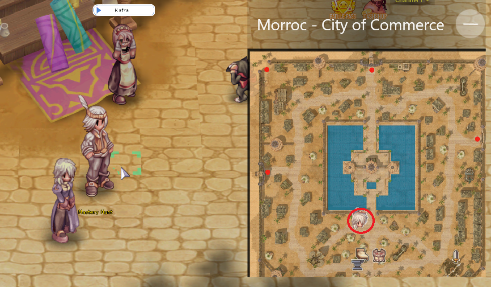
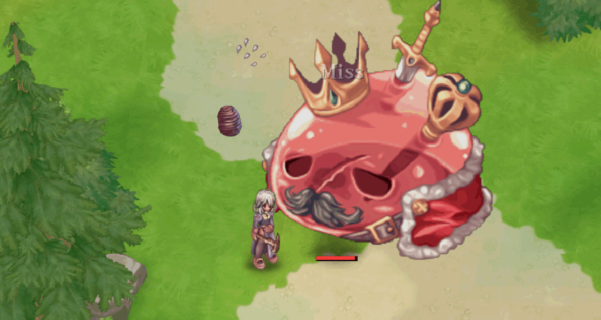
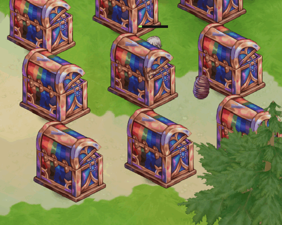

# 🏹 Mastery Hunt

* **Mastery Hunt** is a special event that takes place on alternating days (every other day) with the goal of **helping new adventurers obtain Mastery Points**, which are usually difficult to acquire.
* During the event, special monsters are summoned in specific maps, and a special boss may appear to offer greater rewards.

## 🔰 NPC Location

* It is located near the Kafras of the cities.

<figure><figcaption>
<mark style="color:red;"><strong>NPC Mastery Hunt</strong></mark>
</figcaption></figure>

## 🕒 **Activation Times**

The event is activated **twice a day**:

* **3:00 PM**
* **8:30 PM**

***

## 🌍 Map Selection

When participating in the event, the player can choose one of the available maps:

* **South Prontera**

> 💡 The difficulty of the monsters is equal to the native difficulty of the selected map.

***

## ⏳ **Event Duration**

* Each Mastery Hunt session lasts **20 minutes**.
* During this time, **special monsters** appear on the maps, identified by the prefix `'Arkaik'`.

***

## ⚔️ Difficulty

The strength of the monsters and the **difficulty of obtaining mastery points** are defined by the **native difficulty of the map** where the event takes place.

***

## 📌 Methods to Obtain Mastery Points

### 🔷 **Method 1: Monster Hunt**

* Eliminate event monsters to get a _chance to earn **Mastery Points**_.
* The chance to get each point is 20% by defeating monsters **(**_**except King Poring**_**)**.

<figure><figcaption>
<mark style="color:red;"><strong>Identifying the "Arkaik" prefix on monsters.</strong></mark>
</figcaption></figure>

<figure><figcaption>
<mark style="color:red;"><strong>By defeating monsters you have a chance to obtain 1 Mastery Point.</strong></mark>
</figcaption></figure>

***

🔷 **Method 2: Event Boss**

* After some time, **a&#x20;**_**giant boss**_**&#x20;appears** on the map.
* Players must _team up to defeat it_, as the reward is greater.
* When defeated, **the boss drops&#x20;**_**treasures on the ground**_.

<figure><figcaption>
<mark style="color:red;"><strong>Emergence of Arkaik King Poring</strong></mark>
</figcaption></figure>

**How to Collect the Treasure:**

* _Approach, click the treasure, and wait 10 seconds_ to collect **20 Mastery Points**.\
  ⚠️ _Be quick_, other players can also take it!
* The value is _not fixed_ and may vary.

<figure><figcaption>
<mark style="color:red;"><strong>Upon defeating the Arkaik King Poring, several treasure chests will emerge.</strong></mark>
</figcaption></figure>

<figure><figcaption>
<mark style="color:red;"><strong>Click on the Bau to Collect the 20 Mastery Points reward.</strong></mark>
</figcaption></figure>

***

## 🔒 Daily Limits

* 🎯 A maximum of **20 Mastery Points per day** (via monster hunting).
* 💎 _Only 1 treasure_ from the boss can be collected per day.
* 📛 These limits are _per account_, meaning _they **cannot be bypassed using other characters**_.

<figure><figcaption>
<mark style="color:red;"><strong>You can only collect one Treasure per day.</strong></mark>
</figcaption></figure>
