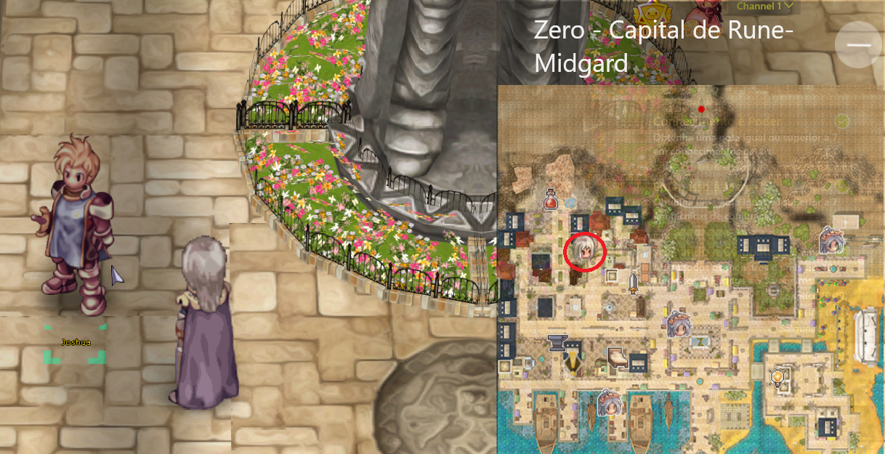

# 🏞️ EP. Eldoria

## **Cara Mengakses Eldoria**

* Pertama, Anda harus menyelesaikan quest awal di tempat pelatihan pemula dan memilih kelas Anda.
* Setelah menyelesaikan perubahan pekerjaan pertama Anda, Anda akan siap untuk memulai perjalanan Anda ke <mark style="color:red;">**Eldoria**</mark>.
* Di kota mana pun, pergi ke <mark style="color:red;">**Kafra**</mark>, klik padanya, pilih opsi **"**<mark style="color:red;">**Teleport**</mark>**"**, dan pilih kota **"**<mark style="color:red;">**Zero**</mark>**"**. Kemudian, pergi ke NPC **"**<mark style="color:red;">**Joshua**</mark>**"** untuk memulai quest utama.

<figure><figcaption>
<mark style="color:red;"><strong>Awal quest untuk akses ke "Eldoria"</strong></mark>
</figcaption></figure>

## Quest Utama

## **1.0 \[ Pelajari Tentang Bestiary dengan Joshua Lv 0 ]**

* Bicaralah dengan <mark style="color:red;">**Joshua**</mark> di kota **Zero** untuk memulai misi pertama Anda.
* Dia akan mengajarkan Anda tentang bestiary menggunakan **"**<mark style="color:red;">**ALT+B**</mark>**"** untuk melihat informasi monster.

<figure><figcaption>
<mark style="color:red;"><strong>Awal dari segalanya Joshua.</strong></mark>
</figcaption></figure>

## **1.1 \[ Bicaralah dengan Panduan Umum ]**

* Joshua akan meminta Anda untuk bertemu NPC **"Panduan Umum"**, yang terletak di **Selatan** kota **Zero**.
* Bicaralah dengan NPC **dua kali** dan pilih opsi **"**<mark style="color:red;">**Tentang Item/Monster**</mark>**"**.
* Anda akan menerima <mark style="color:blue;">**\[ 10x**</mark> .png>)<mark style="color:blue;">**Ervas Azuis  ]**</mark> sebagai hadiah.
* Setelah itu, kembali ke **"**<mark style="color:red;">**Joshua**</mark>**"**.

<figure><figcaption>
<mark style="color:red;"><strong>Ikuti Langkah-Langkah Panduan Umum.</strong></mark>
</figcaption></figure>

## **1.2 \[ Laporkan Pembelajaran Anda kepada Joshua ]**

* Setelah berbicara dengan <mark style="color:red;">**Joshua**</mark>, dia akan mengucapkan selamat atas pencapaian Anda.
* Anda akan menerima <mark style="color:blue;">**\[20x**</mark> .png>) <mark style="color:blue;">**Herba Biru]**</mark> sebagai hadiah.

<figure><figcaption>
<mark style="color:red;"><strong>Memecahkan Batas Anda Lv.30</strong></mark>
</figcaption></figure>

## **1.3 \[ Menjadi Lebih Kuat ]**

* Selanjutnya, dia akan meminta Anda untuk **mencapai Level 30** untuk melanjutkan.
* Anda dapat mencapai **Level 30** dengan pergi ke **"**<mark style="color:red;">**Gua Payon**</mark>**"**, di kota **Payon**.
* **Setelah mencapai Level 30, kembali ke** <mark style="color:red;">**Joshua**</mark>.* Anda akan menerima <mark style="color:blue;">**\[50x**</mark> .png>) <mark style="color:blue;">**Herba Biru]**</mark> sebagai hadiah.

<table><thead><tr><th width="365">Joshua</th><th>Gua Payon</th></tr></thead><tbody><tr><td>
 

<mark style="color:red;"><strong>Breaking Limit Lv.30</strong></mark>
</td><td>

<mark style="color:red;"><strong>Area yang Direkomendasikan untuk Lv.30</strong></mark>
</td></tr></tbody></table>

## **1.4 \[ Kontrol Horde ]**

* Joshua kemudian akan meminta Anda untuk pergi ke **"Gua Payon"**.
* Di dalam gua, **kalahkan** <mark style="color:red;">**200 Kerangka**</mark>.
* Setelah mengalahkan monster, kembali ke Joshua, dan dia akan mengucapkan selamat kepada Anda.
* Anda akan menerima <mark style="color:blue;">**\[2x**</mark> .png>) <mark style="color:blue;">**Daun Yggdrasil]**</mark> sebagai hadiah.| Masuk ke Gua Payon                                                                                                                                                                        | Gua Payon                                                                                                                                                                            |
| ------------------------------------------------------------------------------------------------------------------------------------------------------------------------------------------ | ------------------------------------------------------------------------------------------------------------------------------------------------------------------------------------ || 

<em><mark style="color:red;"><strong>Lokasi pintu masuk ke Gua Payon.</strong></mark></em>
 | 

<em><mark style="color:red;"><strong>Kerangka di dalam Gua Payon.</strong></mark></em>
 |

<figure><figcaption>
<mark style="color:red;"><strong>Menyelesaikan 200 Kerangka</strong></mark>
</figcaption></figure>

## **1.5 \[ Temukan Raja Zell II \]**

* Joshua akan meminta Anda untuk menemukan **"Lupina"** untuk belajar lebih banyak tentang Raja Zell II.
* Pergi ke selatan kota **Zero**, dekat jembatan.
* Setelah berbicara dengan **"**<mark style="color:red;">**Lupina**</mark>**"**, dia akan membagikan beberapa informasi.
* Anda akan menerima <mark style="color:blue;">**\[1x**</mark> .png>) <mark style="color:blue;">**Manual Pertarungan]**</mark> sebagai hadiah.<figure><figcaption>
<mark style="color:red;"><strong>Lokasi Lupina untuk informasi tentang Raja Zell II.</strong></mark>
</figcaption></figure>

## **1.6 \[ Bantu Lupina \] Bagian 1/2**

* Ketika berbicara dengan **"Lupina"** lagi, dia akan meminta Anda untuk membawa sebuah **"**<mark style="color:red;">**Batu Permata**</mark>**"** dari monster mana pun di **"Saluran Nol"**.
* Untuk mendapatkan **Batu Permata**, bicaralah dengan **"**<mark style="color:red;">**Perekrut Saluran**</mark>**"**.
* Setelah mendapatkan **"Batu Permata"** dari monster saluran mana pun, kembalilah ke **Lupina** untuk menyerahkannya.
* Anda akan menerima <mark style="color:blue;">**\[1x**</mark> .png>) <mark style="color:blue;">**Batu Permata Poles]**</mark> sebagai hadiah.<table><thead><tr><th width="374">Perekrut Saluran</th><th>Saluran Nol</th></tr></thead><tbody><tr><td>

<mark style="color:red;"><strong>Lokasi di mana Lupina meminta Anda untuk pergi.</strong></mark>
</td><td>

<mark style="color:red;"><strong>Lokasi untuk mendapatkan Permata.</strong></mark>
</td></tr></tbody></table>

## **1.7 \[ Bantu Lupina \] Bagian 2/2**

* Setelah menerima hadiah Anda, bicaralah dengan **"Lupina"** lagi.
* <mark style="color:red;">**Anda akan melihat bahwa tidak ada quest yang muncul, dan itu tidak apa-apa.**</mark>
* Dia meminta Anda untuk menemukan **"Raja Zell II"** di kota **Morroc**.
* Untuk melakukan ini, Anda harus **menemui penduduk di sudut kiri bawah&#x20;**<mark style="color:red;">**Morroc**</mark>.* Bicaralah dengan **"**<mark style="color:red;">**Shenya**</mark>**"**, dia akan menjelaskan situasi di kota. Pilih opsi **"**<mark style="color:red;">**Percayalah padaku**</mark>**"**.

<figure><figcaption>
<mark style="color:red;"><strong>Bagian kedua "Persiapan untuk misi berikutnya".</strong></mark>
</figcaption></figure>

## **1.7 \[ Misteri Morroc ]**

* Sekarang setelah Anda mendengar keluhan <mark style="color:red;">**Shenya**</mark><mark style="color:red;">'s</mark>, dia akan meminta Anda untuk meminta penjelasan dari **Raja Zell II**.
* Temukan dia di sudut atas **Morroc**, di mana beberapa penjaga akan berada di gerbang.
* Pertama, bicaralah dengan salah satu **Penjaga**, yang akan menjelaskan beberapa hal.
* Kemudian, <mark style="color:red;">**Raja Zell II**</mark> akan muncul di antara para penjaga. Bicaralah dengannya.
* Dia akan menjelaskan beberapa hal, dan kemudian Anda akan **diteleportasi ke "**<mark style="color:red;">**Dalam Morroc"**</mark>.* Bicara lagi dengan **Raja Zell II**, dan dia akan meminta Anda untuk kembali ke <mark style="color:red;">**Shenya**</mark> dan berbicara dengannya.
* Setelah berbicara dengan <mark style="color:red;">**Shenya**</mark>, dia akan memahami apa yang terjadi di kota.
* Anda akan menerima <mark style="color:blue;">**\[50x**</mark> .png>) <mark style="color:blue;">**Herba Biru]**</mark> sebagai hadiah.

| Lokasi Penjaga                                                                                                                                                  | Di Dalam Morroc                                                                                                                                           | Shenya                                                                                                                                                          || ----------------------------------------------------------------------------------------------------------------------------------------------------------------- | ----------------------------------------------------------------------------------------------------------------------------------------------------------- | --------------------------------------------------------------------------------------------------------------------------------------------------------------- |
| 

<mark style="color:red;"><strong>Lokasi Penjaga Zell.</strong></mark>
 | 

<mark style="color:red;"><strong>Kamar Pribadi Zell.</strong></mark>
 | 

<mark style="color:red;"><strong>Penjelasan Shenya.</strong></mark>
 |## **1.8 \[ Populasi Tenang ]**

* Kembali ke **"**<mark style="color:red;">**Lokasi Baru**</mark>**"** di mana **Raja Zell II** berada.
* Bicaralah dengan **Raja Zell II** tentang apa yang terjadi pada para penduduk desa.
* Anda akan menerima <mark style="color:blue;">**\[100x**</mark> .png>) <mark style="color:blue;">**Herba Biru]**</mark> sebagai hadiah.

<table><thead><tr><th width="376">Kamar Raja Zell II</th><th>Di Dalam Morroc</th></tr></thead><tbody><tr><td>

<em><mark style="color:red;"><strong>Lokasi baru di mana Raja Zell II ditemukan.</strong></mark></em>
</td><td>

<mark style="color:red;"><strong>Raja Zell II.</strong></mark>
</td></tr></tbody></table>

## **1.9 \[ Laporkan kepada Raja ]**

* Kembali ke **Kota Zero**, di mana **"Lupina"** berada.* **Raja Zell II** akan berada di sampingnya, <mark style="color:red;">**bicaralah padanya**</mark> tentang kota **"Prontera"**.
* Anda akan menerima <mark style="color:blue;">**\[2x**</mark> .png>) <mark style="color:blue;">**Buah Yggdrasil]**</mark> sebagai hadiah.

<figure><figcaption>
<mark style="color:red;"><strong>Raja Zell di samping Lupina di Zero.</strong></mark>
</figcaption></figure>



## **2.0 \[ Temukan Kolektor ]**

* Pergilah ke **Kota Geffen** dan bicaralah dengan **"Kolektor Agung"**.
* **Harald** adalah NPC yang dikenal dengan gelar ini.
* Bicaralah padanya dan pilih opsi **"Halo, Kolektor Agung"**.
* Anda akan menerima <mark style="color:blue;">**\[2x**</mark> .png>) <mark style="color:blue;">**Buah Yggdrasil]**</mark> sebagai hadiah.<figure><figcaption>
<em><mark style="color:red;"><strong>Harald dikenal sebagai "Pengumpul Agung".</strong></mark></em>
</figcaption></figure>

## **2.1 \[ Lengkapi Koleksi ]**

* **Harald** akan meminta Anda untuk menyelesaikan salah satu koleksi.
* <mark style="color:red;">**Payon Cave A2**</mark> <mark style="color:red;"></mark><mark style="color:red;">atau</mark> <mark style="color:red;"></mark><mark style="color:red;">**Geffen Surroundings 10**</mark><mark style="color:red;">.</mark>
* Setelah menyelesaikan salah satu koleksi di peta menggunakan **"ALT+C"**, kembali ke <mark style="color:red;">**Harald**</mark>.
* Anda akan menerima <mark style="color:blue;">**\[1x**</mark> .png>) <mark style="color:blue;">**Batu Reset]**</mark> sebagai hadiah.<table><thead><tr><th width="373">Pay_dun01</th><th>Gef_fild10</th></tr></thead><tbody><tr><td>

<em><mark style="color:red;"><strong>Gua Payon (A2) - Contoh Koleksi Lengkap.</strong></mark></em>
</td><td>

<em><mark style="color:red;"><strong>Lingkungan Geffen (10) - Peta Opsional.</strong></mark></em>
</td></tr></tbody></table>

## **2.2 \[ Meningkatkan Mastery ]**

* **Harald** meminta Anda untuk pergi ke kota **"Zero"** dan mendapatkan setidaknya **70 Poin Mastery**.
* Setelah tiba di **Zero**, bicaralah dengan **"**<mark style="color:red;">**Akademi Mastery**</mark>**"**.
* Pertama kali Anda berbicara dengannya, Anda akan menerima **7 poin gratis**.
* Namun, Anda masih perlu membeli **70 poin** darinya.* Pembelian **70 poin** (jika Anda belum pernah membelinya) akan memakan biaya sekitar <mark style="color:red;">**621,250 Zeny**</mark>.
* Setelah mendapatkan **70 poin**, kembali ke <mark style="color:red;">**Harald**</mark>.
* Bicara dengan **Harald** dan pilih opsi **"**<mark style="color:red;">**Apa langkah selanjutnya?**</mark>**"**.
* Anda akan menerima <mark style="color:blue;">**\[1x**</mark> .png>) <mark style="color:blue;">**Neuralizer]**</mark> sebagai hadiah.

<figure><figcaption>
<mark style="color:red;"><strong>NPC Mastery Academic di Zero.</strong></mark>
</figcaption></figure>

## **2.3 \[ Temukan Vivus di Payon ]**

* Pergi ke **Kota Payon** dan cari NPC bernama **"**<mark style="color:red;">**Vivus**</mark>**"**.
* Ketika Anda menemukan **Vivus**, bicaralah dengannya, karena dia akan meminta Anda untuk mengalahkan beberapa monster.
* Anda akan menerima <mark style="color:blue;">**\[4x**</mark> .png>) <mark style="color:blue;">**Yggdrasil Fruits]**</mark> sebagai hadiah.<figure><figcaption>
<mark style="color:red;"><strong>Vivus di Payon</strong></mark>
</figcaption></figure>

## **2.4 \[ Pertarungan Terbatas ]**

* **Vivus** akan meminta Anda untuk pergi ke **"**<mark style="color:red;">**Gua Payon A2**</mark>**"** dan mengalahkan beberapa monster.
* Anda perlu mengeliminasi <mark style="color:red;">**80 Archer Skeletons**</mark> dan <mark style="color:red;">**100 Soldier Skeletons**</mark>.
* Setelah mengalahkan semua monster, kembali ke <mark style="color:red;">**Vivus**</mark>.
* Dia akan berterima kasih atas usaha Anda.
* Anda akan menerima <mark style="color:blue;">**\[1x**</mark> .png>) <mark style="color:blue;">**Kantong Penguasaan]**</mark> sebagai hadiah.

<figure><figcaption>
<mark style="color:red;"><strong>Gua Payon A2 (Pay_dun01).</strong></mark>
</figcaption></figure>

## **2.5 \[ Kembali ke Joshua ] Bagian 1/2*** **Vivus** akan meminta Anda untuk pergi ke **Joshua** untuk melaporkan kemajuan Anda.
* Setelah tiba di **Zero City**, **bicara dengan**<mark style="color:red;">**Joshua**</mark>, dan dia akan menjelaskan misi selanjutnya.
* Anda akan menerima <mark style="color:blue;">**\[4x**</mark> .png>) <mark style="color:blue;">**Buah Yggdrasil]**</mark> sebagai hadiah.

<figure><figcaption>
<mark style="color:red;"><strong>Melaporkan informasi Vivus kepada Joshua.</strong></mark>
</figcaption></figure>

## **2.6 \[ Kembali ke Joshua ] Bagian 2/2**

* **Joshua** mengatakan bahwa Anda telah melakukan perjalanan yang panjang sejauh ini dan meminta Anda untuk beristirahat.
* Pergi ke **penginapan** di **Zero City** dan **beristirahat**.
* Di dalam **penginapan**, bicara dengan <mark style="color:red;">**Pemilik Penginapan**</mark> dan pilih opsi **"**<mark style="color:red;">**Ya**</mark>**"**.
* Anda akan membayar **biaya 400 Zeny** untuk beristirahat.
* Anda akan **teleportasi ke ruang istirahat**, klik pada **tempat tidur** untuk tidur.* Kembali ke **Joshua** dan bicaralah dengannya.
* Anda akan menerima <mark style="color:blue;">**\[50x**</mark> .png>) <mark style="color:blue;">**Ramuan Putih]**</mark> sebagai hadiah.

<table><thead><tr><th width="343">Lokasi Penginapan</th><th>Kamar Tidur</th></tr></thead><tbody><tr><td>

<em><mark style="color:red;">Lokasi ikon penginapan.</mark></em> 
</td><td>

<mark style="color:red;"><strong>Klik pada tempat tidur untuk "Tidur".</strong></mark>
</td></tr></tbody></table>

## **2.7 \[ Temukan Insinyur \]**

* **Joshua** meminta Anda untuk menemukan **Insinyur Morroc**.
* Untuk melakukan ini, pergi ke **"**<mark style="color:red;">**Kapal Kapten**</mark>**"** di **Kota Zero**.
* Setelah mencapai **"Kapal Kapten"**, bicaralah dengannya, dan dia akan memberi tahu Anda tentang tujuannya.* Anda perlu pergi ke **"**<mark style="color:red;">**Pulau Akademi Warisan Transendental**</mark>**"**.
* Jika tujuan berbeda, Anda harus menunggu sampai yang benar muncul.
* Ketika lokasi yang benar muncul, pilih **"Ya"** dan pergi ke lokasi tersebut.
* Setelah itu, bicaralah dengan <mark style="color:red;">**Insinyur**</mark> dan pilih opsi pertama.
* Anda akan menerima <mark style="color:red;">**\[2x**</mark> .png>) <mark style="color:red;">**Daun Yggdrasil]**</mark> sebagai hadiah.

| Kapten Kapal                                                                                                                                                          | Insinyur Morroc                                                                                                                                                       || --------------------------------------------------------------------------------------------------------------------------------------------------------------------- | ------------------------------------------------------------------------------------------------------------------------------------------------------------------------ |
| 

<em><mark style="color:red;"><strong>Kapten Kapal Zero.</strong></mark></em>
 | 

<em><mark style="color:red;"><strong>Lokasi Insinyur.</strong></mark></em>
 |

## **2.8 \[ Kumpulkan Bahan ]**

* **Insinyur** akan meminta Anda untuk membawakan beberapa barang.
* **30x** .png>)**Baja**
* **20x** .png>)**Batu Bara**
* **25x**  .png>) **Kayu Padat**
* **80k Zeny**
* Setelah mengumpulkan semua barang, kembali ke **Insinyur** dan bicaralah dengannya lagi.* Anda akan menerima <mark style="color:blue;">**\[1x**</mark> .png>) <mark style="color:blue;">**Kantong Penguasaan Kecil]**</mark> sebagai hadiah.

<figure><figcaption>
<mark style="color:red;"><strong>Insinyur - Pulau Akademi Warisan Transendental.</strong></mark>
</figcaption></figure>

## **2.9 \[ Kembali ke Joshua ]**

* Setelah itu, kembali ke NPC **"**<mark style="color:red;">**Joshua**</mark>**"** di **Kota Zero** dan laporkan kemajuan Anda kepadanya.

<figure><figcaption>
<em><mark style="color:red;"><strong>Memberikan informasi Insinyur kepada Joshua.</strong></mark></em>
</figcaption></figure>



## **3.0 \[ Temukan Tomoe ] Bagian 1/2**

* **Joshua** meminta Anda untuk pergi ke **Niflheim** dan menemukan NPC **"**<mark style="color:red;">**Tomoe**</mark>**"**.
* Di dalam kota, pergi ke **rumah** di sebelahnya, dan setelah masuk, Anda akan menemukannya.* Bicaralah dengan **Tomoe**, dan dia akan meminta **2x** .png>) **Teh Panas**.
* Anda akan menerima <mark style="color:blue;">**\[2x**</mark> .png>) <mark style="color:blue;">**Gulungan Perbaikan]**</mark> sebagai hadiah.

| Lokasi di Niflheim                                                                                                                                 | Tomoe                                                                                                                                                      |
| ---------------------------------------------------------------------------------------------------------------------------------------------------- | ---------------------------------------------------------------------------------------------------------------------------------------------------------- || 

<em><mark style="color:red;">Di mana Tomoe ditemukan.</mark></em>
 | 

<em><mark style="color:red;">Tomoe di dalam rumah.</mark></em>
 |

## **3.1 \[ Temukan Tomoe ] Bagian 2/2**

* Setelah mengantarkan **2x** .png>) **Teh Panas** kepada **Tomoe**, dia akan meminta Anda untuk menemukan **Raja Zell II**.
* **Raja Zell II** sekarang berada di kota baru **Prontera**. Pergi ke **Kafra** dan pilih kota.
* Untuk menemukannya, dia berada di **Utara Prontera, di pusat kota**.

<figure><figcaption>
<mark style="color:red;"><strong>Raja Zell di Prontera baru.</strong></mark>
</figcaption></figure>

## **3.2 \[ Buka Aura ]**

* Setelah berbicara dengan **Raja Zell II**, dia akan meminta Anda untuk pergi ke **Kota Payon**.
* Di kota, cari NPC **"**<mark style="color:red;">**Aura Master**</mark>**"**.* Dapatkan **Aura level 3** **apa saja**.
* Setelah mendapatkan **Aura level 3** Anda, kembali ke **Raja Zell II**.
* Dia kemudian akan meminta Anda untuk menemukan **"Tomoe"** lagi.
* Anda akan menerima <mark style="color:red;">**\[1x**</mark> .png>) <mark style="color:red;">**Permen Karet**</mark> sebagai hadiah.

<figure><figcaption>
<mark style="color:red;"><strong>NPC "Mestre da Aura".</strong></mark>
</figcaption></figure>

## **3.3 \[ Misi TANPA NAMA \]**

* <mark style="color:red;">Misi ini</mark> <mark style="color:red;"></mark><mark style="color:red;">**tidak akan muncul di log pada awalnya**</mark><mark style="color:red;">.</mark>
* Pergi ke **Niflheim** dan temukan **Tomoe** lagi.
* Saat berbicara dengan **Tomoe**, pilih opsi **"Saya Siap!"**.
* Dia akan meminta **2x** .png>) <mark style="color:red;">**Bilah Spear Kolosal**</mark> (Bilah tersebut **tidak akan habis** setelah diserahkan).
* **Bilah** dapat **dibeli** di Pasar Global antara pemain.* **Blade** juga dapat diperoleh dengan mengalahkan <mark style="color:red;">**MVP Lord of the Dead**</mark> (**Disarankan untuk Grup**).
* Setelah mendapatkan **2 Blade**, kembali ke **Tomoe**.

| Tomoe                                                                                                                                                                              | Lâmina de Lança Colossal                                                                                                                                                            |
| ---------------------------------------------------------------------------------------------------------------------------------------------------------------------------------- | ----------------------------------------------------------------------------------------------------------------------------------------------------------------------------------- || 

<em><mark style="color:red;"><strong>Berbicara dengan Tomoe tentang Pedang.</strong></mark></em>
 | 

<em><mark style="color:red;"><strong>MVP Lord of the Dead (Spear Blade).</strong></mark></em>
 |

## **3.4 \[ Serahkan Pedang kepada Ilmuwan ] Bagian 1/2**

* Pergi ke **Kota Prontera**, menuju ke **bagian kanan bawah** kota, dan Anda akan menemukan <mark style="color:red;">**Ilmuwan**</mark>.
* Bicara dengan **Ilmuwan** dan pilih opsi **"Tomoe mengirim saya."**, lalu pilih **"Benarkah?"**.
* Anda akan menerima <mark style="color:blue;">**\[1x**</mark> .png>) <mark style="color:blue;">**Permen Karet]**</mark> sebagai hadiah.<figure><figcaption>
<em><mark style="color:red;"><strong>Berbicaralah dengan ilmuwan tentang Colossal Spear Blade.</strong></mark></em>
</figcaption></figure>

## **3.5 \[ Serahkan Blade kepada Ilmuwan ] Bagian 2/2**

* Selanjutnya, **Ilmuwan** akan meminta Anda untuk membawakan beberapa item:
  * 5x  .png>) Kain
  * 10x  .png>) Alkohol
  * 20x .png>) Daging
* Setelah mengumpulkan semua item, <mark style="color:red;">**serahkan kepada Ilmuwan**</mark>.
* Dia kemudian akan meminta Anda untuk berbicara dengan **Tomoe**.
* Anda akan menerima <mark style="color:blue;">**\[5x**</mark> .png>) <mark style="color:blue;">**Gulungan untuk Meningkatkan Agility]**</mark> sebagai hadiah.

<figure><figcaption>
<em><mark style="color:red;"><strong>Kumpulkan semua item dan serahkan kepada Ilmuwan.</strong></mark></em>
</figcaption></figure>

## **3.6 \[ Lengkapi Koleksi Niflheim ]*** Ketika berbicara dengan **Tomoe**, dia akan meminta Anda untuk menyelesaikan **"Koleksi"** dari <mark style="color:red;">**Kota Niflheim**</mark> (ALT+C).
* Setelah menyelesaikan **Koleksi Peta**, kembali ke **Tomoe**.
* Anda akan menerima <mark style="color:blue;">**\[5x**</mark> .png>) <mark style="color:blue;">**Gulungan Berkah]**</mark> sebagai hadiah.

<table><thead><tr><th width="368">Tomoe</th><th>Koleksi Niflheim</th></tr></thead><tbody><tr><td>

<em><mark style="color:red;"><strong>Berbicara dengan Tomoe tentang Koleksi Peta.</strong></mark></em>
</td><td>

<mark style="color:red;"><strong>Koleksi selesai untuk Kota Niflheim.</strong></mark>
</td></tr></tbody></table>

## **3.7 \[ Temukan Zukko ]**

* Tomoe meminta Anda untuk pergi ke kota **Glast Heim** dan menemukan NPC <mark style="color:red;">**Zukko**</mark>.* Setelah menemukan **Zukko** di selatan kota **Glast Heim**, bicaralah padanya.
* Anda akan menerima sebagai hadiah <mark style="color:blue;">**\[1x**</mark> .png>) <mark style="color:blue;">**Cincin Suci]**</mark>.

<figure><figcaption>
<mark style="color:red;"><strong>NPC Zukko di selatan kota Glast Heim.</strong></mark>
</figcaption></figure>

## **3.8 \[ Hapus Kesatria Abyss ]**

* **Zukko** meminta Anda untuk pergi ke **Kavaleri Glast Heim**.
* <mark style="color:red;">**Hapus 50x Kesatria Abyss**</mark>.
* Setelah **mengalahkan** semua kesatria, kembali ke **NPC Zukko**.
* Anda akan menerima sebagai hadiah **\[4x** .png>) **Elunium]**.<table><thead><tr><th width="348">Zukko</th><th>Kavaleri Glast Heim (gl_knt01)</th></tr></thead><tbody><tr><td>

<mark style="color:red;"><strong>NPC Zukko berbicara tentang Kesatria.</strong></mark>
</td><td>

<mark style="color:red;"><strong>Kavaleri Abyss Knight</strong></mark>
</td></tr></tbody></table>

<figure><figcaption>
<mark style="color:red;"><strong>Setelah mengalahkan semua Abyss Knights.</strong></mark>
</figcaption></figure>

## **3.9 \[QUEST TANPA NAMA]**

* <mark style="color:red;">**Quest ini pada awalnya tidak akan muncul di log**</mark>**.**
* **Zukko** meminta Anda untuk menemukan ayah Anda, Anda dapat menemukannya di peta di sebelah kanan **Glast Heim**.
* **Temukan Ayah Anda, di peta "**<mark style="color:red;">**Geffen 6 Pinggiran**</mark>**"*** Setelah mencapai lokasi, Anda akan menemukan NPC **"**<mark style="color:red;">**Lucius**</mark>**"**.
* Bicaralah dengan **Lucius**, dia akan **bertengkar** dengan Anda dan bertarung.
* Kembali dan laporkan apa yang terjadi kepada NPC <mark style="color:red;">**Zukko**</mark>.

| Lokasi Masuk untuk Menemukan Ayah Anda                                                                                                                                 | Lucius                                                                                                                                                                     |
| ---------------------------------------------------------------------------------------------------------------------------------------------------------------------- | -------------------------------------------------------------------------------------------------------------------------------------------------------------------------- || 

<mark style="color:red;"><strong>Masuk ke Geffen 6 Pinggiran.</strong></mark>
 | 

<mark style="color:red;"><strong>Lokasi di mana NPC Lucius ditemukan.</strong></mark>
 |



## **4.0 \[Laporan Lucius]**

* Ketika berbicara dengan <mark style="color:red;">**Zukko**</mark>, dia akan menjelaskan beberapa hal dan meminta Anda untuk pergi ke **Tomoe**.
* Anda akan menerima hadiah <mark style="color:blue;">**\[5x**</mark> .png>) <mark style="color:blue;">**Permen Guarana]**</mark>.

<figure><figcaption>
<mark style="color:red;"><strong>Keterangan: Laporan Lucius kepada Zukko.</strong></mark>
</figcaption></figure>

## **4.1 \[Minta Bantuan Ilmuwan]**

* Ketika berbicara dengan **Tomoe**, dia meminta Anda untuk pergi ke **ilmuwan** di **Prontera**.* Anda akan menerima hadiah <mark style="color:blue;">**\[5x**</mark> .png>) <mark style="color:blue;">**Salad Buah Tropis]**</mark>.
* **Dia akan menjelaskan beberapa hal dan meminta daftar item:**
  * 2x  .png>)Mata Dullahan
  * 150x  .png>)Anjing Beracun
  * 1x  .png>)Botol Kosong
  * 30x  .png>)Sengatan Lebah
  * 20x  .png>)Rambut Mengerikan
  * 10x  .png>)Buah Yggdrasil
  * 10x  .png>)Mastela
  * 10x  .png>)Pewarna Putih
  * 10x .png>)Pewarna Hitam
  * 10x  .png>)Pewarna Merah
  * 10x  .png>)Pewarna Hijau
  * 10x  .png>)Pewarna Kuning
* Setelah mengantarkan semua item, dia akan meminta Anda untuk **kembali ke Tomoe** untuk melapor.| Bicaralah dengan Tomoe terlebih dahulu                                                                                                                                               | Kemudian bicaralah dengan ilmuwan                                                                                                                                                   || 

<mark style="color:red;"><strong>Berbicaralah dengan Tomoe terlebih dahulu untuk mendapatkan informasi.</strong></mark>
 | 

<mark style="color:red;"><strong>Ilmuwan akan menjelaskan tentang obatnya.</strong></mark>
 |

## **4.2 \[Kumpulkan Batalyon Elite]**

* **Tomoe** meminta Anda untuk meyakinkan **Vivus** dan **Harald**.
* **Bicaralah dengan masing-masing dari mereka.**
* Namun, **Harald** akan meminta Anda untuk **20x** .png>) **Oridecon** dan **20x** .png>) **Elunium**.
* Anda akan menerima hadiah berikut:
  * <mark style="color:blue;">**\[1x**</mark> .png>) <mark style="color:blue;">**Kotak Batu Berharga Lv.1]**</mark>.
  * <mark style="color:blue;">**\[2x**</mark> .png>) <mark style="color:blue;">**Kantong Penguasaan Kecil]**</mark>.| Bicara dengan Vivus terlebih dahulu.                                                                                                                            | Bicara dengan Harald                                                                                                                                                                   || 

<mark style="color:red;"><strong>Berbicaralah dengan Vivus terlebih dahulu.</strong></mark>
 | 

<mark style="color:red;"><strong>Berbicaralah dengan Harald (Dia akan meminta Anda untuk memberikan item).</strong></mark>
 |

## **4.3 \[Gunakan Dagger]**

* **Tomoe** meminta Anda untuk pergi ke <mark style="color:red;">**Lucius**</mark> dan gunakan dagger padanya.
* Anda harus menggunakan dagger pada **"Kaki"**-nya.
* Anda akan menerima hadiah berikut:
  * <mark style="color:blue;">**\[1x**</mark> .png>) <mark style="color:blue;">**Kotak Pembantu Monster Lv.2]**</mark>.

<figure><figcaption>
<mark style="color:red;"><strong>Gunakan dagger pada kaki Lucius. </strong></mark><em><mark style="color:red;"><strong>(Jika Anda gagal, Anda akan mati dan harus kembali.)</strong></mark></em>
</figcaption></figure>

## **4.4 \[Laporkan kepada Tomoe]*** Setelah memulihkan **memori Lucius**, pergi ke <mark style="color:red;">**Tomoe**</mark> dan laporkan apa yang terjadi.
* Anda akan menerima hadiah berikut:
  * <mark style="color:blue;">**\[3x**</mark> .png>) <mark style="color:blue;">**Kartu Elemen]**</mark>.

<figure><figcaption>
<mark style="color:red;"><strong>Setelah menggunakan pisau pada Lucius, bicaralah dengan Tomoe.</strong></mark>
</figcaption></figure>

## **4.5 \[Arahan Baru dengan Zell]**

* **Tomoe** meminta Anda untuk pergi ke kota Prontera dan berbicara dengan <mark style="color:red;">**Rei Zell II**</mark>.
* Anda akan menerima hadiah berikut:
  * <mark style="color:blue;">**\[3x**</mark>  .png>)<mark style="color:blue;">**Kartu Serangan]**</mark>.

<figure><figcaption>
<mark style="color:red;"><strong>Bicaralah dengan Rei Zell II.</strong></mark>
</figcaption></figure>

## **4.6 \[Hapus Lava Golem]*** Rei Zell II meminta Anda untuk mengalahkan <mark style="color:red;">**150x**</mark> <mark style="color:red;">**Lava Golem**</mark>.
* Setelah itu, Rei Zell II meminta Anda untuk mengalahkan <mark style="color:red;">**200x Apocalypse**</mark>.
* Kemudian, Rei Zell II meminta Anda untuk mengalahkan <mark style="color:red;">**200x Anubis**</mark>.
* Setelah mengalahkan semua **Lava Golem**, kembali ke **Rei Zell II**.
* Setelah mengalahkan semua **Apocalypse**, kembali ke **Rei Zell II**.
* Setelah mengalahkan semua **Anubis**, kembali ke **Rei Zell II**.
* Anda akan menerima hadiah berikut:
  * \[150x .png>) **Contribution Coin**].
  * \[1x .png>) **Enriched Oridecon**].| mag\_dun01                                                                                                                                                                          | juperos\_02                                                                                                                                                                         | sphinx4                                                                                                                                                                         || ----------------------------------------------------------------------------------------------------------------------------------------------------------------------------------- | ----------------------------------------------------------------------------------------------------------------------------------------------------------------------------------- | ------------------------------------------------------------------------------------------------------------------------------------------------------------------------------- || 

<mark style="color:red;"><strong>Kalahkan 150 Lava Golem</strong> (mag_dun01).</mark>
 | 

<mark style="color:red;"><strong>Kalahkan 200 Apocalypse</strong> (juperos_02).</mark>
 | 

<mark style="color:red;"><strong>Kalahkan 200 Anubis</strong> (in_sphinx4).</mark>
 |

<figure><figcaption>
<mark style="color:red;"><strong>Semua Lava Golem telah dikalahkan.</strong></mark>
</figcaption></figure>

<figure><figcaption>
<mark style="color:red;"><strong>Semua Apocalypse telah dikalahkan.</strong></mark>
</figcaption></figure><figure><figcaption>
<mark style="color:red;"><strong>Semua Anubis dikalahkan.</strong></mark>
</figcaption></figure>

## **4.7 \[Temukan Sarina]**

* Setelah mengalahkan semua monster, bicaralah dengan **Rei Zell II**, dia akan memberitahumu tentang **Sarina**.
* Kamu akan menerima hadiah:
  * \[1x .png>) **Surat Sarina**].
* Setelah menerima **"**<mark style="color:red;">**Surat Sarina**</mark>**"**, klik pada surat tersebut dengan **tombol kiri mouse** dan bacalah.
* **Setelah membaca surat, kamu akan memiliki tantangan untuk diselesaikan.**
* <mark style="color:red;">**Untuk setiap tantangan yang diselesaikan, kamu harus membaca surat itu lagi.**</mark>

### Daftar Tantangan:

1. **Tantangan Pertama** – Pergi ke **Sanctuary** di utara **Payon**.
2. **Tantangan Kedua** – Pergi ke **pohon** di pusat **Prontera**.
3. **Tantangan Ketiga** – Pergi ke **Orc Dungeon** dan temukan **tengkorak di sumur**.4. **Tantangan Keempat** – Pergilah ke **Desa Orc** dan temukan **tengkorak di dalam perangkap**.  
5. **Tantangan Kelima** – Pergilah ke **Neraka Semut Infernal (T1)** dan temukan **tengkorak di tanah**.  
6. **Tantangan Keenam** – Pergilah ke **Menara Jam (A1)** dan temukan **lokasi jarum jam**.  
7. Setelah tiba di setiap lokasi, **klik lagi pada suratnya**, dan opsi **"**<mark style="color:red;">**Teleport**</mark>**"** akan muncul.  
8. Setelah melakukan teleportasi, Anda akan dikirim ke peta **"Monte Mjolnir"**, dengan <mark style="color:red;">**portal di depan Anda**</mark>.  

| Tantangan dari Surat Sarina                     | Lokasi Tantangan                                                                                                                                                            || ----------------------------------------------- | --------------------------------------------------------------------------------------------------------------------------------------------------------------------------- |
| **Tantangan Pertama**                           | 

<mark style="color:red;"><strong>Sanctuary of Payon.</strong></mark>
               |
| **Tantangan Kedua**                             | 

<mark style="color:red;"><strong>Pohon Prontera.</strong></mark>
                 |
| 
<strong>Tantangan Ketiga</strong>  
 | 

<mark style="color:red;"><strong>Sumur di Orc Dungeon (A1).</strong></mark>
        || **Tantangan Keempat**                          | 

<mark style="color:red;"><strong>Skull di batu di Desa Orc.</strong></mark>
    |
| **Tantangan Kelima**                           | 

<mark style="color:red;"><strong>Skull di Sarang Semut Infernal (T1).</strong></mark>
 |
| **Tantangan Keenam**                           | 

<mark style="color:red;"><strong>Jarum Jam di Menara Jam (A1).</strong></mark>
  |

## **4.8 \[ Tantangan Akhir - Jalan Menuju Eldoria \]**

* Ketika Anda **teleport** ke _Monte Mjolnir_, Anda harus <mark style="color:red;">**masuk ke portal**</mark> di depan Anda.
* Setelah memasuki portal, Anda akan **teleport** ke sebuah ruangan kecil.
* Di dalam portal, pilih opsi **"Mulai Tantangan"**.* Tantangan ini terdiri dari kamu mengalahkan salinan dirimu sendiri.
* <mark style="color:red;">**Kalahkan dirimu sendiri**</mark>**.**
* Setelah itu, kamu akan **dipindahkan** kembali ke luar.
* **Masuk ke portal lagi**, sekarang kamu akan pergi ke <mark style="color:red;">**Eldoria**</mark>.
* Kamu akan menerima hadiah berikut: <mark style="color:blue;">**\[1x**</mark> .png>) <mark style="color:blue;">**Potential Restorer]**</mark>.

| Akses ke Eldoria.                                                                                                                                               | Pelindung Eldoria - Tantangan Akhir                                                                                                                                 || ----------------------------------------------------------------------------------------------------------------------------------------------------------------- | ---------------------------------------------------------------------------------------------------------------------------------------------------------------------- |
| 

<mark style="color:red;"><strong>Teleport ke tantangan.</strong></mark>
 | 

<mark style="color:red;"><strong>Tantangan akhir - Anda.</strong></mark>
 |

## **Selamat datang di Eldoria**

* Selamat! Anda sekarang memiliki akses ke <mark style="color:red;">**Eldoria**</mark>.

<figure><figcaption>
<mark style="color:red;"><strong>Selamat! Anda sekarang memiliki akses ke Eldoria.</strong></mark>
</figcaption></figure>


<mark style="color:red;">**Bagian 1**</mark>



<mark style="color:red;">**Bagian 2**</mark>



<mark style="color:red;">**Bagian 3**</mark>



<mark style="color:red;">**Bagian 4**</mark>





## **Tentang Peta**

* Eldoria dibagi menjadi <mark style="color:red;">**3 Peta Utama**</mark>.



<figure><figcaption>
<mark style="color:red;"><strong>Kota Eldoria </strong></mark><em><mark style="color:red;"><strong>"Diakses hanya melalui Quest Utama."</strong></mark></em>
</figcaption></figure><table><thead><tr><th width="139">Gambar</th><th>Deskripsi</th></tr></thead><tbody><tr><td></td><td>Artisan</td></tr><tr><td></td><td>Kafra</td></tr><tr><td></td><td>Toko Utilitas</td></tr><tr><td></td><td>Pasar Global</td></tr></tbody></table>



<figure><figcaption>
<mark style="color:red;"><strong>Peta Eldoria Fields 1</strong></mark>
</figcaption></figure>



<figure><figcaption>
<mark style="color:red;"><strong>Peta Eldoria Fields 2</strong></mark>
</figcaption></figure>



## **Monster dan MVP*** Di **"Eldoria"**, terdapat beberapa monster yang tersebar di seluruh area-nya.
* Berikut adalah daftar monster di setiap peta.



<figure><figcaption>
<mark style="color:red;"><strong>Peta "Eldoria Fields 1", eld_field.</strong></mark>
</figcaption></figure>

<table><thead><tr><th width="126">Monster</th><th>Ras</th><th>Ukuran</th><th>Elemen</th></tr></thead><tbody><tr><td>Elf Shaman</td><td>Demi-Manusia</td><td>Medium</td><td>Air</td></tr><tr><td>Dark Elf</td><td>Demi-Manusia</td><td>Medium</td><td>Gelap</td></tr><tr><td>Motaro</td><td>Brute</td><td>Besar</td><td>Gelap</td></tr></tbody></table>



<figure><figcaption>
<mark style="color:red;"><strong>Peta "Eldoria Fields 2", eldoria.</strong></mark>
</figcaption></figure>

<table><thead><tr><th width="128">Monster</th><th>Ras</th><th>Ukuran</th><th>Elemen</th></tr></thead><tbody><tr><td> Elfykid</td><td>Demi-Manusia</td><td>Kecil</td><td>Api</td></tr><tr><td>MechaTree</td><td>Brute</td><td>Kecil</td><td>Api</td></tr><tr><td>Momon</td><td>Demi-Manusia</td><td>Besar</td><td>Undead</td></tr><tr><td>Ainz Ooal Gown</td><td>Demon</td><td>Besar</td><td>Undead</td></tr></tbody></table>



## **Kartu*** Beberapa <mark style="color:red;">**Kartu**</mark> baru juga ditambahkan dengan kedatangan **Eldoria**.<table><thead><tr><th width="191">Kartu</th><th>Efek</th></tr></thead><tbody><tr><td> Elf Shaman</td><td>+20% Kerusakan dengan keterampilan <mark style="color:blue;">[Frost Lance]</mark>.</td></tr><tr><td> Dark Elf</td><td>+5% MATK dan 100 SP.</td></tr><tr><td> Elfykid</td><td>+20% Kerusakan dengan keterampilan <mark style="color:red;">[Fire Lance]</mark>.</td></tr><tr><td> MechaTree</td><td>+30% Kerusakan dengan keterampilan <mark style="color:orange;">[Stone Column]</mark> dan <mark style="color:red;">[Meteor Storm]</mark>.</td></tr><tr><td> Momon</td><td>+5 CRIT dan Hit, +25% Kerusakan dengan keterampilan <strong>[Tyr's Impact]</strong>.</td></tr><tr><td> Motaro</td><td>Ketika menerima kerusakan fisik jarak dekat: 0.1% peluang untuk mengautocast [Unknown Skill] lv.10. Setiap 10 level dasar: +1 ATK, CRIT, dan Hit.</td></tr><tr><td> Ainz Ooal Gown</td><td>Mengabaikan 100% MDEF dari monster normal dan pemain.</td></tr></tbody></table>## **Permata**

* Beberapa <mark style="color:red;">**Permata**</mark> baru juga ditambahkan dengan kedatangan **Eldoria**.

| Permata                                                                                  | Efek                                                                       |
| ---------------------------------------------------------------------------------------- | -------------------------------------------------------------------------- |
|   Elf Shaman         | MATK +30. Saat menggunakan tongkat dua tangan: ketahanan terhadap sifat netral +10%. |
|   Dark Elf           | MATK +30. Casting tidak dapat terputus.                                   |
|  Elfykid             | Perfect Hit +15. CRIT -15.                                                 ||   MechaTree          | Mengurangi kerusakan yang diterima dari monster berukuran besar sebesar 7%. Max HP +170.       |
|  Momon           | Kerusakan Kritis +10%. Hit -150.                                            |
|  Motaro          | Max HP +3000. Max SP -15%.                                                 |
|   Ainz Ooal Gown | Mengabaikan 70% DEF dari monster normal dan pemain.                     |

## **Item Baru**

* Beberapa <mark style="color:red;">**Peralatan**</mark> baru juga ditambahkan dengan kedatangan **Eldoria**.<table><thead><tr><th width="222">Monster</th><th>Item</th></tr></thead><tbody><tr><td><strong>Motaro</strong></td><td></td></tr><tr><td> <strong>Ainz Ooal Gown</strong></td><td></td></tr></tbody></table>