# 🏞️ EP. Eldoria

## **How to Access Eldoria**

* First, you must complete the initial quest in the novice training ground and choose your class.
* After completing your first job change, you will be ready to begin your journey to <mark style="color:red;">**Eldoria**</mark>.
* In any city, go to a <mark style="color:red;">**Kafra**</mark>, click on her, select the **"**<mark style="color:red;">**Teleport**</mark>**"** option, and choose the city of **"**<mark style="color:red;">**Zero**</mark>**"**. Then, go to the NPC **"**<mark style="color:red;">**Joshua**</mark>**"** to start the main quest.

<figure><figcaption>
<mark style="color:red;"><strong>Quest start for access to "Eldoria</strong></mark>
</figcaption></figure>

## Main Quest



### **1.0 \[ Learn About the Bestiary with Joshua Lv 0 ]**

* Talk to <mark style="color:red;">**Joshua**</mark> in the city of **Zero** to start your first mission.
* He will teach you about the bestiary using **"**<mark style="color:red;">**ALT+B**</mark>**"** to view monster information.

<figure><figcaption>
<mark style="color:red;"><strong>The beginning of everything Joshua.</strong></mark>
</figcaption></figure>

### **1.1 \[ Talk to the General Guide ]**

* Joshua will ask you to meet the NPC **"General Guide"**, located in the **South** of **Zero** city.
* Talk to the NPC **twice** and select the option **"**<mark style="color:red;">**About Item/Monster**</mark>**"**.
* You will receive <mark style="color:blue;">**\[ 10x**</mark> .png>)<mark style="color:blue;">**Ervas Azuis ]**</mark> as a reward.
* After that, return to **"**<mark style="color:red;">**Joshua**</mark>**"**.

<figure>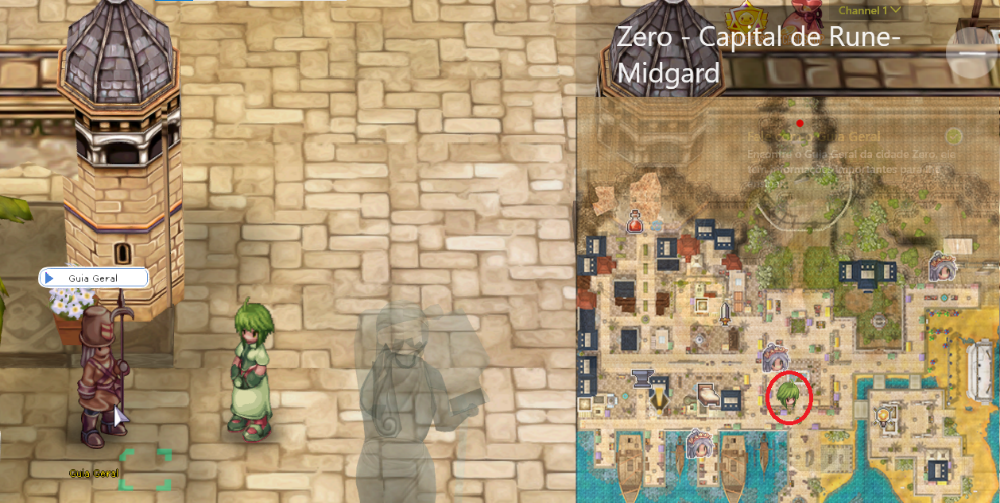<figcaption>
<mark style="color:red;"><strong>Following the General Guide's Steps.</strong></mark>
</figcaption></figure>

### **1.2 \[ Report Your Learning to Joshua ]**

* After talking to <mark style="color:red;">**Joshua**</mark>, he will congratulate you on your achievement.
* You will receive <mark style="color:blue;">**\[20x**</mark> .png>) <mark style="color:blue;">**Blue Herbs]**</mark> as a reward.

<figure><figcaption>
<mark style="color:red;"><strong>Breaking Your Limit Lv.30</strong></mark>
</figcaption></figure>

### **1.3 \[ Get Stronger ]**

* Next, he will ask you to **reach Level 30** to proceed.
* You can reach **Level 30** by going to the **"**<mark style="color:red;">**Payon Cave**</mark>**"**, in the city of **Payon**.
* **After reaching Level 30, return to&#x20;**<mark style="color:red;">**Joshua**</mark>.
* You will receive <mark style="color:blue;">**\[50x**</mark> .png>) <mark style="color:blue;">**Blue Herbs]**</mark> as a reward.

<table><thead><tr><th width="365">Joshua</th><th>Payon Cave</th></tr></thead><tbody><tr><td>
 

<mark style="color:red;"><strong>Breaking Limit Lv.30</strong></mark>
</td><td>

<mark style="color:red;"><strong>Recommended Area for Lv.30</strong></mark>
</td></tr></tbody></table>

### **1.4 \[ Horde Control ]**

* Joshua will then ask you to go to the **"Payon Cave"**.
* Inside the cave, **defeat&#x20;**<mark style="color:red;">**200 Skeletons**</mark>.
* After defeating the monsters, return to Joshua, and he will congratulate you.
* You will receive <mark style="color:blue;">**\[2x**</mark> .png>) <mark style="color:blue;">**Yggdrasil Leaf]**</mark> as a reward.

| Entrance to Payon Cave                                                                                                                                                              | Payon Cave                                                                                                                                                                    |
| ----------------------------------------------------------------------------------------------------------------------------------------------------------------------------------- | ----------------------------------------------------------------------------------------------------------------------------------------------------------------------------- |
| 

<em><mark style="color:red;"><strong>Location of the entrance to Payon Cave.</strong></mark></em>
 | 

<em><mark style="color:red;"><strong>Skeleton inside Payon Cave.</strong></mark></em>
 |

<figure><figcaption>
<mark style="color:red;"><strong>Finishing the 200 Skeletons</strong></mark>
</figcaption></figure>

### **1.5 \[ Find King Zell II ]**

* Joshua will ask you to find **"Lupina"** to learn more about King Zell II.
* Head south of **Zero** city, near the bridge.
* After speaking with **"**<mark style="color:red;">**Lupina**</mark>**"**, she will share some information.
* You will receive <mark style="color:blue;">**\[1x**</mark> .png>) <mark style="color:blue;">**Combat Manual]**</mark> as a reward.

<figure><figcaption>
<mark style="color:red;"><strong>Location of Lupina for information about King Zell II.</strong></mark>
</figcaption></figure>

### **1.6 \[ Help Lupina ] Part 1/2**

* When speaking with **"Lupina"** again, she will ask you to bring a **"**<mark style="color:red;">**Gem**</mark>**"** from any monster in the **"Zero Sewer"**.
* To obtain the **Gem**, talk to the **"**<mark style="color:red;">**Sewer Recruiter**</mark>**"**.
* After obtaining a **"Gem"** from any sewer monster, return to **Lupina** to deliver it.
* You will receive <mark style="color:blue;">**\[1x**</mark> .png>) <mark style="color:blue;">**Polishing Gem]**</mark> as a reward.

<table><thead><tr><th width="374">Sewer Recruiter</th><th>Zero Sewer</th></tr></thead><tbody><tr><td>
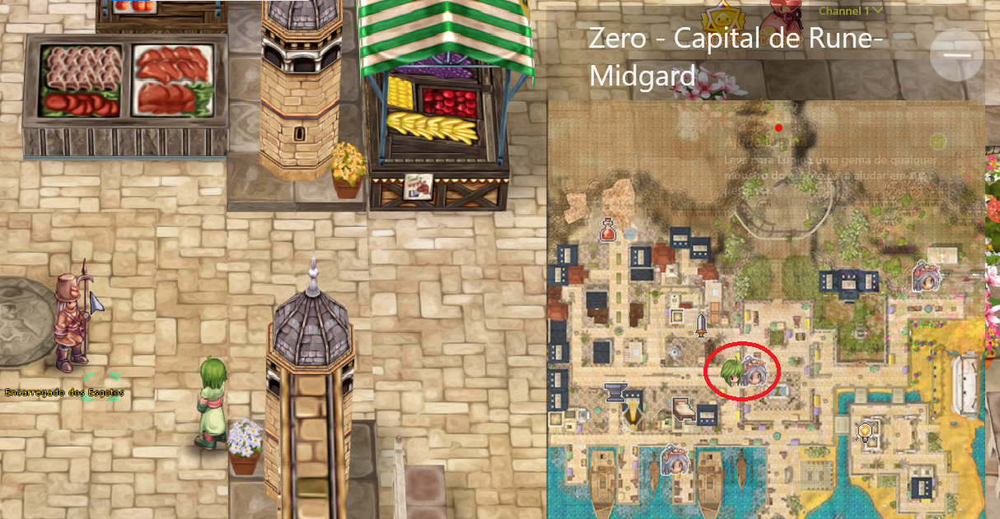

<mark style="color:red;"><strong>Location where Lupina asks you to go.</strong></mark>
</td><td>
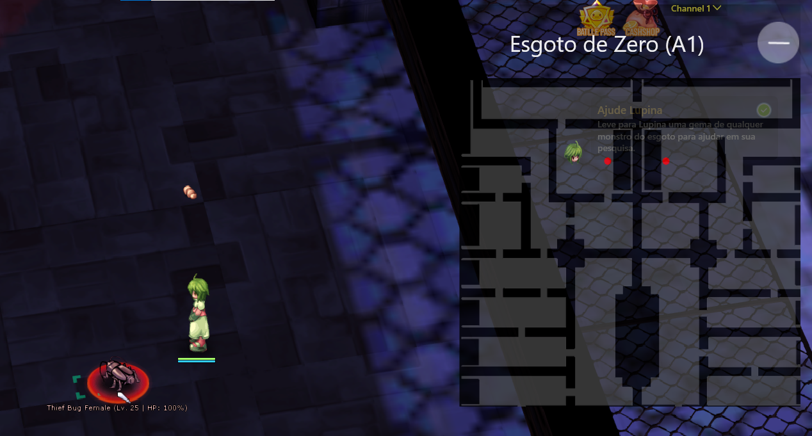

<mark style="color:red;"><strong>Location to obtain the Gem.</strong></mark>
</td></tr></tbody></table>

### **1.7 \[ Help Lupina ] Part 2/2**

* After receiving your reward, talk to **"Lupina"** again.
* <mark style="color:red;">**You will notice that no quest will appear, and that's okay.**</mark>
* She asks you to find **"King Zell II"** in the city of **Morroc**.
* To do this, you must **meet the population in the lower-left corner of&#x20;**<mark style="color:red;">**Morroc**</mark>.
* Talk to **"**<mark style="color:red;">**Shenya**</mark>**"**, she will explain the situation in the city. Select the option **"**<mark style="color:red;">**Trust me**</mark>**"**.

<figure><figcaption>
<mark style="color:red;"><strong>Second part "Preparatory for the next mission".</strong></mark>
</figcaption></figure>

### **1.7 \[ The Mystery of Morroc ]**

* Now that you have heard <mark style="color:red;">**Shenya**</mark><mark style="color:red;">'s</mark> complaints, she will ask you to request explanations from **King Zell II**.
* Find him in the upper corner of **Morroc**, where several guards will be at the gate.
* First, talk to one of the **Guards**, who will explain a few things.
* Then, <mark style="color:red;">**King Zell II**</mark> will appear among the guards. Talk to him.
* He will explain some things, and then you will be **teleported to the "**<mark style="color:red;">**Inside of Morroc"**</mark>.
* Speak with **King Zell II** again, and he will ask you to return to <mark style="color:red;">**Shenya**</mark> and talk to her.
* Upon speaking with <mark style="color:red;">**Shenya**</mark>, she will understand what happened to the city.
* You will receive <mark style="color:blue;">**\[50x**</mark> .png>) <mark style="color:blue;">**Blue Herb]**</mark> as a reward.

| Guard's Location                                                                                                                                           | Inside of Morroc                                                                                                                                     | Shenya                                                                                                                                                   |
| ---------------------------------------------------------------------------------------------------------------------------------------------------------- | ---------------------------------------------------------------------------------------------------------------------------------------------------- | -------------------------------------------------------------------------------------------------------------------------------------------------------- |
| 
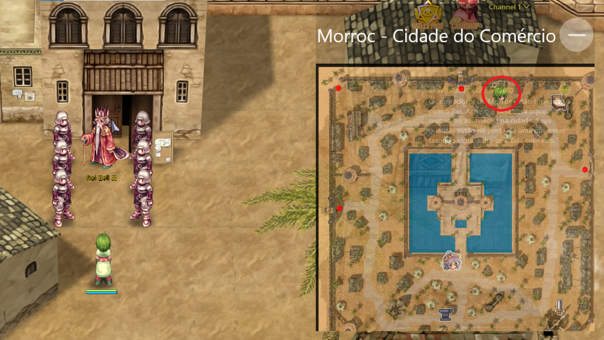

<mark style="color:red;"><strong>Location of Zell's Guards.</strong></mark>
 | 

<mark style="color:red;"><strong>Zell's Private Room.</strong></mark>
 | 

<mark style="color:red;"><strong>Shenya's Explanation.</strong></mark>
 |

### **1.8 \[ Calmed Population ]**

* Return to the **"**<mark style="color:red;">**New Location**</mark>**"** where **King Zell II** is.
* Talk to **King Zell II** about what happened to the villagers.
* You will receive <mark style="color:blue;">**\[100x**</mark> .png>) <mark style="color:blue;">**Blue Herb]**</mark> as a reward.

<table><thead><tr><th width="376">King Zell II's Quarters</th><th>Inside of Morroc</th></tr></thead><tbody><tr><td>
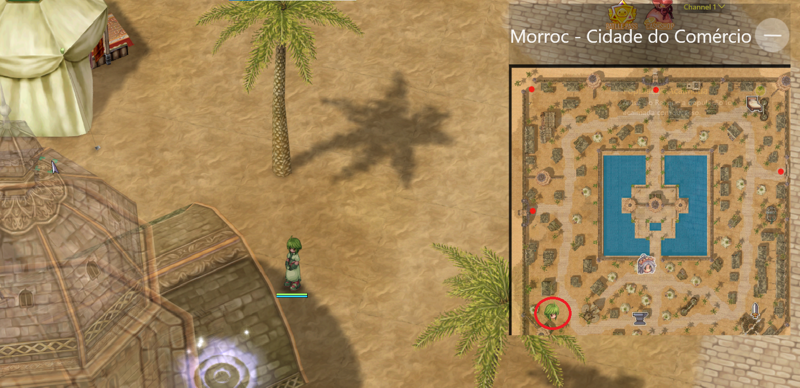

<em><mark style="color:red;"><strong>New location where King Zell II is found.</strong></mark></em>
</td><td>

<mark style="color:red;"><strong>King Zell II.</strong></mark>
</td></tr></tbody></table>

### **1.9 \[ Report to the King ]**

* Return to **Zero City**, where **"Lupina"** is located.
* **King Zell II** will be beside her, <mark style="color:red;">**talk to him**</mark> about the city of **"Prontera"**.
* You will receive <mark style="color:blue;">**\[2x**</mark> .png>) <mark style="color:blue;">**Yggdrasil Fruit]**</mark> as a reward.

<figure>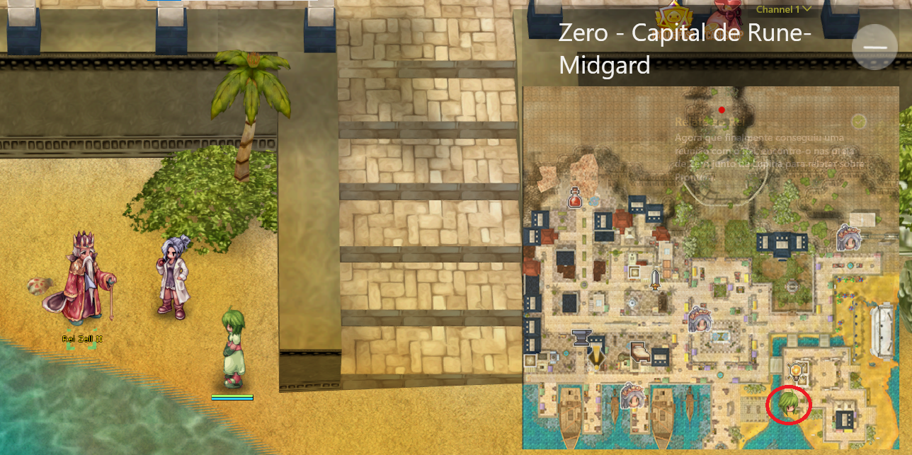<figcaption>
<mark style="color:red;"><strong>King Zell beside Lupina in Zero.</strong></mark>
</figcaption></figure>



### **2.0 \[ Find the Collector ]**

* Go to **Geffen City** and talk to **"The Great Collector"**.
* **Harald** is the NPC known by this title.
* Talk to him and choose the option **"Hello, Great Collector"**.
* You will receive <mark style="color:blue;">**\[2x**</mark> .png>) <mark style="color:blue;">**Yggdrasil Fruits]**</mark> as a reward.

<figure><figcaption>
<em><mark style="color:red;"><strong>Harald is known as "The Great Collector".</strong></mark></em>
</figcaption></figure>

### **2.1 \[ Complete a Collection ]**

* **Harald** will ask you to complete one of the collections.
* <mark style="color:red;">**Payon Cave A2**</mark> <mark style="color:red;">or</mark> <mark style="color:red;">**Geffen Surroundings 10**</mark><mark style="color:red;">.</mark>
* After completing one of the collections on the map using **"ALT+C"**, return to <mark style="color:red;">**Harald**</mark>.
* You will receive <mark style="color:blue;">**\[1x**</mark> .png>) <mark style="color:blue;">**Reset Stone]**</mark> as a reward.

<table><thead><tr><th width="373">Pay_dun01</th><th>Gef_fild10</th></tr></thead><tbody><tr><td>

<em><mark style="color:red;"><strong>Cave of Payon (A2) - Example of a Complete Collection.</strong></mark></em>
</td><td>

<em><mark style="color:red;"><strong>Geffen Surroundings (10) - Optional Map.</strong></mark></em>
</td></tr></tbody></table>

### **2.2 \[ Increasing Masteries ]**

* **Harald** asks you to go to **"Zero"** city and obtain at least **70 Mastery Points**.
* Upon arriving in **Zero**, talk to the **"**<mark style="color:red;">**Mastery Academic**</mark>**"**.
* The first time you talk to him, you will receive **7 free points**.
* However, you still need to buy **70 points** from him.
* The **70 points** purchase (if you have never bought them) will cost around <mark style="color:red;">**621,250 Zeny**</mark>.
* After obtaining the **70 points**, return to <mark style="color:red;">**Harald**</mark>.
* Talk to **Harald** and choose the option **"**<mark style="color:red;">**What’s the next step?**</mark>**"**.
* You will receive <mark style="color:blue;">**\[1x**</mark> .png>) <mark style="color:blue;">**Neuralizer]**</mark> as a reward.

<figure><figcaption>
<mark style="color:red;"><strong>NPC Mastery Academic in Zero.</strong></mark>
</figcaption></figure>

### **2.3 \[ Find Vivus in Payon ]**

* Go to **Payon City** and look for the NPC named **"**<mark style="color:red;">**Vivus**</mark>**"**.
* When you find **Vivus**, talk to him, as he will ask you to defeat some monsters.
* You will receive <mark style="color:blue;">**\[4x**</mark> .png>) <mark style="color:blue;">**Yggdrasil Fruits]**</mark> as a reward.

<figure><figcaption>
<mark style="color:red;"><strong>Vivus in Payon</strong></mark>
</figcaption></figure>

### **2.4 \[ Restricted Combat ]**

* **Vivus** will ask you to go to **"**<mark style="color:red;">**Payon Cave A2**</mark>**"** and defeat some monsters.
* You need to eliminate <mark style="color:red;">**80 Archer Skeletons**</mark> and <mark style="color:red;">**100 Soldier Skeletons**</mark>.
* After defeating all the monsters, return to <mark style="color:red;">**Vivus**</mark>.
* He will thank you for your effort.
* You will receive <mark style="color:blue;">**\[1x**</mark> .png>) <mark style="color:blue;">**Mastery Pouch]**</mark> as a reward.

<figure><figcaption>
<mark style="color:red;"><strong>Cave of Payon A2 (Pay_dun01).</strong></mark>
</figcaption></figure>

### **2.5 \[ Return to Joshua ] Part 1/2**

* **Vivus** will ask you to go to **Joshua** to report your progress.
* Upon arriving in **Zero City**, **talk to&#x20;**<mark style="color:red;">**Joshua**</mark>, and he will explain the next mission.
* You will receive <mark style="color:blue;">**\[4x**</mark> .png>) <mark style="color:blue;">**Yggdrasil Fruits]**</mark> as a reward.

<figure><figcaption>
<mark style="color:red;"><strong>Reporting Vivus' information to Joshua.</strong></mark>
</figcaption></figure>

### **2.6 \[ Return to Joshua ] Part 2/2**

* **Joshua** says that you’ve had a long journey so far and asks you to rest.
* Go to the **inn** in **Zero City** and **rest**.
* Inside the **inn**, talk to the <mark style="color:red;">**Innkeeper**</mark> and choose the option **"**<mark style="color:red;">**Yes**</mark>**"**.
* You will pay a **fee of 400 Zeny** to rest.
* You will be **teleported to a resting room**, click on the **bed** to sleep.
* Return to **Joshua** and talk to him.
* You will receive <mark style="color:blue;">**\[50x**</mark> .png>) <mark style="color:blue;">**White Potion]**</mark> as a reward.

<table><thead><tr><th width="343">Inn Location</th><th>Sleeping Room</th></tr></thead><tbody><tr><td>

<em><mark style="color:red;">Location of the inn icon.</mark></em> 
</td><td>
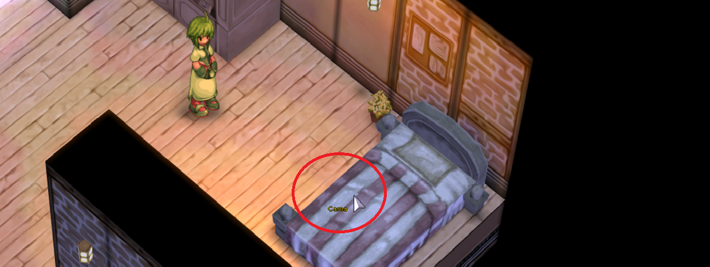

<mark style="color:red;"><strong>Click on the bed to "Sleep".</strong></mark>
</td></tr></tbody></table>

### **2.7 \[ Find the Engineer ]**

* **Joshua** asks you to find the **Engineer of Morroc**.
* To do this, go to the **"**<mark style="color:red;">**Ship Captain**</mark>**"** in **Zero City**.
* Upon reaching the **"Ship Captain"**, talk to him, and he will tell you about his destination.
* You need to go to the **"**<mark style="color:red;">**Island of the Transcendental Heritage Academy**</mark>**"**.
* If the destination is different, you must wait until the correct one appears.
* When the correct location appears, select **"Yes"** and travel to the location.
* After that, talk to the <mark style="color:red;">**Engineer**</mark> and select the first option.
* You will receive <mark style="color:red;">**\[2x**</mark> .png>) <mark style="color:red;">**Yggdrasil Leaf]**</mark> as a reward.

| Ship Captain                                                                                                                                                   | Engineer of Morroc                                                                                                                                                |
| -------------------------------------------------------------------------------------------------------------------------------------------------------------- | ----------------------------------------------------------------------------------------------------------------------------------------------------------------- |
| 
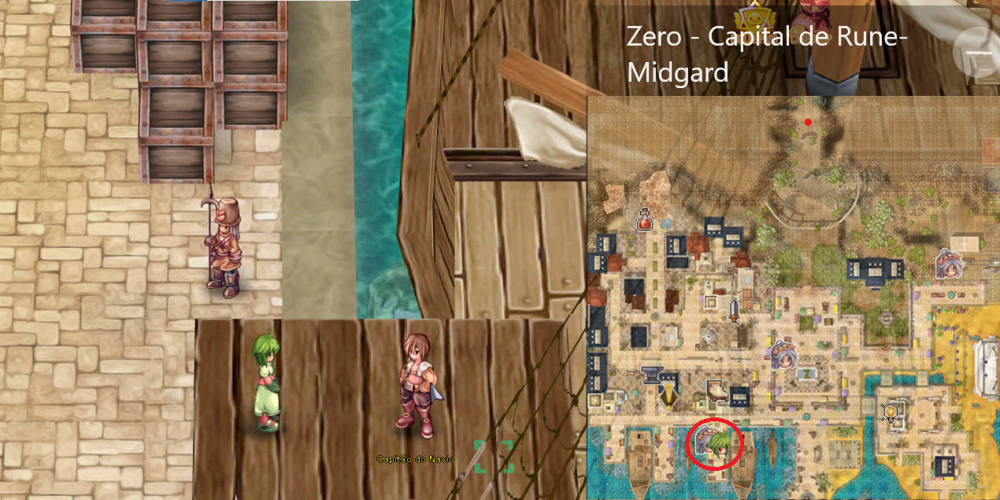

<em><mark style="color:red;"><strong>Ship Captain of Zero.</strong></mark></em>
 | 

<em><mark style="color:red;"><strong>Engineer’s Location.</strong></mark></em>
 |

### **2.8 \[ Gather the Materials ]**

* The **Engineer** will ask you to bring him some items.
* **30x** .png>)**Steel**
* **20x** .png>)**Coal**
* **25x** .png>) **Solid Log**
* **80k Zeny**
* After gathering all the items, return to the **Engineer** and talk to him again.
* You will receive <mark style="color:blue;">**\[1x**</mark> .png>) <mark style="color:blue;">**Small Mastery Pouch]**</mark> as a reward.

<figure><figcaption>
<mark style="color:red;"><strong>Engineer - Island of the Transcendental Heritage Academy.</strong></mark>
</figcaption></figure>

### **2.9 \[ Return to Joshua ]**

* After that, return to NPC **"**<mark style="color:red;">**Joshua**</mark>**"** in **Zero City** and report your progress to him.

<figure><figcaption>
<em><mark style="color:red;"><strong>Passed the Engineer's information to Joshua.</strong></mark></em>
</figcaption></figure>



### **3.0 \[ Find Tomoe ] Part 1/2**

* **Joshua** asks you to go to **Niflheim** and find NPC **"**<mark style="color:red;">**Tomoe**</mark>**"**.
* Inside the city, go to the **house** next to it, and upon entering, you will find him.
* Talk to **Tomoe**, and he will ask for **2x** .png>) **Hot Tea**.
* You will receive <mark style="color:blue;">**\[2x**</mark> .png>) <mark style="color:blue;">**Repair Scroll]**</mark> as a reward.

| Location in Niflheim                                                                                                                          | Tomoe                                                                                                                                                   |
| --------------------------------------------------------------------------------------------------------------------------------------------- | ------------------------------------------------------------------------------------------------------------------------------------------------------- |
| 
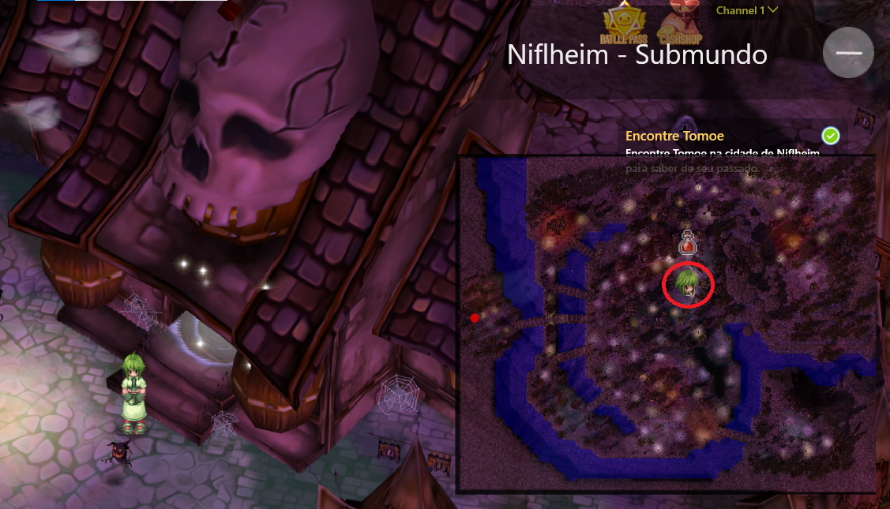

<em><mark style="color:red;">Where Tomoe is found.</mark></em>
 | 

<em><mark style="color:red;">Tomoe inside the house.</mark></em>
 |

### **3.1 \[ Find Tomoe ] Part 2/2**

* After delivering **2x** .png>) **Hot Tea** to **Tomoe**, he will ask you to find **King Zell II**.
* **King Zell II** is now in the new city of **Prontera**. Go to a **Kafra** and choose the city.
* To find him, he is in **North Prontera, in the city center**.

<figure><figcaption>
<mark style="color:red;"><strong>King Zell in the new Prontera.</strong></mark>
</figcaption></figure>

### **3.2 \[ Unlock Aura ]**

* After talking to **King Zell II**, he will ask you to go to **Payon City**.
* In the city, find the NPC **"**<mark style="color:red;">**Aura Master**</mark>**"**.
* Acquire **any Aura at level 3**.
* After acquiring your **level 3 Aura**, return to **King Zell II**.
* He will then ask you to find **"Tomoe"** again.
* You will receive <mark style="color:red;">**\[1x**</mark> .png>) <mark style="color:red;">**Chewing Gum]**</mark> as a reward.

<figure>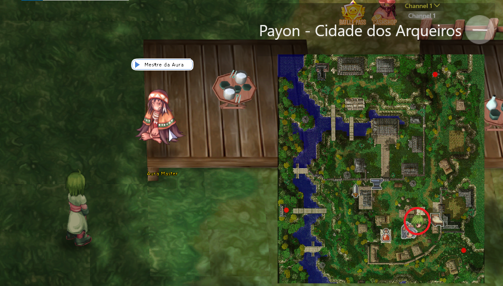<figcaption>
<mark style="color:red;"><strong>NPC "Mestre da Aura".</strong></mark>
</figcaption></figure>

### **3.3 \[ NAMELESS Mission ]**

* <mark style="color:red;">This mission</mark> <mark style="color:red;">**will not initially appear in the log**</mark><mark style="color:red;">.</mark>
* Go to **Niflheim** and find **Tomoe** again.
* When talking to **Tomoe**, choose the option **"I'm Ready!"**.
* He will request **2x** .png>) <mark style="color:red;">**Colossal Spear Blade**</mark> (The Blade is **not consumed** after delivery).
* The **Blade** can be **purchased** in the Global Market between players.
* The **Blade** can also be obtained by defeating the <mark style="color:red;">**MVP Lord of the Dead**</mark> (**Group Recommended**).
* After obtaining the **2 Blades**, return to **Tomoe**.

| Tomoe                                                                                                                                                                       | Lâmina de Lança Colossal                                                                                                                                                     |
| --------------------------------------------------------------------------------------------------------------------------------------------------------------------------- | ---------------------------------------------------------------------------------------------------------------------------------------------------------------------------- |
| 

<em><mark style="color:red;"><strong>Talk to Tomoe about the Blade.</strong></mark></em>
 | 
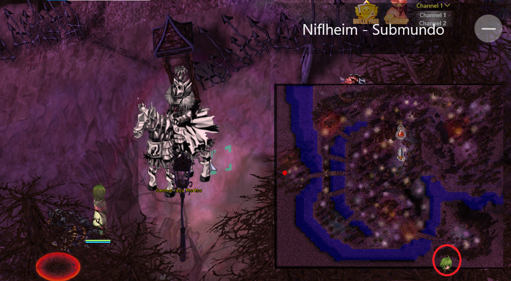

<em><mark style="color:red;"><strong>MVP Lord of the Dead (Spear Blade).</strong></mark></em>
 |

### **3.4 \[ Deliver the Blade to the Scientist ] Part 1/2**

* Go to **Prontera City**, head to the **lower right part** of the city, and you will find the <mark style="color:red;">**Scientist**</mark>.
* Talk to the **Scientist** and select the option **"Tomoe sent me."**, then choose **"Really?"**.
* You will receive <mark style="color:blue;">**\[1x**</mark> .png>) <mark style="color:blue;">**Chewing Gum]**</mark> as a reward.

<figure><figcaption>
<em><mark style="color:red;"><strong>Talk to the scientist about the Colossal Spear Blade.</strong></mark></em>
</figcaption></figure>

### **3.5 \[ Deliver the Blade to the Scientist ] Part 2/2**

* Next, the **Scientist** will ask you to bring him some items:
  * 5x .png>) Fabric
  * 10x .png>)Alcohol
  * 20x .png>) Meat
* After gathering all the items, <mark style="color:red;">**deliver them to the Scientist**</mark>.
* He will then ask you to talk to **Tomoe**.
* You will receive <mark style="color:blue;">**\[5x**</mark> .png>) <mark style="color:blue;">**Scroll for Increased Agility]**</mark> as a reward.

<figure><figcaption>
<em><mark style="color:red;"><strong>Gather all the items and deliver them to the Scientist.</strong></mark></em>
</figcaption></figure>

### **3.6 \[ Complete the Niflheim Collection ]**

* When speaking with **Tomoe**, he will ask you to complete the **"Collection"** of <mark style="color:red;">**Niflheim City**</mark> (ALT+C).
* After completing the **Map Collection**, return to **Tomoe**.
* You will receive <mark style="color:blue;">**\[5x**</mark> .png>) <mark style="color:blue;">**Blessing Scroll]**</mark> as a reward.

<table><thead><tr><th width="368">Tomoe</th><th>Collection of Niflheim</th></tr></thead><tbody><tr><td>

<em><mark style="color:red;"><strong>Talk to Tomoe about the Map Collection.</strong></mark></em>
</td><td>

<mark style="color:red;"><strong>Collection completed for the City of Niflheim.</strong></mark>
</td></tr></tbody></table>

### **3.7 \[ Find Zukko ]**

* Tomoe asks you to go to the city of **Glast Heim** and find the NPC <mark style="color:red;">**Zukko**</mark>.
* Upon finding **Zukko** south of the city of **Glast Heim**, talk to him.
* You will receive as a reward <mark style="color:blue;">**\[1x**</mark> .png>) <mark style="color:blue;">**Holy Ring]**</mark>.

<figure>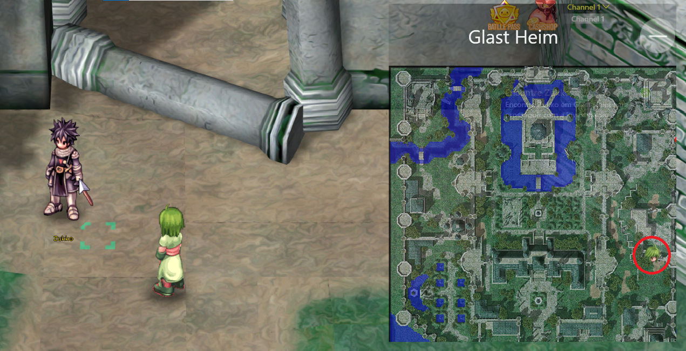<figcaption>
<mark style="color:red;"><strong>NPC Zukko south of the city of Glast Heim.</strong></mark>
</figcaption></figure>

### **3.8 \[ Eliminate Abyss Knight ]**

* **Zukko** asks you to go to the **Cavalry of Glast Heim**.
* <mark style="color:red;">**Eliminate 50x Abyss Knights**</mark>.
* After **defeating** all the knights, return to **NPC Zukko**.
* You will receive as a reward **\[4x** .png>) **Elunium]**.

<table><thead><tr><th width="348">Zukko</th><th>Cavalry of Glast Heim (gl_knt01)</th></tr></thead><tbody><tr><td>

<mark style="color:red;"><strong>NPC Zukko talking about the Knights.</strong></mark>
</td><td>
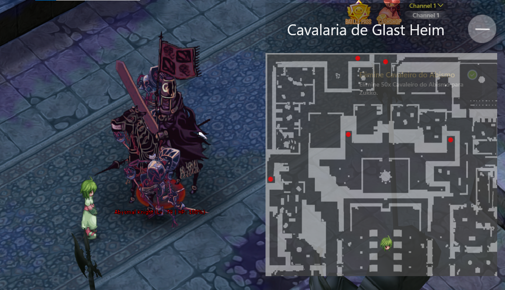

<mark style="color:red;"><strong>Abyss Knight Cavalry</strong></mark>
</td></tr></tbody></table>

<figure><figcaption>
<mark style="color:red;"><strong>After defeating all the Abyss Knights.</strong></mark>
</figcaption></figure>

### **3.9 \[NAMELESS QUEST]**

* <mark style="color:red;">**This quest will initially not appear in the log**</mark>**.**
* **Zukko** asks you to find your father, you can find him on the map to the right of **Glast Heim**.
* **Find your Father, on the map "**<mark style="color:red;">**Geffen 6 Outskirts**</mark>**"**
* Upon reaching the location, you will find the NPC **"**<mark style="color:red;">**Lucius**</mark>**"**.
* Talk to **Lucius**, he will **argue** with you and fight.
* Return and report what happened to NPC <mark style="color:red;">**Zukko**</mark>.

| Entry Location to Find Your Father                                                                                                                              | Lucius                                                                                                                                                              |
| --------------------------------------------------------------------------------------------------------------------------------------------------------------- | ------------------------------------------------------------------------------------------------------------------------------------------------------------------- |
| 
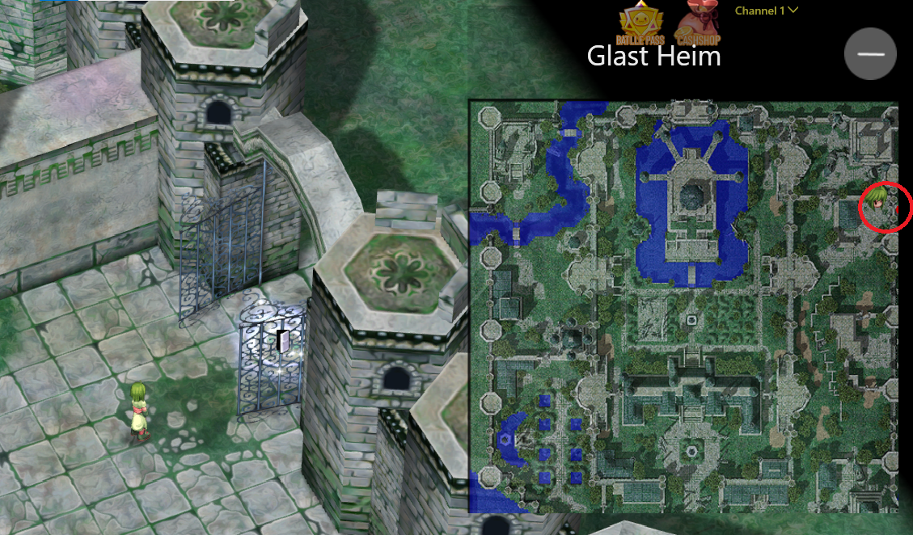

<mark style="color:red;"><strong>Entrance to Geffen 6 Outskirts.</strong></mark>
 | 
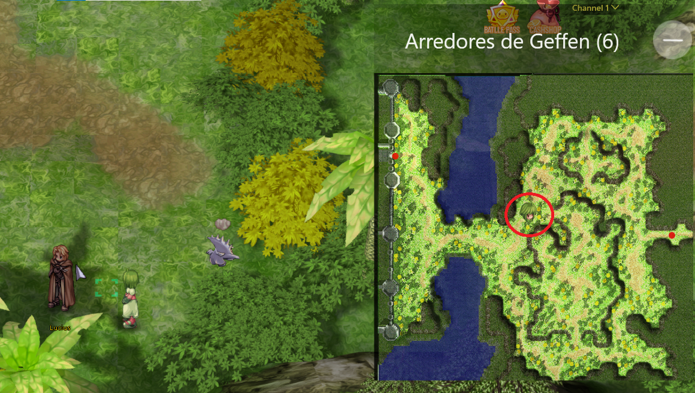

<mark style="color:red;"><strong>Location where NPC Lucius is found.</strong></mark>
 |



### **4.0 \[Lucius' Report]**

* When talking to <mark style="color:red;">**Zukko**</mark>, he will explain some things and ask you to go to **Tomoe**.
* You will receive a reward <mark style="color:blue;">**\[5x**</mark> .png>) <mark style="color:blue;">**Guarana Candy]**</mark>.

<figure><figcaption>
<mark style="color:red;"><strong>Caption: Lucius' report to Zukko.</strong></mark>
</figcaption></figure>

### **4.1 \[Ask the Scientist for Help]**

* When talking to **Tomoe**, he asks you to go to the **scientist** in **Prontera**.
* You will receive a reward <mark style="color:blue;">**\[5x**</mark> .png>) <mark style="color:blue;">**Tropical Fruit Salad]**</mark>.
* **He will explain some things and request a list of items:**
  * 2x .png>)Dullahan's Eye
  * 150x .png>)Venomous Canine
  * 1x .png>)Empty Bottle
  * 30x .png>)Bee Sting
  * 20x .png>)Horrendous Hair
  * 10x .png>)Yggdrasil Fruit
  * 10x .png>)Mastela
  * 10x .png>)White Dye
  * 10x .png>)Black Dye
  * 10x .png>)Red Dye
  * 10x .png>)Green Dye
  * 10x .png>)Yellow Dye
* After delivering all the items, he will ask you to **go back to Tomoe** to report.

| Talk to Tomoe first                                                                                                                                                             | Then talk to the scientist                                                                                                                                                    |
| ------------------------------------------------------------------------------------------------------------------------------------------------------------------------------- | ----------------------------------------------------------------------------------------------------------------------------------------------------------------------------- |
| 

<mark style="color:red;"><strong>Talk to Tomoe first to get the information.</strong></mark>
 | 

<mark style="color:red;"><strong>The scientist will explain about the cure.</strong></mark>
 |

### **4.2 \[Assemble the Elite Battalion]**

* **Tomoe** asks you to convince **Vivus** and **Harald**.
* **Talk to each of them.**
* However, **Harald** will ask you for **20x** .png>) **Oridecon** and **20x** .png>) **Elunium**.
* You will receive the following rewards:
  * <mark style="color:blue;">**\[1x**</mark> .png>) <mark style="color:blue;">**Precious Stones Box Lv.1]**</mark>.
  * <mark style="color:blue;">**\[2x**</mark> .png>) <mark style="color:blue;">**Small Mastery Pouch]**</mark>.

| Talk to Vivus first.                                                                                                                                     | Talk to Harald                                                                                                                                                                  |
| -------------------------------------------------------------------------------------------------------------------------------------------------------- | ------------------------------------------------------------------------------------------------------------------------------------------------------------------------------- |
| 

<mark style="color:red;"><strong>Talk to Vivus first.</strong></mark>
 | 

<mark style="color:red;"><strong>Talk to Harald (He will ask you for items).</strong></mark>
 |

### **4.3 \[Use the Dagger]**

* **Tomoe** asks you to go to <mark style="color:red;">**Lucius**</mark> and use the dagger on him.
* You must use the dagger on his **"Leg"**.
* You will receive the following reward:
  * <mark style="color:blue;">**\[1x**</mark> .png>) <mark style="color:blue;">**Monster Assistant Box Lv.2]**</mark>.

<figure><figcaption>
<mark style="color:red;"><strong>Use the dagger on Lucius' leg. </strong></mark><em><mark style="color:red;"><strong>(If you miss, you will die and have to return.)</strong></mark></em>
</figcaption></figure>

### **4.4 \[Report to Tomoe]**

* After recovering **Lucius'** memory, go to <mark style="color:red;">**Tomoe**</mark> and report what happened.
* You will receive the following reward:
  * <mark style="color:blue;">**\[3x**</mark> .png>) <mark style="color:blue;">**Elemental Card]**</mark>.

<figure><figcaption>
<mark style="color:red;"><strong>After using the knife on Lucius, talk to Tomoe.</strong></mark>
</figcaption></figure>

### **4.5 \[New Directives with Zell]**

* **Tomoe** asks you to go to the city of Prontera and speak with <mark style="color:red;">**Rei Zell II**</mark>.
* You will receive the following reward:
  * <mark style="color:blue;">**\[3x**</mark> .png>)<mark style="color:blue;">**Attack Card]**</mark>.

<figure><figcaption>
<mark style="color:red;"><strong>Talk to Rei Zell II.</strong></mark>
</figcaption></figure>

### **4.6 \[Eliminate Lava Golem]**

* Rei Zell II asks you to defeat <mark style="color:red;">**150x**</mark> <mark style="color:red;">**Lava Golem**</mark>.
* After that, Rei Zell II asks you to defeat <mark style="color:red;">**200x Apocalypse**</mark>.
* Then, Rei Zell II asks you to defeat <mark style="color:red;">**200x Anubis**</mark>.
* After defeating all **Lava Golems**, return to **Rei Zell II**.
* After defeating all **Apocalypse**, return to **Rei Zell II**.
* After defeating all **Anubis**, return to **Rei Zell II**.
* You will receive the following rewards:
  * \[150x .png>) **Contribution Coin**].
  * \[1x .png>) **Enriched Oridecon**].

| mag\_dun01                                                                                                                                                                   | juperos\_02                                                                                                                                                                  | sphinx4                                                                                                                                                                  |
| ---------------------------------------------------------------------------------------------------------------------------------------------------------------------------- | ---------------------------------------------------------------------------------------------------------------------------------------------------------------------------- | ------------------------------------------------------------------------------------------------------------------------------------------------------------------------ |
| 

<mark style="color:red;"><strong>Defeat 150 Lava Golems</strong> (mag_dun01).</mark>
 | 

<mark style="color:red;"><strong>Defeat 200 Apocalypse</strong> (juperos_02).</mark>
 | 

<mark style="color:red;"><strong>Defeat 200 Anubis</strong> (in_sphinx4).</mark>
 |

<figure><figcaption>
<mark style="color:red;"><strong>All Lava Golems defeated.</strong></mark>
</figcaption></figure>

<figure><figcaption>
<mark style="color:red;"><strong>All Apocalypse defeated.</strong></mark>
</figcaption></figure>

<figure><figcaption>
<mark style="color:red;"><strong>All Anubis defeated.</strong></mark>
</figcaption></figure>

### **4.7 \[Find Sarina]**

* After defeating all the monsters, talk to **Rei Zell II**, he will tell you about **Sarina**.
* You will receive the reward:
  * \[1x .png>) **Sarina’s Letter**].
* After receiving **"**<mark style="color:red;">**Sarina’s Letter**</mark>**"**, click on it with the **left mouse button** and read it.
* **After reading the letter, you will have a challenge to complete.**
* <mark style="color:red;">**For each completed challenge, you must read the letter again.**</mark>

#### Challenge List:

1. **First Challenge** – Go to the **Sanctuary** in the north of **Payon**.
2. **Second Challenge** – Go to the **tree** in the center of **Prontera**.
3. **Third Challenge** – Go to the **Orc Dungeon** and find the **skull in the well**.
4. **Fourth Challenge** – Go to the **Orc Village** and find the **skull in the trap**.
5. **Fifth Challenge** – Go to the **Infernal Ant Hell (T1)** and find the **skull on the ground**.
6. **Sixth Challenge** – Go to the **Clock Tower (A1)** and find the **location of the clock hand**.
7. After arriving at each location, **click again on the letter**, and the **"**<mark style="color:red;">**Teleport**</mark>**"** option will appear.
8. Upon teleporting, you will be sent to the **"Monte Mjolnir"** map, with a <mark style="color:red;">**portal in front of you**</mark>.

| Challenges from Sarina's Letter                 | Challenge Locations                                                                                                                                                  |
| ----------------------------------------------- | -------------------------------------------------------------------------------------------------------------------------------------------------------------------- |
| **First Challenge**                             | 

<mark style="color:red;"><strong>Sanctuary of Payon.</strong></mark>
               |
| **Second Challenge**                            | 

<mark style="color:red;"><strong>Tree of Prontera.</strong></mark>
                 |
| 
<strong>Third Challenge</strong>  
 | 
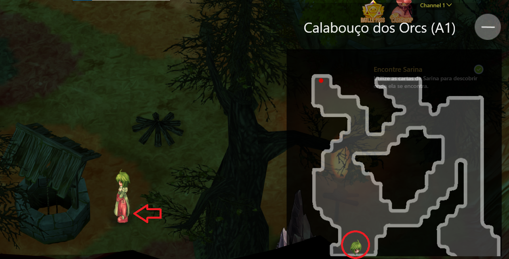

<mark style="color:red;"><strong>Well in the Orc Dungeon (A1).</strong></mark>
        |
| **Fourth Challenge**                            | 
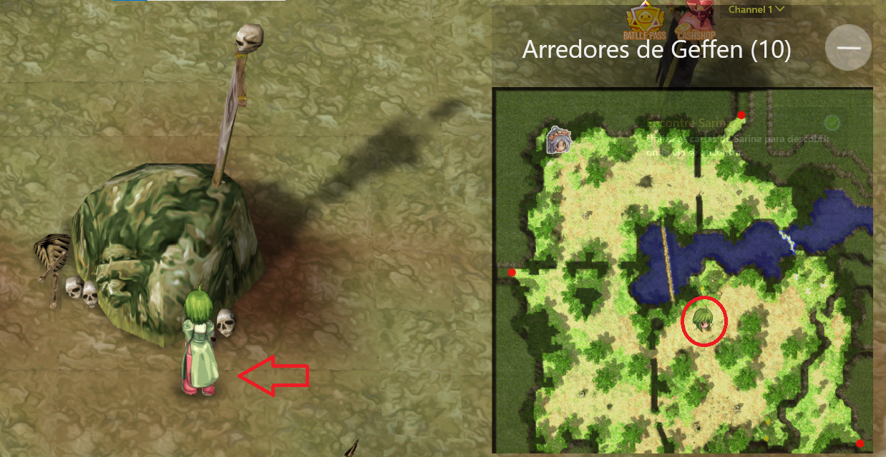

<mark style="color:red;"><strong>Skull on the rock in Orc Village.</strong></mark>
    |
| **Fifth Challenge**                             | 
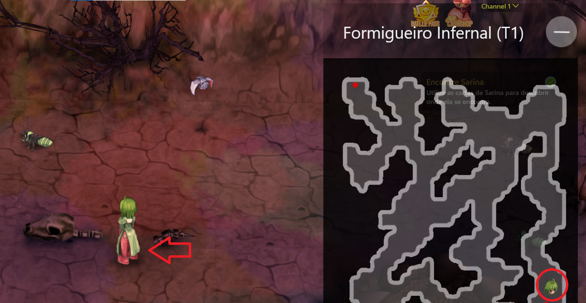

<mark style="color:red;"><strong>Skull in the Infernal Ant Nest (T1).</strong></mark>
 |
| **Sixth Challenge**                             | 

<mark style="color:red;"><strong>Clock Hand in the Clock Tower (A1).</strong></mark>
  |

### **4.8 \[ The Final Challenge - Path to Eldoria ]**

* When you **teleport** to _Monte Mjolnir_, you must <mark style="color:red;">**enter the portal**</mark> in front of you.
* Upon entering the portal, you will be **teleported** to a small room.
* In the portal, choose the option **"Start Challenge"**.
* The challenge consists of you defeating a copy of yourself.
* <mark style="color:red;">**Defeat yourself**</mark>**.**
* After that, you will be **teleported** back outside.
* **Enter the portal again**, now you will go to <mark style="color:red;">**Eldoria**</mark>.
* You will receive the following reward: <mark style="color:blue;">**\[1x**</mark> .png>) <mark style="color:blue;">**Potential Restorer]**</mark>.

| Access to Eldoria.                                                                                                                                         | Protector of Eldoria - Final Challenge                                                                                                                          |
| ---------------------------------------------------------------------------------------------------------------------------------------------------------- | --------------------------------------------------------------------------------------------------------------------------------------------------------------- |
| 
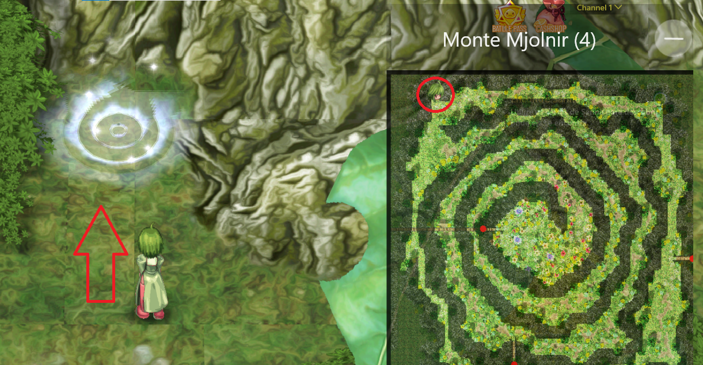

<mark style="color:red;"><strong>Teleport to the challenge.</strong></mark>
 | 

<mark style="color:red;"><strong>Final challenge - You.</strong></mark>
 |

### **Welcome to Eldoria**

* Congratulations! You now have access to <mark style="color:red;">**Eldoria**</mark>.

<figure><figcaption>
<mark style="color:red;"><strong>Congratulations! You now have access to Eldoria.</strong></mark>
</figcaption></figure>




<mark style="color:red;">**Parte 1**</mark>



<mark style="color:red;">**Parte 2**</mark>



<mark style="color:red;">**Parte 3**</mark>



<mark style="color:red;">**Parte 4**</mark>




## **About the Maps**

* Eldoria is divided into <mark style="color:red;">**3 Main Maps**</mark>.



<figure><figcaption>
<mark style="color:red;"><strong>City of Eldoria </strong></mark><em><mark style="color:red;"><strong>"Accessed only through the Main Quest."</strong></mark></em>
</figcaption></figure>

<table><thead><tr><th width="139">Image</th><th>Description</th></tr></thead><tbody><tr><td></td><td>Artisan</td></tr><tr><td></td><td>Kafra</td></tr><tr><td></td><td>Utility Shop</td></tr><tr><td></td><td>Global Market</td></tr></tbody></table>



<figure><figcaption>
<mark style="color:red;"><strong>Map of Eldoria Fields 1</strong></mark>
</figcaption></figure>



<figure><figcaption>
<mark style="color:red;"><strong>Map of Eldoria Fields 2</strong></mark>
</figcaption></figure>



## **Monsters and MVP**

* In **"Eldoria"**, there are several monsters scattered throughout its area.
* Below is the list of monsters in each map.



<figure>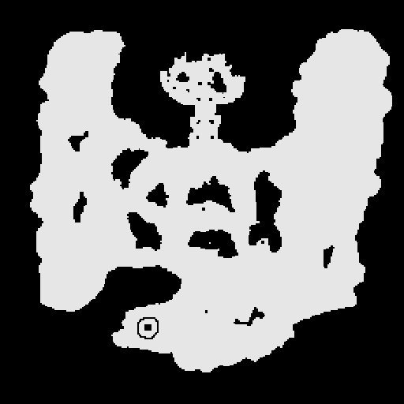<figcaption>
<mark style="color:red;"><strong>Map "Eldoria Fields 1", eld_field.</strong></mark>
</figcaption></figure>

<table><thead><tr><th width="126">Monsters</th><th>Race</th><th>Size</th><th>Element</th></tr></thead><tbody><tr><td>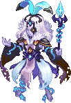Elf Shaman</td><td>Demi-Human</td><td>Medium</td><td>Water</td></tr><tr><td>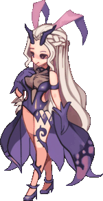Dark Elf</td><td>Demi-Human</td><td>Medium</td><td>Dark</td></tr><tr><td>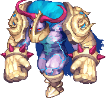Motaro</td><td>Brute</td><td>Large</td><td>Dark</td></tr></tbody></table>



<figure>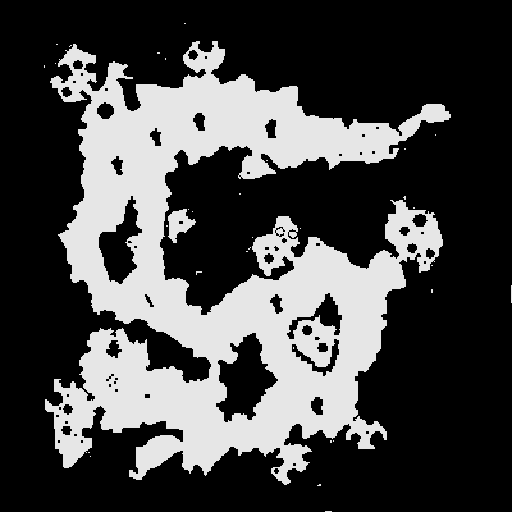<figcaption>
<mark style="color:red;"><strong>Map "Eldoria Fields 2", eldoria.</strong></mark>
</figcaption></figure>

<table><thead><tr><th width="128">Monsters</th><th>Race</th><th>Size</th><th>Element</th></tr></thead><tbody><tr><td>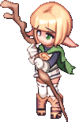 Elfykid</td><td>Demi-Human</td><td>Smalll</td><td>Fire</td></tr><tr><td>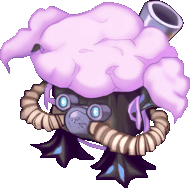MechaTree</td><td>Brute</td><td>Smalll</td><td>Fire</td></tr><tr><td>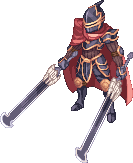Momon</td><td>Demi-Human</td><td>Large</td><td>Undead</td></tr><tr><td>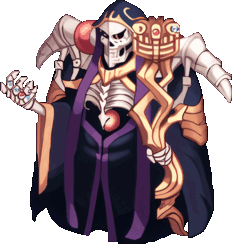Ainz Ooal Gown</td><td>Demon</td><td>Large</td><td>Undead</td></tr></tbody></table>



## **Cards**

* Some new <mark style="color:red;">**Cards**</mark> were also added with the arrival of **Eldoria**.

<table><thead><tr><th width="191">Carta</th><th>Efeito</th></tr></thead><tbody><tr><td> Elf Shaman</td><td>+20% Damage with the skill <mark style="color:blue;">[Frost Lance]</mark>.</td></tr><tr><td> Dark Elf</td><td>+5% MATK and 100 SP.</td></tr><tr><td> Elfykid</td><td>+20% Damage with the skill <mark style="color:red;">[Fire Lance]</mark>.</td></tr><tr><td> MechaTree</td><td>+30% Damage with the skills <mark style="color:orange;">[Stone Column]</mark> and <mark style="color:red;">[Meteor Storm]</mark>.</td></tr><tr><td> Momon</td><td>+5 CRIT and Hit, +25% Damage with the skill <strong>[Tyr's Impact]</strong>.</td></tr><tr><td> Motaro</td><td>When receiving melee physical damage: 0.1% chance to autocast [Unknown Skill] lv.10. Every 10 base levels: +1 ATK, CRIT, and Hit.</td></tr><tr><td> Ainz Ooal Gown</td><td>Ignores 100% of the MDEF of normal monsters and players.</td></tr></tbody></table>

## **Gems**

* Some new <mark style="color:red;">**Gems**</mark> were also added with the arrival of **Eldoria**.

| Gem                                                                                     | Effect                                                                     |
| --------------------------------------------------------------------------------------- | -------------------------------------------------------------------------- |
| 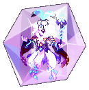 Elf Shaman         | MATK +30. When using a two-handed staff: Neutral property resistance +10%. |
| 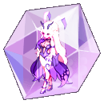 Dark Elf           | MATK +30. Casting cannot be interrupted.                                   |
| 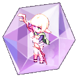 Elfykid            | Perfect Hit +15. CRIT -15.                                                 |
| 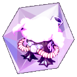 MechaTree          | Reduces damage received from large-size monsters by 7%. Max HP +170.       |
|  Momon          | Critical Damage +10%. Hit -150.                                            |
|  Motaro         | Max HP +3000. Max SP -15%.                                                 |
|  Ainz Ooal Gown | Ignores 70% of the DEF of normal monsters and players.                     |

## **New Items**

* Some new <mark style="color:red;">**Equipment**</mark> was also added with the arrival of **Eldoria**.

<table><thead><tr><th width="222">Monster</th><th>Item</th></tr></thead><tbody><tr><td><strong>Motaro</strong></td><td></td></tr><tr><td> <strong>Ainz Ooal Gown</strong></td><td></td></tr></tbody></table>
