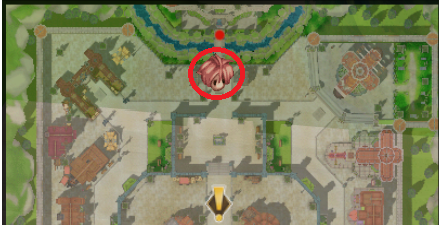

# 🏞️ EP. Eldoria

## **วิธีเข้าถึง Eldoria**

* ก่อนอื่นคุณต้องทำภารกิจเริ่มต้นในสนามฝึกอบรมมือใหม่ให้เสร็จและเลือกคลาสของคุณ.
* หลังจากทำการเปลี่ยนงานครั้งแรกเสร็จสิ้น, คุณจะพร้อมที่จะเริ่มการเดินทางไปยัง <mark style="color:red;">**Eldoria**</mark>.
* ในเมืองใดๆ, ไปที่ <mark style="color:red;">**Kafra**</mark>, คลิกที่เธอ, เลือกตัวเลือก **"**<mark style="color:red;">**Teleport**</mark>**"**, และเลือกเมือง **"**<mark style="color:red;">**Zero**</mark>**"**. จากนั้นไปที่ NPC **"**<mark style="color:red;">**Joshua**</mark>**"** เพื่อเริ่มภารกิจหลัก.

<figure><figcaption>
<mark style="color:red;"><strong>เริ่มภารกิจเพื่อเข้าถึง "Eldoria"</strong></mark>
</figcaption></figure>

## ภารกิจหลัก



## **1.0 \[ เรียนรู้เกี่ยวกับ Bestiary กับ Joshua Lv 0 ]**

* พูดคุยกับ <mark style="color:red;">**Joshua**</mark> ในเมือง **Zero** เพื่อเริ่มภารกิจแรกของคุณ.
* เขาจะสอนคุณเกี่ยวกับ Bestiary โดยใช้ **"**<mark style="color:red;">**ALT+B**</mark>**"** เพื่อดูข้อมูลมอนสเตอร์.

<figure><figcaption>
<mark style="color:red;"><strong>จุดเริ่มต้นของทุกสิ่ง Joshua.</strong></mark>
</figcaption></figure>

## **1.1 \[ พูดคุยกับ General Guide ]**

* Joshua จะขอให้คุณพบ NPC **"General Guide"**, ตั้งอยู่ทาง **ใต้** ของเมือง **Zero**.
* พูดคุยกับ NPC **สองครั้ง** และเลือกตัวเลือก **"**<mark style="color:red;">**เกี่ยวกับไอเทม/มอนสเตอร์**</mark>**"**.
* คุณจะได้รับ <mark style="color:blue;">**\[ 10x**</mark> .png>)<mark style="color:blue;">**Ervas Azuis  ]**</mark> เป็นรางวัล.
* หลังจากนั้น, กลับไปที่ **"**<mark style="color:red;">**Joshua**</mark>**"**.

<figure><figcaption>
<mark style="color:red;"><strong>ตามขั้นตอนของ General Guide.</strong></mark>
</figcaption></figure>

## **1.2 \[ รายงานการเรียนรู้ของคุณกับ Joshua ]**

* หลังจากพูดคุยกับ <mark style="color:red;">**Joshua**</mark>, เขาจะยินดีต้อนรับคุณในความสำเร็จของคุณ.
* คุณจะได้รับ <mark style="color:blue;">**\[20x**</mark> .png>) <mark style="color:blue;">**Blue Herbs]**</mark> เป็นรางวัล.

<figure><figcaption>
<mark style="color:red;"><strong>ทำลายขีดจำกัดของคุณ Lv.30</strong></mark>
</figcaption></figure>

## **1.3 \[ แข็งแกร่งขึ้น ]**

* ต่อไป, เขาจะขอให้คุณ **ถึงระดับ 30** เพื่อดำเนินการต่อ.
* คุณสามารถถึง **ระดับ 30** โดยไปที่ **"**<mark style="color:red;">**Payon Cave**</mark>**"**, ในเมือง **Payon**.
* **หลังจากถึงระดับ 30, กลับไปที่**<mark style="color:red;">**Joshua**</mark>.
* คุณจะได้รับ <mark style="color:blue;">**\[50x**</mark> .png>) <mark style="color:blue;">**Blue Herbs]**</mark> เป็นรางวัล.

<table><thead><tr><th width="365">Joshua</th><th>Payon Cave</th></tr></thead><tbody><tr><td>
 

<mark style="color:red;"><strong>ทำลายขีดจำกัด Lv.30</strong></mark>
</td><td>

<mark style="color:red;"><strong>พื้นที่แนะนำสำหรับ Lv.30</strong></mark>
</td></tr></tbody></table>

## **1.4 \[ ควบคุมฝูงชน ]**

* Joshua จะขอให้คุณไปที่ **"Payon Cave"**.
* ภายในถ้ำ, **เอาชนะ**<mark style="color:red;">**200 Skeletons**</mark>.
* หลังจากเอาชนะมอนสเตอร์, กลับไปที่ Joshua, และเขาจะยินดีต้อนรับคุณ.
* คุณจะได้รับ <mark style="color:blue;">**\[2x**</mark> .png>) <mark style="color:blue;">**Yggdrasil Leaf]**</mark> เป็นรางวัล.

| ทางเข้าไปยัง Payon Cave                                                                                                                                                                     | Payon Cave                                                                                                                                                                           |
| ------------------------------------------------------------------------------------------------------------------------------------------------------------------------------------------ | ------------------------------------------------------------------------------------------------------------------------------------------------------------------------------------ |
| 

<em><mark style="color:red;"><strong>ตำแหน่งของทางเข้าถ้ำ Payon.</strong></mark></em>
 | 

<em><mark style="color:red;"><strong>Skeleton ภายใน Payon Cave.</strong></mark></em>
 |

<figure><figcaption>
<mark style="color:red;"><strong>เสร็จสิ้น 200 Skeletons</strong></mark>
</figcaption></figure>

## **1.5 \[ ค้นหา King Zell II ]**

* Joshua จะขอให้คุณค้นหา **"Lupina"** เพื่อเรียนรู้เพิ่มเติมเกี่ยวกับ King Zell II.
* มุ่งหน้าไปทางใต้ของเมือง **Zero**, ใกล้สะพาน.
* หลังจากพูดคุยกับ **"**<mark style="color:red;">**Lupina**</mark>**"**, เธอจะให้ข้อมูลบางอย่าง.
* คุณจะได้รับ <mark style="color:blue;">**\[1x**</mark> .png>) <mark style="color:blue;">**Combat Manual]**</mark> เป็นรางวัล.

<figure><figcaption>
<mark style="color:red;"><strong>ตำแหน่งของ Lupina สำหรับข้อมูลเกี่ยวกับ King Zell II.</strong></mark>
</figcaption></figure>

## **1.6 \[ ช่วย Lupina ] ส่วนที่ 1/2**

* เมื่อพูดคุยกับ **"Lupina"** อีกครั้ง, เธอจะขอให้คุณนำ **"**<mark style="color:red;">**Gem**</mark>**"** จากมอนสเตอร์ใดๆ ใน **"Zero Sewer"**.
* เพื่อให้ได้ **Gem**, พูดคุยกับ **"**<mark style="color:red;">**Sewer Recruiter**</mark>**"**.
* หลังจากได้รับ **"Gem"** จากมอนสเตอร์ในท่อระบายน้ำใดๆ, กลับไปที่ **Lupina** เพื่อส่งมัน.
* คุณจะได้รับ <mark style="color:blue;">**\[1x**</mark> .png>) <mark style="color:blue;">**Polishing Gem]**</mark> เป็นรางวัล.

<table><thead><tr><th width="374">Sewer Recruiter</th><th>Zero Sewer</th></tr></thead><tbody><tr><td>

<mark style="color:red;"><strong>ตำแหน่งที่ Lupina ขอให้คุณไป.</strong></mark>
</td><td>

<mark style="color:red;"><strong>ตำแหน่งเพื่อให้ได้ Gem.</strong></mark>
</td></tr></tbody></table>

## **1.7 \[ ช่วย Lupina ] ส่วนที่ 2/2**

* หลังจากได้รับรางวัลของคุณ, พูดคุยกับ **"Lupina"** อีกครั้ง.
* <mark style="color:red;">**คุณจะสังเกตเห็นว่าไม่มีภารกิจปรากฏขึ้น, และนั่นก็โอเค.**</mark>
* เธอขอให้คุณค้นหา **"King Zell II"** ในเมือง **Morroc**.
* เพื่อทำเช่นนี้, คุณต้อง **พบประชากรในมุมล่างซ้ายของ**<mark style="color:red;">**Morroc**</mark>.
* พูดคุยกับ **"**<mark style="color:red;">**Shenya**</mark>**"**, เธอจะอธิบายสถานการณ์ในเมือง. เลือกตัวเลือก **"**<mark style="color:red;">**Trust me**</mark>**"**.

<figure><figcaption>
<mark style="color:red;"><strong>ส่วนที่สอง "เตรียมพร้อมสำหรับภารกิจถัดไป".</strong></mark>
</figcaption></figure>

## **1.7 \[ ความลึกลับของ Morroc ]**

* ตอนนี้ที่คุณได้ยินคำบ่นของ <mark style="color:red;">**Shenya**</mark>, เธอจะขอให้คุณขอคำอธิบายจาก **King Zell II**.
* ค้นหาเขาในมุมบนของ **Morroc**, ที่ซึ่งมีการ์ดหลายคนอยู่ที่ประตู.
* ก่อนอื่น, พูดคุยกับหนึ่งใน **การ์ด**, ที่จะอธิบายบางสิ่ง.
* จากนั้น, <mark style="color:red;">**King Zell II**</mark> จะปรากฏตัวท่ามกลางการ์ด. พูดคุยกับเขา.
* เขาจะอธิบายบางสิ่ง, และจากนั้นคุณจะถูก **เทเลพอร์ตไปยัง "**<mark style="color:red;">**ภายใน Morroc"**</mark>.
* พูดคุยกับ **King Zell II** อีกครั้ง, และเขาจะขอให้คุณกลับไปที่ <mark style="color:red;">**Shenya**</mark> และพูดคุยกับเธอ.
* เมื่อพูดคุยกับ <mark style="color:red;">**Shenya**</mark>, เธอจะเข้าใจว่าเกิดอะไรขึ้นกับเมือง.
* คุณจะได้รับ <mark style="color:blue;">**\[50x**</mark> .png>) <mark style="color:blue;">**Blue Herb]**</mark> เป็นรางวัล.

| ตำแหน่งการ์ด                                                                                                                                                  | ภายใน Morroc                                                                                                                                           | Shenya                                                                                                                                                          |
| ----------------------------------------------------------------------------------------------------------------------------------------------------------------- | -------------------------------------------------------------------------------------------------------------------------------------------------------- | --------------------------------------------------------------------------------------------------------------------------------------------------------------- |
| 

<mark style="color:red;"><strong>ตำแหน่งของการ์ด Zell.</strong></mark>
 | 

<mark style="color:red;"><strong>ห้องส่วนตัวของ Zell.</strong></mark>
 | 

<mark style="color:red;"><strong>คำอธิบายของ Shenya.</strong></mark>
 |

## **1.8 \[ ประชากรที่สงบลง ]**

* กลับไปที่ **"**<mark style="color:red;">**ตำแหน่งใหม่**</mark>**"** ที่ **King Zell II** อยู่.
* พูดคุยกับ **King Zell II** เกี่ยวกับสิ่งที่เกิดขึ้นกับชาวบ้าน.
* คุณจะได้รับ <mark style="color:blue;">**\[100x**</mark> .png>) <mark style="color:blue;">**Blue Herb]**</mark> เป็นรางวัล.

<table><thead><tr><th width="376">ห้องพักของ King Zell II</th><th>ภายใน Morroc</th></tr></thead><tbody><tr><td>

<em><mark style="color:red;"><strong>ตำแหน่งใหม่ที่ King Zell II อยู่.</strong></mark></em>
</td><td>

<mark style="color:red;"><strong>King Zell II.</strong></mark>
</td></tr></tbody></table>

## **1.9 \[ รายงานไปยัง King ]**

* กลับไปที่ **Zero City**, ที่ **"Lupina"** ตั้งอยู่.
* **King Zell II** จะอยู่ข้างๆ เธอ, <mark style="color:red;">**พูดคุยกับเขา**</mark> เกี่ยวกับเมือง **"Prontera"**.
* คุณจะได้รับ <mark style="color:blue;">**\[2x**</mark> .png>) <mark style="color:blue;">**Yggdrasil Fruit]**</mark> เป็นรางวัล.

<figure><figcaption>
<mark style="color:red;"><strong>King Zell ข้าง Lupina ใน Zero.</strong></mark>
</figcaption></figure>



## **2.0 \[ ค้นหาผู้รวบรวม ]**

* ไปที่ **Geffen City** และพูดคุยกับ **"The Great Collector"**.
* **Harald** เป็น NPC ที่รู้จักกันในชื่อเรื่องนี้.
* พูดคุยกับเขาและเลือกตัวเลือก **"สวัสดี, ผู้รวบรวมที่ยิ่งใหญ่"**.
* คุณจะได้รับ <mark style="color:blue;">**\[2x**</mark> .png>) <mark style="color:blue;">**Yggdrasil Fruits]**</mark> เป็นรางวัล.

<figure><figcaption>
<em><mark style="color:red;"><strong>Harald เป็นที่รู้จักในชื่อ "ผู้รวบรวมที่ยิ่งใหญ่".</strong></mark></em>
</figcaption></figure>

## **2.1 \[ ทำการรวบรวมให้เสร็จสิ้น ]**

* **Harald** จะขอให้คุณทำการรวบรวมหนึ่งในนั้นให้เสร็จสิ้น.
* <mark style="color:red;">**Payon Cave A2**</mark> <mark style="color:red;"></mark><mark style="color:red;">หรือ</mark> <mark style="color:red;"></mark><mark style="color:red;">**Geffen Surroundings 10**</mark><mark style="color:red;">.</mark>
* หลังจากทำการรวบรวมหนึ่งในแผนที่โดยใช้ **"ALT+C"**, กลับไปที่ <mark style="color:red;">**Harald**</mark>.
* คุณจะได้รับ <mark style="color:blue;">**\[1x**</mark> .png>) <mark style="color:blue;">**Reset Stone]**</mark> เป็นรางวัล.

<table><thead><tr><th width="373">Pay_dun01</th><th>Gef_fild10</th></tr></thead><tbody><tr><td>

<em><mark style="color:red;"><strong>ถ้ำของ Payon (A2) - ตัวอย่างการรวบรวมที่เสร็จสิ้น.</strong></mark></em>
</td><td>

<em><mark style="color:red;"><strong>Geffen Surroundings (10) - แผนที่เพิ่มเติม.</strong></mark></em>
</td></tr></tbody></table>

## **2.2 \[ เพิ่มการเชี่ยวชาญ ]**

* **Harald** ขอให้คุณไปที่ **"Zero"** city และได้รับอย่างน้อย **70 Mastery Points**.
* เมื่อมาถึง **Zero**, พูดคุยกับ **"**<mark style="color:red;">**Mastery Academic**</mark>**"**.
* ครั้งแรกที่คุณพูดคุยกับเขา, คุณจะได้รับ **7 คะแนนฟรี**.
* อย่างไรก็ตาม, คุณยังต้องซื้อ **70 คะแนน** จากเขา.
* การซื้อ **70 คะแนน** (ถ้าคุณไม่เคยซื้อ) จะมีค่าใช้จ่ายประมาณ <mark style="color:red;">**621,250 Zeny**</mark>.
* หลังจากได้รับ **70 คะแนน**, กลับไปที่ <mark style="color:red;">**Harald**</mark>.
* พูดคุยกับ **Harald** และเลือกตัวเลือก **"**<mark style="color:red;">**ขั้นตอนถัดไปคืออะไร?**</mark>**"**.
* คุณจะได้รับ <mark style="color:blue;">**\[1x**</mark> .png>) <mark style="color:blue;">**Neuralizer]**</mark> เป็นรางวัล.

<figure><figcaption>
<mark style="color:red;"><strong>NPC Mastery Academic ใน Zero.</strong></mark>
</figcaption></figure>

## **2.3 \[ ค้นหา Vivus ใน Payon ]**

* ไปที่ **Payon City** และมองหา NPC ที่ชื่อ **"**<mark style="color:red;">**Vivus**</mark>**"**.
* เมื่อคุณพบ **Vivus**, พูดคุยกับเขา, เนื่องจากเขาจะขอให้คุณเอาชนะมอนสเตอร์บางตัว.
* คุณจะได้รับ <mark style="color:blue;">**\[4x**</mark> .png>) <mark style="color:blue;">**Yggdrasil Fruits]**</mark> เป็นรางวัล.

<figure><figcaption>
<mark style="color:red;"><strong>Vivus ใน Payon</strong></mark>
</figcaption></figure>

## **2.4 \[ การต่อสู้ที่ถูกจำกัด ]**

* **Vivus** จะขอให้คุณไปที่ **"**<mark style="color:red;">**Payon Cave A2**</mark>**"** และเอาชนะมอนสเตอร์บางตัว.
* คุณต้องกำจัด <mark style="color:red;">**80 Archer Skeletons**</mark> และ <mark style="color:red;">**100 Soldier Skeletons**</mark>.
* หลังจากเอาชนะมอนสเตอร์ทั้งหมด, กลับไปที่ <mark style="color:red;">**Vivus**</mark>.
* เขาจะขอบคุณคุณสำหรับความพยายามของคุณ.
* คุณจะได้รับ <mark style="color:blue;">**\[1x**</mark> .png>) <mark style="color:blue;">**Mastery Pouch]**</mark> เป็นรางวัล.

<figure><figcaption>
<mark style="color:red;"><strong>ถ้ำของ Payon A2 (Pay_dun01).</strong></mark>
</figcaption></figure>

## **2.5 \[ กลับไปที่ Joshua ] ส่วนที่ 1/2**

* **Vivus** จะขอให้คุณไปที่ **Joshua** เพื่อรายงานความก้าวหน้าของคุณ.
* เมื่อมาถึงใน **Zero City**, **พูดคุยกับ**<mark style="color:red;">**Joshua**</mark>, และเขาจะอธิบายภารกิจถัดไป.
* คุณจะได้รับ <mark style="color:blue;">**\[4x**</mark> .png>) <mark style="color:blue;">**Yggdrasil Fruits]**</mark> เป็นรางวัล.

<figure><figcaption>
<mark style="color:red;"><strong>รายงานข้อมูลของ Vivus ให้กับ Joshua.</strong></mark>
</figcaption></figure>

## **2.6 \[ กลับไปที่ Joshua ] ส่วนที่ 2/2**

* **Joshua** กล่าวว่า คุณได้เดินทางมาไกลแล้วและขอให้คุณพักผ่อน.
* ไปที่ **โรงแรม** ใน **Zero City** และ **พักผ่อน**.
* ภายใน **โรงแรม**, พูดคุยกับ <mark style="color:red;">**Innkeeper**</mark> และเลือกตัวเลือก **"**<mark style="color:red;">**ใช่**</mark>**"**.
* คุณจะจ่ายค่าธรรมเนียม **400 Zeny** เพื่อพักผ่อน.
* คุณจะถูก **เทเลพอร์ตไปยังห้องพัก**, คลิกที่ **เตียง** เพื่อหลับ.
* กลับไปที่ **Joshua** และพูดคุยกับเขา.
* คุณจะได้รับ <mark style="color:blue;">**\[50x**</mark> .png>) <mark style="color:blue;">**White Potion]**</mark> เป็นรางวัล.

<table><thead><tr><th width="343">ตำแหน่งโรงแรม</th><th>ห้องนอน</th></tr></thead><tbody><tr><td>

<em><mark style="color:red;">ตำแหน่งของไอคอนโรงแรม.</mark></em> 
</td><td>

<mark style="color:red;"><strong>คลิกที่เตียงเพื่อ "นอน".</strong></mark>
</td></tr></tbody></table>

## **2.7 \[ ค้นหาวิศวกร ]**

* **Joshua** ขอให้คุณค้นหา **วิศวกรของ Morroc**.
* เพื่อทำเช่นนี้, ไปที่ **"**<mark style="color:red;">**Ship Captain**</mark>**"** ใน **Zero City**.
* เมื่อไปถึง **"Ship Captain"**, พูดคุยกับเขา, และเขาจะบอกคุณเกี่ยวกับจุดหมายปลายทางของเขา.
* คุณต้องไปที่ **"**<mark style="color:red;">**Island of the Transcendental Heritage Academy**</mark>**"**.
* หากจุดหมายปลายทางแตกต่าง, คุณต้องรอจนกว่าจะปรากฏขึ้น.
* เมื่อจุดหมายปลายทางที่ถูกต้องปรากฏขึ้น, เลือก **"ใช่"** และเดินทางไปยังตำแหน่งนั้น.
* หลังจากนั้น, พูดคุยกับ <mark style="color:red;">**Engineer**</mark> และเลือกตัวเลือกแรก.
* คุณจะได้รับ <mark style="color:red;">**\[2x**</mark> .png>) <mark style="color:red;">**Yggdrasil Leaf]**</mark> เป็นรางวัล.

| เรือกัปตัน                                                                                                                                                          | วิศวกรของ Morroc                                                                                                                                                       |
| --------------------------------------------------------------------------------------------------------------------------------------------------------------------- | ------------------------------------------------------------------------------------------------------------------------------------------------------------------------ |
| 

<em><mark style="color:red;"><strong>เรือกัปตันของ Zero.</strong></mark></em>
 | 

<em><mark style="color:red;"><strong>ตำแหน่งของวิศวกร.</strong></mark></em>
 |

## **2.8 \[ รวบรวมวัสดุ ]**

* **วิศวกร** จะขอให้คุณนำของบางอย่างให้เขา.
* **30x** .png>)**เหล็ก**
* **20x** .png>)**ถ่านหิน**
* **25x**  .png>) **ไม้แข็ง**
* **80k  Zeny**
* หลังจากรวบรวมของทั้งหมด, กลับไปที่ **วิศวกร** และพูดคุยกับเขาอีกครั้ง.
* คุณจะได้รับ <mark style="color:blue;">**\[1x**</mark> .png>) <mark style="color:blue;">**Small Mastery Pouch]**</mark> เป็นรางวัล.

<figure><figcaption>
<mark style="color:red;"><strong>วิศวกร - เกาะของ Transcendental Heritage Academy.</strong></mark>
</figcaption></figure>

## **2.9 \[ กลับไปที่ Joshua ]**

* หลังจากนั้น, กลับไปที่ NPC **"**<mark style="color:red;">**Joshua**</mark>**"** ใน **Zero City** และรายงานความก้าวหน้าของคุณให้เขาฟัง.

<figure><figcaption>
<em><mark style="color:red;"><strong>ส่งข้อมูลของวิศวกรให้กับ Joshua.</strong></mark></em>
</figcaption></figure>



## **3.0 \[ ค้นหา Tomoe ] ส่วนที่ 1/2**

* **Joshua** ขอให้คุณไปที่ **Niflheim** และค้นหา NPC **"**<mark style="color:red;">**Tomoe**</mark>**"**.
* ภายในเมือง, ไปที่ **บ้าน** ข้างๆ, และเมื่อเข้าไป, คุณจะพบเขา.
* พูดคุยกับ **Tomoe**, และเขาจะขอ **2x** .png>) **Hot Tea**.
* คุณจะได้รับ <mark style="color:blue;">**\[2x**</mark> .png>) <mark style="color:blue;">**Repair Scroll]**</mark> เป็นรางวัล.

| ตำแหน่งใน Niflheim                                                                                                                                 | Tomoe                                                                                                                                                      |
| ---------------------------------------------------------------------------------------------------------------------------------------------------- | ---------------------------------------------------------------------------------------------------------------------------------------------------------- |
| 

<em><mark style="color:red;">ตำแหน่งที่ Tomoe ถูกพบ.</mark></em>
 | 

<em><mark style="color:red;">Tomoe ภายในบ้าน.</mark></em>
 |

## **3.1 \[ ค้นหา Tomoe ] ส่วนที่ 2/2**

* หลังจากส่ง **2x** .png>) **Hot Tea** ให้กับ **Tomoe**, เขาจะขอให้คุณค้นหา **King Zell II**.
* **King Zell II** ตอนนี้อยู่ในเมืองใหม่ **Prontera**. ไปที่ **Kafra** และเลือกเมือง.
* เพื่อค้นหาเขา, เขาอยู่ใน **North Prontera, ในใจกลางเมือง**.

<figure><figcaption>
<mark style="color:red;"><strong>King Zell ใน Prontera ใหม่.</strong></mark>
</figcaption></figure>

## **3.2 \[ ปลดล็อก Aura ]**

* หลังจากพูดคุยกับ **King Zell II**, เขาจะขอให้คุณไปที่ **Payon City**.
* ในเมือง, ค้นหา NPC **"**<mark style="color:red;">**Aura Master**</mark>**"**.
* รับ **Aura ใดๆ ที่ระดับ 3**.
* หลังจากได้รับ **Aura ระดับ 3**, กลับไปที่ **King Zell II**.
* เขาจะขอให้คุณค้นหา **"Tomoe"** อีกครั้ง.
* คุณจะได้รับ <mark style="color:red;">**\[1x**</mark> .png>) <mark style="color:red;">**Chewing Gum]**</mark> เป็นรางวัล.

<figure><figcaption>
<mark style="color:red;"><strong>NPC "Mestre da Aura".</strong></mark>
</figcaption></figure>

## **3.3 \[ ภารกิจที่ไม่มีชื่อ ]**

* <mark style="color:red;">ภารกิจนี้</mark> <mark style="color:red;"></mark><mark style="color:red;">**จะไม่ปรากฏในบันทึกในตอนแรก**</mark><mark style="color:red;">.</mark>
* ไปที่ **Niflheim** และค้นหา **Tomoe** อีกครั้ง.
* เมื่อพูดคุยกับ **Tomoe**, เลือกตัวเลือก **"ฉันพร้อมแล้ว!"**.
* เขาจะขอ **2x**  .png>) <mark style="color:red;">**Colossal Spear Blade**</mark> (ใบมีดจะ **ไม่ถูกใช้** หลังจากส่ง).
* **ใบมีด** สามารถ **ซื้อ** ได้ในตลาดโลกระหว่างผู้เล่น.
* **ใบมีด** ยังสามารถได้รับจากการเอาชนะ <mark style="color:red;">**MVP Lord of the Dead**</mark> (**แนะนำให้เป็นกลุ่ม**).
* หลังจากได้รับ **2 ใบมีด**, กลับไปที่ **Tomoe**.

| Tomoe                                                                                                                                                                              | Lâmina de Lança Colossal                                                                                                                                                            |
| ---------------------------------------------------------------------------------------------------------------------------------------------------------------------------------- | ----------------------------------------------------------------------------------------------------------------------------------------------------------------------------------- |
| 

<em><mark style="color:red;"><strong>พูดคุยกับ Tomoe เกี่ยวกับใบมีด.</strong></mark></em>
 | 

<em><mark style="color:red;"><strong>MVP Lord of the Dead (ใบมีดหอก).</strong></mark></em>
 |

## **3.4 \[ ส่งใบมีดให้กับนักวิทยาศาสตร์ ] ส่วนที่ 1/2**

* ไปที่ **Prontera City**, มุ่งหน้าไปที่ **ส่วนล่างขวา** ของเมือง, และคุณจะพบ <mark style="color:red;">**นักวิทยาศาสตร์**</mark>.
* พูดคุยกับ **นักวิทยาศาสตร์** และเลือกตัวเลือก **"Tomoe ส่งฉันมา."**, จากนั้นเลือก **"จริงเหรอ?"**.
* คุณจะได้รับ <mark style="color:blue;">**\[1x**</mark> .png>) <mark style="color:blue;">**Chewing Gum]**</mark> เป็นรางวัล.

<figure><figcaption>
<em><mark style="color:red;"><strong>พูดคุยกับนักวิทยาศาสตร์เกี่ยวกับใบมีด Colossal Spear.</strong></mark></em>
</figcaption></figure>

## **3.5 \[ ส่งใบมีดให้กับนักวิทยาศาสตร์ ] ส่วนที่ 2/2**

* ต่อไป, **นักวิทยาศาสตร์** จะขอให้คุณนำของบางอย่างให้เขา:
  * 5x  .png>) ผ้า
  * 10x  .png>)แอลกอฮอล์
  * 20x .png>) เนื้อ
* หลังจากรวบรวมของทั้งหมด, <mark style="color:red;">**ส่งให้กับนักวิทยาศาสตร์**</mark>.
* เขาจะขอให้คุณพูดคุยกับ **Tomoe**.
* คุณจะได้รับ <mark style="color:blue;">**\[5x**</mark> .png>) <mark style="color:blue;">**Scroll for Increased Agility]**</mark> เป็นรางวัล.

<figure><figcaption>
<em><mark style="color:red;"><strong>รวบรวมของทั้งหมดและส่งให้กับนักวิทยาศาสตร์.</strong></mark></em>
</figcaption></figure>

## **3.6 \[ ทำการรวบรวม Niflheim ให้เสร็จสิ้น ]**

* เมื่อพูดคุยกับ **Tomoe**, เขาจะขอให้คุณทำการ **"รวบรวม"** ของ <mark style="color:red;">**Niflheim City**</mark> (ALT+C).
* หลังจากทำการรวบรวม **แผนที่** เสร็จสิ้น, กลับไปที่ **Tomoe**.
* คุณจะได้รับ <mark style="color:blue;">**\[5x**</mark> .png>) <mark style="color:blue;">**Blessing Scroll]**</mark> เป็นรางวัล.

<table><thead><tr><th width="368">Tomoe</th><th>การรวบรวมของ Niflheim</th></tr></thead><tbody><tr><td>

<em><mark style="color:red;"><strong>พูดคุยกับ Tomoe เกี่ยวกับการรวบรวมแผนที่.</strong></mark></em>
</td><td>

<mark style="color:red;"><strong>การรวบรวมเสร็จสิ้นสำหรับเมือง Niflheim.</strong></mark>
</td></tr></tbody></table>

## **3.7 \[ ค้นหา Zukko ]**

* Tomoe ขอให้คุณไปที่เมือง **Glast Heim** และค้นหา NPC <mark style="color:red;">**Zukko**</mark>.
* เมื่อคุณพบ **Zukko** ทางใต้ของเมือง **Glast Heim**, พูดคุยกับเขา.
* คุณจะได้รับเป็นรางวัล <mark style="color:blue;">**\[1x**</mark> .png>) <mark style="color:blue;">**Holy Ring]**</mark>.

<figure><figcaption>
<mark style="color:red;"><strong>NPC Zukko ทางใต้ของเมือง Glast Heim.</strong></mark>
</figcaption></figure>

## **3.8 \[ กำจัด Abyss Knight ]**

* **Zukko** ขอให้คุณไปที่ **Cavalry of Glast Heim**.
* <mark style="color:red;">**กำจัด 50x Abyss Knights**</mark>.
* หลังจาก **เอาชนะ** อัศวินทั้งหมด, กลับไปที่ **NPC Zukko**.
* คุณจะได้รับเป็นรางวัล **\[4x** .png>) **Elunium]**.

<table><thead><tr><th width="348">Zukko</th><th>Cavalry of Glast Heim (gl_knt01)</th></tr></thead><tbody><tr><td>

<mark style="color:red;"><strong>NPC Zukko พูดคุยเกี่ยวกับอัศวิน.</strong></mark>
</td><td>

<mark style="color:red;"><strong>Abyss Knight Cavalry</strong></mark>
</td></tr></tbody></table>

<figure><figcaption>
<mark style="color:red;"><strong>หลังจากเอาชนะอัศวินทั้งหมด.</strong></mark>
</figcaption></figure>

## **3.9 \[ภารกิจที่ไม่มีชื่อ\]**

* <mark style="color:red;">**ภารกิจนี้จะไม่ปรากฏในบันทึกในตอนแรก**</mark>**.**
* **Zukko** ขอให้คุณค้นหาพ่อของคุณ, คุณสามารถหาพ่อของคุณได้ที่แผนที่ทางขวาของ **Glast Heim**.
* **ค้นหาพ่อของคุณ, ที่แผนที่ "**<mark style="color:red;">**Geffen 6 Outskirts**</mark>**"**
* เมื่อไปถึงตำแหน่ง, คุณจะพบ NPC **"**<mark style="color:red;">**Lucius**</mark>**"**.
* พูดคุยกับ **Lucius**, เขาจะ **โต้เถียง** กับคุณและต่อสู้.
* กลับไปและรายงานสิ่งที่เกิดขึ้นกับ NPC <mark style="color:red;">**Zukko**</mark>.

| ทางเข้าไปหาพ่อของคุณ	                                                                                                                                    | Lucius                                                                                                                                                                     |
| ---------------------------------------------------------------------------------------------------------------------------------------------------------------------- | -------------------------------------------------------------------------------------------------------------------------------------------------------------------------- |
| 

<mark style="color:red;"><strong>ทางเข้าของ Geffen 6 Outskirts.</strong></mark>
 | 

<mark style="color:red;"><strong>ตำแหน่งที่ NPC Lucius ถูกพบ.</strong></mark>
 |



## **4.0 \[ รายงานของ Lucius ]**

* เมื่อพูดคุยกับ <mark style="color:red;">**Zukko**</mark>, เขาจะอธิบายบางสิ่งและขอให้คุณไปที่ **Tomoe**.
* คุณจะได้รับรางวัล <mark style="color:blue;">**\[5x**</mark> .png>) <mark style="color:blue;">**Guarana Candy]**</mark>.

<figure><figcaption>
<mark style="color:red;"><strong>คำบรรยาย: รายงานของ Lucius ต่อ Zukko.</strong></mark>
</figcaption></figure>

## **4.1 \[ ขอความช่วยเหลือจากนักวิทยาศาสตร์ ]**

* เมื่อพูดคุยกับ **Tomoe**, เขาขอให้คุณไปที่ **นักวิทยาศาสตร์** ใน **Prontera**.
* คุณจะได้รับรางวัล <mark style="color:blue;">**\[5x**</mark> .png>) <mark style="color:blue;">**Tropical Fruit Salad]**</mark>.
* **เขาจะอธิบายบางสิ่งและขอรายการของสิ่งของ:**
  * 2x  .png>)Dullahan's Eye
  * 150x  .png>)Venomous Canine
  * 1x  .png>)Empty Bottle
  * 30x  .png>)Bee Sting
  * 20x  .png>)Horrendous Hair
  * 10x  .png>)Yggdrasil Fruit
  * 10x  .png>)Mastela
  * 10x  .png>)White Dye
  * 10x .png>)Black Dye
  * 10x  .png>)Red Dye
  * 10x  .png>)Green Dye
  * 10x  .png>)Yellow Dye
* หลังจากส่งของทั้งหมด, เขาจะขอให้คุณ **กลับไปที่ Tomoe** เพื่อรายงาน.

| พูดคุยกับ Tomoe ก่อน                                                                                                                                                                    | จากนั้นพูดคุยกับนักวิทยาศาสตร์                                                                                                                                                           |
| -------------------------------------------------------------------------------------------------------------------------------------------------------------------------------------- | ------------------------------------------------------------------------------------------------------------------------------------------------------------------------------------ |
| 

<mark style="color:red;"><strong>พูดคุยกับ Tomoe ก่อนเพื่อรับข้อมูล.</strong></mark>
 | 

<mark style="color:red;"><strong>นักวิทยาศาสตร์จะอธิบายเกี่ยวกับการรักษา.</strong></mark>
 |

## **4.2 \[ รวบรวมกองทัพชั้นยอด ]**

* **Tomoe** ขอให้คุณโน้มน้าว **Vivus** และ **Harald**.
* **พูดคุยกับแต่ละคน.**
* อย่างไรก็ตาม, **Harald** จะขอให้คุณ **20x** .png>) **Oridecon** และ **20x** .png>) **Elunium**.
* คุณจะได้รับรางวัลดังต่อไปนี้:
  * <mark style="color:blue;">**\[1x**</mark> .png>) <mark style="color:blue;">**Precious Stones Box Lv.1]**</mark>.
  * <mark style="color:blue;">**\[2x**</mark> .png>) <mark style="color:blue;">**Small Mastery Pouch]**</mark>.

| พูดคุยกับ Vivus ก่อน.                                                                                                                                            | พูดคุยกับ Harald                                                                                                                                                                         |
| --------------------------------------------------------------------------------------------------------------------------------------------------------------- | -------------------------------------------------------------------------------------------------------------------------------------------------------------------------------------- |
| 

<mark style="color:red;"><strong>พูดคุยกับ Vivus ก่อน.</strong></mark>
 | 

<mark style="color:red;"><strong>พูดคุยกับ Harald (เขาจะขอให้คุณนำของ).</strong></mark>
 |

## **4.3 \[ ใช้มีด ]**

* **Tomoe** ขอให้คุณไปที่ <mark style="color:red;">**Lucius**</mark> และใช้มีดกับเขา.
* คุณต้องใช้มีดกับ **"ขา"** ของเขา.
* คุณจะได้รับรางวัลดังต่อไปนี้:
  * <mark style="color:blue;">**\[1x**</mark> .png>) <mark style="color:blue;">**Monster Assistant Box Lv.2]**</mark>.

<figure><figcaption>
<mark style="color:red;"><strong>ใช้มีดกับขาของ Lucius. </strong></mark><em><mark style="color:red;"><strong>(ถ้าคุณพลาด, คุณจะตายและต้องกลับไปใหม่.)</strong></mark></em>
</figcaption></figure>

## **4.4 \[ รายงานไปยัง Tomoe ]**

* หลังจากฟื้นฟูความทรงจำของ **Lucius**, ไปที่ <mark style="color:red;">**Tomoe**</mark> และรายงานสิ่งที่เกิดขึ้น.
* คุณจะได้รับรางวัลดังต่อไปนี้:
  * <mark style="color:blue;">**\[3x**</mark> .png>) <mark style="color:blue;">**Elemental Card]**</mark>.

<figure><figcaption>
<mark style="color:red;"><strong>หลังจากใช้มีดกับ Lucius, พูดคุยกับ Tomoe.</strong></mark>
</figcaption></figure>

## **4.5 \[ แนวทางใหม่กับ Zell ]**

* **Tomoe** ขอให้คุณไปที่เมือง Prontera และพูดคุยกับ <mark style="color:red;">**Rei Zell II**</mark>.
* คุณจะได้รับรางวัลดังต่อไปนี้:
  * <mark style="color:blue;">**\[3x**</mark>  .png>)<mark style="color:blue;">**Attack Card]**</mark>.

<figure><figcaption>
<mark style="color:red;"><strong>พูดคุยกับ Rei Zell II.</strong></mark>
</figcaption></figure>

## **4.6 \[ กำจัด Lava Golem ]**

* Rei Zell II ขอให้คุณเอาชนะ <mark style="color:red;">**150x**</mark> <mark style="color:red;">**Lava Golem**</mark>.
* หลังจากนั้น, Rei Zell II ขอให้คุณเอาชนะ <mark style="color:red;">**200x Apocalypse**</mark>.
* จากนั้น, Rei Zell II ขอให้คุณเอาชนะ <mark style="color:red;">**200x Anubis**</mark>.
* หลังจากเอาชนะ **Lava Golems** ทั้งหมด, กลับไปที่ **Rei Zell II**.
* หลังจากเอาชนะ **Apocalypse** ทั้งหมด, กลับไปที่ **Rei Zell II**.
* หลังจากเอาชนะ **Anubis** ทั้งหมด, กลับไปที่ **Rei Zell II**.
* คุณจะได้รับรางวัลดังต่อไปนี้:
  * \[150x .png>) **Contribution Coin**].
  * \[1x .png>) **Enriched Oridecon**].

| mag\_dun01                                                                                                                                                                          | juperos\_02                                                                                                                                                                         | sphinx4                                                                                                                                                                         |
| ----------------------------------------------------------------------------------------------------------------------------------------------------------------------------------- | ----------------------------------------------------------------------------------------------------------------------------------------------------------------------------------- | ------------------------------------------------------------------------------------------------------------------------------------------------------------------------------- |
| 

<mark style="color:red;"><strong>กำจัด 150 Lava Golems</strong> (mag_dun01).</mark>
 | 

<mark style="color:red;"><strong>กำจัด 200 Apocalypse</strong> (juperos_02).</mark>
 | 

<mark style="color:red;"><strong>กำจัด 200 Anubis</strong> (in_sphinx4).</mark>
 |

<figure><figcaption>
<mark style="color:red;"><strong>กำจัด Lava Golems ทั้งหมด.</strong></mark>
</figcaption></figure>

<figure><figcaption>
<mark style="color:red;"><strong>กำจัด Apocalypse ทั้งหมด.</strong></mark>
</figcaption></figure>

<figure><figcaption>
<mark style="color:red;"><strong>กำจัด Anubis ทั้งหมด.</strong></mark>
</figcaption></figure>

## **4.7 \[ ค้นหา Sarina ]**

* หลังจากเอาชนะมอนสเตอร์ทั้งหมด, พูดคุยกับ **Rei Zell II**, เขาจะบอกคุณเกี่ยวกับ **Sarina**.
* คุณจะได้รับรางวัล:
  * \[1x .png>) **จดหมายจาก Sarina**].
* หลังจากได้รับ **"**<mark style="color:red;">**จดหมายจาก Sarina**</mark>**"**, คลิกที่มันด้วย **ปุ่มซ้ายของเมาส์** และอ่านมัน.
* **หลังจากอ่านจดหมาย, คุณจะมีความท้าทายให้ทำ.**
* <mark style="color:red;">**สำหรับแต่ละความท้าทายที่เสร็จสิ้น, คุณต้องอ่านจดหมายอีกครั้ง.**</mark>

### รายการความท้าทาย:

1. **ความท้าทายแรก** – ไปที่ **Sanctuary** ทางเหนือของ **Payon**.
2. **ความท้าทายที่สอง** – ไปที่ **ต้นไม้** ในใจกลางของ **Prontera**.
3. **ความท้าทายที่สาม** – ไปที่ **Orc Dungeon** และค้นหา **กะโหลกในบ่อ**.
4. **ความท้าทายที่สี่** – ไปที่ **Orc Village** และค้นหา **กะโหลกในกับดัก**.
5. **ความท้าทายที่ห้า** – ไปที่ **Infernal Ant Hell (T1)** และค้นหา **กะโหลกบนพื้น**.
6. **ความท้าทายที่หก** – ไปที่ **Clock Tower (A1)** และค้นหาตำแหน่งของ **เข็มนาฬิกา**.
7. หลังจากไปถึงแต่ละตำแหน่ง, **คลิกที่จดหมายอีกครั้ง**, และตัวเลือก **"**<mark style="color:red;">**Teleport**</mark>**"** จะปรากฏขึ้น.
8. เมื่อเทเลพอร์ต, คุณจะถูกส่งไปยังแผนที่ **"Monte Mjolnir"**, โดยมี <mark style="color:red;">**พอร์ทัลอยู่ข้างหน้า**</mark>.

| ความท้าทายจากจดหมายของ Sarina                 | ตำแหน่งความท้าทาย                                                                                                                                                         |
| ----------------------------------------------- | --------------------------------------------------------------------------------------------------------------------------------------------------------------------------- |
| **ความท้าทายแรก**                             | 

<mark style="color:red;"><strong>Sanctuary ของ Payon.</strong></mark>
               |
| **ความท้าทายที่สอง**                            | 

<mark style="color:red;"><strong>ต้นไม้ใน Prontera.</strong></mark>
                 |
| 
<strong>ความท้าทายที่สาม</strong>  
 | 

<mark style="color:red;"><strong>บ่อใน Orc Dungeon (A1).</strong></mark>
        |
| **ความท้าทายที่สี่**                            | 

<mark style="color:red;"><strong>กะโหลกบนหินใน Orc Village.</strong></mark>
    |
| **ความท้าทายที่ห้า**                             | 

<mark style="color:red;"><strong>กะโหลกในรังมดนรก (T1).</strong></mark>
 |
| **ความท้าทายที่หก**                             | 

<mark style="color:red;"><strong>เข็มนาฬิกาใน Clock Tower (A1).</strong></mark>
  |

## **4.8 \[ ความท้าทายสุดท้าย - เส้นทางสู่ Eldoria ]**

* เมื่อคุณ **เทเลพอร์ต** ไปยัง _Monte Mjolnir_, คุณต้อง <mark style="color:red;">**เข้าไปในพอร์ทัล**</mark> ข้างหน้า.
* เมื่อเข้าไปในพอร์ทัล, คุณจะถูก **เทเลพอร์ต** ไปยังห้องเล็กๆ.
* ในพอร์ทัล, เลือกตัวเลือก **"เริ่มความท้าทาย"**.
* ความท้าทายประกอบด้วยการเอาชนะสำเนาของคุณเอง.
* <mark style="color:red;">**เอาชนะตัวเอง**</mark>**.**
* หลังจากนั้น, คุณจะถูก **เทเลพอร์ต** กลับไปข้างนอก.
* **เข้าไปในพอร์ทัลอีกครั้ง**, ตอนนี้คุณจะไปที่ <mark style="color:red;">**Eldoria**</mark>.
* คุณจะได้รับรางวัลดังต่อไปนี้: <mark style="color:blue;">**\[1x**</mark> .png>) <mark style="color:blue;">**Potential Restorer]**</mark>.

| การเข้าถึง Eldoria.                                                                                                                                                | ผู้ปกป้องของ Eldoria - ความท้าทายสุดท้าย                                                                                                                                 |
| ----------------------------------------------------------------------------------------------------------------------------------------------------------------- | ---------------------------------------------------------------------------------------------------------------------------------------------------------------------- |
| 

<mark style="color:red;"><strong>เทเลพอร์ตไปยังความท้าทาย.</strong></mark>
 | 

<mark style="color:red;"><strong>ความท้าทายสุดท้าย - คุณ.</strong></mark>
 |

## **ยินดีต้อนรับสู่ Eldoria**

* ขอแสดงความยินดี! ตอนนี้คุณสามารถเข้าถึง <mark style="color:red;">**Eldoria**</mark> ได้แล้ว.

<figure><figcaption>
<mark style="color:red;"><strong>ขอแสดงความยินดี! ตอนนี้คุณสามารถเข้าถึง Eldoria ได้แล้ว.</strong></mark>
</figcaption></figure>




<mark style="color:red;">**ส่วนที่ 1**</mark>



<mark style="color:red;">**ส่วนที่ 2**</mark>



<mark style="color:red;">**ส่วนที่ 3**</mark>



<mark style="color:red;">**ส่วนที่ 4**</mark>





## **เกี่ยวกับแผนที่**

* Eldoria แบ่งออกเป็น <mark style="color:red;">**3 แผนที่หลัก**</mark>.



<figure><figcaption>
<mark style="color:red;"><strong>เมือง Eldoria </strong></mark><em><mark style="color:red;"><strong>"เข้าถึงได้เฉพาะผ่านภารกิจหลัก."</strong></mark></em>
</figcaption></figure>

<table><thead><tr><th width="139">ภาพ</th><th>คำอธิบาย</th></tr></thead><tbody><tr><td></td><td>ช่างฝีมือ</td></tr><tr><td></td><td>Kafra</td></tr><tr><td></td><td>ร้านค้าอุปกรณ์</td></tr><tr><td></td><td>ตลาดโลก</td></tr></tbody></table>



<figure><figcaption>
<mark style="color:red;"><strong>แผนที่ของ Eldoria Fields 1</strong></mark>
</figcaption></figure>



<figure><figcaption>
<mark style="color:red;"><strong>แผนที่ของ Eldoria Fields 2</strong></mark>
</figcaption></figure>



## **มอนสเตอร์และ MVP**

* ใน **"Eldoria"**, มีมอนสเตอร์หลายตัวกระจายอยู่ทั่วพื้นที่.
* ด้านล่างนี้คือรายการมอนสเตอร์ในแต่ละแผนที่.



<figure><figcaption>
<mark style="color:red;"><strong>แผนที่ "Eldoria Fields 1", eld_field.</strong></mark>
</figcaption></figure>

<table><thead><tr><th width="126">มอนสเตอร์</th><th>เผ่า</th><th>ขนาด</th><th>ธาตุ</th></tr></thead><tbody><tr><td> Elf Shaman</td><td>Demi-Human</td><td>Medium</td><td>Water</td></tr><tr><td> Dark Elf</td><td>Demi-Human</td><td>Medium</td><td>Dark</td></tr><tr><td> Motaro</td><td>Brute</td><td>Large</td><td>Dark</td></tr></tbody></table>



<figure><figcaption>
<mark style="color:red;"><strong>แผนที่ "Eldoria Fields 2", eldoria.</strong></mark>
</figcaption></figure>

<table><thead><tr><th width="128">มอนสเตอร์</th><th>เผ่า</th><th>ขนาด</th><th>ธาตุ</th></tr></thead><tbody><tr><td> Elfykid</td><td>Demi-Human</td><td>Smalll</td><td>Fire</td></tr><tr><td>MechaTree</td><td>Brute</td><td>Smalll</td><td>Fire</td></tr><tr><td>Momon</td><td>Demi-Human</td><td>Large</td><td>Undead</td></tr><tr><td>Ainz Ooal Gown</td><td>Demon</td><td>Large</td><td>Undead</td></tr></tbody></table>



## **การ์ด**

* การ์ดใหม่ <mark style="color:red;">**บางตัว**</mark> ก็ถูกเพิ่มเข้ามาพร้อมกับการมาถึงของ **Eldoria**.

<table><thead><tr><th width="191">การ์ด</th><th>ผลกระทบ</th></tr></thead><tbody><tr><td> Elf Shaman</td><td>+20% ความเสียหายด้วยทักษะ <mark style="color:blue;">[Frost Lance]</mark>.</td></tr><tr><td> Dark Elf</td><td>+5% MATK และ 100 SP.</td></tr><tr><td> Elfykid</td><td>+20% ความเสียหายด้วยทักษะ <mark style="color:red;">[Fire Lance]</mark>.</td></tr><tr><td> MechaTree</td><td>+30% ความเสียหายด้วยทักษะ <mark style="color:orange;">[Stone Column]</mark> และ <mark style="color:red;">[Meteor Storm]</mark>.</td></tr><tr><td> Momon</td><td>+5 CRIT และ Hit, +25% ความเสียหายด้วยทักษะ <strong>[Tyr's Impact]</strong>.</td></tr><tr><td> Motaro</td><td>เมื่อได้รับความเสียหายทางกายภาพระยะประชิด: 0.1% โอกาสที่จะใช้ [Unknown Skill] lv.10 โดยอัตโนมัติ. ทุก 10 ระดับพื้นฐาน: +1 ATK, CRIT, และ Hit.</td></tr><tr><td> Ainz Ooal Gown</td><td>ไม่สนใจ MDEF ของมอนสเตอร์และผู้เล่นปกติ 100%.</td></tr></tbody></table>

## **อัญมณี**

* อัญมณีใหม่ <mark style="color:red;">**บางตัว**</mark> ก็ถูกเพิ่มเข้ามาพร้อมกับการมาถึงของ **Eldoria**.

| อัญมณี                                                                                      | ผลกระทบ                                                                     |
| ---------------------------------------------------------------------------------------- | -------------------------------------------------------------------------- |
|   Elf Shaman         | MATK +30. เมื่อใช้ไม้เท้าสองมือ: ความต้านทานต่อธาตุธรรมชาติ +10%. |
|   Dark Elf           | MATK +30. การร่ายเวทไม่สามารถถูกขัดจังหวะได้.                                   |
|  Elfykid             | Perfect Hit +15. CRIT -15.                                                 |
|   MechaTree          | ลดความเสียหายที่ได้รับจากมอนสเตอร์ขนาดใหญ่ลง 7%. HP สูงสุด +170.       |
|  Momon           | ความเสียหายจากการวิจารณ์ +10%. Hit -150.                                            |
|  Motaro          | HP สูงสุด +3000. SP สูงสุด -15%.                                                 |
|   Ainz Ooal Gown | ไม่สนใจ DEF ของมอนสเตอร์และผู้เล่นปกติ 70%.                     |

## **ไอเท็มใหม่**

* ไอเท็มใหม่ <mark style="color:red;">**บางตัว**</mark> ก็ถูกเพิ่มเข้ามาพร้อมกับการมาถึงของ **Eldoria**.

<table><thead><tr><th width="222">มอนสเตอร์</th><th>ไอเท็ม</th></tr></thead><tbody><tr><td><strong>Motaro</strong></td><td></td></tr><tr><td> <strong>Ainz Ooal Gown</strong></td><td></td></tr></tbody></table>