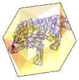
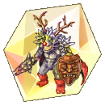

# 🌃 EP. Lutie

## **Cách Truy Cập LUTIE**

* Tại bất kỳ thành phố nào, hãy đến Kafra, nhấp vào cô ấy, chọn tùy chọn **"Dịch chuyển"**, và chọn **"**<mark style="color:red;">**Lutie**</mark>**"**.

<figure><figcaption>
<mark style="color:red;"><strong>Đi đến thành phố Lutie</strong></mark>
</figcaption></figure>

## **Về Các Bản Đồ**

* Lutie được chia thành **4 Bản Đồ Chính**.
* **"**<mark style="color:red;">**Lutie**</mark>**", "**<mark style="color:red;">**X-Mas**</mark>**"**,
* **"**<mark style="color:red;">**Nhà máy Đồ chơi Cấp 1**</mark>**", "**<mark style="color:red;">**Nhà máy Đồ chơi Cấp 2**</mark>**"**.


<figure><figcaption>
<mark style="color:red;"><strong>Thành phố Lutie</strong></mark>
</figcaption></figure>

<table><thead><tr><th width="139">Hình ảnh</th><th>Mô tả</th></tr></thead><tbody><tr><td></td><td>Hướng dẫn</td></tr><tr><td></td><td>Kho</td></tr><tr><td></td><td>Kho Clan</td></tr><tr><td></td><td>Cửa hàng tiện ích</td></tr><tr><td></td><td>Cửa hàng trang bị và đạn dược</td></tr></tbody></table>



<figure><figcaption>
<mark style="color:red;"><strong>Bản đồ Lutie Village (Giáng Sinh)</strong></mark>
</figcaption></figure>


<figure><figcaption>
<mark style="color:red;"><strong>Bản đồ Nhà máy Đồ chơi Cấp 1</strong></mark>
</figcaption></figure>



<figure><figcaption>
<mark style="color:red;"><strong>Nhà máy Đồ chơi Cấp 2</strong></mark>
</figcaption></figure>



## **Quái vật và MVP**

* Tại Lutie, có nhiều quái vật phân bố khắp khu vực.
* Xem danh sách quái vật ở mỗi bản đồ bên dưới.



<figure><figcaption>
<mark style="color:red;"><strong>Bản đồ Lutie Village (X-MAS)</strong></mark>
</figcaption></figure>

| Quái vật                               | Giống     | Kích thước | Nguyên tố  |
| ------------------------------------- | --------- | ------ | --------- |
| .png>) | Thực vật  | Trung bình | Thánh 1   || .png>) | Thực vật | Vừa    | Nước 2    |
| .png>) | Thiên thần | Vừa    | Thánh 3   |
|        | Thú dữ   | Lớn    | Trung tính 3 |
| .png>) | Hình người | Vừa    | Trung tính 3 |
| .png>) | Hình người | Vừa    | Đất 1     |
| .png>) | Vô hình   | Vừa    | Lửa 2     |
| .png>) | Thú dữ   | Vừa    | Nước 2    |
| .png>) | Thú dữ   | Lớn    | Nước 4    |



<figure><figcaption>
<mark style="color:red;"><strong>Nhà máy đồ chơi Cấp 1</strong></mark>
</figcaption></figure>

| Quái vật                                   | Giới tính | Kích thước | Nguyên tố  |
| ----------------------------------------- | --------- | ------- | --------- |
| .png>)     | Thực vật | Vừa    | Nước 1    |
|  (1).png>) | Thực vật | Vừa    | Độc 1     |
|  (1).png>) | Thực vật | Vừa    | Nước 1    |
|  (1).png>) | Thực vật | Trung bình | Nước 2   |
| .png>)    | Thực vật | Trung bình | Thánh 1    |
|  (1).png>) | Thực vật | Trung bình | Nước 2   |
|  (1).png>) | Thiên thần | Trung bình | Thánh 4    |
|  (1).png>) | Nhân hình | Nhỏ | Thánh 2  |
|  (1).png>) | Nhân hình | Nhỏ | Trung lập 3  |
|  (1).png>) | Vô hình | Trung bình | Trung lập 3 |
|  (1).png>) | Nhân hình | Trung bình | Lửa 1    |
| .png>)    | Nhân hình | Trung bình | Đất 1   |
| .png>)    | Vô hình | Trung bình | Lửa 2    |
| .png>)    | Nhân hình | Trung bình | Gió 1    |



<figure><figcaption>
<mark style="color:red;"><strong>Nhà máy đồ chơi Cấp 2</strong></mark>
</figcaption></figure>

| Quái vật                                  | Giống      | Kích thước    | Nguyên tố   || ----------------------------------------- | --------- | ------- | --------- |
| .png>)    | Thực vật  | Trung bình  | Thánh 1    |
|  (1).png>) | Nhân hình  | Nhỏ  | Thánh 2    |
|  (1).png>) | Nhân hình  | Nhỏ  | Trung lập 3 |
| .png>)    | Vô hình   | Trung bình  | Trung lập 3 |
|  (1).png>) | Vô hình   | Trung bình  | Trung lập 3 |
| .png>)    | Vô hình   | Trung bình  | Lửa 2    |
|  (2).png>) | Nhân hình  | Trung bình  | Gió 1    |
|  (2).png>) | Vô hình   | Trung bình  | Gió 4    |



## **Thẻ**

* Một số <mark style="color:red;">**Thẻ**</mark> mới cũng đã được thêm vào với sự xuất hiện của Lutie.

| Carta                                                   | Efeito                                                                                                                                                                              || ------------------------------------------------------- | ----------------------------------------------------------------------------------------------------------------------------------------------------------------------------------- |
|  Thẻ Bánh Quy Giáng Sinh | Kháng cự với quái vật chủng tộc Thiên Thần -20%. Kinh nghiệm nhận được từ quái vật chủng tộc Thiên Thần +10%. Loại: Thẻ Trang bị trên: Giày Trọng lượng: 1                                                          |
|  Thẻ Bánh Quy           | LUK +2. \[Ánh Sáng Thần Thánh] Sát thương +10%. Loại: Thẻ Trang bị trên: Phụ kiện Trọng lượng: 1                                                                                                        |
|  Thẻ Quà Tặng           | Khi đánh bại quái vật: 0.3% cơ hội rơi ra Hộp Quà. Loại: Thẻ Trang bị trên: Mũ Trọng lượng: 1                                                                                   ||  Thẻ Binh Sĩ Nhỏ      | Tăng sát thương chí mạng +10%. Tăng CRIT +7 khi đối đầu với kẻ thù thuộc chủng tộc Brute và Doram. Loại: Thẻ Trang bị trên: Vũ khí Trọng lượng: 1                                                                        |
|  Thẻ Sasquatch        | Khi nhận sát thương vật lý: 6% cơ hội gây hiệu ứng Đóng Băng lên đối thủ. Loại: Thẻ Trang bị trên: Giáp Trọng lượng: 1                                                                 |
|  Thẻ Chepet           | Khi thực hiện các đòn tấn công vật lý: 5% cơ hội tự động thi triển \[Heal] cấp 5 lên đối thủ. Loại: Thẻ Trang bị trên: Vũ khí Trọng lượng: 1                                                        |
|  Thẻ Hatii Baby       | Khi thực hiện các đòn tấn công vật lý: 5% cơ hội tự động thi triển \[Frost Diver] cấp 3. Phần Thưởng Set \[Thẻ Hatii]: Tăng thêm +30% cơ hội tự động thi triển. Loại: Thẻ Trang bị trên: Vũ khí Trọng lượng: 1 ||  Thẻ Archangeling     | Max HP +300. Nếu LUK cơ bản từ 77 trở lên: Tăng tốc độ hồi phục HP và SP tự nhiên +100%. Loại: Thẻ Gắn lên: Mũ Trọng lượng: 1                                                            |
|  Thẻ Hatii            | Khi nhận sát thương vật lý: 50% cơ hội gây hiệu ứng \[Đóng Băng] lên đối thủ. Loại: Thẻ Gắn lên: Giáp Trọng lượng: 1                                                              |
|  Thẻ Stormy Knight     | Khi thực hiện các đòn tấn công vật lý: 2% cơ hội tự động thi triển \[Storm Gust] lv.1. 20% cơ hội gây hiệu ứng Đóng Băng lên đối thủ. Loại: Thẻ Gắn lên: Vũ khí Trọng lượng: 1                    |

## **Ngọc**

* Một số <mark style="color:red;">**Ngọc**</mark> mới cũng đã được thêm vào với sự xuất hiện của Lutie.<table><thead><tr><th width="414">Ngọc</th><th>Hiệu ứng</th></tr></thead><tbody><tr><td> Ngọc Bánh Quy Giáng Sinh</td><td> -0.2 giây thời gian hồi chiêu của kỹ năng [Frost Lance].</td></tr><tr><td> Ngọc Bánh Quy</td><td>+4% sát thương nguyên tố Nước (Vật lý và Ma thuật) và +4% sát thương nguyên tố Trung lập (Vật lý và Ma thuật).</td></tr><tr><td> Ngọc Lính Chì</td><td>+15 Điểm Trúng và +10 Điểm Trúng Hoàn Hảo.</td></tr><tr><td> Ngọc Quà Tặng</td><td>5% cơ hội nhận tối đa 500 Zeny khi đánh bại quái vật.</td></tr><tr><td> Ngọc Chepet</td><td>+15% sát thương Ma thuật nguyên tố Lửa và Thánh.</td></tr><tr><td> Ngọc Sasquatch</td><td>-5% sát thương nguyên tố Nước nhận được.</td></tr><tr><td> Ngọc Cún Hatii</td><td>Cấp cho +[IntStats/10]% sát thương ma thuật.</td></tr><tr><td> Ngọc Hatii</td><td>+10% cơ hội tự động thi triển [Storm Gust] cấp 5 (hoặc cấp hiện tại nếu kỹ năng đã học) khi nhận một đòn tấn công vật lý.</td></tr><tr><td> Ngọc Hiệp Sĩ Bão Tố</td><td>Giảm 100% sát thương nguyên tố Gió nhận được. +50% sát thương nguyên tố Đất nhận được.</td></tr></tbody></table>## **Món Mới**

* Một số <mark style="color:red;">**Trang Bị**</mark> mới cũng đã được thêm vào với sự xuất hiện của **Lutie**.

<table><thead><tr><th width="279">Quái Vật</th><th>Món Đồ</th></tr></thead><tbody><tr><td> Viên Ngọc Quà Tặng</td><td></td></tr><tr><td> Người Lính Thiếc</td><td></td></tr><tr><td> Chapet</td><td></td></tr><tr><td> Sasquatch</td><td></td></tr></tbody></table>