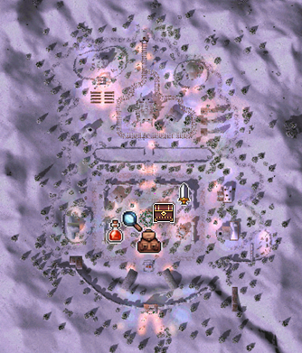
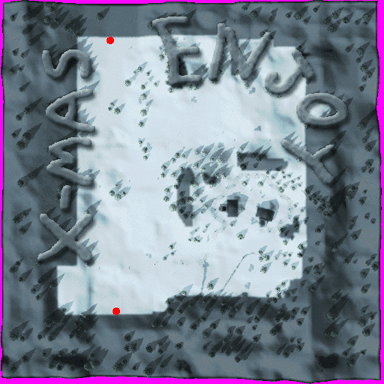
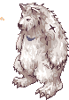
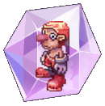
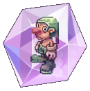
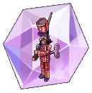
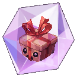
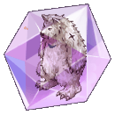
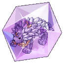

# 🌃 EP. Lutie

## **How to Access LUTIE**

* In any city, go to a Kafra, click on her, select the **"Teleport"** option, and choose **"**<mark style="color:red;">**Lutie**</mark>**"**.

<figure><figcaption>
<mark style="color:red;"><strong>Traveling to the city of Lutie</strong></mark>
</figcaption></figure>

## **About the Maps**

* Lutie is divided into **4 Main Maps**.
* **"**<mark style="color:red;">**Lutie**</mark>**", "**<mark style="color:red;">**X-Mas**</mark>**"**,
* **"**<mark style="color:red;">**Toy Factory Level 1**</mark>**", "**<mark style="color:red;">**Toy Factory Level 2**</mark>**"**.



<figure><figcaption>
<mark style="color:red;"><strong>City of Lutie</strong></mark>
</figcaption></figure>

<table><thead><tr><th width="139">Image</th><th>Description</th></tr></thead><tbody><tr><td></td><td>Guide</td></tr><tr><td></td><td>Storage</td></tr><tr><td></td><td>Clan Storage</td></tr><tr><td></td><td>Utility Shop</td></tr><tr><td></td><td>Equipment and Ammunition Shop</td></tr></tbody></table>



<figure><figcaption>
<mark style="color:red;"><strong>Lutie Village Map (X-MAS)</strong></mark>
</figcaption></figure>



<figure><figcaption>
<mark style="color:red;"><strong>Toy Factory Level 1 Map</strong></mark>
</figcaption></figure>



<figure><figcaption>
<mark style="color:red;"><strong>Toy Factory Level 2</strong></mark>
</figcaption></figure>



## **Monsters and MVP**

* In Lutie, there are several monsters scattered throughout its area.
* See below for the list of monsters in each map.



<figure><figcaption>
<mark style="color:red;"><strong>Lutie Village Map (X-MAS)</strong></mark>
</figcaption></figure>

| Monsters                              | Race      | Size   | Element   |
| ------------------------------------- | --------- | ------ | --------- |
| .png>) | Plant     | Medium | Holy 1    |
| .png>) | Plant     | Medium | Water 2   |
| .png>) | Angel     | Medium | Holy 3    |
|        | Brute     | Large  | Neutral 3 |
| .png>) | Humanoid  | Medium | Neutral 3 |
| .png>) | Humanoid  | Medium | Earth 1   |
| .png>) | Amorphous | Medium | Fire 2    |
| .png>) | Bruto     | Medium | Water 2   |
| .png>) | Brute     | Large  | Water 4   |



<figure><figcaption>
<mark style="color:red;"><strong>Toy Factory Level 1</strong></mark>
</figcaption></figure>

| Monsters                                  | Race      | Size    | Element   |
| ----------------------------------------- | --------- | ------- | --------- |
| .png>)     | Plant     | Medium  | Water 1   |
|  (1).png>) | Plant     | Medium  | Poison 1  |
|  (1).png>) | Plant     | Medium  | Water 1   |
|  (1).png>) | Plant     | Medium  | Water 2   |
| .png>)    | Plant     | Medium  | Holy 1    |
|  (1).png>) | Plant     | Medium  | Water 2   |
|  (1).png>) | Angel     | Medium  | Holy 4    |
|  (1).png>) | Humanoid  | Pequeno | SaHoly 2  |
|  (1).png>) | Humanoid  | Pequeno | Neutro 3  |
|  (1).png>) | Amorphous | Medium  | Neutral 3 |
|  (1).png>) | Humanoid  | Medium  | Fire 1    |
| .png>)    | Humanoid  | Medium  | Earth 1   |
| .png>)    | Amorphous | Medium  | Fire 2    |
| .png>)    | Humanoid  | Medium  | Wind 1    |



<figure><figcaption>
<mark style="color:red;"><strong>Toy Factory Level 2</strong></mark>
</figcaption></figure>

| Monsters                                  | Race      | Size    | Element   |
| ----------------------------------------- | --------- | ------- | --------- |
| .png>)    | Plant     | Medium  | Holy 1    |
|  (1).png>) | Humanoid  | Pequeno | Holy 2    |
|  (1).png>) | Humanoid  | Pequeno | Neutral 3 |
| .png>)    | Amorphous | Medium  | Neutral 3 |
|  (1).png>) | Amorphous | Medium  | Neutral 3 |
| .png>)    | Amorphous | Medium  | Fire 2    |
|  (2).png>) | Humanoid  | Medium  | Wind 1    |
|  (2).png>) | Amorphous | Medium  | Wind 4    |



## **Cards**

* Some new <mark style="color:red;">**Cards**</mark> were also added with the arrival of Lutie.

| Carta                                                   | Efeito                                                                                                                                                                              |
| ------------------------------------------------------- | ----------------------------------------------------------------------------------------------------------------------------------------------------------------------------------- |
|  Christmas Cookie Card | Resistance to Angel race monsters -20%. EXP gained from Angel race monsters +10%. Type: Card Equips on: Footgear Weight: 1                                                          |
|  Cookie Card           | LUK +2. \[Holy Light] Damage +10%. Type: Card Equips on: Accessory Weight: 1                                                                                                        |
|  Gift Card             | When defeating monsters: 0.3% chance to drop a Gift Box. Type: Card Equips on: Headgear Weight: 1                                                                                   |
|  Tin Soldier Card      | Critical damage +10%. CRIT +7 against Brute and Doram race opponents. Type: Card Equips on: Weapon Weight: 1                                                                        |
|  Sasquatch Card        | When receiving physical attacks: 6% chance to inflict Freeze on the opponent. Type: Card Equips on: Armor Weight: 1                                                                 |
|  Chepet Card           | When performing physical attacks: 5% chance to autocast \[Heal] lv.5 on the opponent. Type: Card Equips on: Weapon Weight: 1                                                        |
| Hatii Baby Card        | When performing physical attacks: 5% chance to autocast \[Frost Diver] lv.3. Set Bonus \[Hatii Card]: Additional +30% chance of autocasting. Type: Card Equips on: Weapon Weight: 1 |
|  Archangeling Card     | Max HP +300. If base LUK is 77 or higher: HP and SP natural regeneration +100%. Type: Card Equips on: Headgear Weight: 1                                                            |
|  Hatii Card            | When receiving physical damage: 50% chance to inflict \[Freeze] on the opponent. Type: Card Equips on: Armor Weight: 1                                                              |
|  Stormy Knight Card    | When performing physical attacks: 2% chance to autocast \[Storm Gust] lv.1. 20% chance to inflict Freeze on the opponent. Type: Card Equips on: Weapon Weight: 1                    |

## **Gems**

* Some new <mark style="color:red;">**Gems**</mark> were also added with the arrival of Lutie.

<table><thead><tr><th width="414">Gem</th><th>Effect</th></tr></thead><tbody><tr><td> Christmas Cookie Gem</td><td> -0.2 seconds from the cooldown time of the skill [Frost Lance].</td></tr><tr><td> Cookie Gem</td><td>+4% Water element damage (Physical and Magical) and +4% Neutral element damage (Physical and Magical).</td></tr><tr><td> Tin Soldier Gem</td><td>+15 Hit and +10 Perfect Hit.</td></tr><tr><td> Gift Gem</td><td>5% chance to obtain up to 500 Zeny when defeating monsters.</td></tr><tr><td> Chepet Gem</td><td>+15% Fire and Holy element Magic damage.</td></tr><tr><td> Sasquatch Gem</td><td>-5% Water element damage received.</td></tr><tr><td> Hatii Pup Gem</td><td>Grants +[IntStats/10]% magic damage.</td></tr><tr><td> Hatii Gem</td><td>+10% chance to autocast [Storm Gust] level 5 (or the current level if the skill is learned) upon receiving a physical attack.</td></tr><tr><td> Stormy Knight Gem</td><td>100% reduction of Wind element damage received. +50% Earth element damage received.</td></tr></tbody></table>

## **New Items**

* Some new <mark style="color:red;">**Equipment**</mark> was also added with the arrival of **Lutie**.

<table><thead><tr><th width="279">Monstro</th><th>Item</th></tr></thead><tbody><tr><td> Gift Gem</td><td></td></tr><tr><td> Tin Soldier</td><td></td></tr><tr><td> Chapet</td><td></td></tr><tr><td> Sasquacth</td><td></td></tr></tbody></table>
