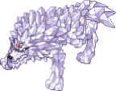

# 🌃 EP. Lutie

## **วิธีเข้าถึง LUTIE**

* ในเมืองใดก็ได้, ไปที่ Kafra, คลิกที่เธอ, เลือกตัวเลือก **"Teleport"** และเลือก **"**<mark style="color:red;">**Lutie**</mark>**"**.

<figure><figcaption>
<mark style="color:red;"><strong>เดินทางไปยังเมือง Lutie</strong></mark>
</figcaption></figure>

## **เกี่ยวกับแผนที่**

* Lutie แบ่งออกเป็น **4 แผนที่หลัก**.
* **"**<mark style="color:red;">**Lutie**</mark>**", "**<mark style="color:red;">**X-Mas**</mark>**"**,
* **"**<mark style="color:red;">**Toy Factory Level 1**</mark>**", "**<mark style="color:red;">**Toy Factory Level 2**</mark>**"**.



<figure><figcaption>
<mark style="color:red;"><strong>เมือง Lutie</strong></mark>
</figcaption></figure>

<table><thead><tr><th width="139">ภาพ</th><th>คำอธิบาย</th></tr></thead><tbody><tr><td></td><td>คู่มือ</td></tr><tr><td></td><td>ที่เก็บของ</td></tr><tr><td></td><td>ที่เก็บของกลุ่ม</td></tr><tr><td></td><td>ร้านค้าอุปกรณ์</td></tr><tr><td></td><td>ร้านค้าอุปกรณ์และกระสุน</td></tr></tbody></table>



<figure><figcaption>
<mark style="color:red;"><strong>แผนที่หมู่บ้าน Lutie (X-MAS)</strong></mark>
</figcaption></figure>



<figure><figcaption>
<mark style="color:red;"><strong>แผนที่โรงงานของเล่นระดับ 1</strong></mark>
</figcaption></figure>



<figure><figcaption>
<mark style="color:red;"><strong>โรงงานของเล่นระดับ 2</strong></mark>
</figcaption></figure>



## **มอนสเตอร์และ MVP**

* ใน Lutie มีมอนสเตอร์หลายตัวกระจายอยู่ทั่วพื้นที่.
* ดูด้านล่างสำหรับรายชื่อมอนสเตอร์ในแต่ละแผนที่.



<figure><figcaption>
<mark style="color:red;"><strong>แผนที่หมู่บ้าน Lutie (X-MAS)</strong></mark>
</figcaption></figure>

| มอนสเตอร์                              | เผ่าพันธุ์      | ขนาด   | ธาตุ   |
| ------------------------------------- | --------- | ------ | --------- |
| .png>) | พืช     | ขนาดกลาง | ธาตุศักดิ์สิทธิ์ 1    |
| .png>) | พืช     | ขนาดกลาง | ธาตุน้ำ 2   |
| .png>) | เทวดา     | ขนาดกลาง | ธาตุศักดิ์สิทธิ์ 3    |
|        | อสูร     | ขนาดใหญ่  | ธาตุเป็นกลาง 3 |
| .png>) | มนุษย์     | ขนาดกลาง | ธาตุเป็นกลาง 3 |
| .png>) | มนุษย์     | ขนาดกลาง | ธาตุดิน 1   |
| .png>) | อมอร์ฟัส | ขนาดกลาง | ธาตุไฟ 2    |
| .png>) | อสูร     | ขนาดกลาง | ธาตุน้ำ 2   |
| .png>) | อสูร     | ขนาดใหญ่  | ธาตุน้ำ 4   |



<figure><figcaption>
<mark style="color:red;"><strong>โรงงานของเล่นระดับ 1</strong></mark>
</figcaption></figure>

| มอนสเตอร์                                  | เผ่าพันธุ์      | ขนาด    | ธาตุ   |
| ----------------------------------------- | --------- | ------- | --------- |
| .png>)     | พืช     | ขนาดกลาง  | ธาตุน้ำ 1   |
|  (1).png>) | พืช     | ขนาดกลาง  | ธาตุพิษ 1  |
|  (1).png>) | พืช     | ขนาดกลาง  | ธาตุน้ำ 1   |
|  (1).png>) | พืช     | ขนาดกลาง  | ธาตุน้ำ 2   |
| .png>)    | พืช     | ขนาดกลาง  | ธาตุศักดิ์สิทธิ์ 1    |
|  (1).png>) | พืช     | ขนาดกลาง  | ธาตุน้ำ 2   |
|  (1).png>) | เทวดา     | ขนาดกลาง  | ธาตุศักดิ์สิทธิ์ 4    |
|  (1).png>) | มนุษย์     | ขนาดเล็ก | ธาตุศักดิ์สิทธิ์ 2  |
|  (1).png>) | มนุษย์     | ขนาดเล็ก | ธาตุเป็นกลาง 3  |
|  (1).png>) | อมอร์ฟัส | ขนาดกลาง  | ธาตุเป็นกลาง 3 |
|  (1).png>) | มนุษย์     | ขนาดกลาง  | ธาตุไฟ 1    |
| .png>)    | มนุษย์     | ขนาดกลาง  | ธาตุดิน 1   |
| .png>)    | อมอร์ฟัส | ขนาดกลาง  | ธาตุไฟ 2    |
| .png>)    | มนุษย์     | ขนาดกลาง  | ธาตุลม 1    |



<figure><figcaption>
<mark style="color:red;"><strong>โรงงานของเล่นระดับ 2</strong></mark>
</figcaption></figure>

| มอนสเตอร์                                  | เผ่าพันธุ์      | ขนาด    | ธาตุ   |
| ----------------------------------------- | --------- | ------- | --------- |
| .png>)    | พืช     | ขนาดกลาง  | ธาตุศักดิ์สิทธิ์ 1    |
|  (1).png>) | มนุษย์     | ขนาดเล็ก | ธาตุศักดิ์สิทธิ์ 2  |
|  (1).png>) | มนุษย์     | ขนาดเล็ก | ธาตุเป็นกลาง 3 |
| .png>)    | อมอร์ฟัส | ขนาดกลาง  | ธาตุเป็นกลาง 3 |
|  (1).png>) | อมอร์ฟัส | ขนาดกลาง  | ธาตุเป็นกลาง 3 |
| .png>)    | อมอร์ฟัส | ขนาดกลาง  | ธาตุไฟ 2    |
|  (2).png>) | มนุษย์     | ขนาดกลาง  | ธาตุลม 1    |
|  (2).png>) | อมอร์ฟัส | ขนาดกลาง  | ธาตุลม 4    |



## **การ์ด**

* การ์ดใหม่ <mark style="color:red;">**การ์ด**</mark> บางใบก็ถูกเพิ่มเข้ามาพร้อมกับการมาของ Lutie.

| การ์ด                                                   | ผลกระทบ                                                                                                                                                                              |
| ------------------------------------------------------- | ----------------------------------------------------------------------------------------------------------------------------------------------------------------------------------- |
|  การ์ดคุกกี้วันคริสต์มาส | ความต้านทานต่อมอนสเตอร์เผ่าเทวดา -20%. EXP ที่ได้รับจากมอนสเตอร์เผ่าเทวดา +10%. ประเภท: การ์ด ติดตั้งได้ที่: อุปกรณ์รองเท้า น้ำหนัก: 1                                                          |
|  การ์ดคุกกี้           | LUK +2. \[Holy Light] ความเสียหาย +10%. ประเภท: การ์ด ติดตั้งได้ที่: เครื่องประดับ น้ำหนัก: 1                                                                                                        |
|  การ์ดของขวัญ             | เมื่อฆ่ามอนสเตอร์: โอกาส 0.3% ที่จะดรอปกล่องของขวัญ. ประเภท: การ์ด ติดตั้งได้ที่: หมวก น้ำหนัก: 1                                                                                   |
|  การ์ดทหารดีบุก      | ความเสียหายวิกฤต +10%. CRIT +7 ต่อคู่ต่อสู้เผ่าอสูรและโดรัม. ประเภท: การ์ด ติดตั้งได้ที่: อาวุธ น้ำหนัก: 1                                                                        |
|  การ์ดซาสควอช        | เมื่อได้รับการโจมตีทางกายภาพ: โอกาส 6% ที่จะทำให้คู่ต่อสู้ติดสถานะ Freeze. ประเภท: การ์ด ติดตั้งได้ที่: เกราะ น้ำหนัก: 1                                                                 |
|  การ์ดเชเพท           | เมื่อทำการโจมตีทางกายภาพ: โอกาส 5% ที่จะทำให้เกิดการใช้ [Heal] lv.5 โดยอัตโนมัติบนคู่ต่อสู้. ประเภท: การ์ด ติดตั้งได้ที่: อาวุธ น้ำหนัก: 1                                                        |
|  การ์ดลูกสุนัขฮาตี        | เมื่อทำการโจมตีทางกายภาพ: โอกาส 5% ที่จะทำให้เกิดการใช้ [Frost Diver] lv.3 โดยอัตโนมัติ. ชุดโบนัส \[การ์ดฮาตี]: โอกาสเพิ่มอีก +30% ในการใช้โดยอัตโนมัติ. ประเภท: การ์ด ติดตั้งได้ที่: อาวุธ น้ำหนัก: 1 |
|  การ์ดอาร์คแองเจลลิ่ง     | HP สูงสุด +300. หาก LUK พื้นฐาน 77 หรือสูงกว่า: การฟื้นฟู HP และ SP ตามธรรมชาติ +100%. ประเภท: การ์ด ติดตั้งได้ที่: หมวก น้ำหนัก: 1                                                            |
|  การ์ดฮาตี            | เมื่อได้รับความเสียหายทางกายภาพ: โอกาส 50% ที่จะทำให้คู่ต่อสู้ติดสถานะ \[Freeze]. ประเภท: การ์ด ติดตั้งได้ที่: เกราะ น้ำหนัก: 1                                                              |
|  การ์ดอัศวินพายุ    | เมื่อทำการโจมตีทางกายภาพ: โอกาส 2% ที่จะทำให้เกิดการใช้ [Storm Gust] lv.1 โดยอัตโนมัติ. โอกาส 20% ที่จะทำให้คู่ต่อสู้ติดสถานะ Freeze. ประเภท: การ์ด ติดตั้งได้ที่: อาวุธ น้ำหนัก: 1                    |

## **อัญมณี**

* อัญมณีใหม่ <mark style="color:red;">**อัญมณี**</mark> บางชนิดก็ถูกเพิ่มเข้ามาพร้อมกับการมาของ Lutie.

<table><thead><tr><th width="414">อัญมณี</th><th>ผลกระทบ</th></tr></thead><tbody><tr><td> อัญมณีคุกกี้วันคริสต์มาส</td><td> -0.2 วินาทีจากเวลาคูลดาวน์ของทักษะ [Frost Lance].</td></tr><tr><td> อัญมณีคุกกี้</td><td>+4% ความเสียหายธาตุน้ำ (ทางกายภาพและเวทมนตร์) และ +4% ความเสียหายธาตุเป็นกลาง (ทางกายภาพและเวทมนตร์).</td></tr><tr><td> อัญมณีทหารดีบุก</td><td>+15 Hit และ +10 Perfect Hit.</td></tr><tr><td> อัญมณีของขวัญ</td><td>โอกาส 5% ที่จะได้รับสูงสุด 500 Zeny เมื่อฆ่ามอนสเตอร์.</td></tr><tr><td> อัญมณีเชเพท</td><td>+15% ความเสียหายเวทมนตร์ธาตุไฟและธาตุศักดิ์สิทธิ์.</td></tr><tr><td> อัญมณีซาสควอช</td><td>-5% ความเสียหายธาตุน้ำที่ได้รับ.</td></tr><tr><td> อัญมณีลูกสุนัขฮาตี</td><td>ให้ +[IntStats/10]% ความเสียหายเวทมนตร์.</td></tr><tr><td> อัญมณีฮาตี</td><td>+10% โอกาสที่จะทำให้เกิดการใช้ [Storm Gust] ระดับ 5 (หรือตามระดับปัจจุบันถ้าทักษะนั้นเรียนรู้แล้ว) เมื่อได้รับการโจมตีทางกายภาพ.</td></tr><tr><td> อัญมณีอัศวินพายุ</td><td>การลดความเสียหายธาตุลมที่ได้รับ 100%. +50% ความเสียหายธาตุดินที่ได้รับ.</td></tr></tbody></table>

## **ไอเท็มใหม่**

* ไอเท็มใหม่ <mark style="color:red;">**อุปกรณ์**</mark> บางชนิดก็ถูกเพิ่มเข้ามาพร้อมกับการมาของ **Lutie**.

<table><thead><tr><th width="279">มอนสเตอร์</th><th>ไอเท็ม</th></tr></thead><tbody><tr><td> อัญมณีของขวัญ</td><td></td></tr><tr><td> ทหารดีบุก</td><td></td></tr><tr><td> เชเพท</td><td></td></tr><tr><td> ซาสควอช</td><td></td></tr></tbody></table>