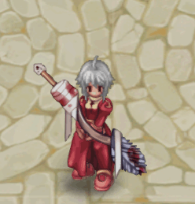

# 🌃EP. Lutie

## Cách truy cập LUTIE

*   Ở bất kỳ thành phố nào, hãy đến Kafra, nhấp vào cô ấy, chọn tùy chọn "Dịch chuyển" và chọn "Lutie".\
    \

    <figure><figcaption>
Du lịch đến thành phố Lutie
</figcaption></figure>

### Giới Thiệu về Bản Đồ

* Lutie được chia thành 4 bản đồ chính.
* "Lutie", "X-Mas",
* "Toy Factory Level 1", "Toy Factory Level 2".



<figure><figcaption>
Thành phố Lutie
</figcaption></figure>

<table><thead><tr><th width="100">Hình ảnh</th><th>Mô tả</th></tr></thead><tbody><tr><td></td><td>Hướng dẫn </td></tr><tr><td></td><td>Kho</td></tr><tr><td></td><td>Kho lưu trữ bang hội</td></tr><tr><td></td><td>cửa hàng tiện ích</td></tr><tr><td></td><td>cửa hàng thiết bị và đạn dược</td></tr></tbody></table>











\
\
\
\
\
\
\
\
\
\
\




### Quái Vật và MVP

* Ở Lutie, có một số quái vật rải rác khắp khu vực của nó.
* Xem bên dưới để biết danh sách quái vật trong mỗi bản đồ.



<figure><figcaption>
Bản đồ làng Lutie (X-MAS)
</figcaption></figure>

<table><thead><tr><th width="111">Quái vật</th><th width="169">Loài</th><th>Kích cỡ</th><th>Yếu tố</th></tr></thead><tbody><tr><td></td><td>Plant</td><td>Trung Bình</td><td>Thánh 1</td></tr><tr><td></td><td>Plant</td><td>Trung Bình</td><td>Nước 2</td></tr><tr><td></td><td>Angel</td><td>Trung Bình</td><td>Thánh 3</td></tr><tr><td></td><td>Brute</td><td>Lớn</td><td>Trung Tính 3</td></tr><tr><td></td><td>
Humanoid

 
</td><td>Trung Bình </td><td>Trung Tính 3</td></tr><tr><td></td><td>Humanoid</td><td>Trung Bình</td><td>Đất 1</td></tr><tr><td></td><td>Amorphous</td><td>Trung Bình</td><td>Lửa 2 </td></tr><tr><td></td><td>
Bruto

 
</td><td>Trung Bình</td><td>Nước 2 </td></tr><tr><td></td><td>
Brute

 
</td><td>Lớn</td><td>Nước 4</td></tr></tbody></table>



<figure><figcaption>
Nhà máy đồ chơi level 1
</figcaption></figure>

<table><thead><tr><th width="147">Quái vật</th><th>Loài</th><th>Kích cỡ</th><th>Nguyên tố</th></tr></thead><tbody><tr><td></td><td>Plant</td><td>Trung bình</td><td>Nước 1</td></tr><tr><td></td><td>Plant</td><td>Trung bình</td><td>Độc 1</td></tr><tr><td></td><td>Plant</td><td>Trung bình</td><td>Nước 1</td></tr><tr><td></td><td>Plant</td><td>Trung bình</td><td>Nước 2</td></tr><tr><td></td><td>Plant</td><td>Trung bình</td><td>Thánh 1</td></tr><tr><td></td><td>Plant</td><td>Trung bình</td><td>Nước 2</td></tr><tr><td></td><td>Angel</td><td>Trung bình</td><td>Thánh 4</td></tr><tr><td></td><td>Humanoid</td><td>Nhỏ</td><td>Thánh thần 2</td></tr><tr><td></td><td>Humanoid</td><td>Nhỏ</td><td>Trung tính 3</td></tr><tr><td></td><td>Amorphous</td><td>Trung bình</td><td>Trung tính 3</td></tr><tr><td></td><td>Humanoid</td><td>Trung bình</td><td>Lửa 1</td></tr><tr><td></td><td>Humanoid</td><td>Trung bình</td><td>Đất 1</td></tr><tr><td></td><td>Amorphous</td><td>Trung bình</td><td>Lửa 2</td></tr><tr><td></td><td>Humanoid</td><td>Trung bình</td><td>Gió 1</td></tr></tbody></table>



<figure><figcaption>
Nhà máy đồ chơi Level 2
</figcaption></figure>

| Quái vật                                                                                                                                                                                                                                                                                                                                                                                                             | Loài                       | Kích cỡ    | Nguyên tố    |
| -------------------------------------------------------------------------------------------------------------------------------------------------------------------------------------------------------------------------------------------------------------------------------------------------------------------------------------------------------------------------------------------------------------------- | -------------------------- | ---------- | ------------ |
|                                                                 | Plant                      | Trung bình | Thánh 1      |
|                                                      | Humanoid                   | Nhỏ        | Thánh 2      |
| 

 
 | Humanoid                   | Nhỏ        | Trung tính 3 |
| 
  
               | Amorphous                  | Trung bình | Trung tính 3 |
|                                                      | Amorphous                  | Trung bình | Trung tính 3 |
|                                                                 | Amorphous                  | Trung bình | Lửa 2        |
|                                                      | 
Humanoid

 
 | Trung bình | Gió 1        |
|                                                      | Amorphous                  | Trung bình | Gió 4        |



## Thẻ Bài

* Một số Thẻ mới cũng được thêm vào khi Lutie xuất hiện.

| Thẻ                                                                                                                                                                                                                                                                                                                                                                                                               | Tác dụng                                                                                                                                                                                              |
| ----------------------------------------------------------------------------------------------------------------------------------------------------------------------------------------------------------------------------------------------------------------------------------------------------------------------------------------------------------------------------------------------------------------- | ----------------------------------------------------------------------------------------------------------------------------------------------------------------------------------------------------- |
| 
 Thẻ Bánh Quy Giáng Sinh
    | Khả năng kháng quái vật thuộc chủng tộc Thiên thần -20%. EXP nhận được từ quái vật chủng tộc Thiên thần +10%. Loại: Thẻ Trang bị trên: Giày dép Trọng lượng: 1                                        |
| 
 Thẻ bánh quy
               | LUK +2. \[Ánh sáng thần thánh] Sát thương +10%. Loại: Thẻ Trang bị: Phụ kiện Trọng lượng: 1                                                                                                           |
| 
 Thẻ quà tặng
               | Khi đánh bại quái vật: Có 0,3% cơ hội rơi ra Hộp quà. Loại: Thẻ Trang bị trong: Mũ bảo hiểm Trọng lượng: 1                                                                                            |
| 
 Thẻ lính tin tức
           | Sát thương chí mạng +10%. CRIT +7 trước đối thủ Brute và Doram. Loại: Thẻ Được trang bị trên: Vũ khí Trọng lượng: 1                                                                                   |
| 
 Thẻ Sasquatch
              | Khi nhận đòn tấn công vật lý: Có 6% khả năng gây hiệu ứng Đóng băng lên đối thủ. Loại: Thẻ Trang bị trong: Giáp Trọng lượng: 1                                                                        |
| 
 Thẻ chepet
                 | Khi thực hiện đòn tấn công vật lý: 5% cơ hội tự động niệm \[Hồi phục] cấp độ 5 lên đối thủ. Loại: Thẻ Trang bị trên: Vũ khí Trọng lượng: 1                                                            |
| 
 Thiệp chúc mừng Baby Hatii
 | Khi thực hiện đòn tấn công vật lý: 5% cơ hội tự động thi triển \[Ice Diver] cấp độ 3. Phần thưởng bộ \[Thẻ Hatii]: Thêm +30% Cơ hội tự động thi triển. Loại: Thẻ Trang bị trên: Vũ khí Trọng lượng: 1 |
| 
 Thẻ tổng lãnh thiên thần
   | HP tối đa +300. Nếu LUK cơ bản là 77 hoặc cao hơn: Tái tạo HP và SP tự nhiên +100%. Loại: Thẻ Trang bị trong: Mũ bảo hiểm Trọng lượng: 1                                                              |
| 
 Thẻ Hatii
                  | Khi chịu sát thương vật lý: Có 50% cơ hội gây hiệu ứng \[Đóng băng] lên đối thủ. Loại: Thẻ Trang bị trong: Giáp Trọng lượng: 1                                                                        |
| 
 Thẻ hiệp sĩ bão tố
         | Khi thực hiện đòn tấn công vật lý: 2% cơ hội tự động thi triển \[Storm Gust] cấp độ 1. Có 20% cơ hội gây hiệu ứng đóng băng lên đối thủ. Loại: Thẻ Trang bị trên: Vũ khí Trọng lượng: 1               |

## Đá Quý

* Một số Đá quý mới cũng được bổ sung khi Lutie xuất hiện.

| Đá Quý                                                                                                                                                                                                                                                                                                                                                         | Tác dụng                                                                                                                                        |
| -------------------------------------------------------------------------------------------------------------------------------------------------------------------------------------------------------------------------------------------------------------------------------------------------------------------------------------------------------------- | ----------------------------------------------------------------------------------------------------------------------------------------------- |
|  Christmas Cookie Gem | -0,2 giây kể từ thời gian hồi chiêu của kỹ năng \[Frost Lance].                                                                                 |
|  Cookie Gem           | +4% sát thương nguyên tố Nước (Vật lý và Phép thuật) và +4% sát thương nguyên tố Trung tính (Vật lý và Phép thuật).                             |
|  Tin Soldier Gem      | +15 Trúng đích và +10 Đòn đánh hoàn hảo.                                                                                                        |
|  Gift Gem              | Có 5% cơ hội nhận được tới 500 Zeny khi đánh bại quái vật.                                                                                      |
|  Chepet Gem           | +15% sát thương phép thuật thuộc nguyên tố Lửa và Thánh.                                                                                        |
|  Sasquatch Gem        | -5% sát thương phải chịu của nguyên tố Nước.                                                                                                    |
|  Hatii Pup Gem        | Cung cấp +\[IntStats/10]% sát thương phép.                                                                                                      |
|  Hatii Gem            | 
+10% cơ hội tự động thi triển [Storm Gust] cấp độ 5 (hoặc cấp độ hiện tại nếu học được kỹ năng) khi nhận đòn tấn công vật lý.

 
 |
|  Stormy Knight Gem    | Giảm 100% sát thương phải nhận của nguyên tố Gió. +50% sát thương phải nhận của nguyên tố Đất.                                                  |

## Vật phẩm mới

| Quái vật                                                                                                                                                                                                                                                                                                                                                           | Vật phẩm                                                                                                                                     |
| ------------------------------------------------------------------------------------------------------------------------------------------------------------------------------------------------------------------------------------------------------------------------------------------------------------------------------------------------------------------ | -------------------------------------------------------------------------------------------------------------------------------------------- |
|  Gift Gem                | 
<figure><figcaption></figcaption></figure>
             |
|  Tin Soldier | 
<figure><figcaption></figcaption></figure>
 |
|  Chapet      | 
<figure><figcaption></figcaption></figure>
     |
|  Sasquacth   | 
<figure><figcaption></figcaption></figure>
         |

* Một số thiết bị mới cũng được bổ sung khi Lutie xuất hiện.\

