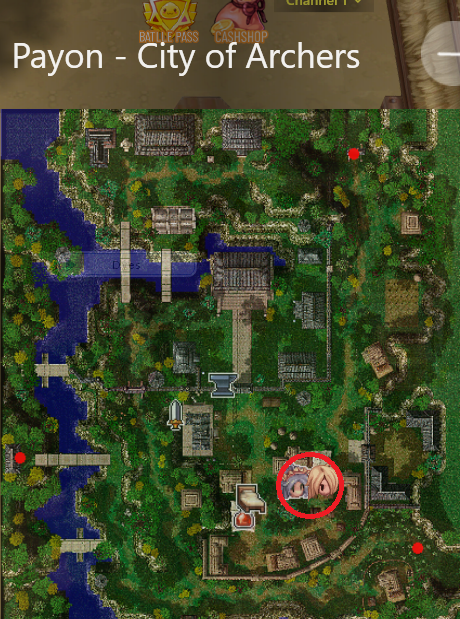

# ✨ Aura System

<figure><figcaption></figcaption></figure>

* It allows players to customize the appearance and abilities of their characters through special auras, which not only provide unique visual effects but can also impact attributes and game mechanics.
* This system is designed to offer dynamic benefits in combat and social interactions, as well as highlight the player's individuality in the game world.

## How to Acquire an Aura

* **Aura Master** - <mark style="color:red;">**Payon City**</mark>



<figure><figcaption>
<mark style="color:red;"><strong>NPC Aura Master</strong></mark>
</figcaption></figure>



<figure><figcaption>
<mark style="color:red;"><strong>NPC Aura Master Location on the Map</strong></mark>
</figcaption></figure>



<table><thead><tr><th width="175">About the NPC</th><th>Description</th></tr></thead><tbody><tr><td><mark style="color:red;"><strong>Auras</strong></mark></td><td>

<ul><li>There is an aura for each attribute, which can be evolved up to level 5.</li><li>It is possible to unlock and evolve all auras to the maximum.</li><li>Auras can be equipped and unequipped at any time via command.</li></ul></td></tr><tr><td><mark style="color:red;"><strong>Commands</strong></mark></td><td>@aurastr / @auraagi / @auravit / @auraint / @auradex / @auraluk / @aura0(unequip)</td></tr><tr><td><mark style="color:red;">Enhancement</mark></td><td>

<ul><li>Each aura you unlock will grant <strong>1 point</strong> in the specific attribute of that aura.</li><li>Evolving an aura to level 5 will grant <strong>5 points</strong> in that attribute.</li><li>Equipping an aura <strong>doubles</strong> its attribute value. For example, if you have level 1 <mark style="color:red;"><strong>STR</strong></mark>, equipping the aura will make it <strong>2 </strong><mark style="color:red;"><strong>STR</strong></mark>.</li></ul></td></tr></tbody></table>

## **Bonus of Each Aura**

* Eac<mark style="color:red;">h aura has its own unique visual effect.</mark>
* Below is also a list of items required to upgrade your aura.



## About the STR Aura

<table><thead><tr><th width="199">Imagem</th><th width="98">Attribute</th><th>Bonus</th></tr></thead><tbody><tr><td></td><td><strong>STR</strong></td><td><strong>[STR / @aurastr]</strong> = +1 / +2 / +3 / +4 / +5</td></tr></tbody></table>

## **Aura Level Quest**

<table><thead><tr><th width="344">Level</th><th>Items &#x26; ID</th></tr></thead><tbody><tr><td>Level 1 (+1 Attribute)</td><td>Sleep 20 times at an inn in <mark style="color:red;"><strong>Zero</strong></mark>.</td></tr><tr><td>Level 2 (+2 Attribute)</td><td>100x  Stardust (1001)  150x  Jellopy (909)  2x  Emperium (714)</td></tr><tr><td>Level 3 (+3 Attribute)</td><td>230x  Feather (916)  200x  Sticky Webfoot (918)  4x  Grape Juice (533)</td></tr><tr><td>Level 4 (+4 Attribute)</td><td>150x  Honey (518)  150x  Zirgon (912)  6x  Amethyst (719)</td></tr><tr><td>Level 5 (+5 Attribute)</td><td>300x  White Herb (509)  300x  Skull (7005)  5x  Flogopita (7290)</td></tr></tbody></table>



## About the AGI Aura

<table><thead><tr><th width="198">Image</th><th width="97">Attribute</th><th>Bonus</th></tr></thead><tbody><tr><td></td><td><strong>AGI</strong></td><td><strong>[AGI / @auraagi]</strong> = +1 / +2 / +3 / +4 / +5</td></tr></tbody></table>

## **Aura Level Quest**

<table><thead><tr><th width="206">Level</th><th>Items &#x26; ID</th></tr></thead><tbody><tr><td>Level 1 (+1 Attribute)</td><td>Complete <a href="broken-reference"><strong>Prontera Dungeon</strong></a> 4 times.</td></tr><tr><td>Level 2 (+2 Attribute)</td><td>100x  Bat Tooth (913)  150x  Resin (907)  2x  Emperium (714)</td></tr><tr><td>Level 3 (+3 Attribute)</td><td>30x  Green Live  (993)  200x  Scell (911)  4x  Gold (969)</td></tr><tr><td>Level 4 (+4 Attribute)</td><td>100x  Topaz (728)  200x  EGreen Herb (511)  6x  Muscovite (7292)</td></tr><tr><td>Level 5 (+5 Attribute)</td><td>300x  Oridecon (984) 20x  Fruto de Yggdrasil (607)  10x  Citrine (7295)</td></tr></tbody></table>



## About the VIT Aura

<table><thead><tr><th width="202">Image</th><th width="95">Attribute</th><th>Bonus</th></tr></thead><tbody><tr><td></td><td><strong>VIT</strong></td><td><strong>[VIT / @auravit]</strong> = +1 / +2 / +3 / +4 / +5</td></tr></tbody></table>

## **Aura Level Quest**

<table><thead><tr><th width="210">Level</th><th>Items &#x26; ID</th></tr></thead><tbody><tr><td>Level 1 (+1 Attribute)</td><td>Climb the <a href="broken-reference"><strong>Endless Tower</strong></a> <strong>3 times up to floor 70</strong>.</td></tr><tr><td>Level 2 (+2 Attribute)</td><td>100x  Decayed Nail (957) 150x  Brigan  2x  Emperium (714)</td></tr><tr><td>Level 3 (+3 Attribute)</td><td>100x  Marbles (746)  200x  Goat Horn (7106)  4x  Emerald (721)</td></tr><tr><td>Level 4 (+4 Attribute)</td><td>200x  Harpy Talon (7116)  300x  Javelin (7312)  6x  Topaz Ring (5008)</td></tr><tr><td>Level 5 (+5 Attribute)</td><td>200x  Flame Horseshoe (7120)  700x  Jellopy (909)  7x  Black Dyestuff (983)</td></tr></tbody></table>



## About the INT Aura

<table><thead><tr><th width="181">Image</th><th width="96">Attribute</th><th>Bonus</th></tr></thead><tbody><tr><td></td><td><strong>INT</strong></td><td><strong>[INT / @auraint]</strong> = +1 / +2 / +3 / +4 / +5</td></tr></tbody></table>

## **Aura Level Quest**

<table><thead><tr><th width="203">Level</th><th>Items &#x26; ID</th></tr></thead><tbody><tr><td>Level 1 (+1 Attribute)</td><td>Complete <a href="broken-reference"><strong>Geffen Defense</strong></a> <strong>6 times</strong>.</td></tr><tr><td>Level 2 (+2 Attribute)</td><td>100x  Fracon (1010)  150x  Feather (949)  2x  Emperium (714)</td></tr><tr><td>Level 3 (+3 Attribute)</td><td>200x Worm Peel  (955)  20x  Royal Jelly (526)  4x  Light Particle (7938)</td></tr><tr><td>Level 4 (+4 Attribute)</td><td>300x  Crystal Fragment (7321)  200x  Red Herb (507)  6x  Biotite (7297)</td></tr><tr><td>Level 5 (+5 Attribute)</td><td>300x  Fabric (1059)  300x  Elunium (985)  5x  Pyroxene (7296)</td></tr></tbody></table>



## About the DEX Aura

<table><thead><tr><th width="190">Image</th><th width="111">Attribute</th><th>Bonus</th></tr></thead><tbody><tr><td></td><td><strong>DEX</strong></td><td><strong>[DEX / @auradex ]</strong> = +1 / +2 / +3 / +4 / +5</td></tr></tbody></table>

## **Aura Level Quest**

<table><thead><tr><th width="220">Level</th><th>Items &#x26; ID</th></tr></thead><tbody><tr><td>Level 1 (+1 Attribute)</td><td>Complete the quest "<a href="broken-reference"><strong>Rebuilding Morroc</strong></a>" from the mural 20 times.</td></tr><tr><td>Level 2 (+2 Attribute)</td><td>
100x  Sticky Mucus (938) 

150x  Rotten Bandage (930) 

2x  Emperium (714)
</td></tr><tr><td>Level 3 (+3 Attribute)</td><td>
200x  Cyfar (7053) 

200x  Dragon Canine (1035) 

4x  Gold (969)
</td></tr><tr><td>Level 4 (+4 Attribute)</td><td>
300x  Harpy Feather (7115) 

200x  Reptile Tongue (903) 

4x  Bone Helm (5017)
</td></tr><tr><td>Level 5 (+5 Attribute)</td><td>
200x  Small Evil Wing (1039) 

700x  Jellopy (909) 

7x  Turquoise (7294)
</td></tr></tbody></table>



## About the LUK Aura

<table><thead><tr><th width="191">Image</th><th width="109">Attribute</th><th>Bonus</th></tr></thead><tbody><tr><td></td><td><strong>LUK</strong></td><td>[<strong>LUK / @auraluk]</strong> = +1 / +2 / +3 / +4 / +5</td></tr></tbody></table>

## **Aura Level Quest**

<table><thead><tr><th width="222">Nível</th><th>Items &#x26; ID</th></tr></thead><tbody><tr><td>Level 1 (+1 Attribute)</td><td>Complete 30 <a href="broken-reference"><strong>Collections</strong></a> from any map.</td></tr><tr><td>Level 2 (+2 Attribute)</td><td>100x  Claw  (956)  150x  Steel (999)  2x  Emperium (714)</td></tr><tr><td>Level 3 (+3 Attribute)</td><td>200x  Dragon Scale (1036)  150x  Goat Skin(7107)  4x  Light Particle (7938)</td></tr><tr><td>Level 4 (+4 Attribute)</td><td>200x  Great Nature (997)  300x  Single Cell (1052)  6x  Agate (7291)</td></tr><tr><td>Level 5 (+5 Attribute)</td><td>700x  Stardust (1001)  700x  Jellopy (909)  4x  Colossal Shield Piece (7108)</td></tr></tbody></table>



## About the  Aura

| Image                                                                     | Attribute  | Bonus                                                   |
| ------------------------------------------------------------------------- | ---------- | ------------------------------------------------------- |
|  | **VISUAL** | Level 99 Aura, purely visual (Does not grant any bonus) |

Quest dos Niveis da Aura

| Level   | Item           |
| ------- | -------------- |
| Leve 1  | Reach Level 99 |


