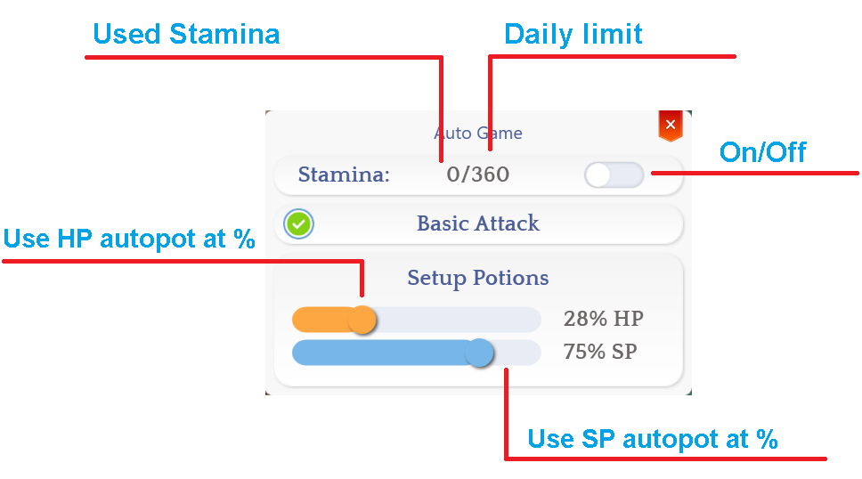

# 🤖 Auto Combat

**About the System**

We know that many players no longer have as much time as before, so our proposal is to give freedom to casual players who want to play with friends without worrying about spending hours trying to farm an item or complete a **quest**.&#x20;

This system allows you to carry out your daily tasks while your character plays automatically for you.

## @akfcombat

VIPs who have an active battle pass and stamina can now use the @afkcombat command, which allows the character to continue auto-combat even when the game is closed (fly wings will not be used when in offline mode).

<table><thead><tr><th width="114">Img</th><th>Name</th></tr></thead><tbody><tr><td></td><td><strong>30D Stamina:</strong> Allows you to gain 240 minutes (4 hours) of auto-combat per day for 30 days.  Every day at 00:00, the 240 minutes will reset to 0/720.</td></tr><tr><td></td><td><strong>1D Stamina:</strong> Allows you to gain 360 minutes (6 hours) of auto-combat immediately. Every day at 00:00, the 360 minutes will reset to 0/720.</td></tr></tbody></table>

## <mark style="color:red;">**Rules**</mark>

When using **auto-combat**, be aware of some essential rules to use it properly:

1. The system is not a 100% **bot**; it allows you to stay in combat for a maximum of 12 hours (720 minutes) per day. Even if you buy **Stamina** from the shop, you cannot exceed this limit.
2. The system does not sell your items or talk to **NPCs**; it only attacks, uses skills, and consumes items.
3. If you use **Fly Wings** or **Golden Fly Wing**, after 30 seconds without finding monsters, the system will automatically use the item without needing it to be in the skill bar.
4. **If you use up all 720 minutes in a day, using additional Stamina items will have no effect, as it is not cumulative. The item will appear in your inventory automatically.**
5. Any form of **auto-farm, bot, or macro** to supplement or improve **auto-combat** is strictly prohibited.
6. **Auto-combat does not work against MVPs or Champion Mobs.**
7. **The use of any methods that violate game rules is strictly prohibited.** This includes, but is not limited to:

* Performing **RMT (Real Money Trading)** transactions outside the official system. This includes both buying and selling items, currency, or services related to the game.
* Offering the sale of **Zeny** within the game. This practice is prohibited and subject to punishment, which may result in a **1-day ban or more in case of repeat offenses**.
* Selling or buying player accounts.
* Using **macros, bots, or any tools** that allow you to obtain in-game resources without legitimate effort.\
  Even if the **Auto-Combat** icon is active above your character, the use of macros is still subject to punishment.\
  To avoid penalties, use only the resources provided directly by the system.
* Using any form of **cheating** or benefiting from **exploits**.

Remember that actions that compromise the integrity of the game are subject to severe punishment.\
To avoid penalties, play fairly and use only the resources provided by the official system.

## **Basic Functions**

<figure><figcaption></figcaption></figure>

## **Setting Up Auto-Combat in Hotkeys**

* Use <mark style="color:red;">**F1**</mark>**&#x20;to&#x20;**<mark style="color:red;">**F5**</mark> to assign the skills you want **auto-combat** to use automatically.
* Use <mark style="color:red;">**F6**</mark>**&#x20;to&#x20;**<mark style="color:red;">**F10**</mark> to assign HP and SP potions for restoration.\
  &#xNAN;_(Golden Fly Wing does not need to be in these slots to be used.)_
* _List of allowed items for F6 to F10._

<figure><figcaption>
<mark style="color:red;"><strong>Skill = Offensive skills. / Buff Skills = Potions and Buff Skills.</strong></mark>
</figcaption></figure>

## Consumables Avaiables

* About the elemental converters, you can put one of them in the consumables bar.

<table><thead><tr><th>ID</th><th width="660">Consumable name</th></tr></thead><tbody><tr><td>501</td><td> Red Potion</td></tr><tr><td>502</td><td> Orange Potion</td></tr><tr><td>503</td><td> Yellow Potion</td></tr><tr><td>504</td><td> White Potion</td></tr><tr><td>507</td><td> Red Herb</td></tr><tr><td>508</td><td> Yellow Herb</td></tr><tr><td>509</td><td> White Herb</td></tr><tr><td>569</td><td> Novice Potion</td></tr><tr><td>547</td><td> Compact White Potion</td></tr><tr><td>546</td><td> Compact Yellow Potion</td></tr><tr><td>545</td><td> Compact Red Potion</td></tr><tr><td>505</td><td> Blue Potion</td></tr><tr><td>578</td><td> Strawberry</td></tr><tr><td>568</td><td> Lemon</td></tr><tr><td>510</td><td> Blue Herb</td></tr><tr><td>11563</td><td> Hot Tea</td></tr><tr><td>29732</td><td> Reformulated Blue Potion</td></tr><tr><td>645</td><td> Concentration Potion</td></tr><tr><td>656</td><td> Awakening Potion</td></tr><tr><td>657</td><td> Berserk Potion </td></tr><tr><td>29739</td><td> Infinity Berserk Potion</td></tr><tr><td>12114</td><td> <mark style="color:red;">Elemental Converter (Fire)</mark> </td></tr><tr><td>12115</td><td> <mark style="color:blue;">Elemental Converter (Water)</mark></td></tr><tr><td>12116</td><td> <mark style="color:orange;">Elemental Converter (Earth)</mark></td></tr><tr><td>12117</td><td> <mark style="color:green;">Elemental Converter (Wind)</mark></td></tr><tr><td>12118</td><td> Fireproof Potion</td></tr><tr><td>12119</td><td> Coldproof Potion</td></tr><tr><td>12120</td><td> Earthproof Potion</td></tr><tr><td>12121</td><td> Thunderproof Potion</td></tr></tbody></table>

## **How to know if it is active?**

When using **auto-combat**, an icon will appear above your character, and it will disappear when using **/effect**.

<figure><figcaption></figcaption></figure>

## **Every time I restart the game, my daily limit decreases**

Yes, every time you use **stamina** and **relog**, the system recalculates the remaining stamina for the day.\
For example, if your stamina was <mark style="color:red;">**0/1079**</mark> and you used 5 minutes, it would become <mark style="color:red;">**10/1079**</mark>, and after relogging, it would be <mark style="color:red;">**0/1069**</mark>.\
\
**See the examples below:**

<figure><figcaption>
<mark style="color:red;"><strong>After spending 5 minutes.</strong></mark>
</figcaption></figure>

<figure><figcaption>
<mark style="color:red;"><strong>After relogging.</strong></mark>
</figcaption></figure>

## <mark style="color:red;">**FAQ**</mark>

1. **I used 720 minutes, and my auto-combat shows 720/720. Can I use daily stamina?**\
   **A:** No! Using more **stamina** will not reset it, as your daily limit has already been reached.
2. **I have 30-day Stamina and used up my 240 minutes. My auto-combat now shows 240/720. Can I use daily stamina to complete it?**\
   **A:** Yes! You can add **+360 minutes**, summing up to **600/720** after using it. However, if you want **+120 minutes**, you will need to use another **daily stamina** item, but you will only gain 120 minutes—the rest of the 240 will be lost.
3. **Can I buy 30-day stamina and leave my character farming while I’m at work?**\
   **A:** Yes, you can leave it anywhere, as long as you have available minutes to use.
4. **If my inventory is full, will auto-combat automatically sell my items?**\
   **A:** No, auto-combat does not sell your items. You need to have space in your inventory.
5. **Will I get banned if I just leave Auto-Combat running on my account without playing?**\
   **A:** No, you paid for this benefit, and it is within the game's rules.
6. **Does Auto-Combat collect items automatically?**\
   **A:** It depends. If you place the **Collect** skill in F1 to F6, then yes. However, if you have the **Compulsive Collector** mastery, Auto-Loot will function automatically at the percentage you have set.
7. **My Stamina is at 0/0. Did the system bug?**\
   **A:** No, every time you use **stamina** and **relog**, the system recalculates your remaining stamina for the day.\
   For example, if your stamina was **0/600** and you used 5 minutes, it would become **5/600**, and after relogging, it would be **0/595**.
8. **Do GEMS that activate special drop effects, such as ZENY, or other effects that grant extra items or ZENY, work?**\
   **A:** No, Auto-Combat is not designed to **farm** items in this way. Any GEM that grants a special extra effect, such as **"Earn Zeny when killing a monster"**, whether by percentage or a fixed amount, will **not work in Auto-Combat**.
