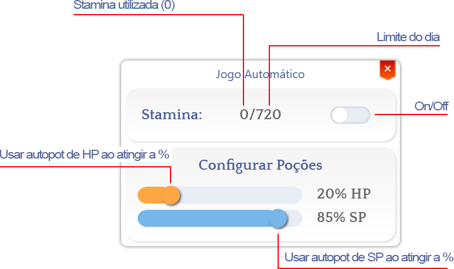
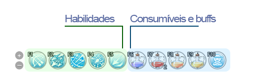
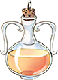
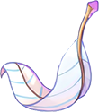
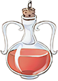
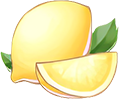
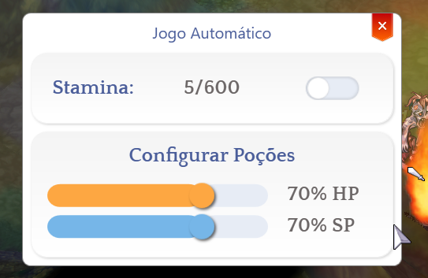
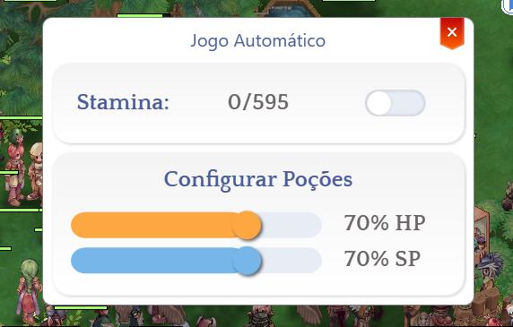

# 🤖 Pertarungan Otomatis

## **Tentang Sistem**

Kami tahu bahwa banyak pemain tidak memiliki waktu sebanyak sebelumnya, jadi proposal kami adalah memberikan kebebasan kepada pemain kasual yang ingin bermain dengan teman tanpa khawatir menghabiskan berjam-jam mencoba untuk mendapatkan item atau menyelesaikan **quest**.&#x20;

Sistem ini memungkinkan Anda untuk melaksanakan tugas harian Anda sementara karakter Anda bermain secara otomatis untuk Anda.<table><thead><tr><th width="114">Img</th><th>Name</th></tr></thead><tbody><tr><td></td><td><strong>30D Stamina:</strong> Memungkinkan Anda mendapatkan 240 menit (4 jam) auto-combat per hari selama 30 hari.  Setiap hari pada pukul 00:00, 240 menit akan direset menjadi 0/720.</td></tr><tr><td></td><td><strong>1D Stamina:</strong> Memungkinkan Anda mendapatkan 360 menit (6 jam) auto-combat secara langsung. Setiap hari pada pukul 00:00, 360 menit akan direset menjadi 0/720.</td></tr></tbody></table>

## <mark style="color:red;">**Aturan**</mark>

Saat menggunakan **auto-combat**, perhatikan beberapa aturan penting untuk menggunakannya dengan benar:

1. Sistem ini bukan **bot** 100%; ini memungkinkan Anda tetap bertarung selama maksimum 12 jam (720 menit) per hari. Bahkan jika Anda membeli **Stamina** dari toko, Anda tidak dapat melebihi batas ini.2. Sistem tidak menjual item Anda atau berbicara dengan **NPC**; itu hanya menyerang, menggunakan keterampilan, dan mengonsumsi item.
3. Jika Anda menggunakan **Fly Wings** atau **Golden Fly Wing**, setelah 30 detik tanpa menemukan monster, sistem akan secara otomatis menggunakan item tersebut tanpa perlu ada di bar keterampilan.
4. **Jika Anda menggunakan semua 720 menit dalam sehari, menggunakan item Stamina tambahan tidak akan berpengaruh, karena tidak bersifat kumulatif. Item akan muncul di inventaris Anda secara otomatis.**
5. Setiap bentuk **auto-farm, bot, atau macro** untuk melengkapi atau meningkatkan **auto-combat** dilarang keras.
6. **Auto-combat tidak berfungsi melawan MVP atau Champion Mobs.**
7. **Penggunaan metode apapun yang melanggar aturan permainan dilarang keras.** Ini termasuk, tetapi tidak terbatas pada:

* Melakukan transaksi **RMT (Real Money Trading)** di luar sistem resmi. Ini termasuk membeli dan menjual item, mata uang, atau layanan terkait permainan.* Menawarkan penjualan **Zeny** dalam permainan. Praktik ini dilarang dan dapat dikenakan hukuman, yang mungkin mengakibatkan **larangan 1 hari atau lebih dalam kasus pelanggaran berulang**.
* Menjual atau membeli akun pemain.
* Menggunakan **makro, bot, atau alat apa pun** yang memungkinkan Anda memperoleh sumber daya dalam permainan tanpa usaha yang sah.\
  Bahkan jika ikon **Auto-Combat** aktif di atas karakter Anda, penggunaan makro tetap dapat dikenakan hukuman.\
  Untuk menghindari hukuman, gunakan hanya sumber daya yang disediakan langsung oleh sistem.
* Menggunakan bentuk **kecurangan** apa pun atau mendapatkan keuntungan dari **eksploitasi**.

Ingat bahwa tindakan yang mengkompromikan integritas permainan dapat dikenakan hukuman berat.\
Untuk menghindari hukuman, bermainlah dengan adil dan gunakan hanya sumber daya yang disediakan oleh sistem resmi.

## **Fungsi Dasar**

<figure><figcaption></figcaption></figure>

## **Mengatur Auto-Combat di Hotkeys*** Gunakan <mark style="color:red;">**F1**</mark>**&#x20;untuk&#x20;**<mark style="color:red;">**F5**</mark> untuk menetapkan keterampilan yang ingin **auto-combat** gunakan secara otomatis.
* Gunakan <mark style="color:red;">**F6**</mark>**&#x20;untuk&#x20;**<mark style="color:red;">**F10**</mark> untuk menetapkan ramuan HP dan SP untuk pemulihan.\
  &#xNAN;_(Golden Fly Wing tidak perlu berada di slot ini untuk digunakan.)_
* _Daftar item yang diizinkan untuk F6 hingga F10._

<figure><figcaption></figcaption></figure><table><thead><tr><th>ID</th><th width="660">Nama Konsumsi</th></tr></thead><tbody><tr><td>501</td><td> Ramuan Merah</td></tr><tr><td>502</td><td> Ramuan Oranye</td></tr><tr><td>503</td><td> Ramuan Kuning</td></tr><tr><td>504</td><td> Ramuan Putih</td></tr><tr><td>507</td><td> Herbal Merah</td></tr><tr><td>508</td><td> Herbal Kuning</td></tr><tr><td>509</td><td> Herbal Putih</td></tr><tr><td>569</td><td> Ramuan Pemula</td></tr><tr><td>547</td><td> Ramuan Putih Kompak</td></tr><tr><td>546</td><td> Ramuan Kuning Kompak</td></tr><tr><td>545</td><td> Ramuan Merah Kompak</td></tr><tr><td>505</td><td> Ramuan Biru</td></tr><tr><td>578</td><td> Stroberi</td></tr><tr><td>568</td><td> Lemon</td></tr><tr><td>510</td><td> Herbal Biru</td></tr><tr><td>11563</td><td> Teh Panas</td></tr><tr><td>29732</td><td> Ramuan Biru yang Diformulasikan Ulang</td></tr></tbody></table>## **Bagaimana cara mengetahui apakah itu aktif?**

Saat menggunakan **auto-combat**, ikon akan muncul di atas karakter Anda, dan akan menghilang saat menggunakan **/effect**.

<figure><figcaption></figcaption></figure>

## **Setiap kali saya memulai ulang permainan, batas harian saya berkurang**

Ya, setiap kali Anda menggunakan **stamina** dan **relog**, sistem akan menghitung ulang sisa stamina untuk hari itu.\
Sebagai contoh, jika stamina Anda adalah <mark style="color:red;">**0/600**</mark> dan Anda menggunakan 5 menit, itu akan menjadi <mark style="color:red;">**5/600**</mark>, dan setelah relog, itu akan menjadi <mark style="color:red;">**0/595**</mark>.\
\
**Lihat contoh di bawah ini:**

<figure><figcaption>
<mark style="color:red;"><strong>Setelah menghabiskan 5 menit.</strong></mark>
</figcaption></figure><figure><figcaption>
<mark style="color:red;"><strong>Setelah relogging.</strong></mark>
</figcaption></figure>

## <mark style="color:red;">**FAQ**</mark>

1. **Saya telah menggunakan 720 menit, dan auto-combat saya menunjukkan 720/720. Bisakah saya menggunakan stamina harian?**\
   **A:** Tidak! Menggunakan lebih banyak **stamina** tidak akan meresetnya, karena batas harian Anda sudah tercapai.
2. **Saya memiliki Stamina 30-hari dan telah menggunakan 240 menit. Auto-combat saya sekarang menunjukkan 240/720. Bisakah saya menggunakan stamina harian untuk menyelesaikannya?**\
   **A:** Ya! Anda dapat menambahkan **+360 menit**, sehingga total menjadi **600/720** setelah menggunakannya. Namun, jika Anda ingin **+120 menit**, Anda perlu menggunakan item **stamina harian** lainnya, tetapi Anda hanya akan mendapatkan 120 menit—sisa 240 menit akan hilang.
3. **Bisakah saya membeli stamina 30-hari dan membiarkan karakter saya farming saat saya bekerja?**\
   **A:** Ya, Anda dapat meninggalkannya di mana saja, asalkan Anda memiliki menit yang tersedia untuk digunakan.4. **Jika inventaris saya penuh, apakah auto-combat akan otomatis menjual barang saya?**\
   **A:** Tidak, auto-combat tidak menjual barang Anda. Anda perlu memiliki ruang di inventaris Anda.
5. **Apakah saya akan dibanned jika saya hanya membiarkan Auto-Combat berjalan di akun saya tanpa bermain?**\
   **A:** Tidak, Anda membayar untuk keuntungan ini, dan itu sesuai dengan aturan permainan.
6. **Apakah Auto-Combat mengumpulkan barang secara otomatis?**\
   **A:** Tergantung. Jika Anda menempatkan keterampilan **Collect** di F1 hingga F6, maka ya. Namun, jika Anda memiliki penguasaan **Compulsive Collector**, Auto-Loot akan berfungsi secara otomatis pada persentase yang telah Anda atur.
7. **Stamina saya berada di 0/0. Apakah sistemnya mengalami bug?**\
   **A:** Tidak, setiap kali Anda menggunakan **stamina** dan **relog**, sistem akan menghitung ulang sisa stamina Anda untuk hari itu.\
   Misalnya, jika stamina Anda adalah **0/600** dan Anda menggunakan 5 menit, itu akan menjadi **5/600**, dan setelah relogging, itu akan menjadi **0/595**.8. **Apakah GEMS yang mengaktifkan efek drop khusus, seperti ZENY, atau efek lain yang memberikan item tambahan atau ZENY, berfungsi?**\
   **A:** Tidak, Auto-Combat tidak dirancang untuk **mengumpulkan** item dengan cara ini. Setiap GEM yang memberikan efek tambahan khusus, seperti **"Dapatkan Zeny saat membunuh monster"**, baik dengan persentase atau jumlah tetap, **tidak akan berfungsi di Auto-Combat**.